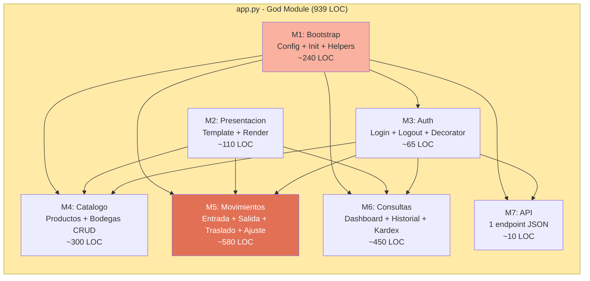

# Módulos del Sistema — StockControl

## Inventario de Módulos

El sistema **NO tiene módulos separados**. Todo reside en un único archivo `app.py`. Este documento describe las "zonas lógicas" como módulos virtuales para facilitar la comprensión y planificación de la modernización.

## Módulos Virtuales (Zonas del God Module)

## Detalle por Módulo Virtual

### M1: Bootstrap (Infraestructura)

| Elemento | LOC | Función |
|---|---|---|
| Imports + Config global | 15 | `app.py:1-50` |
| `iniciar()` God Function | 160 | `app.py:62-222` — DDL + seed + conexión |
| `db()` | 5 | `app.py:225-229` — acceso a conexión global |
| `md5pw()` | 3 | `app.py:232-234` — hash MD5 |
| `now()` | 3 | `app.py:237-239` — timestamp |
| `get_stock()` | 8 | `app.py:241-249` — query stock |
| `actualizar_stock()` | 25 | `app.py:252-294` — UPSERT stock |

### M2: Presentación

| Elemento | LOC | Función |
|---|---|---|
| `TMPL_BASE` (HTML string) | 97 | `app.py:311-398` — layout completo |
| `render()` | 12 | `app.py:399-410` — wrapper de template |
| `opts_prods()` | 6 | `app.py:414-419` — HTML options productos |
| `opts_bodegas()` | 7 | `app.py:422-428` — HTML options bodegas |
| `get_prods_bodegas()` | 7 | `app.py:431-438` — carga datos para forms |

### M3: Autenticación

| Elemento | LOC | Función |
|---|---|---|
| `auth()` decorator | 8 | `app.py:297-306` — verificar sesión |
| `login()` | 55 | `app.py:444-492` — login con SQL Injection |
| `logout()` | 4 | `app.py:495-498` — limpiar sesión |

### M4: Catálogo (Productos + Bodegas)

| Elemento | LOC | Función |
|---|---|---|
| `productos()` listado | 95 | `app.py:714-810` — con filtros SQL Injection |
| `producto_nuevo()` | 72 | `app.py:813-885` — crear |
| `producto_editar()` | 140 | `app.py:888-1030` — editar |
| `producto_toggle()` | 8 | `app.py:1033-1040` — cambiar estado |
| `bodegas()` listado | 55 | `app.py:1045-1100` — con métricas |
| `bodega_nueva()` | 43 | `app.py:1103-1146` — crear |
| `bodega_editar()` | 63 | `app.py:1149-1213` — editar |
| `bodega_toggle()` | 8 | `app.py:1216-1226` — cambiar estado |

### M5: Movimientos (Core Domain)

| Elemento | LOC | Función |
|---|---|---|
| `mov_entrada()` | 140 | `app.py:1233-1370` — registrar entrada |
| `mov_salida()` | 155 | `app.py:1377-1528` — registrar salida |
| `mov_traslado()` | 160 | `app.py:1533-1690` — traslado entre bodegas |
| `mov_ajuste()` | 115 | `app.py:1695-1808` — ajuste de inventario |

### M6: Consultas (Read-only views)

| Elemento | LOC | Función |
|---|---|---|
| `dashboard()` | 205 | `app.py:500-706` — KPIs |
| `movimientos()` historial | 130 | `app.py:1823-1950` — listado con N+1 |
| `kardex()` | 150 | `app.py:1955-2100` — CROSS JOIN |
| `kardex_detalle()` | 100 | `app.py:2103-2200` — historial por producto |

### M7: API

| Elemento | LOC | Función |
|---|---|---|
| `api_stock()` | 5 | `app.py:1810-1818` — JSON stock query |

## Clasificación para Modernización

| Módulo | Tipo (DDD) | Prioridad Migración | Complejidad |
|---|---|---|---|
| M1: Bootstrap | Generic/Infrastructure | Alta (base para todo) | Media |
| M2: Presentación | Generic | Alta (separar de Python) | Baja |
| M3: Auth | Supporting | Alta (seguridad) | Baja |
| M4: Catálogo | Supporting | Media | Baja |
| M5: Movimientos | **Core Domain** | Alta (valor de negocio) | Alta |
| M6: Consultas | Supporting | Baja (solo lectura) | Media |
| M7: API | Generic | Baja | Trivial |

## Hallazgos Clave

1. **M5 (Movimientos) es el core** — Contiene la lógica de negocio real y la mayor complejidad
2. **M5 tiene 80% duplicación** — Entrada/Salida/Traslado son copy-paste
3. **M6 es el más costoso en runtime** — Dashboard con 10+ queries, Kardex con CROSS JOIN
4. **M1 + M2 son pre-requisitos** — Deben separarse primero para desbloquear el resto
5. **M3 es crítico de seguridad** — SQL Injection + MD5 deben resolverse prioritariamente

## Referencias

- [program-structure.md](program-structure.md)
- [interfaces.md](interfaces.md)
- [../architecture/components.md](../architecture/components.md)
- [../migration/component-order.md](../migration/component-order.md)
