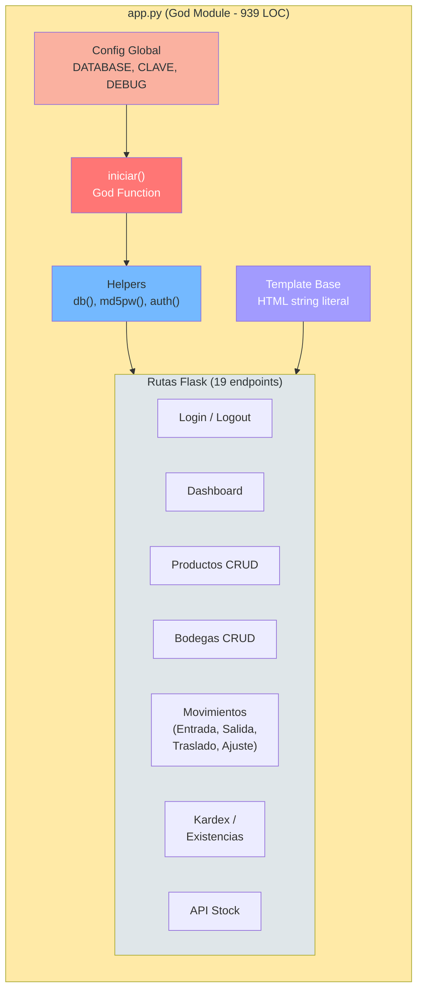

# Estructura del Programa — StockControl

## Árbol del Proyecto

```
App/
├── app.py                 ← Modulo principal (God Module): 2,221 lineas brutas, 939 LOC
├── test_app.py            ← Script de prueba HTTP manual: 67 lineas brutas
├── requirements.txt       ← Manifiesto de dependencias (2 paquetes)
├── _app-name.txt          ← Metadata CBA: nombre de la aplicacion
├── _cloc-report.txt       ← Metadata CBA: conteo oficial de LOC
└── [stock.db]             ← Base de datos SQLite (generada en runtime, no versionada)
```

## Clasificación por Capas

El proyecto **NO tiene separación de capas** en su estructura de archivos. Todo reside en un único archivo `app.py`. Sin embargo, se pueden identificar **zonas lógicas** dentro del archivo:

| Zona | Líneas | Responsabilidad | Archivos |
|---|---|---|---|
| **Configuración Global** | 1-60 | Imports, constantes, estado global | `app.py:1-60` |
| **Inicialización (God Function)** | 62-222 | DDL, seed data, conexión BD | `app.py:62-222` |
| **Helpers / Utilities** | 224-300 | `db()`, `md5pw()`, `now()`, `get_stock()`, `actualizar_stock()`, `auth()` | `app.py:224-300` |
| **Template Base** | 301-398 | HTML/CSS del layout (string literal) | `app.py:301-398` |
| **Función Render** | 399-410 | `render()` — wrapper de `render_template_string` | `app.py:399-410` |
| **Helpers HTML** | 412-440 | `opts_prods()`, `opts_bodegas()`, `get_prods_bodegas()` | `app.py:412-440` |
| **Rutas Auth** | 442-498 | `/login`, `/logout` | `app.py:442-498` |
| **Dashboard** | 500-706 | `/` — 8+ queries + construcción HTML | `app.py:500-706` |
| **Productos CRUD** | 708-1040 | `/productos`, `/productos/nuevo`, `/productos/editar/<id>`, `/productos/toggle/<id>` | `app.py:708-1040` |
| **Bodegas CRUD** | 1042-1226 | `/bodegas`, `/bodegas/nuevo`, `/bodegas/editar/<id>`, `/bodegas/toggle/<id>` | `app.py:1042-1226` |
| **Movimientos Entrada** | 1228-1370 | `/movimientos/entrada` (POST form processing + HTML) | `app.py:1228-1370` |
| **Movimientos Salida** | 1372-1528 | `/movimientos/salida` (copy-paste de entrada) | `app.py:1372-1528` |
| **Movimientos Traslado** | 1530-1690 | `/movimientos/traslado` (copy-paste de salida) | `app.py:1530-1690` |
| **Movimientos Ajuste** | 1692-1808 | `/movimientos/ajuste` (lógica diferente) | `app.py:1692-1808` |
| **API mínima** | 1810-1818 | `/api/stock` — endpoint JSON | `app.py:1810-1818` |
| **Historial Movimientos** | 1820-1950 | `/movimientos` (listado con filtros + N+1) | `app.py:1820-1950` |
| **Kardex / Existencias** | 1952-2100 | `/kardex`, `/kardex/detalle/<id>/<id>` | `app.py:1952-2200` |
| **Error Handlers** | 2202-2214 | `404`, `500` — exponen info interna | `app.py:2202-2214` |
| **Main** | 2216-2221 | `app.run()` con config hardcoded | `app.py:2216-2221` |

## Endpoints / Rutas del Sistema

| Método | Ruta | Función | Auth | Propósito |
|---|---|---|---|---|
| GET/POST | `/login` | `login()` | No | Autenticación |
| GET | `/logout` | `logout()` | No | Cierre de sesión |
| GET | `/` | `dashboard()` | Sí | Panel principal con KPIs |
| GET | `/productos` | `productos()` | Sí | Listado de productos con filtros |
| GET/POST | `/productos/nuevo` | `producto_nuevo()` | Sí | Crear producto |
| GET/POST | `/productos/editar/<int:pid>` | `producto_editar(pid)` | Sí | Editar producto |
| GET | `/productos/toggle/<int:pid>` | `producto_toggle(pid)` | Sí | Activar/inactivar producto |
| GET | `/bodegas` | `bodegas()` | Sí | Listado de bodegas |
| GET/POST | `/bodegas/nuevo` | `bodega_nueva()` | Sí | Crear bodega |
| GET/POST | `/bodegas/editar/<int:bid>` | `bodega_editar(bid)` | Sí | Editar bodega |
| GET | `/bodegas/toggle/<int:bid>` | `bodega_toggle(bid)` | Sí | Activar/bloquear bodega |
| GET/POST | `/movimientos/entrada` | `mov_entrada()` | Sí | Registrar entrada de inventario |
| GET/POST | `/movimientos/salida` | `mov_salida()` | Sí | Registrar salida de inventario |
| GET/POST | `/movimientos/traslado` | `mov_traslado()` | Sí | Traslado entre bodegas |
| GET/POST | `/movimientos/ajuste` | `mov_ajuste()` | Sí | Ajuste de inventario |
| GET | `/movimientos` | `movimientos()` | Sí | Historial de movimientos |
| GET | `/kardex` | `kardex()` | Sí | Existencias cruzadas (producto × bodega) |
| GET | `/kardex/detalle/<int:prod_id>/<int:bod_id>` | `kardex_detalle(prod_id,bod_id)` | Sí | Kardex detalle con historial |
| GET | `/api/stock` | `api_stock()` | Sí | API JSON: consulta stock |

**Total: 19 rutas** (20 contando el patrón GET/POST como 1).

## Funciones Principales

| Función | LOC aprox. | Responsabilidad | Complejidad |
|---|---|---|---|
| `iniciar()` | ~160 | DDL + seed + config + conexión | **God Function** — Alta |
| `dashboard()` | ~205 | 8+ queries + HTML dashboard | Alta (N+1, HTML strings) |
| `productos()` | ~80 | Listado con filtros SQL injection | Media |
| `mov_entrada()` | ~140 | Parseo form + validación + insert + stock update | Alta |
| `mov_salida()` | ~130 | Copy-paste de entrada con validación stock | Alta |
| `mov_traslado()` | ~140 | Copy-paste con 2 bodegas | Alta |
| `kardex()` | ~130 | CROSS JOIN + filtros + HTML | Alta |
| `kardex_detalle()` | ~100 | Historial por producto/bodega | Media |
| `login()` | ~55 | Auth con SQL Injection | Media-Alta (por vulnerabilidad) |

## Diagrama de Estructura



El diagrama muestra cómo todo el sistema está contenido en un único módulo Python sin separación de responsabilidades. La función `iniciar()` es el punto de arranque que crea BD + tablas + datos, y todas las rutas dependen de los helpers globales y el template base como string literal.

## Métricas Rápidas

| Métrica | Valor |
|---|---|
| Archivos de código fuente | 2 (app.py + test_app.py) |
| LOC efectivas (cloc) | 939 |
| Líneas brutas (app.py) | 2,221 |
| Líneas brutas (test_app.py) | 67 |
| Funciones/rutas | 19 endpoints + ~10 helpers = 29 funciones |
| Tablas de BD | 7 |
| Dependencias externas | 2 (flask, werkzeug) |
| Frameworks de test | 0 (solo script HTTP manual) |
| Archivos de configuración | 1 (requirements.txt) |

## Cobertura de Lectura

| Categoría | Total | Leídos | Cobertura |
|---|---|---|---|
| Archivos de código (.py) | 2 | 2 | **100%** |
| Archivos de configuración | 1 | 1 | **100%** |
| Total archivos texto relevantes | 3 | 3 | **100%** |

## Referencias

- [../project-overview.md](../project-overview.md)
- [../specialized/specialized-documentation.md](../specialized/specialized-documentation.md)
