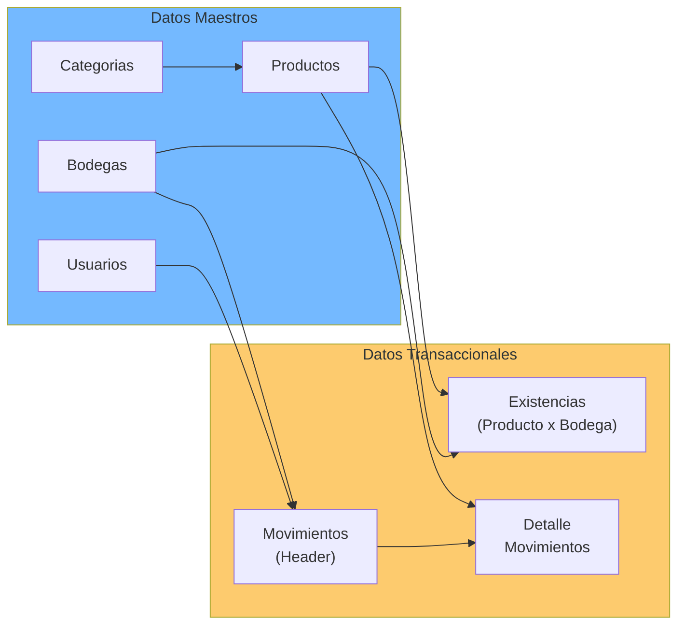

# Documentación Especializada — StockControl

## Integraciones Detectadas desde Archivos de Configuración

### requirements.txt

| Dependencia | Versión | Propósito | Estado |
|---|---|---|---|
| flask | 2.2.5 | Framework web (rutas, sesiones, templates) | Versión antigua (2023) — última estable ~3.1.x |
| werkzeug | 2.2.3 | Servidor WSGI subyacente de Flask | Versión antigua — última estable ~3.1.x |

**Observaciones detectadas en los comentarios del propio archivo:**
- Explícitamente marcadas como "MALA PRACTICA: versiones antiguas y sin pinear correctamente" (`requirements.txt:1`)
- Sin separación de dependencias dev/producción
- Sin lock file (no hay `requirements.lock`, `Pipfile.lock`, ni `poetry.lock`)
- Sin hashing de dependencias transitivas

### Configuración de la Aplicación (Hardcoded en `app.py`)

| Config Key | Valor | Archivo:Línea | Propósito |
|---|---|---|---|
| `DATABASE` | `os.path.join(…, 'stock.db')` | `app.py:41` | Ruta de BD SQLite (mismo directorio que app.py) |
| `CLAVE` | `stockcontrol_dev_KEY_123` | `app.py:42` | Secret key de Flask (hardcoded) |
| `DEBUG` | `True` | `app.py:43` | Modo debug (siempre activo) |
| `VERSION` | `1.0.0` | `app.py:44` | Versión del sistema |
| `MAX_ROWS` | `999` | `app.py:45` | Magic number sin uso aparente |
| `app.secret_key` | `= CLAVE` | `app.py:49` | Redundante — reasignación del secret |
| `app.debug` | `= DEBUG` | `app.py:50` | Redundante — reasignación debug mode |
| `host` | `0.0.0.0` | `app.py:2221` | Escucha en todas las interfaces |
| `port` | `5001` | `app.py:2221` | Puerto HTTP |
| `check_same_thread` | `False` | `app.py:72` | SQLite: deshabilita check de thread safety |
| `PRAGMA journal_mode` | `WAL` | `app.py:74` | Write-Ahead Logging para SQLite |

## Multi-Tenancy

**No detectada.** No hay indicadores de multi-tenancy:
- Sin campo `tenant_id` o `empresa_id` en ninguna tabla
- Sin connection strings múltiples
- Sin configuración por tenant/empresa
- Sin temas/skins por organización
- Sistema completamente single-tenant

## Particularidades del Dominio

### Dominio: Gestión de Inventarios y Bodegas (WMS simplificado)

| Concepto de Dominio | Implementación | Evidencia |
|---|---|---|
| **Catálogo de productos** | Tabla `productos` con código, código de barras, categoría, unidad de medida, costo promedio | `app.py:85-100` |
| **Bodegas/almacenes** | Tabla `bodegas` con capacidad y estado | `app.py:109-116` |
| **Existencias** | Tabla `existencias` — relación producto × bodega con stock físico y reservado | `app.py:117-125` |
| **Movimientos** | 5 tipos: ENTRADA, SALIDA, TRASLADO, AJUSTE_POS, AJUSTE_NEG | `app.py:126-143` |
| **Kardex** | Histórico de movimientos por producto/bodega con stock antes/después | Ruta `/kardex/detalle` |
| **Control de lotes** | Campo `control_lote` en productos + `lote` en existencias | `app.py:97, 123` |
| **Stock mínimo/máximo** | Alertas en dashboard cuando stock ≤ mínimo | `app.py:529-536` |
| **Costo promedio** | Actualizado directamente (sin fórmula de promedio ponderado correcto) | `app.py:285-287` |

### Reglas de Negocio Detectadas

| Regla | Implementación | Archivo:Línea |
|---|---|---|
| Salida requiere stock suficiente | Validación pre-commit en `mov_salida()` | `app.py:1410-1416` |
| Traslado requiere stock en origen | Validación pre-commit en `mov_traslado()` | `app.py:1568-1574` |
| Ajuste calcula diferencia automáticamente | `diferencia = cantidad_fisica - stock_actual` | `app.py:1698-1699` |
| Stock nunca es negativo | `max(0.0, ...)` en `actualizar_stock()` | `app.py:278, 281` |
| Código de producto es único | Verificación antes de INSERT (pero con SQL injection) | `app.py:839` |
| Productos pueden activarse/inactivarse | Toggle vía ruta GET (sin protección CSRF) | `app.py:1033-1040` |
| Bodegas pueden bloquearse/activarse | Toggle vía ruta GET (sin protección CSRF) | `app.py:1220-1226` |

## Herramientas de Transformación Aplicables

| Herramienta | Aplicabilidad | Justificación |
|---|---|---|
| **AWS App2Container** | No aplica | No es una app containerizable directamente (sin Dockerfile) |
| **AWS Migration Hub** | Baja | App demasiado pequeña para migration hub |
| **Rewrite manual** | **Alta** | 939 LOC es manejable para reescritura completa |
| **Strangler Fig Pattern** | Posible | Podría extraerse ruta por ruta hacia microservicios |
| **Flask → FastAPI migration** | **Alta** | Migración framework directa — rutas similares |
| **SQLite → PostgreSQL/MySQL** | **Alta** | Schema simple, sin features avanzadas de SQLite |
| **Jinja2 templates (separar)** | **Alta** | Extraer HTML de strings a archivos .html |

## Antipatrones Intencionales Documentados en el Código

El propio código fuente documenta los siguientes antipatrones (extraídos del docstring de `app.py:7-35`):

| # | Antipatrón | Ubicación Principal |
|---|---|---|
| 1 | God Module: todo en un solo archivo | `app.py` completo |
| 2 | God Function: `iniciar()` hace BD + tablas + seed + config | `app.py:62-222` |
| 3 | Global State: conexión BD global no thread-safe | `app.py:47` (`_DB = None`) |
| 4 | SQL Injection: concatenación directa en queries | `app.py:454, 722, 839, 1823+` |
| 5 | Broken Authentication: MD5 para passwords | `app.py:265` |
| 6 | Spaghetti Code: lógica + BD + HTML mezclados | Todas las rutas |
| 7 | Copy-Paste Programming: rutas de movimientos casi idénticas | `mov_entrada`, `mov_salida`, `mov_traslado` |
| 8 | Magic Numbers: 999, 50, 100 sin contexto | `app.py:45, 1276, 1842` |
| 9 | No Validation: entrada del usuario directo a BD | Formularios POST |
| 10 | Violated SRP/OCP/DIP/LSP/ISP | Toda la arquitectura |
| 11 | No Error Handling: try/except que swallows errores | `app.py:220, 1278+` |
| 12 | Debug en producción | `app.py:43-44, 2221` |
| 13 | Secrets en código | `app.py:42, 472-476` |
| 14 | HTML por concatenación | Todas las funciones de ruta |
| 15 | Queries N+1 | `app.py:1876-1884` (historial movimientos) |
| 16 | Sin paginación | Todas las listas |
| 17 | Sin logging (solo `print()`) | `app.py:65-67, 219+` |
| 18 | Sin migraciones | DDL en `iniciar()` |
| 19 | Sin tests reales | Solo `test_app.py` (script HTTP) |
| 20 | Credenciales hardcoded visibles en UI | `app.py:472-476` (página de login muestra passwords) |

## Diagrama de Dominio

El diagrama muestra la separación lógica entre datos maestros (catálogo de productos, bodegas, categorías, usuarios) y datos transaccionales (existencias, movimientos y sus detalles). Las existencias actúan como tabla pivote entre productos y bodegas.

## Mapeo Config → Implementación

| Config / Constante | Consumidor en Código | Propósito |
|---|---|---|
| `DATABASE` | `iniciar()`, implícitamente `db()` | Ruta del archivo SQLite |
| `CLAVE` / `app.secret_key` | Flask internals (firma de cookies de sesión) | Cifrado de sesiones |
| `DEBUG` / `app.debug` | Flask — stack traces expuestos | Depuración |
| `MAX_ROWS` | No usado en ninguna query | Dead code (magic number sin uso) |
| `check_same_thread=False` | `sqlite3.connect()` en `iniciar()` | Permitir uso desde múltiples threads Flask |

## Referencias

- [../project-overview.md](../project-overview.md)
- [../reference/program-structure.md](../reference/program-structure.md)
