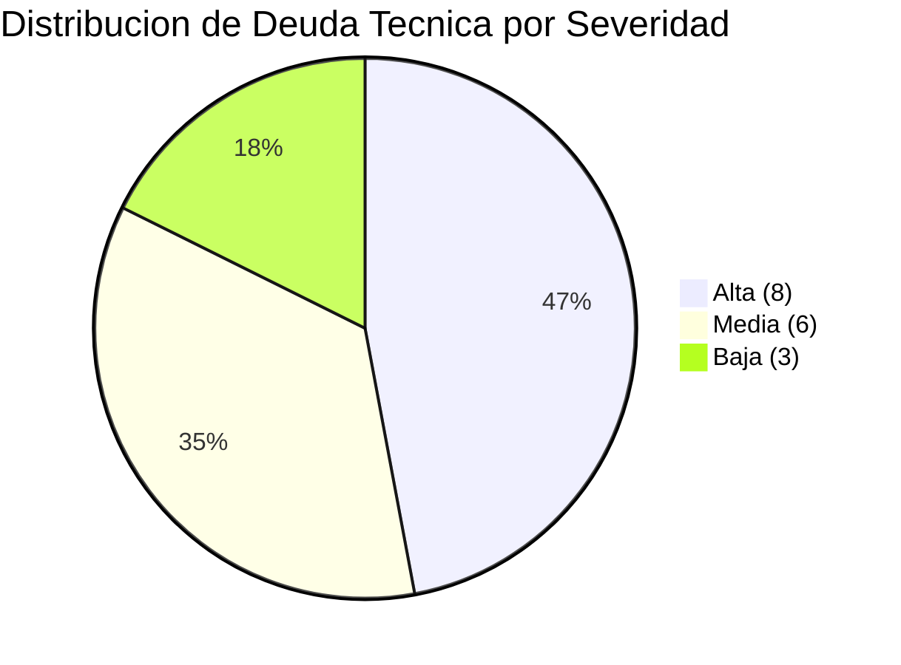

# Reporte Ejecutivo de Deuda Técnica — StockControl

## Resumen Ejecutivo

StockControl presenta **17 hallazgos de deuda técnica** distribuidos en 3 niveles de severidad. El sistema está en estado **crítico desde perspectiva de seguridad** con 4 vulnerabilidades de severidad alta que requieren atención inmediata antes de cualquier uso en producción.

La deuda técnica acumulada hace que el sistema sea **imposible de mantener, testear o escalar** en su estado actual. Sin embargo, su tamaño reducido (939 LOC) y la claridad de sus bounded contexts hacen que la remediación sea factible en 5-6 semanas con 1-2 personas.

## Hallazgos Críticos (Acción Inmediata)

| # | Hallazgo | Riesgo | Remediación | Esfuerzo |
|---|---|---|---|---|
| 1 | **SQL Injection** en 7+ puntos | Data breach completo | Parametrizar queries | 2 horas |
| 2 | **MD5 para passwords** | Credenciales expuestas | Migrar a bcrypt | 4 horas |
| 3 | **Secret key hardcoded** | Sesiones forjables | Externalizar a env var | 15 min |
| 4 | **Debug mode permanente** | RCE via Werkzeug debugger | Condicionar a env var | 15 min |

**Impacto combinado:** Un atacante puede leer/escribir toda la BD via SQL Injection, forjar sesiones de admin, y ejecutar código arbitrario via debugger. El sistema NO debe exponerse a internet en su estado actual.

## Hallazgos Arquitectónicos (Planificar)

| # | Hallazgo | Impacto | Remediación |
|---|---|---|---|
| 5 | God Module (todo en 1 archivo) | Imposible testear/mantener | Separar en módulos (Ola 1) |
| 6 | Copy-paste ×4 en movimientos | 4× costo de mantenimiento | Unificar con Strategy pattern (Ola 2) |
| 7 | HTML embebido en Python | Imposible para diseñadores | Extraer a templates Jinja2 (Ola 1) |
| 8 | Conexión BD global no thread-safe | Race conditions | Repository pattern + pool (Ola 1) |

## Hallazgos Operacionales (Importante)

| # | Hallazgo | Impacto | Remediación |
|---|---|---|---|
| 9 | Flask 2.2.5 desactualizado | Sin parches seguridad | Actualizar a 3.x (Ola 2) |
| 10 | Sin validación de input | Datos inconsistentes | WTForms/Pydantic (Ola 2) |
| 11 | Error swallowing (`except: pass`) | Corrupción silenciosa | Logging + handling explícito |
| 12 | N+1 queries en dashboard | Degradación con datos | Optimizar queries |
| 13 | Sin paginación | OOM con volumen | Agregar LIMIT/OFFSET |
| 14 | Roles sin enforcement | Privilegios excesivos | Implementar RBAC (Ola 2) |

## Métricas de Calidad

| Dimensión | Score Actual | Target Post-Modernización |
|---|---|---|
| Clean Code | 2.8/10 | ≥6/10 |
| Production Readiness | 1/10 | ≥5/10 |
| Scalability | 1/10 | ≥5/10 |
| Legacy Readiness | D (Monolithic) | B (Seam-Rich) |
| OWASP Compliance | 3/10 categorías seguras | ≥8/10 |

## Inversión Requerida

| Concepto | Estimado |
|---|---|
| **Duración total** | 5-6 semanas |
| **Equipo** | 1-2 personas (Python/Flask senior) |
| **Créditos QAM** | ~70 |
| **Variante recomendada** | Refactor (R5) — mismo stack, mejor código |

## Recomendación

1. **Inmediato (esta semana):** Resolver 4 vulnerabilidades críticas (Ola 0 — 2 días)
2. **Corto plazo (2 semanas):** Separar el God Module en estructura modular (Ola 1)
3. **Medio plazo (2 semanas):** Modernizar stack y unificar lógica duplicada (Ola 2)
4. **Cierre (1 semana):** Containerizar y establecer CI/CD (Ola 3)

El ROI es alto: el sistema es pequeño, los bounded contexts están claros, y la inversión de 5-6 semanas produce un sistema mantenible, seguro y operable en cloud.

## Referencias Detalladas

- [Inventario completo de deuda técnica](technical-debt/summary.md)
- [Componentes obsoletos](technical-debt/outdated-components.md)
- [Carga de mantenimiento](technical-debt/maintenance-burden.md)
- [Plan de remediación paso a paso](technical-debt/remediation-plan.md)
- [Plan de migración con timeline](migration/component-order.md)
