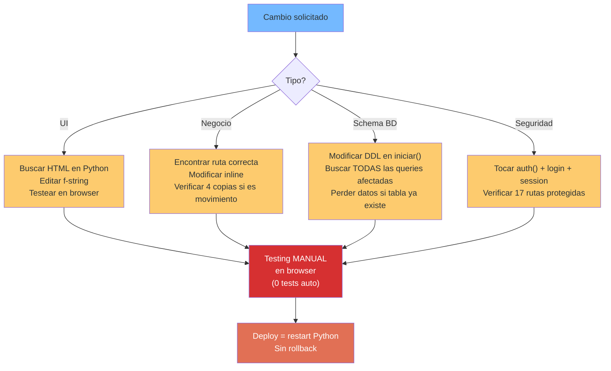

# Carga de Mantenimiento — StockControl

## Evaluación de Carga Operativa

| Aspecto | Carga | Justificación |
|---|---|---|
| **Costo de agregar funcionalidad** | Muy Alto | Todo cambio toca `app.py`; sin separación, sin tests, sin validar regresión |
| **Costo de fix de bugs** | Alto | Sin tests = cada fix es potencial regresión; sin logging = difícil reproducir |
| **Costo de onboarding** | Medio | 939 LOC es comprensible para 1 developer, pero las 4 copias de movimientos confunden |
| **Costo operativo** | Bajo (hoy) | SQLite sin administración; pero escala con datos = problemas |
| **Riesgo de regresión** | Crítico | 0% cobertura de tests + acoplamiento total |

## Factores que Incrementan la Carga

### 1. God Module (factor multiplicador: 3-5x)

Toda funcionalidad nueva requiere:
- Leer y entender ~939 LOC de contexto
- Insertar código entre funciones no relacionadas
- Verificar manualmente que no se rompe otra cosa
- Sin IDE refactoring seguro (todo en un archivo)

**Evidencia:** `app.py` es el ÚNICO punto de modificación para cualquier cambio.

### 2. Copy-Paste de Movimientos (factor: 4x por cambio de lógica compartida)

Cualquier cambio en la lógica de movimientos debe replicarse en 4 funciones:
- `mov_entrada()` — `app.py:1224`
- `mov_salida()` — `app.py:1400`
- `mov_traslado()` — `app.py:1545`
- `mov_ajuste()` — `app.py:1720`

Un cambio en el formato de form parsing, en la lógica de stock, o en el registro de detalle requiere tocar 4 funciones + verificar que no hay divergencia sutil entre copias.

### 3. HTML en Python (factor: 2x para cambios de UI)

Cualquier cambio visual requiere:
- Encontrar el HTML dentro de funciones Python (no en archivos template separados)
- Modificar strings dentro de f-strings (propenso a errores de escape)
- Sin validación de HTML, sin preview, sin herramientas de diseño
- Un error de sintaxis HTML solo se detecta al cargar la página en browser

**Impacto:** Diseñadores UX no pueden participar sin leer Python.

### 4. Ausencia Total de Tests (factor: ∞ para refactoring)

Sin tests automatizados:
- Cada cambio requiere testing manual completo
- No se puede refactorizar con confianza
- Bugs de regresión se descubren en "producción"
- No hay red de seguridad para modernización

### 5. SQL Inline (factor: 2x para cambios de schema)

Cambiar una columna o tabla requiere:
- Buscar TODAS las queries que la referencian (dispersas en 19 funciones)
- No hay ORM ni mapping que centralice el schema
- DDL en `iniciar()` no tiene migraciones → cada cambio de schema pierde datos

## Métricas de Mantenimiento

| Métrica | Valor | Benchmark Saludable |
|---|---|---|
| Archivos a tocar por feature | 1 (siempre `app.py`) | 2-3 archivos max por feature |
| LOC por ruta promedio | ~80 LOC | <30 LOC (controller delgado) |
| Tests por funcionalidad | 0 | ≥2 (happy path + edge case) |
| Tiempo estimado para fix simple | 30-60 min (sin confianza) | 15 min con tests |
| Tiempo para feature nueva | 2-4 horas (con copy-paste) | 1-2 horas con patterns |
| Riesgo de regresión por cambio | ~30% (sin tests) | <5% (con CI/CD) |

## Diagrama de Carga por Tipo de Cambio

El diagrama muestra que TODOS los tipos de cambio convergen en testing manual sin red de seguridad. La ausencia de tests automatizados y CI/CD hace que cada cambio sea un riesgo.

## Proyección de Carga a Futuro

| Escenario | Impacto en Carga |
|---|---|
| +50 productos | Mínimo (SQLite maneja bien volumen bajo) |
| +1000 productos | Sin paginación → UI lenta, queries lentas |
| +10 usuarios concurrentes | SQLite + global `_DB` → errores de concurrencia |
| +5 tipos de movimiento | 5 nuevas funciones copy-paste (~800 LOC nuevas) |
| +Auditoría/compliance | Imposible sin logging framework + RBAC real |

## Hallazgos Clave

1. **Factor multiplicador 3-5x** por God Module — cada tarea simple toma 3-5 veces más
2. **4x mantenimiento por copy-paste** — cambios en movimientos se replican manualmente
3. **Riesgo de regresión 30%** por cambio — sin tests ni CI/CD
4. **HTML en Python bloquea participación UX** — solo developers pueden tocar la UI
5. **Schema changes = pérdida de datos** — sin migraciones versionadas

## Referencias

- [summary.md](summary.md)
- [remediation-plan.md](remediation-plan.md)
- [../analysis/complexity-analysis.md](../analysis/complexity-analysis.md)
