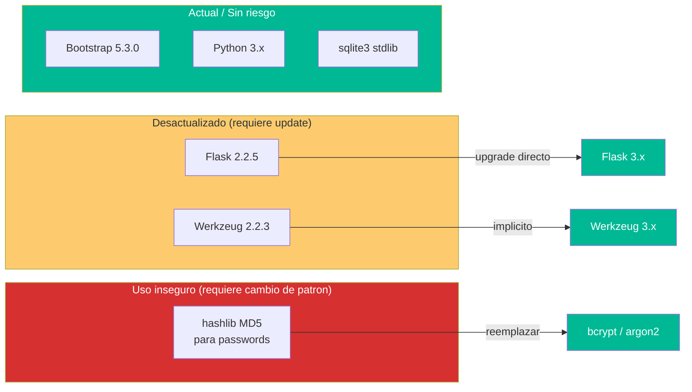

# Componentes Desactualizados — StockControl

## Inventario de Componentes con Versiones

| Componente | Versión Actual | Estado | EOL | Riesgo |
|---|---|---|---|---|
| **Flask** | 2.2.5 | Desactualizado (~2 major behind) | Mantenimiento limitado | Medio |
| **Werkzeug** | 2.2.3 | Desactualizado (~2 major behind) | Se actualiza con Flask | Medio |
| **Python** | Compatible 3.x (no pinned) | Activo | Depende de versión del host | Bajo |
| **Bootstrap** | 5.3.0 (CDN) | Actual | Activo | Bajo |
| **Bootstrap Icons** | 1.11.0 (CDN) | Actual | Activo | Bajo |
| **SQLite** | stdlib (versión del intérprete) | Activo | N/A (stdlib) | Bajo (pero inadecuado para producción) |

## Detalle de Desactualización

### Flask 2.2.5

- **Evidencia:** `requirements.txt:3` — `flask==2.2.5`
- **Versión actual del ecosistema:** Flask 3.x (3.0.0 released Dec 2023)
- **Distancia:** ~2 major versions
- **Cambios breaking en Flask 3.0:**
  - Requiere Werkzeug ≥3.0
  - Requiere Python ≥3.8
  - Depreca `before_first_request`
  - Cambios en `app.run()` defaults
- **Path de migración:** Directo — Flask 2→3 migration guide disponible
- **Riesgo de no actualizar:** Sin parches de seguridad para Flask 2.2.x; posibles CVEs sin fix

[PENDIENTE: verificar si Flask 2.2.5 tiene CVEs conocidos específicos en PyPI Advisory Database]

### Werkzeug 2.2.3

- **Evidencia:** `requirements.txt:4` — `Werkzeug==2.2.3`
- **Versión actual:** Werkzeug 3.x
- **Nota:** Se actualiza automáticamente al actualizar Flask a 3.x
- **Riesgo específico:** Con `DEBUG=True`, el debugger de Werkzeug puede exponer un shell interactivo

### Patrón de Hashing: hashlib MD5

- **No es un componente "desactualizado"** — hashlib está en stdlib y se mantiene
- **El PROBLEMA es el algoritmo usado:** MD5 está roto criptográficamente desde 2004
- **Alternativa moderna:** `bcrypt` (v4.x), `argon2-cffi` (v23.x), o `passlib`
- **Criticidad:** Alta — no por obsolescencia de la lib sino por elección de algoritmo

## Diagrama de Estado de Componentes

El diagrama muestra que solo 2 dependencias requieren actualización (Flask, Werkzeug) y 1 requiere reemplazo de patrón (MD5). El path de migración es directo y bien documentado.

## Impacto de No Actualizar

| Componente | Impacto de mantener versión actual | Timeline de riesgo |
|---|---|---|
| Flask 2.2.5 | Sin parches de seguridad; posibles CVEs sin fix | Ya en riesgo |
| Werkzeug 2.2.3 | Debugger posiblemente vulnerable a exploits conocidos | Ya en riesgo (con DEBUG=True) |
| MD5 para passwords | Credenciales recuperables en minutos con hardware moderno | Riesgo permanente desde día 1 |

## Hallazgos Clave

1. **Solo 2 dependencias PyPI desactualizadas** — Ecosistema mínimo, fácil de actualizar
2. **Flask 2→3 es un upgrade directo** — Migration guide oficial disponible, breaking changes menores
3. **El riesgo principal NO es obsolescencia sino USO inseguro** — MD5 es el problema real
4. **SQLite no está "desactualizado"** pero es inadecuado para producción multi-usuario

## Referencias

- [summary.md](summary.md)
- [../analysis/dependency-security-assessment.md](../analysis/dependency-security-assessment.md)
- [../architecture/dependencies.md](../architecture/dependencies.md)
