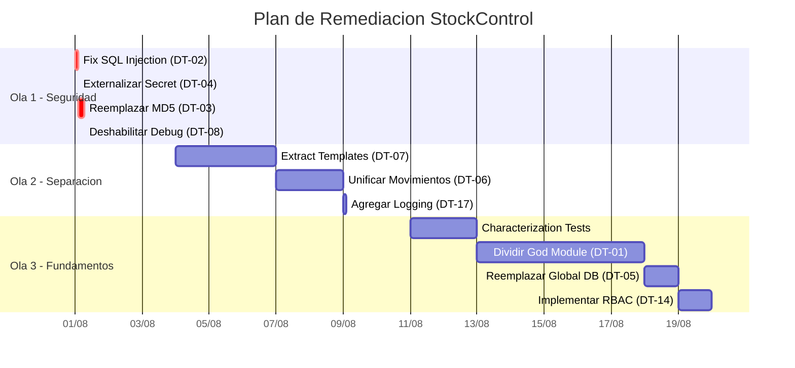

# Plan de Remediación — StockControl

## Estrategia de Remediación

La remediación se organiza en **3 olas** priorizadas por impacto/esfuerzo. Las Ola 1 son quick wins que resuelven riesgos críticos inmediatos. La Ola 2 habilita mantenibilidad futura. La Ola 3 establece fundamentos para escalar.

## Ola 1: Quick Wins de Seguridad (1-2 días)

### DT-02: Fix SQL Injection — Parameterize Queries

**Smell:** SQL concatenation (Injection vulnerability)
**Refactoring recomendado:** Replace string concatenation with parameterized queries
**Mecánica:**
1. Identificar todas las concatenaciones: `" + variable + "` en queries
2. Reemplazar por `?` placeholder + tuple
3. Ejemplo: `"WHERE username='" + u + "'"` → `"WHERE username=?", (u,)`
4. Repetir en 7 puntos identificados
**Archivos afectados:** `app.py:448, 757, 759, 761, 848, 882`
**Tests necesarios antes:** Test HTTP de login + test de filtros de productos
**Riesgo:** Bajo — cambio mecánico sin cambio de lógica
**Esfuerzo:** 2 horas

### DT-04: Externalizar Secret Key

**Smell:** Hardcoded secret
**Refactoring recomendado:** Introduce Parameter (env var)
**Mecánica:**
1. `CLAVE = os.environ.get('SECRET_KEY', 'dev-only-fallback')`
2. Documentar que en producción debe setearse `SECRET_KEY`
3. Agregar `.env.example` con la variable
**Archivos afectados:** `app.py:44`
**Tests necesarios antes:** Ninguno (cambio de configuración)
**Riesgo:** Bajo
**Esfuerzo:** 15 minutos

### DT-03: Reemplazar MD5 por bcrypt

**Smell:** Broken cryptographic algorithm
**Refactoring recomendado:** Replace Data Value with Object (Password strategy)
**Mecánica:**
1. `pip install bcrypt`
2. Crear `hash_password(plain)` → `bcrypt.hashpw(plain.encode(), bcrypt.gensalt())`
3. Crear `verify_password(plain, hashed)` → `bcrypt.checkpw()`
4. Actualizar login route para usar `verify_password()`
5. Migración: re-hash passwords en primer login exitoso con flag `needs_rehash`
**Archivos afectados:** `app.py:265`, ruta login, seeds
**Tests necesarios antes:** Test de login/logout
**Riesgo:** Medio (requiere migración de datos)
**Esfuerzo:** 4 horas

### DT-08: Deshabilitar Debug en Producción

**Smell:** Security misconfiguration
**Refactoring recomendado:** Introduce Parameter (env var)
**Mecánica:**
1. `DEBUG = os.environ.get('FLASK_DEBUG', 'false').lower() == 'true'`
2. `app.run(host=os.environ.get('HOST', '127.0.0.1'), port=int(os.environ.get('PORT', 5001)))`
**Archivos afectados:** `app.py:44, 2221`
**Tests necesarios antes:** Ninguno
**Riesgo:** Bajo
**Esfuerzo:** 15 minutos

## Ola 2: Separación de Concerns (1-2 semanas)

### DT-07: Extract Templates

**Smell:** Mixed responsibilities (HTML en Python)
**Refactoring recomendado:** Extract Method → archivos template
**Mecánica:**
1. Crear directorio `templates/`
2. Extraer `TMPL_BASE` → `templates/base.html`
3. Para cada ruta, extraer el HTML del f-string → `templates/{nombre}.html`
4. Reemplazar `render_template_string(TMPL_BASE, ...)` por `render_template('base.html', ...)`
5. Pasar variables con `` pattern
**Archivos afectados:** `app.py` (elimina ~420 LOC de HTML)
**Tests necesarios antes:** Snapshot tests de responses HTTP de cada ruta
**Riesgo:** Medio (muchos archivos nuevos pero cambio mecánico)
**Esfuerzo:** 3 días

### DT-06: Unificar Movimientos con Template Method

**Smell:** Duplicate Code (4 funciones ~80% idénticas)
**Refactoring recomendado:** Extract Method + Template Method Pattern
**Mecánica:**
1. Extract Method: `parse_form_items(request, fields=['prod','cant','costo','lote'])`
2. Extract Method: `registrar_movimiento(tipo, bod_id, items, usuario_id, ref, obs)`
3. Extract Method: `render_movimiento_form(tipo, bodegas, productos, config)`
4. Cada ruta se reduce a: validar → `registrar_movimiento()` → redirect
5. Configuración por tipo: `{'ENTRADA': {'validate_stock': False, 'fields': [...]}, ...}`
**Archivos afectados:** `app.py:1224-1870` (660 LOC → ~200 LOC)
**Tests necesarios antes:** Tests de cada tipo con datos válidos e inválidos
**Riesgo:** Medio (lógica de negocio crítica pero mecánica repetitiva)
**Esfuerzo:** 2 días

### DT-17: Agregar Logging Framework

**Smell:** Debugging by print
**Refactoring recomendado:** Replace `print()` with `logging`
**Mecánica:**
1. `import logging; logger = logging.getLogger(__name__)`
2. Configurar formato + handler (stdout para containers)
3. Reemplazar `print("[OK]...")` → `logger.info(...)`
4. Agregar `logger.error(ex, exc_info=True)` en catches
**Archivos afectados:** `app.py:58, 60, 215, 217, 224, 863, ...`
**Tests necesarios antes:** Ninguno
**Riesgo:** Bajo
**Esfuerzo:** 2 horas

## Ola 3: Fundamentos para Escalar (2-3 semanas)

### DT-01: Dividir God Module

**Smell:** God Class/Module
**Refactoring recomendado:** Extract Class (múltiples módulos)
**Mecánica:**
1. Crear estructura de paquete:
   ```
   app/
   ├── __init__.py (Flask app factory)
   ├── config.py (settings)
   ├── models/ (SQLAlchemy o dataclasses)
   ├── routes/ (blueprints por dominio)
   ├── services/ (lógica de negocio)
   └── templates/ (Jinja2)
   ```
2. Mover auth → `routes/auth.py` + `services/auth_service.py`
3. Mover productos → `routes/productos.py` + `services/catalogo_service.py`
4. Mover bodegas → `routes/bodegas.py`
5. Mover movimientos → `routes/movimientos.py` + `services/inventario_service.py`
6. Mover DDL + seeds → `models/` + migration script
7. Crear app factory para testabilidad
**Archivos afectados:** `app.py` se divide en 15-20 archivos
**Tests necesarios antes:** Characterization tests HTTP completos (19 rutas)
**Riesgo:** Alto (refactoring masivo; requiere tests previos sólidos)
**Esfuerzo:** 5 días

### DT-05: Reemplazar Conexión Global por Pool/Context

**Smell:** Shared mutable state (singleton non-thread-safe)
**Refactoring recomendado:** Replace Global Reference with Getter (app context)
**Mecánica:**
1. Eliminar `_DB` global
2. Usar `g` de Flask para conexión per-request: `g.db = sqlite3.connect(DATABASE)`
3. Agregar `@app.teardown_appcontext` para cerrar conexión
4. O migrar a SQLAlchemy con connection pooling
**Archivos afectados:** `app.py:49, 70, 227-230` + todas las llamadas a `db()`
**Tests necesarios antes:** Tests de operaciones concurrentes
**Riesgo:** Medio (cambia patrón de acceso a datos en todo el código)
**Esfuerzo:** 1 día (con Flask `g`) o 3 días (con SQLAlchemy)

### DT-14: Implementar RBAC

**Smell:** Authorization bypass
**Refactoring recomendado:** Introduce Parameter Object (permissions) + Decorator Enhancement
**Mecánica:**
1. Crear `PERMISOS = {'ADMIN': ['*'], 'AUXILIAR': ['mov_*', 'kardex'], 'AUDITOR': ['view_*']}`
2. Modificar `auth()` para aceptar roles permitidos: `@auth(roles=['ADMIN', 'ADMIN_INV'])`
3. Verificar `session['rol'] in roles` dentro del decorator
**Archivos afectados:** `app.py:298-305` + todas las rutas con `@auth`
**Tests necesarios antes:** Tests de acceso por rol
**Riesgo:** Medio (cambio de comportamiento — puede bloquear usuarios)
**Esfuerzo:** 1 día

## Timeline de Remediación



## Hallazgos Clave

1. **Ola 1 resuelve 4 vulnerabilidades críticas en <1 día** — máximo ROI de seguridad
2. **Ola 2 elimina ~420 LOC de HTML y ~460 LOC duplicados** — reduce codebase un 50%
3. **Ola 3 requiere tests previos obligatorios** — sin characterization tests no se puede hacer el split
4. **Total estimado: 3-4 semanas** — para un developer senior con conocimiento de Flask
5. **Orden es crítico:** Seguridad → Templates → DRY → Split → RBAC

## Referencias

- [summary.md](summary.md)
- [outdated-components.md](outdated-components.md)
- [maintenance-burden.md](maintenance-burden.md)
- [../analysis/tech-debt.md](../analysis/tech-debt.md)
- [../analysis/complexity-analysis.md](../analysis/complexity-analysis.md)
