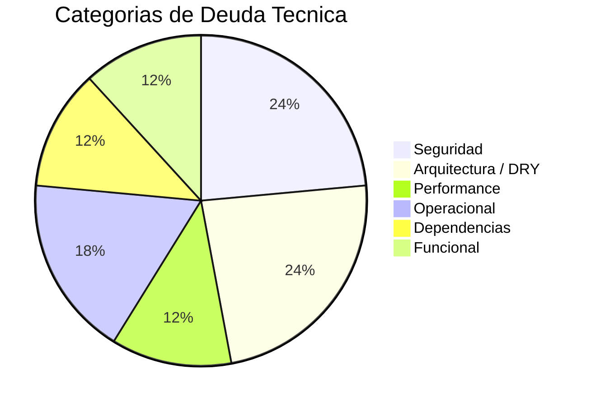

# Resumen de Deuda Técnica — StockControl

## Distribución por Severidad

| Severidad | Cantidad | % |
|---|---|---|
| Alta | 8 | 47% |
| Media | 6 | 35% |
| Baja | 3 | 18% |
| **Total** | **17** | 100% |

## Top 5 Issues Críticos

| # | Issue | Categoría | Impacto | Esfuerzo Fix |
|---|---|---|---|---|
| 1 | **SQL Injection directa** (7+ puntos) | Seguridad | Data breach completo | Bajo (horas) |
| 2 | **God Module** (939 LOC en 1 archivo) | Arquitectura | Imposible mantener/escalar | Alto (semanas) |
| 3 | **MD5 para passwords** | Seguridad | Credenciales expuestas | Bajo (horas) |
| 4 | **Secret key hardcoded** | Seguridad | Sesiones forjables | Bajo (minutos) |
| 5 | **4 funciones copy-paste** (660 LOC duplicados) | DRY | 4x costo de mantenimiento | Medio (días) |

## Impacto en Mantenibilidad

### Esfuerzo de Remediación Estimado

| Categoría | Quick Wins (<1 día) | Refactoring (1-5 días) | Rewrite (>1 semana) |
|---|---|---|---|
| Seguridad | DT-02 (parametrizar SQL), DT-04 (env var para secret) | DT-03 (MD5→bcrypt + migración) | — |
| Arquitectura | — | DT-06 (extract template method) | DT-01 (dividir God Module), DT-07 (extract templates) |
| Performance | — | DT-12 (optimizar dashboard), DT-13 (agregar paginación) | — |
| Operacional | DT-08 (env var para DEBUG), DT-17 (agregar logging) | — | — |
| Dependencias | DT-15 (agregar lock file) | DT-09 (update Flask 3.x) | — |

**Estimación total: 3-4 semanas de un developer senior para remediar completamente.**

[ESTIMADO: Basado en la complejidad del código (939 LOC) y la naturaleza mecánica de la mayoría de los fixes]

## Ruta Crítica de Remediación

```mermaid
flowchart LR
    SQL["DT-02: Fix SQL Injection<br/>(2 horas)"] --> SECRET["DT-04: Externalizar secret<br/>(30 min)"]
    SECRET --> MD5["DT-03: MD5 a bcrypt<br/>(4 horas)"]
    MD5 --> DEBUG["DT-08: Deshabilitar debug<br/>(15 min)"]
    DEBUG --> TMPL["DT-07: Extract templates<br/>(3 dias)"]
    TMPL --> DRY["DT-06: Unify movimientos<br/>(2 dias)"]
    DRY --> GOD["DT-01: Split God Module<br/>(5 dias)"]

    style SQL fill:#d63031,color:#fff
    style SECRET fill:#d63031,color:#fff
    style MD5 fill:#d63031,color:#fff
    style DEBUG fill:#e17055,color:#fff
    style TMPL fill:#fdcb6e,color:#2d3436
    style DRY fill:#fdcb6e,color:#2d3436
    style GOD fill:#74b9ff,color:#2d3436
```

El diagrama muestra la secuencia recomendada de remediación: primero los quick wins de seguridad (impacto inmediato, bajo esfuerzo), luego los refactorings de arquitectura (habilitan mantenibilidad futura).

## Hallazgos Clave

1. **47% de la deuda es de severidad Alta** — dominada por vulnerabilidades de seguridad
2. **Quick wins de seguridad** — DT-02, DT-04 se pueden resolver en <3 horas con impacto masivo
3. **El God Module (DT-01) bloquea TODA mejora arquitectónica** — es el enabler para testing, DRY y escala
4. **Ratio esfuerzo/impacto favorable** — Las vulnerabilidades más graves son las más fáciles de corregir
5. **3-4 semanas** para remediación completa por un developer senior

## Referencias

- [outdated-components.md](outdated-components.md)
- [maintenance-burden.md](maintenance-burden.md)
- [remediation-plan.md](remediation-plan.md)
- [../analysis/tech-debt.md](../analysis/tech-debt.md)
