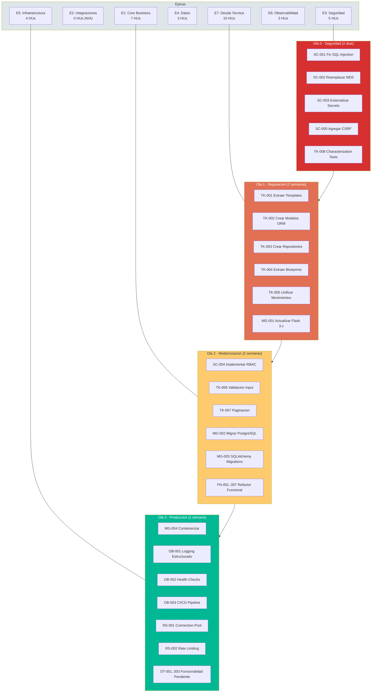

# User Story Map — StockControl

## Diagrama Visual del Mapa de Historias

## Matriz de Priorización (MoSCoW)

| Must Have (Ola 0-1) | Should Have (Ola 2) | Could Have (Ola 3) | Won't Have (fuera scope) |
|---|---|---|---|
| SC-001 Fix SQLi | SC-004 RBAC | OB-003 CI/CD | Integración con ERP |
| SC-002 Fix MD5 | TK-006 Validación | RS-002 Rate Limit | Multi-tenancy |
| SC-003 Secrets | TK-007 Paginación | DT-001 Reservas | App mobile |
| TK-008 Char Tests | MG-002 PostgreSQL | DT-002 Lotes | Notificaciones push |
| TK-001 Templates | FN-001..007 Refactor | DT-003 Promedio ponderado | BI/Analytics |
| TK-002 ORM | MG-003 Migrations | | |
| TK-003 Repos | | | |
| TK-004 Blueprints | | | |
| TK-005 Unificar | | | |

## Referencias

- [backlog.md](backlog.md)
- [epics/01-core-business.md](epics/01-core-business.md)
- [epics/03-security.md](epics/03-security.md)
- [epics/07-tech-debt.md](epics/07-tech-debt.md)
