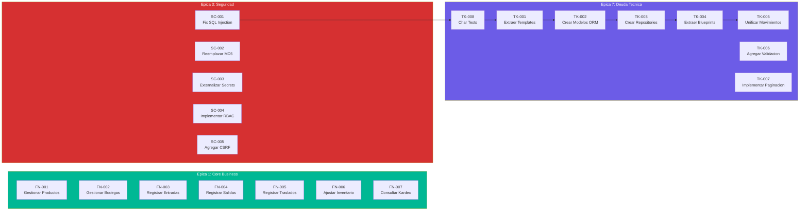
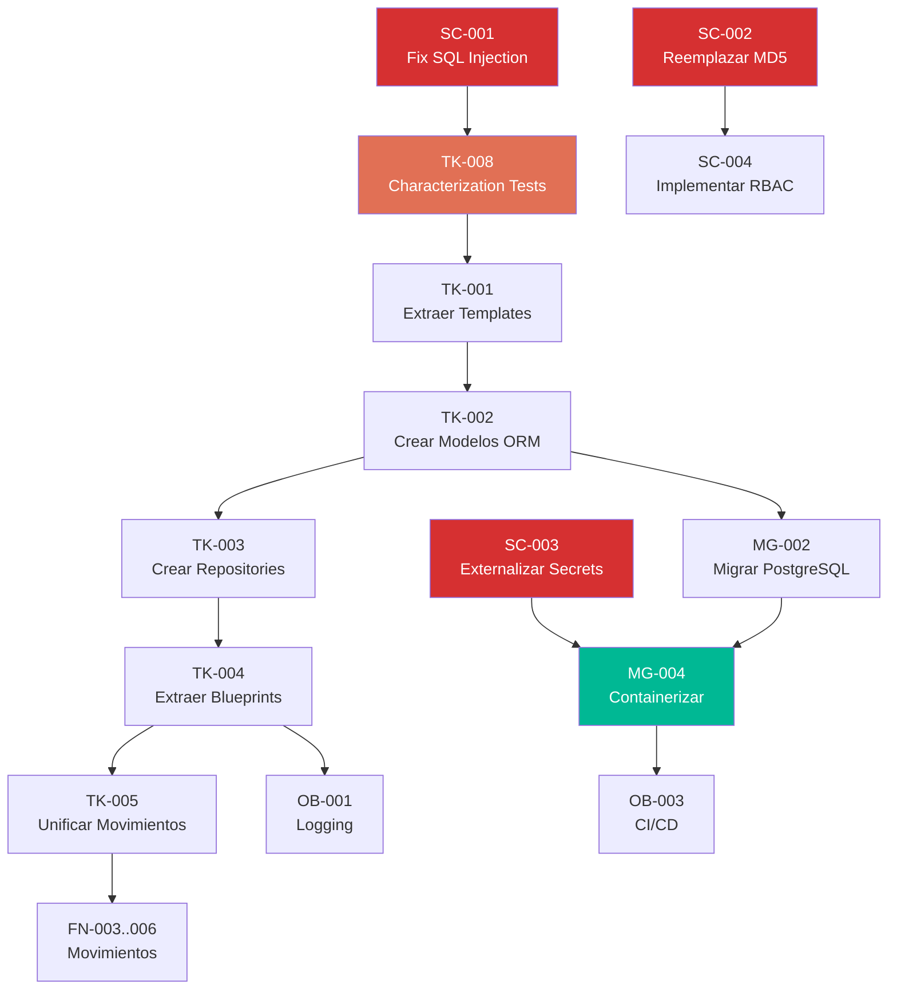

# Backlog de Historias de Usuario — StockControl

## Resumen

| Indicador | Valor |
|---|---|
| **Total HUs** | 32 |
| **Variante de Modernización** | R5 — Refactor |
| **Distribución por tipo** | FN: 7, TK: 8, SC: 5, MG: 4, DT: 3, OB: 3, RS: 2 |
| **Épicas** | 7 |
| **Talla QAM** | S (Small) |
| **Créditos estimados** | ~70 |
| **Duración** | 5-6 semanas |

## User Story Map

## Olas de Implementación

| Ola | Sprint | HUs | Prioridad |
|---|---|---|---|
| **Ola 0** | Sprint 1 (2 días) | SC-001, SC-002, SC-003, SC-005, TK-008 | Crítica — seguridad |
| **Ola 1** | Sprint 2-3 (2 semanas) | TK-001, TK-002, TK-003, TK-004, TK-005, MG-001 | Alta — estructura |
| **Ola 2** | Sprint 4-5 (2 semanas) | SC-004, TK-006, TK-007, FN-001 a FN-007, MG-002, MG-003 | Alta — modernización |
| **Ola 3** | Sprint 6 (1 semana) | OB-001, OB-002, OB-003, RS-001, RS-002, MG-004, DT-001, DT-002, DT-003 | Media — producción |

## Dependencias entre HUs

## Estimación de Esfuerzo por Épica

| Épica | HUs | Story Points | Esfuerzo (días) |
|---|---|---|---|
| Core Business (FN) | 7 | 21 | 5 |
| Seguridad (SC) | 5 | 13 | 3 |
| Deuda Técnica (TK) | 8 | 34 | 10 |
| Migración (MG) | 4 | 16 | 5 |
| Datos (DT) | 3 | 8 | 3 |
| Observabilidad (OB) | 3 | 8 | 3 |
| Resiliencia (RS) | 2 | 5 | 2 |
| **Total** | **32** | **105** | **~31 días** |

[ESTIMADO: Story points basados en complejidad relativa. 1 SP ≈ 0.3 días para 1 dev experimentado en Flask.]

## Criterios de Done Globales

Aplican a TODAS las HUs del backlog:
- [ ] Código pasa linter (flake8 o ruff)
- [ ] Tests unitarios escritos con pytest (≥80% cobertura del componente)
- [ ] Sin secrets hardcoded en el código
- [ ] Sin SQL concatenado (solo parameterized queries)
- [ ] Documentación inline (docstrings) en funciones públicas
- [ ] Funciona con PostgreSQL (no solo SQLite)
- [ ] PR revisado y aprobado

## Referencias

- [Migration — Component Order](../migration/component-order.md)
- [Analysis — Modernization Assessment](../analysis/modernization-assessment.md)
- [Technical Debt — Remediation Plan](../technical-debt/remediation-plan.md)
- [Behavior — Workflows](../behavior/workflows.md)
- [Behavior — Business Logic](../behavior/business-logic.md)
- [Analysis — Security Patterns](../analysis/security-patterns.md)
- [Analysis — Production Readiness](../analysis/production-readiness.md)
