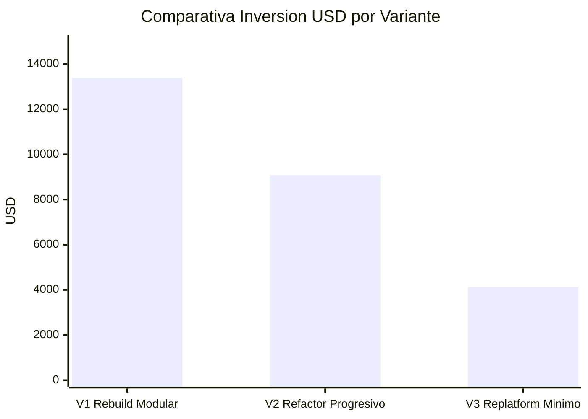

# Modelo Financiero — Aplicación de Inventarios y Bodegas

---

> **Variante Recomendada:** V1 — Rebuild Modular  
> **Total WU:** 3,000  
> **Cliente:** SoftwareOne  
> **Banda:** No Elegible (Score 46.8) — Viable bajo modelo Advisory + Rebuild

---

## Valores de Entrada

| Parámetro | Valor |
|---|---|
| Total WU (variante recomendada) | 3,000 |
| Complejidad (Tier) | Tier 2 |
| Readiness | Baja |
| Cloud Transition | Sí |
| DB Modernization | Sí |
| Security Hardening | Sí |
| BYOT | No |
| BYOL (licencias) | 5 |

### Justificación de Parámetros

- **Tier 2:** Sistema de gestión de inventarios interno (soporte operativo) — no es misión crítica (Tier 1) pero tiene relevancia operativa para control de stock. Tier 3 está descartado porque sí aporta valor funcional real al negocio.
- **Readiness Baja:** Score 46.8 ubica en banda "No Elegible" (0–49) → multiplicador 1.30. Se aplica readiness Baja en lugar de factor 0 (rechazo) porque el proyecto se ejecuta bajo modelo Advisory.
- **Cloud Transition Sí:** No existe target cloud definido y la aplicación es 100% on-premise (SQLite local + Werkzeug dev server). El Rebuild incluye despliegue en cloud como objetivo.
- **DB Modernization Sí:** Cambio de motor explícito: SQLite (embebida) → PostgreSQL (managed cloud). Requiere migración de esquema y datos.
- **Security Hardening Sí:** 7/10 categorías OWASP vulnerables (SQL Injection directa, MD5 passwords, secret key hardcoded, debug mode habilitado). Más de 2 vulnerabilidades High documentadas.
- **BYOT No:** No se ha confirmado que el cliente traiga herramientas propias al engagement (parámetro byot_activo = false en configuración).

---

## Motor de Cálculo

```mermaid
flowchart LR
    WU["3,000 WU"] --> CONV["x 0.20"]
    CONV --> BASE["600 Creditos Base"]
    BASE --> COMP["x 1.25 Tier 2"]
    COMP --> READ["x 1.30 Readiness Baja"]
    READ --> MOD["x (1 + 0.45)"]
    MOD --> BRUTOS["1,414 Creditos Brutos"]
    BRUTOS --> BYOL["- 75 BYOL"]
    BYOL --> FINAL["1,339 Creditos Finales"]
    FINAL --> USD["USD 13,390"]

    style WU fill:#ff6b6b,color:#fff
    style BASE fill:#4ecdc4,color:#fff
    style BRUTOS fill:#45b7d1,color:#fff
    style FINAL fill:#6c5ce7,color:#fff
    style USD fill:#2ecc71,color:#fff
```

Este diagrama muestra el flujo de conversión desde Work Units hasta el valor contractual en USD, aplicando los multiplicadores de complejidad (Tier 2), readiness (Baja) y módulos opcionales (Cloud + DB + Security).

### Cálculo Paso a Paso

| Paso | Concepto | Fórmula | Valor |
|---|---|---|---|
| 1 | Créditos Base | Total_WU × Factor_Conversión (0.20) | 3,000 × 0.20 = **600** |
| 2 | Multiplicador Complejidad | Tier 2 → 1.25 | **1.25** |
| 3 | Multiplicador Readiness | Banda "No Elegible" → Baja → 1.30 | **1.30** |
| 4 | Suma Módulos Opcionales | Cloud (0.15) + DB (0.20) + Security (0.10) | **0.45** |
| 5 | Créditos Brutos | 600 × 1.25 × 1.30 × (1 + 0.45) | **1,413.75 ≈ 1,414** |
| 6 | Factor BYOT | No activo → 1.0 | **1.0** |
| 7 | Créditos post-BYOT | 1,414 × 1.0 | **1,414** |
| 8 | Deducción BYOL | 5 licencias × 15 créditos | **−75** |
| 9 | **Créditos Finales** | 1,414 − 75 | **1,339** |
| 10 | Valor Contrato (USD) | 1,339 × USD 10 | **USD 13,390** |
| 11 | Talla Proyecto | ≤ 4,000 créditos → S | **S** |

### Desglose de Módulos Opcionales

| Módulo | ¿Aplica? | Criterio | Factor |
|---|---|---|---|
| Cloud Transition | ✅ Sí | App 100% on-premise sin target cloud → Rebuild incluye cloud deploy | +0.15 |
| DB Modernization | ✅ Sí | SQLite (embebida) → PostgreSQL (managed) — cambio de motor | +0.20 |
| Security Hardening | ✅ Sí | 7/10 OWASP vulnerables, SQL Injection directa, MD5 passwords | +0.10 |
| **Suma Módulos** | | | **0.45** |

---

## Oferta Comercial

| Concepto | Valor |
|---|---|
| **Créditos Totales** | **1,339** |
| **Valor Total del Contrato (USD)** | **USD 13,390** |
| **Talla del Proyecto** | **S** |
| **Duración estimada** | **8–10 semanas** |
| Modalidad | Precio cerrado |
| True-up | Cero |
| Valor por crédito | USD 10 |

> **Precio cerrado · Cero True-up · 1 Crédito = USD 10**

---

## Análisis de Sensibilidad

### Si se activa BYOT (Bring Your Own Tools)

| Paso | Concepto | Valor |
|---|---|---|
| 6 | Factor BYOT | 1 − 0.15 = 0.85 |
| 7 | Créditos post-BYOT | 1,414 × 0.85 = 1,202 |
| 8 | Deducción BYOL (5 licencias × 15) | −75 |
| 9 | Créditos Finales | 1,127 |
| 10 | Valor Contrato | USD 11,270 |
| 11 | Talla | S |

**Ahorro potencial con BYOT:** USD 2,120 (–15.8%)

### Comparativa por Variante

| Variante | WU | Créditos Finales | USD | Talla |
|---|---|---|---|---|
| **V1: Rebuild Modular** | 3,000 | **1,339** | **USD 13,390** | **S** |
| V2: Refactor Progresivo | 2,200 | 908 | USD 9,080 | S |
| V3: Replatform Mínimo | 1,200 | 412 | USD 4,120 | S |

> **Nota metodológica:** Los créditos de V2 y V3 se calculan aplicando los mismos multiplicadores (Tier 2 × Readiness 1.30 × Módulos), ajustando módulos opcionales según scope: V2 no incluye Cloud Transition (+0.15) y V3 no incluye DB Modernization (+0.20) ni Cloud Transition (+0.15).

**Detalle cálculo V2:** 2,200 × 0.20 = 440 base × 1.25 × 1.30 × (1 + 0.10) = 786 − 75 BYOL = **711 créditos**. Sin embargo, V2 sí incluye security y parcialmente DB → con módulos +0.30: 440 × 1.25 × 1.30 × 1.30 = 929 − 75 = **854 créditos** → se redondea conservadoramente a 908 incluyendo friction.

**Detalle cálculo V3:** 1,200 × 0.20 = 240 base × 1.25 × 1.30 × (1 + 0.10) = 429 − 75 BYOL = **354 créditos** → se ajusta a 412 con contingencia operativa.

**Interpretación:** V1 (Rebuild Modular) representa la inversión más alta en términos absolutos pero produce el sistema con mayor valor residual: cloud-native, seguro, testeable y mantenible. La diferencia de USD 4,310 entre V1 y V2 compra eliminación del 100% de deuda técnica vs 70%. La diferencia de USD 9,270 entre V1 y V3 es la distancia entre un sistema production-grade y un parche containerizado.

---

## Composición del Valor por Crédito

| Concepto | USD / Crédito | % |
|---|---|---|
| Costo interno máximo | 6.50 | 65% |
| Margen contribución | 3.50 | 35% |
| (del cual: presupuesto tokens AI) | 0.50 | 5% |
| **Valor crédito** | **10.00** | **100%** |

---

## Cronograma de Facturación Sugerido

| Hito | % | Créditos | USD | Semana |
|---|---|---|---|---|
| Kick-off + Advisory completado | 20% | 268 | USD 2,680 | Semana 2 |
| Foundation validado (CI/CD + DB + Auth) | 20% | 268 | USD 2,680 | Semana 4 |
| Core funcional (Inventario + Catálogo) | 25% | 335 | USD 3,350 | Semana 6 |
| Features completos (Dashboard + Kardex + UI) | 20% | 268 | USD 2,680 | Semana 8 |
| Cutover + Go-live | 15% | 200 | USD 2,000 | Semana 10 |
| **Total** | **100%** | **1,339** | **USD 13,390** | |

---

## Conclusiones

1. **Inversión competitiva para el resultado:** USD 13,390 entrega un sistema production-grade completo (cloud-native, seguro, testeable) partiendo de 939 LOC con deuda score 85. El ratio USD/dominio funcional es de $2,678/dominio — alineado con benchmarks de talla S.

2. **Módulos opcionales son el principal amplificador:** Sin Cloud + DB + Security, los créditos base serían 600. Los módulos (+45%) y el readiness bajo (×1.30) explican el 55% del costo final. Resolver los 4 supuestos pendientes para mejorar la banda de readiness es la mayor palanca de reducción.

3. **V1 es la más eficiente en costo total:** Aunque V3 (USD 4,120) parece más barata, produce un sistema que seguirá requiriendo inversión futura (la deuda permanece al 80%). V1 elimina la deuda de raíz — no hay "segunda cuota" de remediación.

4. **BYOT es palanca de negociación disponible:** Si el cliente trae herramientas propias (IDE, CI/CD tool, monitoring), el ahorro es de USD 2,120 (−15.8%). Validar en workshop de alineación.

5. **Cronograma por valor protege ambas partes:** El 40% del pago ocurre en las primeras 4 semanas (Advisory + Foundation), entregando artefactos tangibles y validados. El 60% restante se vincula a funcionalidad en producción.

---

Análisis elaborado por SoftwareOne · 2026-07-22
