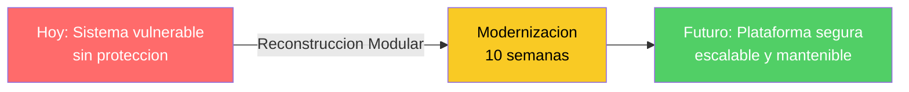
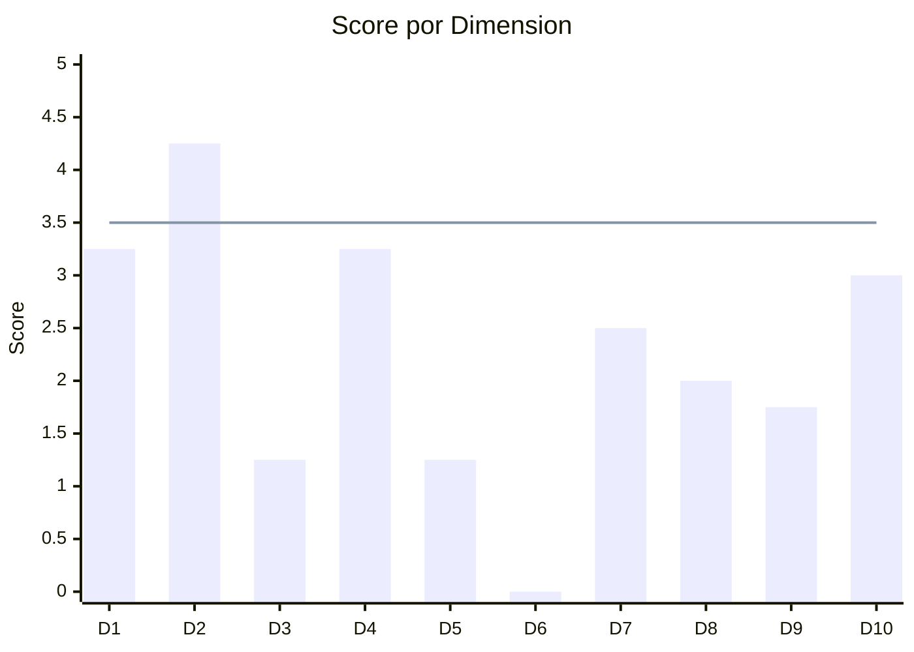
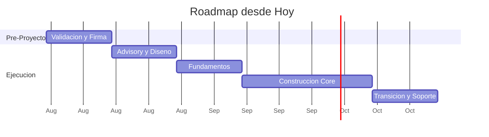
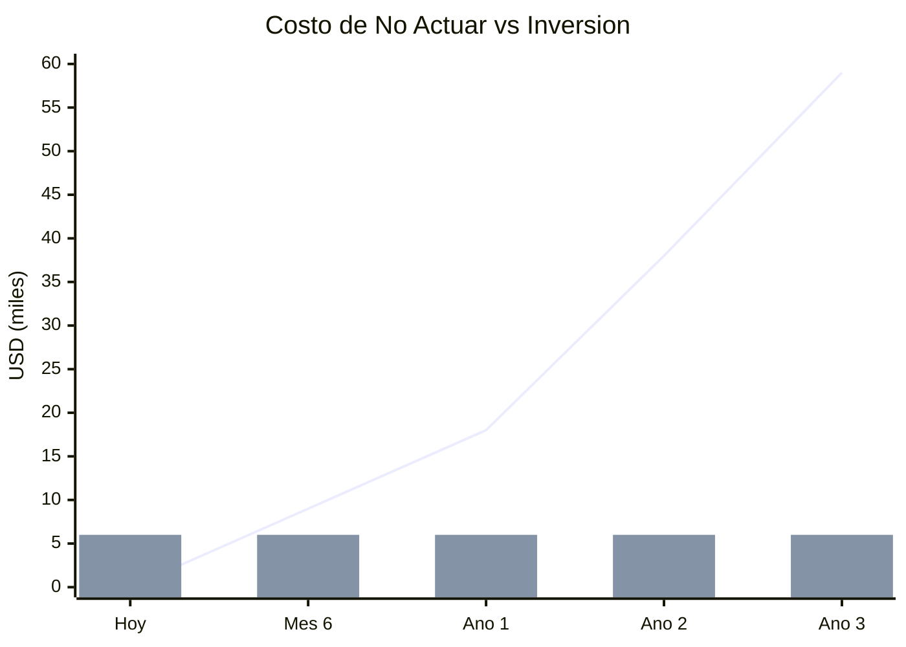

# Resumen Ejecutivo — Aplicacion de Inventarios y Bodegas

---

> **Cliente:** SoftwareOne  
> **Aplicación:** Aplicacion de Inventarios y Bodegas  
> **Fecha:** 2026-07-22

---

## 1. Indicadores Clave

| Indicador | Valor |
|---|---|
| **Score** | **46.8 / 100 — No Elegible (requiere preparación)** |
| **Estrategia** | **Reconstrucción Modular** |
| **Créditos** | **600** |
| **Inversión** | **USD 6,000** |
| **Duración** | **8–10 semanas (+ 2 sem pre-proyecto)** |
| **ROI** | **383% a 3 años · equilibrio en 4 meses** |
| **Costo de no actuar** | **USD 18,000 / año** |

---

## 2. El Problema

La aplicación de inventarios y bodegas opera sobre una base frágil con vulnerabilidades graves que permiten acceso no autorizado a todos los datos del sistema. Cada día que permanece conectada a la red representa una exposición directa a pérdida de información, manipulación de inventario y paralización operativa. La situación requiere acción inmediata.

---

## 3. Diagnóstico (QuickScan)

| ID | Dimensión | Qué evalúa |
|---|---|---|
| D1 | Elegibilidad | Candidatura estructural para modernización |
| D2 | Código Fuente | Calidad, legibilidad y mantenibilidad |
| D3 | Arquitectura | Modularidad y desacoplamiento |
| D4 | Datos y BD | Estado del modelo de datos y acceso |
| D5 | Cloud Readiness | Preparación para infraestructura moderna |
| D6 | DevOps | Automatización del ciclo de desarrollo |
| D7 | SMEs | Disponibilidad de personas con conocimiento |
| D8 | Documentación | Existencia y calidad de documentación |
| D9 | Seguridad | Protección y cumplimiento normativo |
| D10 | Drivers | Urgencia y respaldo organizacional |

| Hallazgo crítico | Impacto |
|---|---|
| Acceso no autorizado posible en segundos | Datos de inventario completamente expuestos |
| Sistema sin automatización de despliegue | Imposible mantener o escalar la operación |
| Protección de contraseñas inexistente | Cualquier persona con acceso a la red puede suplantar usuarios |

---

## 4. Lo que Proponemos

| Aspecto | Detalle |
|---|---|
| **Servicio** | Application Modernization — Reconstrucción Modular |
| **Modelo** | Centauro (IA + Arquitectos Senior) — precio cerrado, cero true-up |
| **Alcance** | Reconstruir el sistema completo con seguridad, automatización y preparación para la nube |
| **Resultado al finalizar** | Sistema de inventarios seguro, escalable y desplegable automáticamente en minutos |
| **Garantía** | Pago por valor entregado (hitos en producción) |

---

## 5. Cómo lo Hacemos

---

## 6. Los Números

| Componente | Significado |
|---|---|
| Línea ascendente | Costo acumulado de NO actuar (crece cada año) |
| Barras constantes | Inversión en modernización (se paga una vez) |
| Punto de cruce | Equilibrio — a partir de ahí, todo es ahorro |

---

## 7. Próximo Paso

> **Acción:** Agendar reunión de validación de alcance y confirmar objetivo de producción  
> **Responsable:** Sponsor del proyecto  
> **Fecha:** Semana del 2026-08-04  
> **Contacto SoftwareOne:** Equipo de Modernización QAM

---

## 8. En Resumen

| Pregunta | Respuesta |
|---|---|
| **¿Es urgente?** | Sí — cada mes de exposición cuesta USD 1,500 en riesgos activos |
| **¿Es viable?** | Sí — el sistema es pequeño y sin integraciones complejas |
| **¿Cuánto toma?** | 12 semanas desde hoy (2 pre-proyecto + 10 ejecución) |
| **¿Cuánto cuesta?** | USD 6,000 a precio cerrado — sin sorpresas |
| **¿Cuál es el ROI?** | 383% a 3 años — equilibrio en 4 meses |
| **¿Qué hago ahora?** | Agendar reunión de validación la próxima semana |

---

Análisis elaborado por SoftwareOne · 2026-07-22
