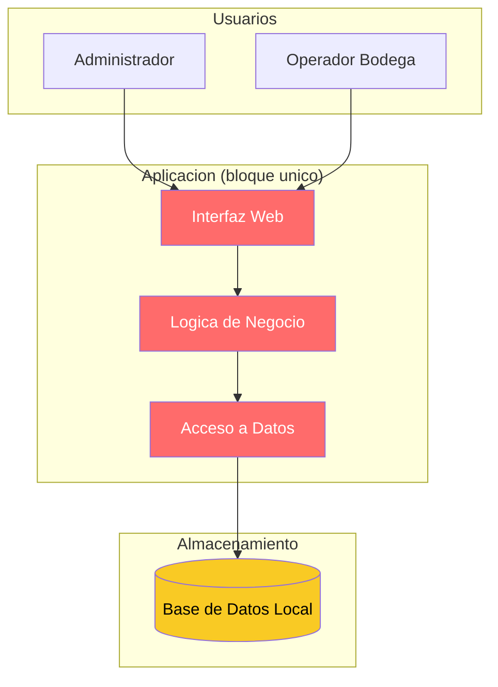
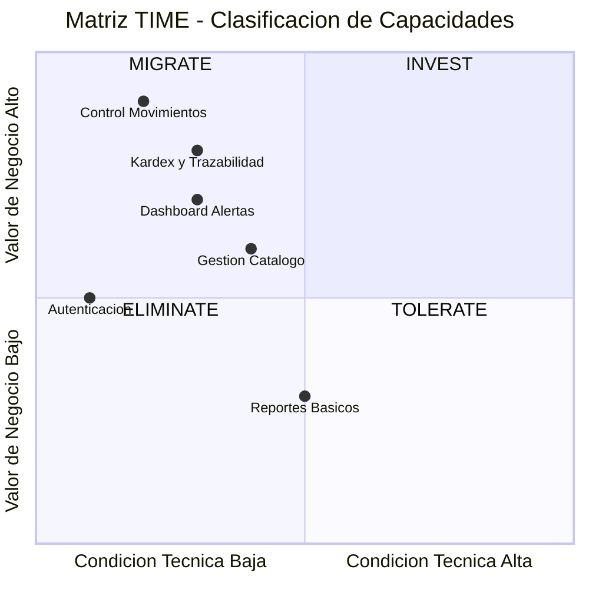
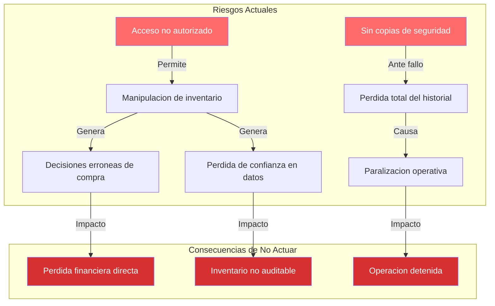

# Estado Actual — Aplicacion de Inventarios y Bodegas

---

> **Aplicación:** Aplicacion de Inventarios y Bodegas  
> **Cliente:** SoftwareOne  
> **Dominio:** Gestión de inventarios y bodegas (control de productos, categorías, almacenes, movimientos de inventario y Kardex)  
> **Fecha:** 2026-07-22

---

## 1. ¿Qué hace la aplicación?

La Aplicación de Inventarios y Bodegas gestiona el control completo de existencias: productos, categorías, almacenes y todos los movimientos que afectan el stock (entradas, salidas, traslados y ajustes). Es utilizada por personal de logística y administración para mantener la trazabilidad del inventario mediante un Kardex detallado y un tablero de indicadores que alerta sobre productos agotados o bajo mínimo. Soporta 5 dominios funcionales y 25 operaciones de negocio.

---

## 2. ¿Sobre qué opera?

La aplicación opera sobre una plataforma web ligera construida hace varios años con tecnología actual pero sin prácticas de seguridad ni infraestructura empresarial. Su arquitectura es de tipo monolítico — todo el sistema reside en un solo bloque de código sin separación interna. Se ejecuta de forma local sin preparación para la nube.

### Arquitectura Actual (Vista Ejecutiva)

La interfaz, la lógica y el acceso a datos están mezclados en un solo bloque (rojo), lo que impide realizar cambios seguros. La base de datos local (amarillo) funciona pero no soporta múltiples usuarios simultáneos ni crece con la operación.

---

## 3. Drivers de negocio afectados

| Driver de Negocio | Estado | Descripción del impacto |
|---|---|---|
| Continuidad del Negocio | 🔴 Comprometido | El sistema puede perder datos sin previo aviso; no existe respaldo automático ni recuperación ante fallos |
| Seguridad y Cumplimiento | 🔴 Comprometido | Vulnerabilidades graves permiten acceso no autorizado y manipulación de datos en segundos |
| Escalabilidad | 🔴 Comprometido | La base de datos local no soporta más de un usuario simultáneo sin riesgo de corrupción |
| Time-to-Market | 🟡 Limitado | Cualquier cambio o mejora funcional requiere tocar todo el sistema, con alto riesgo de causar fallos |
| Eficiencia Operacional | 🟡 Limitado | Despliegue manual; cada actualización requiere intervención técnica directa en el servidor |
| Innovación y Transformación | 🟡 Limitado | Imposible agregar funcionalidades modernas (alertas automáticas, integración con otros sistemas) sin reconstruir |

---

## 4. Hallazgos principales

### 4.1 Problemas actuales

| # | Hallazgo | Criticidad | Impacto en el negocio |
|---|---|---|---|
| 1 | Acceso no autorizado posible sin herramientas especiales | Alta | Cualquier persona conectada a la red puede ver, modificar o eliminar todo el inventario |
| 2 | Las contraseñas se almacenan con protección obsoleta | Alta | Si se accede a la base de datos, todas las cuentas quedan expuestas inmediatamente |
| 3 | Clave de seguridad incrustada directamente en el sistema | Alta | Permite suplantar la identidad de cualquier usuario sin dejar rastro |
| 4 | Sin copias de seguridad ni recuperación automática | Alta | Una falla del equipo o un error humano puede eliminar todo el historial de inventario |
| 5 | Sistema en modo diagnóstico permanente | Media | Expone información interna del sistema a cualquier visitante de la página |
| 6 | Base de datos no soporta uso simultáneo | Media | Dos personas operando al mismo tiempo pueden corromper los registros de stock |

### 4.2 Fortalezas identificadas

| # | Fortaleza | Por qué importa |
|---|---|---|
| 1 | Código fuente completo y accesible | Permite analizar todas las reglas de negocio para la reconstrucción sin pérdida de conocimiento |
| 2 | Funcionalidad de negocio bien definida (5 dominios claros) | El alcance está acotado — se sabe exactamente qué debe hacer el sistema nuevo |
| 3 | Sin integraciones externas complicadas | La modernización no depende de terceros ni de sistemas legados — se puede ejecutar de forma independiente |

---

## 5. Matriz TIME — Clasificación de Capacidades

| Cuadrante | Capacidad | Justificación |
|---|---|---|
| **MIGRATE** | Control de Movimientos de Inventario | Alto valor para la operación pero implementación vulnerable — prioridad de reconstrucción |
| **MIGRATE** | Kardex y Trazabilidad | Crítico para auditoría y control, pero construido sin integridad de datos |
| **MIGRATE** | Dashboard y Alertas de Stock | Información vital para la toma de decisiones, actualmente sin protección |
| **MIGRATE** | Autenticación y Acceso | Necesaria pero completamente insegura — debe reconstruirse desde cero |
| **TOLERATE** | Reportes Básicos | Funcionalidad secundaria que puede mantenerse en formato similar |

---

## 6. Impacto del Negocio (Riesgos)

| # | Riesgo actual | Consecuencia si se materializa | Áreas afectadas |
|---|---|---|---|
| 1 | Datos de inventario expuestos a manipulación | Pérdida de confiabilidad en el control de stock; decisiones de compra/venta basadas en datos falsos | Operaciones / Finanzas |
| 2 | Corrupción de datos por uso simultáneo | Registros de inventario inconsistentes; imposible determinar existencias reales | Operaciones / Logística |
| 3 | Pérdida total de datos sin posibilidad de recuperación | Paralización operativa hasta reconstruir manualmente el inventario | Operaciones / Continuidad |

### Cadena de impacto: Riesgos → Consecuencias

Las cadenas de impacto más largas nacen de las vulnerabilidades de acceso (pueden escalar desde manipulación hasta pérdida financiera) y de la ausencia de respaldos (un solo fallo puede detener la operación).

---

## 7. Estado Actual vs Estado Deseado

| Dimensión | Hoy | Después de Modernizar |
|---|---|---|
| Elegibilidad | Sistema funcional pero vulnerable | Modernizado y vigente |
| Código Fuente | Legible pero en bloque único | Modular, testeable y documentado |
| Arquitectura | Todo mezclado en un solo archivo | Separado por capas y responsabilidades |
| Datos y BD | Base de datos local sin respaldo | Base de datos empresarial con respaldo automático |
| Cloud Readiness | Solo funciona en un equipo específico | Desplegable en cualquier nube en minutos |
| DevOps | Despliegue manual sin automatización | Automatizado con validaciones continuas |
| SMEs y Conocimiento | Concentrado en el código sin documentar | Documentado y distribuido |
| Documentación | Inexistente | Completa y actualizada |
| Seguridad | Vulnerabilidades graves activas | Protección integral desde el diseño |
| Drivers de Negocio | Urgencia alta sin plan | Plan ejecutado con resultados medibles |

---

## Conclusiones

1. **Sistema funcional pero gravemente expuesto:** La aplicación cumple su función de gestión de inventario, pero lo hace sobre una base que pone en riesgo toda la operación.

2. **Seguridad y continuidad son los drivers más comprometidos:** Las vulnerabilidades de acceso y la ausencia de respaldos son riesgos que se materializan sin intervención.

3. **Fortalezas claras aceleran la solución:** El código es pequeño (939 líneas), el alcance está bien definido (5 dominios) y no hay dependencias externas complicadas — la modernización es directa.

4. **La inacción agrava la situación:** Cada día sin actuar mantiene la exposición activa. No es un sistema que "envejece gradualmente" — es uno que está activamente vulnerable.

5. **El camino natural es la reconstrucción:** Dado el tamaño pequeño del sistema y la magnitud de los problemas, reconstruir sobre bases sólidas es más eficiente que reparar pieza por pieza.

---

Análisis elaborado por SoftwareOne · 2026-07-22
