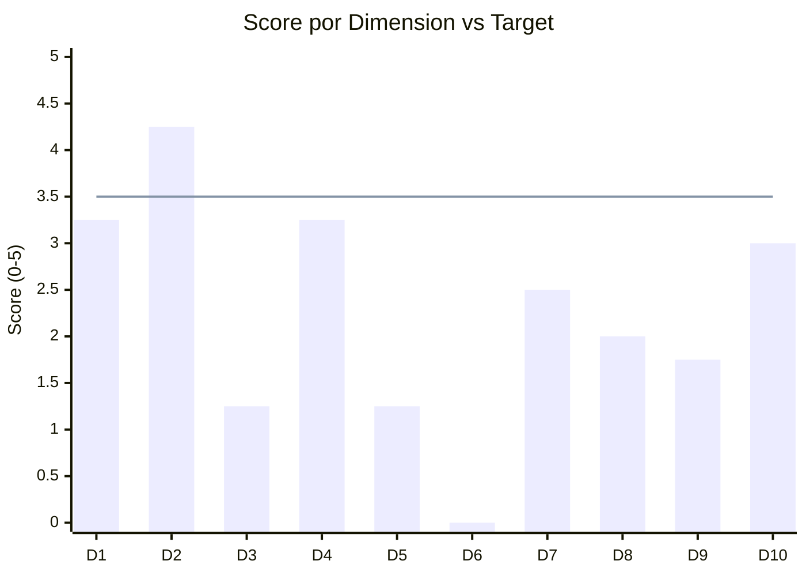
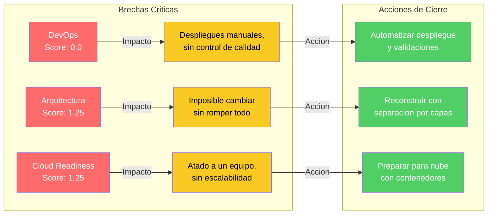

# Radar de Brechas — Aplicacion de Inventarios y Bodegas

---

> **Aplicación:** Aplicacion de Inventarios y Bodegas  
> **Cliente:** SoftwareOne  
> **Score Final:** 46.8 / 100 — No Elegible  
> **Fecha:** 2026-07-22

---

## 1. Contextualización

Las 10 dimensiones evaluadas representan las capacidades clave que una aplicación necesita para ser modernizada con éxito:

| # | Dimensión | ¿Qué evalúa? |
|---|---|---|
| 1 | Elegibilidad | Si la aplicación es candidata para modernización |
| 2 | Código Fuente | Calidad, legibilidad y mantenibilidad del código |
| 3 | Arquitectura | Nivel de modularidad y separación interna |
| 4 | Datos y BD | Estado del almacenamiento y acceso a información |
| 5 | Cloud Readiness | Preparación para operar en infraestructura moderna |
| 6 | DevOps | Automatización del ciclo de desarrollo y despliegue |
| 7 | SMEs y Conocimiento | Disponibilidad de personas que conocen el sistema |
| 8 | Documentación | Existencia y calidad de documentación |
| 9 | Seguridad | Protección contra amenazas y cumplimiento |
| 10 | Drivers de Negocio | Urgencia y respaldo organizacional para modernizar |

---

## 2. Radar Visual de Brechas

Las barras que no alcanzan la línea de referencia (3.5) representan **brechas** que el proyecto de modernización debe cerrar. Las que la superan son **fortalezas** aprovechables.

---

## 3. Tabla de Scores por Dimensión

| # | Dimensión | Score | Peso | Clasificación |
|---|---|---|---|---|
| 1 | Elegibilidad | 3.25 | 12% | Aceptable |
| 2 | Código Fuente | 4.25 | 12% | Fortaleza |
| 3 | Arquitectura | 1.25 | 12% | Brecha crítica |
| 4 | Datos y BD | 3.25 | 10% | Aceptable |
| 5 | Cloud Readiness | 1.25 | 10% | Brecha crítica |
| 6 | DevOps | 0.00 | 8% | Brecha crítica |
| 7 | SMEs y Conocimiento | 2.50 | 12% | Brecha moderada |
| 8 | Documentación | 2.00 | 8% | Brecha moderada |
| 9 | Seguridad | 1.75 | 8% | Brecha moderada |
| 10 | Drivers de Negocio | 3.00 | 8% | Aceptable |

---

## 4. Brechas que Requieren Cierre

### Top-3 Brechas Críticas

| # | Dimensión | Score | Impacto en el negocio | Acción de cierre |
|---|---|---|---|---|
| 1 | DevOps | 0.00 | No existe forma automatizada de desplegar ni validar cambios — todo es manual y propenso a errores | Implementar automatización completa del ciclo de desarrollo |
| 2 | Arquitectura | 1.25 | El sistema es un bloque único — cualquier cambio puede afectar toda la operación | Reconstruir con separación clara de responsabilidades |
| 3 | Cloud Readiness | 1.25 | El sistema solo funciona en un equipo específico — no escala ni se puede respaldar fácilmente | Containerizar y preparar para despliegue en la nube |

---

## 5. ¿Qué Significa Esto?

### Brechas que se solucionan en el proyecto de modernización

- **DevOps (score 0):** Se implementa automatización completa — el sistema se desplegará con un clic, con validaciones automáticas antes de cada actualización.
- **Arquitectura (score 1.25):** Se reconstruye separando funcionalidades en módulos independientes — los cambios futuros serán seguros y localizados.
- **Cloud Readiness (score 1.25):** Se prepara para la nube desde el diseño — escalable, respaldable y recuperable automáticamente.
- **Seguridad (score 1.75):** Se implementa protección integral desde el diseño — acceso controlado, datos protegidos, contraseñas seguras.

### Fortalezas que aceleran la ejecución

- **Código Fuente (score 4.25):** El código está completo, es legible y permite extraer todas las reglas de negocio para la reconstrucción sin riesgo de pérdida de conocimiento.
- **Elegibilidad y Datos (scores 3.25):** El sistema es una aplicación a medida con un modelo de datos claro — la reconstrucción tiene un camino directo.

---

## 6. Score Consolidado

| Indicador | Valor |
|---|---|
| **Score Global** | **46.8 / 100** |
| **Clasificación** | **No Elegible (requiere preparación previa)** |
| Brechas Críticas (score < 1.5) | 3 dimensiones |
| Brechas Moderadas (score 1.5-2.4) | 3 dimensiones |
| Fortalezas (score ≥ 3.5) | 1 dimensión |

---

## Conclusiones

1. **6 de 10 dimensiones están por debajo del umbral aceptable:** El sistema tiene más brechas que fortalezas, lo que confirma la necesidad de una intervención profunda.

2. **Las 3 brechas críticas (DevOps, Arquitectura, Cloud) se resuelven con la reconstrucción:** No requieren trabajo separado previo — son parte natural del proyecto propuesto.

3. **La fortaleza del código fuente (4.25) es el principal activo:** Permite documentar completamente las reglas de negocio antes de reconstruir — el conocimiento no se pierde.

4. **El score de 46.8 no impide el proyecto:** El sistema es tan pequeño y sin complejidad externa que la estrategia de reconstrucción modular lo convierte en un proyecto viable y de bajo riesgo.

5. **La inversión resuelve todas las brechas en una sola intervención:** En lugar de parches sucesivos, la reconstrucción cierra las 6 brechas simultáneamente y produce un sistema con puntuación proyectada superior a 80.

---

Análisis elaborado por SoftwareOne · 2026-07-22
