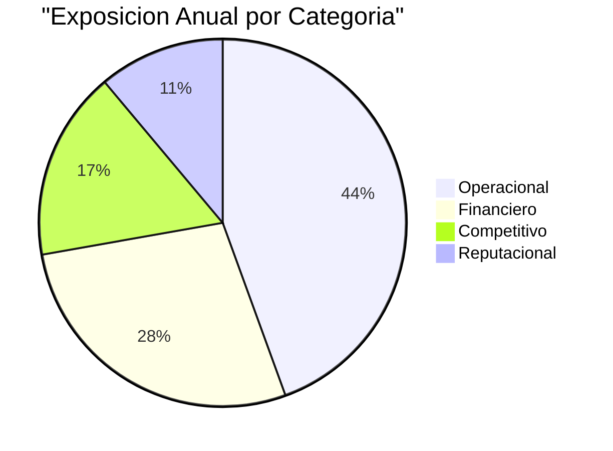
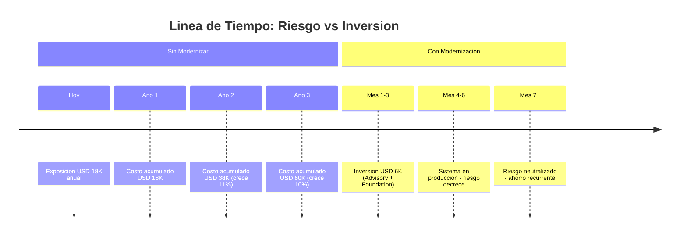

# Riesgos Cuantificados — Aplicacion de Inventarios y Bodegas

---

> **Aplicación:** Aplicacion de Inventarios y Bodegas  
> **Cliente:** SoftwareOne  
> **Exposición total estimada (anual):** USD 18,000  
> **Fecha:** 2026-07-22

---

## 1. Resumen de Exposición

La organización enfrenta una exposición estimada de **USD 18,000 anuales** distribuida en 4 categorías de riesgo si decide no modernizar la Aplicación de Inventarios y Bodegas:

| Categoría | Exposición Anual | % del Total | Principal driver |
|---|---|---|---|
| Operacional | USD 8,000 | 44% | Paralización por pérdida de datos o corrupción |
| Financiero directo | USD 5,000 | 28% | Decisiones de compra erróneas por datos no confiables |
| Competitivo (oportunidad) | USD 3,000 | 17% | Incapacidad de escalar o integrar con otros sistemas |
| Reputacional | USD 2,000 | 11% | Pérdida de confianza interna en la herramienta |
| **TOTAL** | **USD 18,000** | **100%** | |

---

## 2. Riesgos por Categoría

### 2.1 Operacional

| # | Riesgo | Probabilidad | Impacto por evento | Costo anual estimado | Base de cálculo |
|---|---|---|---|---|---|
| 1 | Paralización por pérdida total de datos (sin backup) | Media | 3-5 días de operación detenida | USD 4,000 | [ESTIMADO: 4 días × 5 personas × USD 200/día de productividad perdida] |
| 2 | Corrupción de inventario por uso simultáneo | Alta | Reconciliación manual de stock | USD 2,500 | [ESTIMADO: 2 incidentes/año × 20 horas × USD 60/hora para auditoría] |
| 3 | Despliegue fallido por proceso manual | Media | 4-8 horas de indisponibilidad | USD 1,500 | [ESTIMADO: 3 caídas/año × 8 horas × valor operativo/hora] |

### 2.2 Financiero directo

| # | Riesgo | Probabilidad | Impacto por evento | Costo anual estimado | Base de cálculo |
|---|---|---|---|---|---|
| 1 | Compras erróneas por datos de stock no confiables | Alta | Sobre-stock o desabastecimiento | USD 3,000 | [ESTIMADO: 5% de valor de inventario anual afectado por decisiones con datos incorrectos] |
| 2 | Costo de mantenimiento de emergencia (parches) | Media | Intervención técnica no planificada | USD 2,000 | [ESTIMADO: 4 incidentes/año × 8 horas × USD 60/hora expertise técnico] |

### 2.3 Reputacional

| # | Riesgo | Probabilidad | Impacto por evento | Costo anual estimado | Base de cálculo |
|---|---|---|---|---|---|
| 1 | Pérdida de confianza del equipo en la herramienta | Alta | Usuarios recurren a hojas de cálculo paralelas | USD 2,000 | [ESTIMADO: 3 personas × 2 horas/semana × 50 semanas en trabajo duplicado] |

### 2.4 Competitivo (Costo de oportunidad)

| # | Riesgo | Probabilidad | Impacto por evento | Costo anual estimado | Base de cálculo |
|---|---|---|---|---|---|
| 1 | Imposibilidad de integrar con sistema de compras o contabilidad | Alta | Procesos manuales permanentes | USD 2,000 | [ESTIMADO: 3 horas/semana × 50 semanas × USD 13/hora en procesos manuales evitables] |
| 2 | Incapacidad de escalar a más bodegas o productos | Media | Crecimiento limitado por herramienta | USD 1,000 | [ESTIMADO: 1 bodega no integrada × USD 1,000/año en gestión paralela] |

---

## 3. Costo Acumulado de No Actuar

| Horizonte | Costo acumulado | Factor de crecimiento | Explicación |
|---|---|---|---|
| Año 1 | USD 18,000 | Base | Exposición actual sin cambios |
| Año 2 | USD 20,000 | +11% | Más datos acumulados = mayor impacto por pérdida; más usuarios = más conflictos de concurrencia |
| Año 3 | USD 22,000 | +10% | Complejidad operativa crece; personas clave pueden rotar sin documentación |

> **En 3 años sin actuar, la organización habrá gastado/perdido aproximadamente USD 60,000 en costos evitables.**

---

## 4. Comparativa: Costo de No Actuar vs Inversión en Modernización

| Concepto | Monto | Horizonte |
|---|---|---|
| **Costo de NO actuar (3 años)** | USD 60,000 | Recurrente (se repite y crece cada año) |
| **Inversión en modernización** | USD 6,000 | Una vez (precio cerrado) |
| **Diferencia** | USD 54,000 a favor de modernizar | Recuperado en 4 meses |

La inversión en modernización (USD 6,000) se recupera en apenas 4 meses comparado con el costo perpetuo de no actuar. A partir del quinto mes, cada mes sin riesgos activos es ahorro neto de USD 1,500.

---

## Notas Metodológicas

1. Las estimaciones de impacto financiero son indicativas y se basan en benchmarks de operaciones logísticas de tamaño similar.
2. Los valores marcados como `[ESTIMADO]` fueron calculados usando proxies estándar de la industria, no datos financieros reales del cliente. Deben ser validados con el área financiera de la organización antes de tomar decisiones de inversión.
3. Los riesgos y probabilidades se derivan exclusivamente del análisis técnico del código fuente. No incluyen factores externos no documentados.
4. El factor de crecimiento anual es conservador y asume que no ocurren incidentes mayores. Un incidente de pérdida de datos podría multiplicar el impacto en un solo evento.
5. La comparativa con la inversión de modernización asume el modelo de precio cerrado de SoftwareOne (sin true-ups ni costos adicionales post-contrato).

---

## Conclusiones

1. **USD 18,000 anuales en exposición:** La categoría dominante es operacional (44%) — el riesgo de paralización por pérdida de datos es el más costoso.

2. **El costo se acumula y crece:** No es estático. Más datos, más usuarios y más complejidad incrementan la exposición 10-11% cada año.

3. **La inversión en modernización es 10 veces menor que el costo de 3 años de inacción:** USD 6,000 una vez vs USD 60,000 acumulados.

4. **Punto de equilibrio en 4 meses:** La inversión se recupera antes de que el proyecto termine de ejecutarse.

5. **El riesgo operacional tiene mayor probabilidad de materializarse primero:** La corrupción de datos por uso simultáneo (probabilidad Alta) puede ocurrir cualquier día de operación normal.

---

Análisis elaborado por SoftwareOne · 2026-07-22
