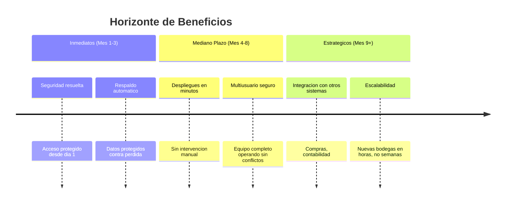
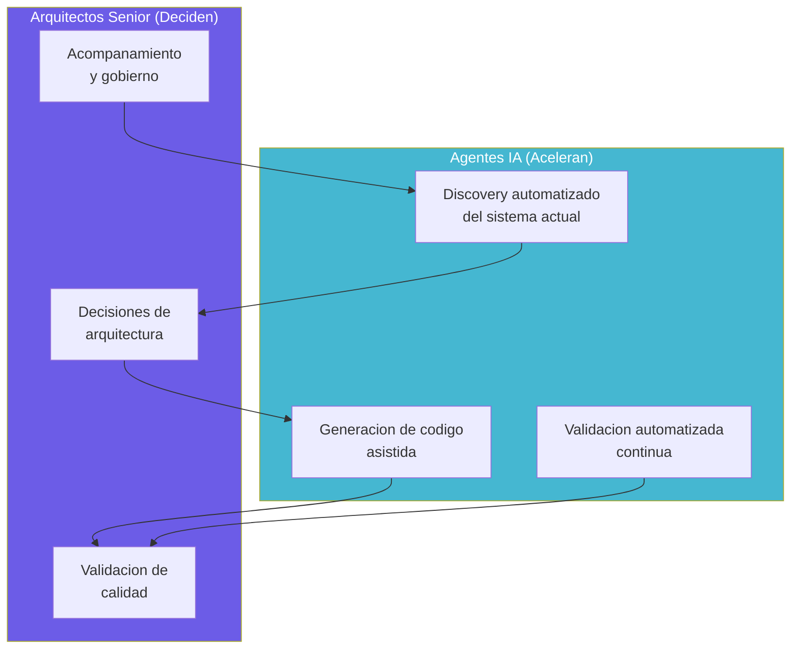

# Oportunidad de Modernización — Aplicacion de Inventarios y Bodegas

---

> **Aplicación:** Aplicacion de Inventarios y Bodegas  
> **Cliente:** SoftwareOne  
> **Variante recomendada:** Reconstrucción Modular  
> **Fecha:** 2026-07-22

---

## 1. Visión del Estado Futuro

### "De Fragilidad Operativa a Control Total del Inventario"

La modernización transforma un sistema vulnerable y limitado en una plataforma robusta de gestión de inventarios: segura por diseño, desplegable en minutos, escalable a múltiples bodegas y preparada para integrar con cualquier sistema corporativo. El equipo de logística pasa de operar con temor a perder datos a tener confianza total en su herramienta de trabajo.

---

## 2. Beneficios por Driver de Negocio

| Driver de Negocio | Beneficio concreto | Hoy | Esperado | Mejora |
|---|---|---|---|---|
| Continuidad del Negocio | Respaldo automático y recuperación ante fallos | Sin respaldo — pérdida irreversible | Respaldos automáticos cada hora | De riesgo total a protección continua |
| Seguridad y Cumplimiento | Protección integral de datos e identidades | 7 de 10 categorías vulnerables | 0 vulnerabilidades activas | De exposición total a cumplimiento completo |
| Escalabilidad | Soporte para crecimiento de bodegas y productos | 1 usuario sin conflictos | Múltiples usuarios simultáneos | De limitado a ilimitado |
| Time-to-Market | Cambios desplegados en minutos, no horas | Proceso manual de varias horas | Automatizado en menos de 5 minutos | De horas a minutos |
| Eficiencia Operacional | Equipo usa una sola herramienta confiable | Duplican trabajo en hojas de cálculo | Herramienta única y confiable | Eliminación de trabajo duplicado |
| Innovación | Capacidad de integrar con otros sistemas | Sistema aislado e incompatible | APIs estándar para integración | De aislado a conectado |

---

## 3. ¿Por Qué App Modernization con SoftwareOne?

### El Modelo Centauro: IA + Arquitectos Senior

**¿Por qué funciona para esta aplicación?**

El modelo centauro es ideal para este caso porque la IA ya extrajo todo el conocimiento del sistema actual (939 líneas completamente analizadas), lo que elimina la fase más costosa de cualquier modernización: entender qué hace el sistema. Los arquitectos senior validan las reglas de negocio y diseñan la solución moderna, mientras la IA acelera la reconstrucción del código. El resultado: en 10 semanas se obtiene lo que manualmente tomaría 4-6 meses.

---

## 4. Resultado Esperado

| Aspecto | Antes (Hoy) | Después (10 semanas) |
|---|---|---|
| Plataforma | Script local sin estructura | Aplicación empresarial moderna |
| Seguridad | Vulnerabilidades graves en todos los accesos | Protección integral desde el diseño |
| Despliegue | Manual, horas, propenso a errores | Automatizado, 5 minutos, validado |
| Base de datos | Archivo local sin respaldo | Base empresarial con respaldo automático |
| Escalabilidad | 1 usuario sin conflictos | Múltiples usuarios y bodegas |
| Monitoreo | Sin visibilidad de lo que ocurre | Alertas en tiempo real |
| Mantenibilidad | Imposible cambiar sin romper | Modular, seguro de modificar |
| Testing | Sin pruebas automatizadas | Más del 80% cubierto con validaciones |

---

## 5. Ventana de Oportunidad

El sistema actualmente tiene vulnerabilidades que pueden ser explotadas en cualquier momento si está conectado a una red. No es un problema que empeora gradualmente — es una puerta abierta que cualquier persona con conocimientos básicos puede aprovechar. Cada día de exposición es un día de riesgo activo.

**Factores de urgencia:**

- Las vulnerabilidades de acceso son explotables sin herramientas especiales — la ventana de ataque está abierta ahora
- La base de datos puede corromperse con uso simultáneo normal — no requiere un evento extraordinario
- Mientras más datos se acumulan en el sistema actual, mayor es el impacto de una pérdida

---

## Conclusiones

1. **De fragilidad a control total:** La modernización transforma la gestión de inventarios de un riesgo operativo constante a una ventaja competitiva con datos confiables.

2. **Seguridad y continuidad son los beneficios más inmediatos:** Desde las primeras semanas del proyecto, los datos quedan protegidos y respaldados.

3. **El modelo centauro reduce el timeline a la mitad:** La IA ya analizó el 100% del sistema — no hay fase de "descubrimiento" costosa.

4. **La ventana para actuar es ahora:** Las vulnerabilidades no esperan — cada día de inacción mantiene la exposición activa sin beneficio alguno.

5. **Por USD 6,000 se obtiene un sistema production-grade completo:** Seguro, escalable, automatizado y preparado para crecer con la operación.

---

Análisis elaborado por SoftwareOne · 2026-07-22
