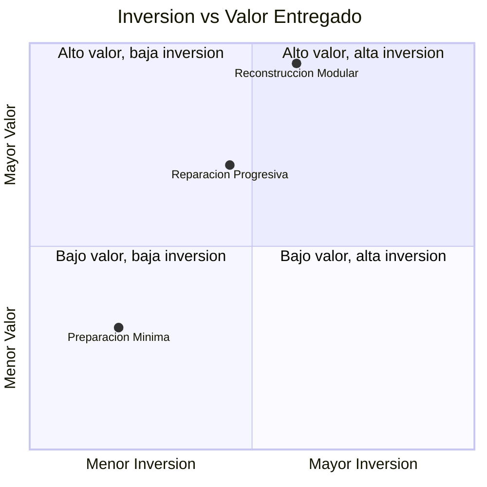
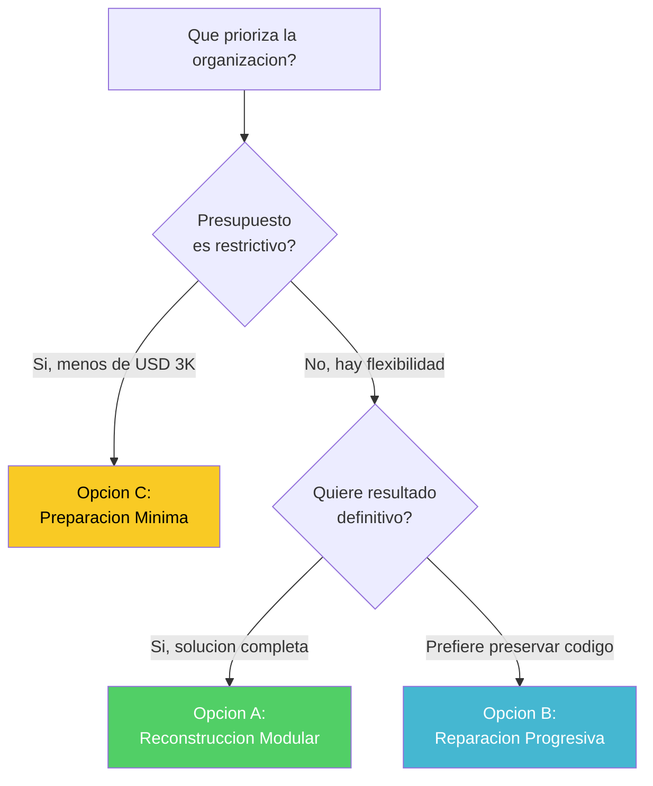

# Opciones y Caminos — Aplicacion de Inventarios y Bodegas

---

> **Aplicación:** Aplicacion de Inventarios y Bodegas  
> **Cliente:** SoftwareOne  
> **Opciones evaluadas:** 3  
> **Fecha:** 2026-07-22

---

## 1. ¿Qué opciones existen?

La evaluación identifica 3 caminos posibles, cada uno con un balance diferente entre inversión, valor entregado y riesgo:

- **Opción A: Reconstrucción Modular** — Se construye el sistema desde cero con arquitectura moderna, seguridad integral y preparación para la nube. Es empezar de nuevo sobre bases sólidas.
- **Opción B: Reparación Progresiva** — Se corrige el sistema existente paso a paso: primero seguridad, luego estructura, luego automatización. Es arreglar la casa sin demolerla.
- **Opción C: Preparación Mínima para Nube** — Se corrigen solo las vulnerabilidades urgentes y se empaqueta el sistema para la nube sin cambiar su estructura interna. Es un parche rápido.

La Reconstrucción Modular ofrece el mayor valor entregado con una inversión que sigue siendo muy contenida (USD 6,000). La Preparación Mínima es la más barata pero deja la mayor parte de los problemas sin resolver.

---

## 2. Detalle de Opciones

### Opción A: Reconstrucción Modular (RECOMENDADA)

| Aspecto | Detalle |
|---|---|
| **Qué se hace** | Se reconstruye el sistema completo con arquitectura separada por módulos, seguridad desde el diseño y automatización completa |
| **Duración** | 8–10 semanas |
| **Talla** | S (Small) |
| **Inversión** | USD 6,000 (600 créditos) |
| **Resultado** | Sistema de inventarios production-grade: seguro, escalable, automatizado y mantenible |
| **Deuda resuelta** | 100% de los problemas actuales |
| **Riesgo de ejecución** | Bajo — funcionalidad simple, sin integraciones complejas |
| **Ideal para** | Organizaciones que quieren una solución definitiva y están dispuestas a invertir 10 semanas |

### Opción B: Reparación Progresiva

| Aspecto | Detalle |
|---|---|
| **Qué se hace** | Se corrige el código existente en fases: seguridad, estructura interna, pruebas automatizadas y automatización de despliegue |
| **Duración** | 6–8 semanas |
| **Talla** | S (Small) |
| **Inversión** | USD 4,400 (440 créditos) |
| **Resultado** | Sistema corregido y mejorado, pero sobre la misma base tecnológica |
| **Deuda resuelta** | 70% — la base de datos local y algunas limitaciones permanecen |
| **Riesgo de ejecución** | Medio — reparar sin pruebas previas puede causar regresiones |
| **Ideal para** | Organizaciones que quieren preservar el código existente y tienen presupuesto estricto |

### Opción C: Preparación Mínima para Nube

| Aspecto | Detalle |
|---|---|
| **Qué se hace** | Se corrigen las vulnerabilidades urgentes de seguridad y se empaqueta el sistema para desplegarse en la nube sin cambiar su estructura |
| **Duración** | 4–6 semanas |
| **Talla** | S (Small) |
| **Inversión** | USD 2,400 (240 créditos) |
| **Resultado** | Sistema en la nube con parches de seguridad, pero arquitectura interna intacta |
| **Deuda resuelta** | 20% — solo los problemas más urgentes |
| **Riesgo de ejecución** | Bajo — cambios mínimos al código |
| **Ideal para** | Situaciones de urgencia extrema donde solo se necesita "parar la sangría" rápidamente |

---

## 3. Comparación

| Aspecto | Opción A: Reconstrucción | Opción B: Reparación | Opción C: Preparación Mínima |
|---|---|---|---|
| **Qué se hace** | Construir desde cero con bases sólidas | Arreglar el existente paso a paso | Parchar y mover a la nube |
| **Duración** | 8–10 sem | 6–8 sem | 4–6 sem |
| **Inversión (USD)** | 6,000 | 4,400 | 2,400 |
| **Talla** | S | S | S |
| **Deuda resuelta** | 100% | 70% | 20% |
| **Riesgo** | Bajo | Medio | Bajo |
| **Primera entrega de valor** | Semana 8 | Semana 2 | Semana 1 |
| **Cobertura funcional** | 100% | 100% | 100% (sin cambios) |
| **Resultado a largo plazo** | Excelente | Bueno | Pobre (problemas regresan) |

---

## 4. Opción Recomendada

**Recomendamos la Opción A: Reconstrucción Modular.**

Con un sistema de apenas 939 líneas de código y problemas que afectan al 85% de su estructura, reconstruir es objetivamente más rápido y seguro que intentar reparar pieza por pieza. La diferencia de inversión entre las opciones es mínima (USD 1,600-3,600), pero la diferencia en resultado es dramática: un sistema sin problemas residuales vs uno que mantiene limitaciones. El bajo riesgo de ejecución (funcionalidad simple, sin integraciones) confirma que esta es la ruta óptima.

---

## 5. Diagrama de Decisión

Si la organización busca una solución definitiva y tiene 10 semanas disponibles, la Opción A es la adecuada. Si el presupuesto es la restricción principal, la Opción C detiene el sangrado inmediato.

---

## Conclusiones

1. **3 opciones viables, todas talla S:** La diferencia está en profundidad de solución (100% vs 70% vs 20% de problemas resueltos), no en complejidad.

2. **Reconstrucción Modular es la recomendación:** Ofrece el mayor valor por la inversión. Por USD 3,600 adicionales vs la opción más barata, se obtiene un resultado cualitativamente superior y definitivo.

3. **El trade-off de la Opción A es el tiempo:** No entrega valor incremental hasta la semana 8, pero el resultado final es un sistema completamente nuevo y sin deuda.

4. **La Opción C sería mejor si hay urgencia extrema (menos de 4 semanas):** En ese caso, parchar y containerizar compra tiempo mientras se planifica la reconstrucción.

5. **La decisión de inversión es clara:** USD 6,000 por un sistema completo vs USD 2,400 por un parche temporal que requerirá otra inversión en 6-12 meses.

---

Análisis elaborado por SoftwareOne · 2026-07-22
