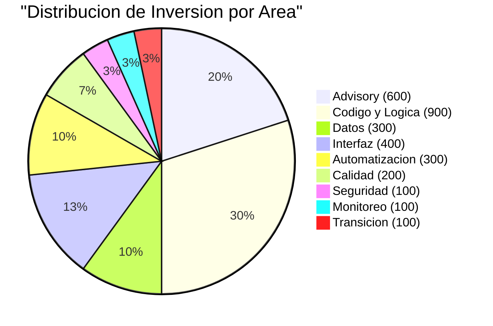
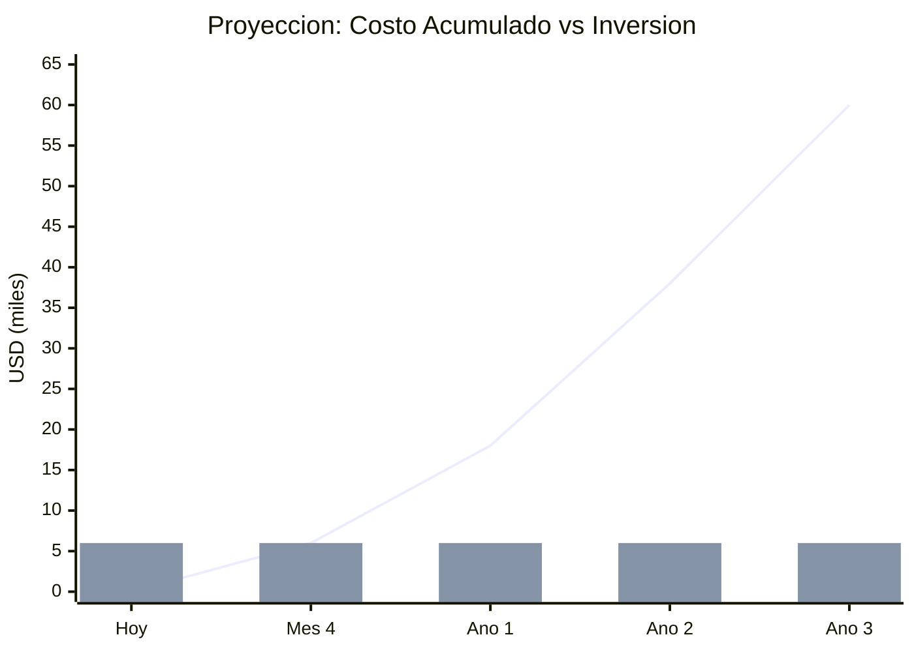
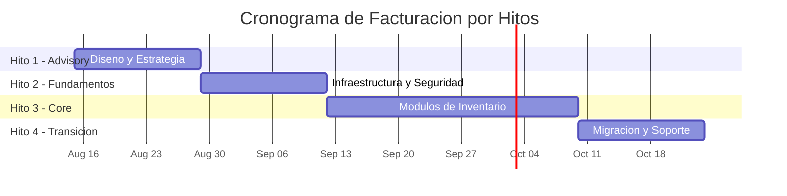

# Inversión y Retorno — Aplicacion de Inventarios y Bodegas

---

> **Aplicación:** Aplicacion de Inventarios y Bodegas  
> **Cliente:** SoftwareOne  
> **Opción recomendada:** Reconstrucción Modular  
> **Fecha:** 2026-07-22

---

## 1. Resumen de Inversión

| Concepto | Valor |
|---|---|
| **Inversión total** | **USD 6,000** |
| **Créditos** | 600 |
| **Talla del proyecto** | S (Small) |
| **Duración estimada** | 8–10 semanas |
| **Modalidad** | Precio cerrado |
| **True-up** | Cero — sin costos adicionales |
| **Modelo de pago** | Por hitos de valor entregado |

---

## 2. ¿Qué incluye la inversión?

| Fase | Entregable | Qué obtiene el cliente |
|---|---|---|
| Advisory | Diseño de la solución + Plan de ejecución | Arquitectura validada y estrategia aprobada antes de escribir código |
| Fundamentos | Infraestructura + Automatización + Seguridad base | Ambiente preparado, despliegue automático, acceso protegido |
| Construcción Core | Módulos de inventario reconstruidos | Funcionalidad principal operando en plataforma moderna |
| Transición | Migración de datos + Validación + Soporte intensivo | Sistema en producción con acompañamiento post-activación |

### Distribución de la inversión

La mayor parte de la inversión (30%) se concentra en reconstruir la lógica de negocio con calidad empresarial. El segundo componente (20%) es el diseño de la solución — asegurar que se construye lo correcto antes de construirlo.

---

## 3. ROI y Punto de Equilibrio

| Métrica | Valor |
|---|---|
| Inversión (una vez) | USD 6,000 |
| Costo de no actuar (anual) | USD 18,000 |
| Costo de no actuar (3 años acumulado) | USD 60,000 |
| **ROI a 3 años** | **383%** |
| **Punto de equilibrio** | **4 meses** |

> La inversión se recupera en **4 meses** — a partir de ese punto, cada mes sin riesgos activos es ahorro neto de USD 1,500.

### Proyección ROI año a año

| Componente | Representación | Descripción |
|---|---|---|
| Línea ascendente | Costo acumulado de NO actuar | Crece año a año — riesgos operacionales, financieros y competitivos |
| Barras constantes | Inversión en modernización | Se paga una vez — precio cerrado |
| Punto de cruce (Mes 4) | Equilibrio | A partir de ahí, todo es ahorro neto |

Las curvas se cruzan en el mes 4: a partir de ese momento, la organización ahorra USD 1,500 mensuales netos. Al cabo de 3 años, el ahorro acumulado es de USD 54,000 — casi 10 veces la inversión inicial.

---

## 4. Cronograma de Facturación

| Hito | Entregable | % | Créditos | USD | Semana |
|---|---|---|---|---|---|
| 1 | Arquitectura validada + Plan aprobado | 20% | 120 | USD 1,200 | Semana 2 |
| 2 | Ambiente productivo + CI/CD + Seguridad base | 20% | 120 | USD 1,200 | Semana 4 |
| 3 | Módulos de inventario en producción | 40% | 240 | USD 2,400 | Semana 8 |
| 4 | Migración completa + Validación + Soporte | 20% | 120 | USD 1,200 | Semana 10 |
| **Total** | | **100%** | **600** | **USD 6,000** | |

---

## 5. Garantías del Modelo

| Garantía | Descripción |
|---|---|
| **Precio cerrado** | La inversión no cambia — sin sorpresas ni costos adicionales |
| **Cero True-up** | No hay ajustes posteriores por consumo real vs estimado |
| **Pago por valor** | Cada hito de facturación está vinculado a un entregable verificable |
| **Equipo centauro dedicado** | Arquitectos senior + IA trabajando exclusivamente en el proyecto |
| **Soporte post-activación** | Acompañamiento incluido después de poner en producción |

---

## 6. Comparación: Invertir Ahora vs Esperar

| Aspecto | Invertir Ahora | Esperar 12 meses |
|---|---|---|
| Inversión | USD 6,000 (una vez) | USD 6,000 + inflación (los costos suben) |
| Riesgo acumulado | Se neutraliza en 10 semanas | USD 18,000 adicional de exposición |
| Datos en riesgo | Protegidos desde la semana 4 | 12 meses más sin respaldo ni protección |
| Vulnerabilidades | Eliminadas por diseño | Activas y explotables durante todo el año |
| Costo total (3 años) | USD 6,000 | USD 60,000 + inversión eventual |

> **Cada mes de espera cuesta USD 1,500 en riesgos no resueltos** — equivalente al 25% de la inversión total del proyecto.

---

## 7. Notas Metodológicas

1. El ROI se calcula comparando la inversión contra el costo estimado de no actuar documentado en el análisis de riesgos. Las estimaciones son indicativas basadas en benchmarks del sector.
2. El punto de equilibrio asume que los riesgos se neutralizan progresivamente — los primeros módulos en producción ya reducen exposición.
3. El cronograma de facturación es indicativo y se formaliza en el Statement of Work. Los hitos pueden ajustarse durante la negociación.
4. La inversión no incluye costos del lado del cliente (tiempo de personas para validación, ambientes propios, licencias). Estos se documentan como prerrequisitos.
5. Los valores de costo de inacción requieren validación con el área financiera del cliente antes de formalizar la decisión.

---

## Conclusiones

1. **La inversión es 10 veces menor que el costo de inacción a 3 años:** USD 6,000 una vez vs USD 60,000 acumulados en riesgos y pérdidas.

2. **Precio cerrado elimina incertidumbre financiera:** El cliente sabe exactamente cuánto pagará — sin sorpresas ni costos ocultos.

3. **Equilibrio en 4 meses:** La inversión se recupera antes de que termine el proyecto. Desde el mes 5, todo es ahorro neto.

4. **Cronograma de pago protege al cliente:** Solo se paga cuando se entrega valor verificable — no por horas de trabajo.

5. **Esperar no reduce el costo — lo incrementa:** Cada mes sin actuar suma USD 1,500 en exposición. En 4 meses de espera se "gasta" el equivalente a la inversión completa sin obtener nada a cambio.

---

Análisis elaborado por SoftwareOne · 2026-07-22
