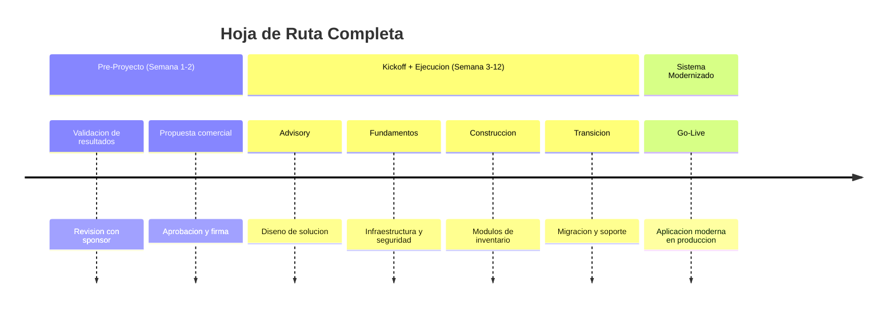
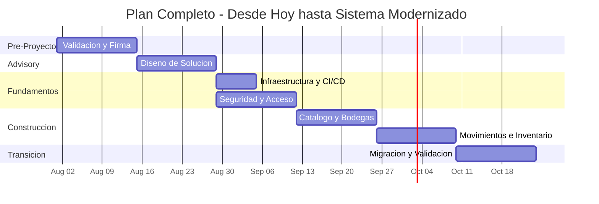

# Próximos Pasos — Aplicacion de Inventarios y Bodegas

---

> **Aplicación:** Aplicacion de Inventarios y Bodegas  
> **Cliente:** SoftwareOne  
> **Opción recomendada:** Reconstrucción Modular  
> **Inversión:** USD 6,000 | **Duración:** 8–10 semanas | **Talla:** S  
> **Fecha:** 2026-07-22

---

## 1. Decisión Solicitada

**Se solicita:** Aprobación para iniciar la fase Advisory del proyecto de modernización de la Aplicación de Inventarios y Bodegas, con una inversión de USD 6,000 durante 10 semanas.

**¿Por qué ahora?** Cada mes de espera cuesta USD 1,500 en riesgos activos — vulnerabilidades explotables, datos sin respaldo y operación limitada a un usuario.

---

## 2. Próximos Pasos Inmediatos

### Hoja de Ruta (desde hoy)

### Detalle por paso

| Paso | Semanas | Participantes | Objetivo | Entregable |
|---|---|---|---|---|
| 1. Validación + Propuesta | Semana 1-2 | Sponsor + Líder TI + SWO | Validar resultados, confirmar alcance, firmar acuerdo | Contrato firmado + alcance validado |
| 2. Advisory | Semana 3-4 | Sponsor + SME + Equipo SWO | Diseñar la solución moderna | Arquitectura aprobada + Plan de ejecución |
| 3. Fundamentos | Semana 5-6 | Equipo técnico SWO | Preparar infraestructura y automatización | Ambiente productivo listo |
| 4. Construcción Core | Semana 7-10 | Equipo centauro | Reconstruir módulos de inventario | Funcionalidad operando |
| 5. Transición | Semana 11-12 | Todos | Migrar datos y validar | **Sistema modernizado en producción** |

### Ejecución Completa (desde hoy)

---

## 3. Qué necesita SoftwareOne del cliente

| # | Prerrequisito | Responsable | Cuándo |
|---|---|---|---|
| 1 | Confirmar que el sistema irá a producción real (no solo ejercicio) | Sponsor | Antes de firma |
| 2 | Aceptar o proponer alternativa al stack tecnológico sugerido | Líder TI | Semana 1 |
| 3 | Definir en qué nube se desplegará (AWS, Azure o Google Cloud) | Líder TI + SWO | Semana 2 |
| 4 | Disponibilidad de 1 persona para validar funcionalidad (4 horas/semana) | Sponsor | Semana 8 |

---

## 4. ¿Qué recibe SoftwareOne al final?

| # | Entregable | Descripción |
|---|---|---|
| 1 | Sistema de inventarios moderno funcionando | Gestión completa de productos, bodegas, movimientos, kardex y dashboard |
| 2 | Seguridad integral | Acceso protegido, contraseñas seguras, datos cifrados, sin vulnerabilidades |
| 3 | Despliegue automatizado | Actualizaciones en 5 minutos con validaciones automáticas |
| 4 | Respaldo automático | Base de datos empresarial con recuperación ante fallos |
| 5 | Documentación completa | Guía de uso, mantenimiento y evolución del sistema |
| 6 | Preparación para la nube | Sistema listo para escalar a más usuarios, más bodegas, más integraciones |

---

## 5. Acciones Inmediatas Recomendadas (Sin Costo)

Mientras se formaliza la decisión, recomendamos estas acciones que no requieren inversión:

1. **Aislar el sistema de la red** — Si está expuesto, desconectar de internet inmediatamente para eliminar el riesgo de acceso no autorizado.
2. **Crear una copia de la base de datos** — Respaldar el archivo actual en un disco externo o servicio de almacenamiento para proteger los datos existentes.
3. **Identificar a la persona que validará la funcionalidad** — Alguien del equipo de logística que confirme que el sistema nuevo hace lo mismo que el actual.

---

## 6. Contacto y Siguiente Reunión

| Aspecto | Detalle |
|---|---|
| **Siguiente paso concreto** | Reunión de validación de alcance (1 hora) |
| **Fecha propuesta** | Semana del 2026-08-04 |
| **Participantes sugeridos** | Sponsor + Líder TI + Equipo SWO |
| **Contacto SoftwareOne** | Equipo de Modernización QAM |

---

## 7. Conclusiones

| Pregunta | Respuesta |
|---|---|
| **¿Es urgente?** | Sí. Cada mes de espera cuesta USD 1,500 en riesgos activos — vulnerabilidades explotables hoy |
| **¿Es viable?** | Sí. Sistema pequeño (939 líneas), sin integraciones complejas, funcionalidad bien definida |
| **¿Cuánto toma?** | 12 semanas desde hoy (2 pre-proyecto + 10 ejecución) |
| **¿Cuánto cuesta?** | USD 6,000 a precio cerrado — sin sorpresas |
| **¿Cuál es el ROI?** | 383% a 3 años — equilibrio en 4 meses |
| **¿Cuál es el siguiente paso?** | Agendar reunión de validación y confirmar objetivo de producción la próxima semana |

---

Análisis elaborado por SoftwareOne · 2026-07-22
