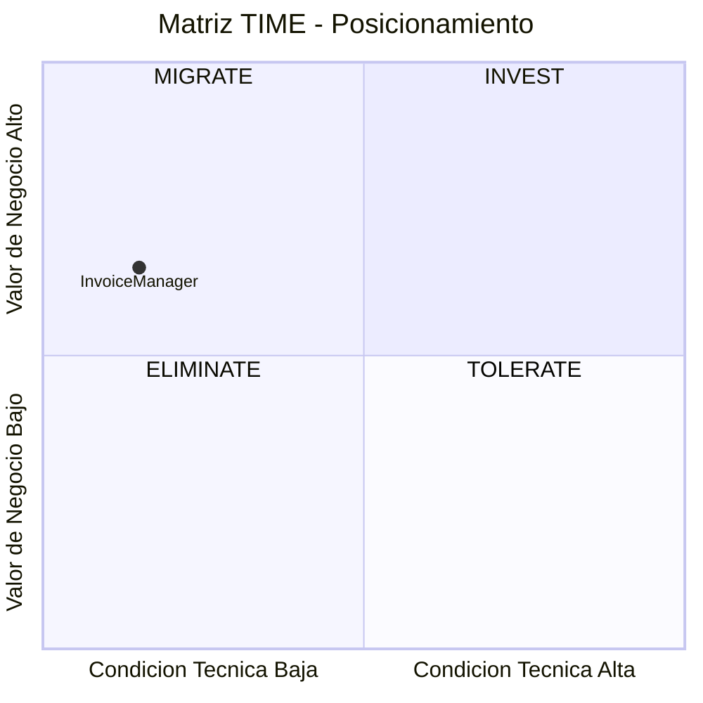
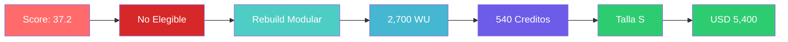

# Resumen Ejecutivo Técnico — InvoiceManager

---

## Ficha de la Aplicación

| Campo | Valor |
|---|---|
| Aplicación | InvoiceManager |
| Cliente | SoftwareOne |
| Sector / Dominio | Servicios Tecnológicos / Facturación y cuentas por cobrar |
| Stack principal | JavaScript ES5 + jQuery 1.12.4 + localStorage (sin backend) |
| LOC | 1,272 en 3 archivos |
| Nivel de input | Enriquecido (Score 8/10) |

---

## Diagnóstico de Salud

| Indicador | Estado | Detalle |
|---|---|---|
| Deuda Técnica | 🔴 | Score deuda: 85 — Complexity: 1.5 |
| Seguridad | 🔴 | 7 vulnerabilidades High (OWASP), 0 mecanismos implementados de 5 |
| Dependencias | 🔴 | 2 SPOFs al 100% (localStorage, var data global), 0 componentes sin fuente |
| Obsolescencia | 🔴 | 2 componentes EOL (jQuery 1.12.4 desde 2016, Bootstrap 3.4.1 desde 2019) |
| Testing | 🔴 | Cobertura: 0%, CI/CD: No |
| Documentación | 🔴 | Score dimensión 8: 1.5/5 |

---

## Veredicto de Elegibilidad

| Campo | Valor |
|---|---|
| Score Final | **37.2 / 100** |
| Banda | **No Elegible** |
| Condiciones mandatorias cumplidas | 4 de 9 |
| Condiciones no verificables | 4 (supuestos pendientes) |
| Veredicto | No Elegible para QAM estándar — Elegibilidad condicional sujeta a validación de 4 supuestos y remediación de gaps bloqueantes |

### Condiciones pendientes de validación

| # | Condición | Estado | Acción requerida para validar |
|---|---|---|---|
| 3 | Al menos 1 SME técnico identificado | ⚠️ Supuesto | Confirmar disponibilidad de desarrollador que conoce la app |
| 4 | Sponsor de negocio activo | ⚠️ Supuesto | Identificar sponsor con autoridad de presupuesto |
| 7 | Presupuesto cubre talla mínima QAM (S) | ⚠️ Supuesto | Validar presupuesto mínimo de USD 4,000 |
| 9 | Timeline compatible con QAM (mín. 8 semanas) | ⚠️ Supuesto | Confirmar ventana de ejecución de 10-12 semanas |

> **Nota:** Si estas condiciones no se validan antes del kickoff, la elegibilidad podría cambiar.

---

## Hallazgos Críticos

| ID | Tipo | Descripción |
|---|---|---|
| A-01 | eol | jQuery 1.12.4 EOL desde 2016 — 8 major versions de desfase, XSS CVEs sin parchear |
| A-03 | seguridad | 22 puntos de inyección XSS via innerHTML sin sanitización en funciones render*() |
| A-04 | seguridad | Autenticación inexistente — selector de rol sin verificación de identidad |
| A-07 | dependencia_bloqueante | Persistencia exclusiva en localStorage — sin backend, límite 5-10MB, datos perdibles |
| A-05 | infraestructura | Sin CI/CD, sin tests (0% cobertura), sin deployment automatizado, sin observabilidad |

---

## Estrategia Recomendada

**Rebuild Modular** — La aplicación tiene 1,272 LOC con stack completamente obsoleto (jQuery 1.12.4 EOL, sin backend, sin autenticación). El tamaño compacto hace viable un rebuild en 10-12 semanas. La lógica de negocio está clara (5 dominios, state machine explícita) y es extraíble. No hay path de migración para jQuery 1.12 ni para el modelo de persistencia (localStorage), lo que descarta Refactor/Replatform.

### Matriz TIME — Posicionamiento de la Aplicación

### Justificación de la R seleccionada

| Criterio | Valor | Implicación |
|---|---|---|
| Cuadrante TIME | Migrate | Rebuild o Rearchitect |
| Runtime principal | EOL (jQuery 1.12.4, 2016) | Rebuild necesario |
| Arquitectura | Monolítica (1 archivo JS, 0 capas) | Reescritura inevitable |
| Target stack definido | No | Propuesta nueva (Node.js/React o similar) |
| Score deuda | 85 | Complejidad máxima — no se puede iterar sobre base actual |

---

## Dimensionamiento

| Concepto | Valor |
|---|---|
| Total WU | 2,700 |
| Créditos | 540 |
| Talla del proyecto | S |
| Duración estimada | 10-12 semanas |
| Valor contrato | USD 5,400 |

---

## Riesgos Top-3

| # | Riesgo | Impacto | Mitigación |
|---|---|---|---|
| 1 | Pérdida de datos en localStorage durante la transición | Alto | Implementar export/import de datos como primera actividad |
| 2 | Ausencia de SME técnico que conozca las reglas de negocio | Medio | Documentar reglas desde código antes de reescribir (characterization tests) |
| 3 | Scope creep al modernizar (agregar features no existentes) | Medio | Paridad funcional como criterio de aceptación estricto |

---

## Próximos Pasos

1. Validar disponibilidad de sponsor y presupuesto con el cliente — semana 1
2. Confirmar al menos 1 SME técnico disponible durante el proyecto — semana 1
3. Definir stack target (propuesta: Node.js + React + PostgreSQL) — semana 2
4. Ejecutar Workshop de Alineación Estratégica (A2) para confirmar drivers — semana 2
5. Iniciar Fase 0: characterization tests + export de datos de localStorage — semana 3

---

## Diagrama Resumen

Este diagrama resume el flujo completo del QuickScan: desde la evaluación cuantitativa hasta la oferta comercial en una sola línea visual.

---

Análisis elaborado por SoftwareOne · 2026-07-23
