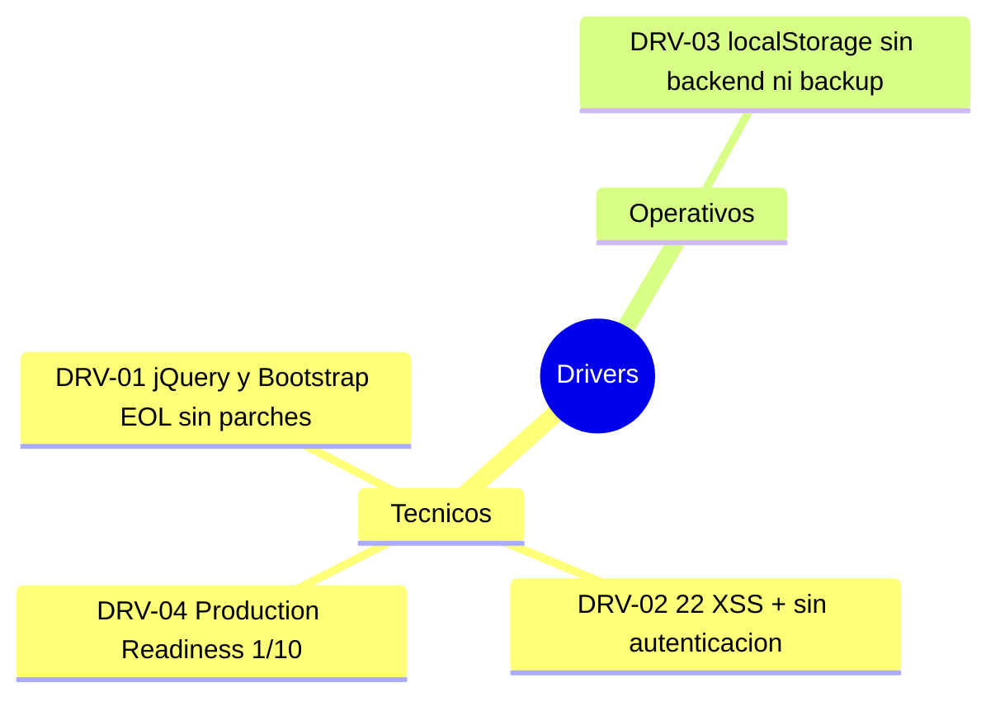

# Alcance — InvoiceManager

---

> **Aplicación:** INV-001 — InvoiceManager  
> **Cliente:** SoftwareOne  
> **Fecha:** 2026-07-23

---

## 1. Resumen ejecutivo

### 1.1 Problema que se busca resolver

La aplicación de facturación y cuentas por cobrar opera sobre un stack tecnológico obsoleto (jQuery 1.12.4, Bootstrap 3.4.1) con persistencia exclusiva en localStorage del navegador. Esto genera riesgos críticos: datos financieros perdibles al limpiar el browser, 22 vulnerabilidades XSS activas, ausencia total de autenticación, e imposibilidad de escalar más allá de un usuario en un dispositivo.

### 1.2 Motivadores (Drivers)

| ID | Driver | Tipo | Urgencia |
|---|---|---|---|
| DRV-01 | jQuery 1.12.4 y Bootstrap 3.4.1 en EOL — sin parches de seguridad desde 2016/2019 | Técnico | Alta |
| DRV-02 | 22 vulnerabilidades XSS + autenticación inexistente — postura de seguridad crítica | Técnico | Alta |
| DRV-03 | Persistencia en localStorage sin backend — datos financieros perdibles, sin backup, sin concurrencia | Operativo | Alta |
| DRV-04 | Production Readiness 1/10 (Dangerous) — 0 stability patterns, 0 observabilidad, 0 tests | Técnico | Media |

### 1.3 Beneficio esperado

Modernizar la aplicación para obtener: datos financieros seguros y persistentes en una base de datos real con backups, autenticación robusta que proteja el acceso, eliminación de vulnerabilidades XSS, y capacidad de operar multi-usuario con concurrencia.

---

## 2. Objetivos

### 2.1 Objetivo general

Reemplazar la aplicación monolítica client-side por una solución moderna con backend, base de datos real, autenticación y seguridad, preservando el 100% de la funcionalidad existente.

### 2.2 Objetivos específicos

1. Implementar backend con API REST que centralice la lógica de negocio y persistencia
2. Migrar datos de localStorage a una base de datos relacional con backups automáticos
3. Implementar autenticación y autorización reales (OAuth2/JWT)
4. Eliminar todas las vulnerabilidades XSS mediante sanitización y frameworks modernos
5. Establecer pipeline CI/CD con tests automatizados (cobertura >60%)

---

## 3. Alcance Funcional

### 3.1 Procesos de Negocio Incluidos

| # | Proceso | Criticidad |
|---|---|---|
| 1 | Facturación (creación, emisión, PDF, envío) | Alta |
| 2 | Gestión de pagos (registro, distribución, conciliación) | Alta |
| 3 | Cuentas por cobrar (seguimiento cartera, estados, recordatorios) | Alta |
| 4 | Notas crédito y anulación | Media |
| 5 | Dashboard financiero (KPIs, gráficos) | Media |
| 6 | Auditoría (trazabilidad de operaciones) | Media |

### 3.2 Funcionalidades Baseline (AS-IS)

| ID | Funcionalidad | Descripción | Criticidad |
|---|---|---|---|
| F001 | Crear factura | Selección de cliente, items, cálculos con impuestos y retención | Alta |
| F002 | Emitir factura | Generación de consecutivo FAC-NNNN, cambio de estado | Alta |
| F003 | Generar PDF | Exportación de factura a formato PDF vía jsPDF | Media |
| F004 | Aplicar pago | Distribución de monto entre facturas pendientes con validaciones | Alta |
| F005 | Máquina de estados | 7 estados (Borrador→Emitida→Pagada/Vencida/Anulada) con recálculo automático | Alta |
| F006 | Nota crédito | Emisión parcial o total con reducción de balance | Media |
| F007 | Anulación | Cambio a estado terminal con motivo obligatorio | Media |
| F008 | Recordatorios | Envío masivo de recordatorios de cobro | Media |
| F009 | Dashboard | 8 KPIs financieros + gráfico de barras + top deudores | Media |
| F010 | Auditoría | Registro de todas las operaciones con usuario, fecha y detalle | Media |
| F011 | Exportar CSV | Exportación de cartera a CSV para análisis externo | Baja |
| F012 | Control por roles | Restricción: Facturador no puede registrar pagos | Media |

---

## 4. Integraciones Incluidas

| Sistema / Servicio | Tipo | Descripción | Criticidad |
|---|---|---|---|
| CDN Bootstrap | Entrada | Librería CSS/JS para UI (a eliminar en modernización) | Baja |
| CDN jQuery | Entrada | Manipulación DOM (a eliminar en modernización) | Baja |
| CDN Chart.js | Entrada | Gráficos del dashboard (a reemplazar por versión moderna) | Baja |
| CDN jsPDF | Entrada | Generación de PDFs (a reemplazar o mantener actualizada) | Media |

[DECISIÓN AUTÓNOMA: La aplicación no tiene integraciones con sistemas externos reales. Las CDN son dependencias de librería, no integraciones de negocio. En la modernización se internalizarán via npm.]

---

## 5. Restricciones Técnicas del Target

[PENDIENTE: Target stack no definido — se propondrá en la recomendación técnica]

### Restricciones no negociables:

1. **Backend:** [PENDIENTE — propuesta: Node.js + Express o similar]
2. **Frontend:** [PENDIENTE — propuesta: React/Vue/Angular moderno]
3. **Autenticación:** Debe implementar OAuth2/JWT como mínimo
4. **Infraestructura:** [PENDIENTE — cloud o on-premise por definir]
5. **CI/CD:** Debe existir pipeline automatizado
6. **Base de datos:** Debe migrar de localStorage a BD relacional (PostgreSQL recomendado)

---

## 6. Exclusiones

- Integración con sistemas ERP o contables externos (no existe actualmente, no se agrega)
- Migración a mobile nativo (solo web responsive)
- Funcionalidad de facturación electrónica (DIAN/SRI/SAT) — requiere proyecto separado
- Multi-tenancy — se mantiene como aplicación single-tenant

---

## 7. Supuestos

| ID | Supuesto | Impacto si no se cumple |
|---|---|---|
| S001 | Existe al menos 1 persona que conoce las reglas de negocio de facturación | Sin SME, las reglas deben inferirse exclusivamente del código (riesgo de paridad funcional) |
| S002 | El presupuesto cubre la talla S de QAM (USD 4,000-5,400) | El proyecto no es viable sin presupuesto mínimo |
| S003 | Los datos actuales en localStorage son recuperables para migración | Si ya se perdieron, se inicia con datos vacíos |
| S004 | El cliente acepta el timeline mínimo de 10-12 semanas | Timeline menor implica reducir alcance funcional |

---

## 8. Dependencias

| ID | Dependencia | Responsable | Estado |
|---|---|---|---|
| D001 | Definición del stack target (backend + frontend + BD) | Arquitecto SoftwareOne | Pendiente |
| D002 | Acceso a los datos actuales de localStorage para migración | Cliente | Pendiente |
| D003 | Disponibilidad de SME funcional durante workshops | Cliente | Pendiente |
| D004 | Provisión de infraestructura cloud o servidor para el nuevo backend | Cliente / SoftwareOne | Pendiente |

---

## Conclusiones

1. **Alcance compacto pero completo:** 12 funcionalidades cubren el ciclo completo de facturación. El tamaño (1,272 LOC) hace viable un rebuild total en 10-12 semanas.
2. **Zero integraciones externas reales:** La ausencia de integraciones simplifica enormemente la modernización — no hay contratos externos que preservar.
3. **Brechas de gobierno:** No hay target stack definido, no hay sponsor confirmado, no hay SME identificado. Estas brechas deben cerrarse en la semana 1-2 del proyecto.
4. **Riesgo de datos:** La dependencia de localStorage implica que los datos financieros actuales pueden no estar disponibles al momento de migrar. Se requiere export inmediato.

---

Generado por SoftwareOne X-Ray QuickScan · 2026-07-23
