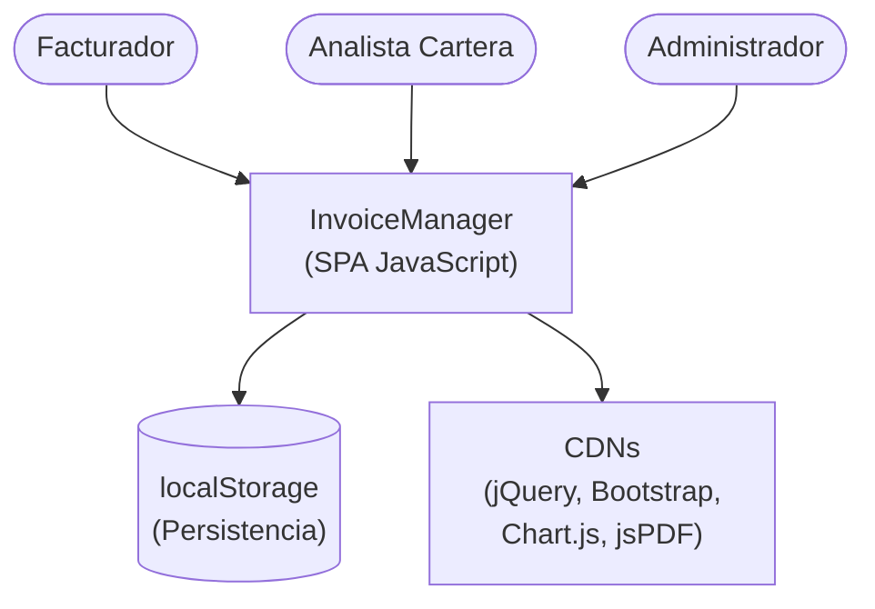
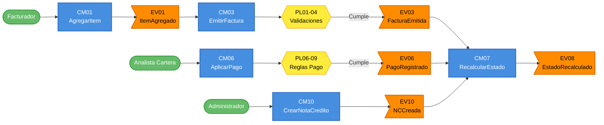

# Event Storming del AS-IS — InvoiceManager (Ciclo de Facturacion y Cuentas por Cobrar)

---

> **Aplicación:** INV-001 — InvoiceManager  
> **Cliente:** SoftwareOne  
> **Tipo de análisis:** X-Ray QuickScan  
> **Fecha de análisis:** 2026-07-23

---

## Dominios Funcionales Identificados

| # | Dominio | Descripción | Eventos principales |
|---|---|---|---|
| 1 | Facturación | Creación, emisión y envío de facturas | FacturaCreada, FacturaEmitida, FacturaEnviada |
| 2 | Tesorería / Pagos | Registro y distribución de pagos | PagoRegistrado, BalanceActualizado |
| 3 | Cartera / CxC | Seguimiento de cuentas por cobrar y cobranza | EstadoRecalculado, RecordatorioEnviado |
| 4 | Ajustes | Notas crédito y anulaciones | NotaCreditoCreada, FacturaAnulada |
| 5 | Reporting | Dashboard financiero y exportaciones | DashboardActualizado, CSVExportado |

---

## Dominio 1: Facturación (Core)

### Eventos de Dominio

| ID | Evento | Descripción | Disparado por |
|----|--------|-------------|---------------|
| EV01 | ItemAgregadoABorrador | Un producto fue agregado a la factura en edición | CM01 |
| EV02 | FacturaGuardadaComoBorrador | La factura fue persistida sin emitir | CM02 |
| EV03 | FacturaEmitida | La factura recibió consecutivo FAC-NNNN y cambió a estado Emitida | CM03 |
| EV04 | PDFGenerado | Se generó el documento PDF de la factura | CM04 |
| EV05 | FacturaEnviada | La factura fue enviada por correo (simulado) | CM05 |

### Comandos

| ID | Comando | Actor | Sistema externo |
|----|---------|-------|-----------------|
| CM01 | AgregarItemABorrador | Facturador | — |
| CM02 | GuardarBorrador | Facturador | — |
| CM03 | EmitirFactura | Facturador / Administrador | — |
| CM04 | GenerarPDF | Facturador | jsPDF (CDN) |
| CM05 | EnviarFactura | Facturador | — (simulado) |

### Actores

| Actor | Rol | Acciones principales |
|-------|-----|----------------------|
| Facturador | Creador de facturas | Agrega items, emite, genera PDF, envía |
| Administrador | Acceso completo | Todas las acciones de Facturador + anulación |

### Sistemas Externos

| Sistema | Protocolo | Rol en el flujo |
|---------|-----------|-----------------|
| jsPDF (CDN) | HTTPS (carga estática) | Generación de documentos PDF client-side |
| localStorage | API Browser | Persistencia de datos (único almacenamiento) |

### Políticas y Reglas de Negocio

| ID | Política | Descripción |
|----|----------|-------------|
| PL01 | ClienteYFechaObligatorios | Toda factura requiere cliente y fecha seleccionados |
| PL02 | MinimoUnItem | Toda factura debe tener al menos un ítem/detalle |
| PL03 | VencimientoEnCredito | Facturas a crédito requieren fecha de vencimiento |
| PL04 | NoDuplicarEmision | No se puede emitir una factura que ya fue emitida |
| PL05 | ConsecutivoAutomatico | Al emitir se genera FAC-{next} incremental |

### Entidades

| ID | Entidad | Atributos clave |
|----|---------|-----------------|
| EN01 | Factura (Invoice) | id, number, clientId, items[], status, total, balance, paid, dueDate, emittedAt |
| EN02 | Item (InvoiceItem) | productId, detail, qty, price, discount, tax, total |
| EN03 | Cliente (Client) | id, name, nit, email |
| EN04 | Producto (Product) | id, name, price, tax |
| EN05 | Numeración (Numeration) | prefix, next |

---

## Dominio 2: Tesorería / Pagos (Core)

### Eventos de Dominio

| ID | Evento | Descripción | Disparado por |
|----|--------|-------------|---------------|
| EV06 | PagoRegistrado | Un pago fue registrado y aplicado a una o más facturas | CM06 |
| EV07 | BalanceFacturaActualizado | El balance y paid de una factura fueron modificados | CM06 |

### Comandos

| ID | Comando | Actor | Sistema externo |
|----|---------|-------|-----------------|
| CM06 | AplicarPago | Analista de Cartera / Administrador | — |

### Actores

| Actor | Rol | Acciones principales |
|-------|-----|----------------------|
| Analista de cartera | Gestión de cobros | Selecciona cliente, distribuye pago entre facturas |
| Administrador | Acceso completo | Mismas acciones |

### Políticas y Reglas de Negocio

| ID | Política | Descripción |
|----|----------|-------------|
| PL06 | RolFacturadorNoRegistraPagos | El rol Facturador NO puede ejecutar el comando AplicarPago |
| PL07 | MontoMayorACero | El valor del pago debe ser > 0 |
| PL08 | SumaConciliada | La suma distribuida entre facturas debe coincidir con el monto total del pago |
| PL09 | NoSuperarSaldo | Ningún monto aplicado puede superar el saldo pendiente de la factura |

### Entidades

| ID | Entidad | Atributos clave |
|----|---------|-----------------|
| EN06 | Pago (Payment) | id, clientId, amount, method, date, allocations[] |

---

## Dominio 3: Cartera / CxC (Core)

### Eventos de Dominio

| ID | Evento | Descripción | Disparado por |
|----|--------|-------------|---------------|
| EV08 | EstadoFacturaRecalculado | El estado de la factura cambió según su balance y fechas | CM07 |
| EV09 | RecordatorioEnviado | Se registró un recordatorio de cobro para una factura vencida | CM08 |

### Comandos

| ID | Comando | Actor | Sistema externo |
|----|---------|-------|-----------------|
| CM07 | RecalcularEstado | Sistema (automático) | — |
| CM08 | EnviarRecordatorio | Analista de cartera | — (simulado) |
| CM09 | EnviarRecordatoriosMasivos | Analista de cartera | — |

### Políticas y Reglas de Negocio

| ID | Política | Descripción |
|----|----------|-------------|
| PL10 | MaquinaDeEstados | 7 estados: Borrador, Emitida, Parcialmente pagada, Pagada, Vencida, Con nota crédito, Anulada |
| PL11 | AnuladaEsTerminal | Estado Anulada no se recalcula |
| PL12 | VencidaPorFecha | Si dueDate < hoy y no está pagada ni en borrador → Vencida |

### Entidades

| ID | Entidad | Atributos clave |
|----|---------|-----------------|
| EN07 | Recordatorio (Reminder) | invoiceId, sentAt, sentBy |

---

## Dominio 4: Ajustes (Supporting)

### Eventos

| ID | Evento | Descripción | Disparado por |
|----|--------|-------------|---------------|
| EV10 | NotaCreditoCreada | Se emitió una nota crédito (parcial o total) que reduce el balance | CM10 |
| EV11 | FacturaAnulada | La factura cambió a estado terminal Anulada con motivo | CM11 |

### Comandos

| ID | Comando | Actor | Sistema externo |
|----|---------|-------|-----------------|
| CM10 | CrearNotaCredito | Administrador | — |
| CM11 | AnularFactura | Administrador | — |

### Políticas y Reglas de Negocio

| ID | Política | Descripción |
|----|----------|-------------|
| PL13 | NCNoSuperaSaldo | La nota crédito no puede superar el saldo pendiente de la factura |
| PL14 | NCTotalIgualaSaldo | Si tipo = Total, el monto se fija al saldo completo |
| PL15 | AnulacionRequiereMotivo | Toda anulación debe registrar un motivo |

### Entidades

| ID | Entidad | Atributos clave |
|----|---------|-----------------|
| EN08 | NotaCredito (CreditNote) | id, invoiceId, amount, reason, type, date |

---

## Dominio 5: Reporting (Generic)

### Eventos

| ID | Evento | Descripción | Disparado por |
|----|--------|-------------|---------------|
| EV12 | DashboardRenderizado | Se calcularon 8 KPIs y se actualizó el gráfico | CM12 |
| EV13 | CarteraExportada | Se generó CSV con datos de cuentas por cobrar | CM13 |

### Comandos

| ID | Comando | Actor | Sistema externo |
|----|---------|-------|-----------------|
| CM12 | RenderizarDashboard | Cualquier rol | Chart.js (CDN) |
| CM13 | ExportarCSV | Cualquier rol | — |

### Entidades

| ID | Entidad | Atributos clave |
|----|---------|-----------------|
| EN09 | Auditoría (Audit) | action, detail, user, timestamp |

---

## Diagrama de Contexto General

---

## Flujo de Eventos (Event Flow)

---

## Conclusiones

1. **5 bounded contexts identificados:** Facturación (Core), Pagos (Core), Cartera (Core), Ajustes (Supporting), Reporting (Generic). La clasificación permite priorizar: los 3 Core son el MVP.
2. **Flujo lineal con bifurcación en Cartera:** El evento de recálculo de estado (CM07/EV08) es el punto de convergencia — todo cambio (pago, nota crédito, vencimiento) lo dispara. Es el candidato natural para un Domain Event en la arquitectura TO-BE.
3. **15 reglas de negocio bien definidas:** Las políticas están evidenciadas en el código con validaciones explícitas. Esto facilita la escritura de tests de paridad funcional.
4. **Máquina de 7 estados como eje central:** La state machine de la factura (PL10) es el corazón del dominio. Su recálculo automático (recalcInvoiceState) es la función más importante a preservar.
5. **Sin sistemas externos reales:** La ausencia de integraciones simplifica enormemente el Event Storming — no hay eventos provenientes de fuera del sistema. Esto reduce el riesgo de la modernización.

---

Análisis elaborado por SoftwareOne · 2026-07-23
