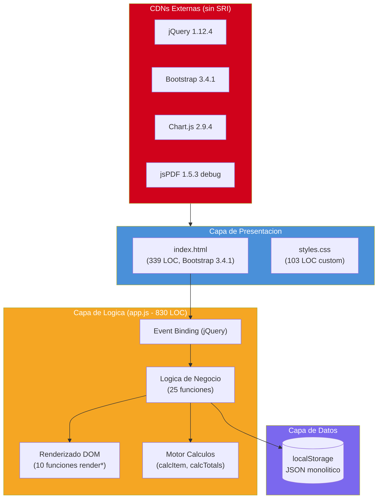

# Inventario Tecnológico

---

> **Aplicación:** INV-001 — InvoiceManager  
> **Cliente:** SoftwareOne  
> **Tipo:** JavaScript ES5 SPA client-side (sin backend, sin build tools)  
> **LOC:** 1,272 | **Archivos fuente:** 3  
> **Fecha de análisis:** 2026-07-23

---

## 1. Runtime y Lenguaje

| Tecnología | Versión | Propósito | Estado | Alerta Vinculada |
|---|---|---|---|---|
| JavaScript (ES5) | ECMAScript 5 (2009) | Lenguaje principal — toda la lógica de negocio y presentación | ⚠️ Legacy funcional | — |

---

## 2. Frameworks y Modelo de Aplicación

| Tecnología | Versión | Propósito | Estado | Alerta Vinculada |
|---|---|---|---|---|
| jQuery | 1.12.4 (2016) | Manipulación DOM, event handling, selectores | ❌ EOL / Descontinuado | A-01 |
| Bootstrap | 3.4.1 (2019) | Framework CSS de layout y componentes UI | ❌ EOL / Descontinuado | A-02 |
| SPA client-side (patrón) | — | Modelo de aplicación: single-page con vistas hide/show | ⚠️ Legacy funcional | — |

---

## 3. Bases de Datos

| Tecnología | Versión | Propósito | Estado | Alerta Vinculada |
|---|---|---|---|---|
| localStorage (Web Storage API) | HTML5 | Persistencia de todo el estado como JSON monolítico | ⚠️ Legacy funcional — no es BD real | A-07 |

---

## 4. Controles / Componentes UI (2)

| Tecnología | Versión | Propósito | Estado | Alerta Vinculada |
|---|---|---|---|---|
| Bootstrap 3 Panels | 3.4.1 | Contenedores de secciones (panel-heading, panel-body) | ❌ EOL — reemplazado por Cards en BS5 | A-02 |
| Bootstrap 3 Nav Pills | 3.4.1 | Navegación entre vistas (tabs) | ❌ EOL — API diferente en BS5 | A-02 |

---

## 5. Bibliotecas y Dependencias (4)

| Tecnología | Versión | Propósito | Estado | Alerta Vinculada |
|---|---|---|---|---|
| jQuery | 1.12.4 | DOM manipulation, event handling | ❌ EOL (2016) — 8 major versions de desfase | A-01 |
| Bootstrap JS | 3.4.1 | Modales, tooltips, collapse | ❌ EOL (2019) — dependiente de jQuery | A-02 |
| Chart.js | 2.9.4 | Gráficos de barras en Dashboard | ⚠️ Legacy funcional — 2 major versions desfasado | — |
| jsPDF | 1.5.3 (debug) | Generación de PDFs client-side | ⚠️ Legacy funcional — versión debug incluida | — |

---

## 6. Herramientas de Build / CI

| Tecnología | Versión | Propósito | Estado | Alerta Vinculada |
|---|---|---|---|---|
| No se detectan herramientas de build automatizado ni CI/CD | — | — | 🚫 Ausente | A-05 |

---

## 7. Componentes Propietarios Sin Código Fuente (0)

No se detectan componentes propietarios sin código fuente. Todas las dependencias son librerías open-source MIT cargadas via CDN.

---

## 8. Diagrama de Stack Tecnológico

---

## 9. Conclusiones

1. **Stack completamente obsoleto:** jQuery 1.12.4 (EOL 2016) y Bootstrap 3.4.1 (EOL 2019) constituyen el 100% del framework. No hay path de migración incremental — requiere reemplazo completo.
2. **Sin toolchain moderno:** Ausencia total de package manager (npm/yarn), bundler (webpack/vite), transpilador (Babel/TypeScript), linter o formateador. Esto implica que la modernización parte de cero en infraestructura de desarrollo.
3. **Persistencia no escalable:** localStorage no es una base de datos — tiene límite de 5-10MB, no soporta queries, no tiene transacciones, y los datos se pierden al limpiar el browser. Es el bloqueante más crítico.
4. **Sin componentes propietarios:** Todas las dependencias son MIT open-source. No hay vendor lock-in ni cajas negras. Esto es una ventaja significativa para la modernización.
5. **CDN sin protección:** Las 5 dependencias se cargan desde CDNs públicas sin Subresource Integrity (SRI), creando un vector de supply chain attack. Quick win: agregar atributo `integrity` a los tags.

---

Análisis elaborado por SoftwareOne · 2026-07-23
