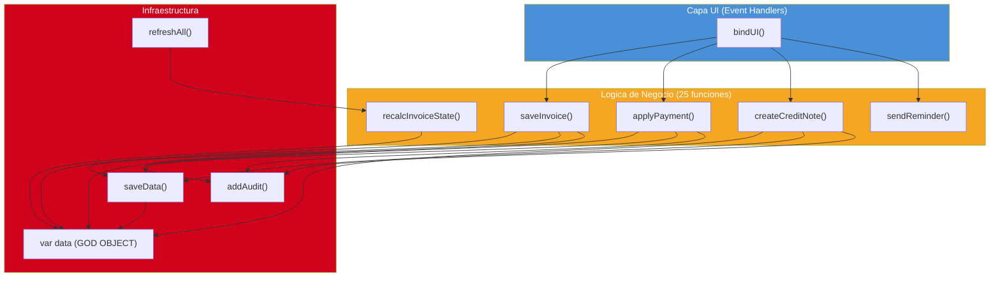
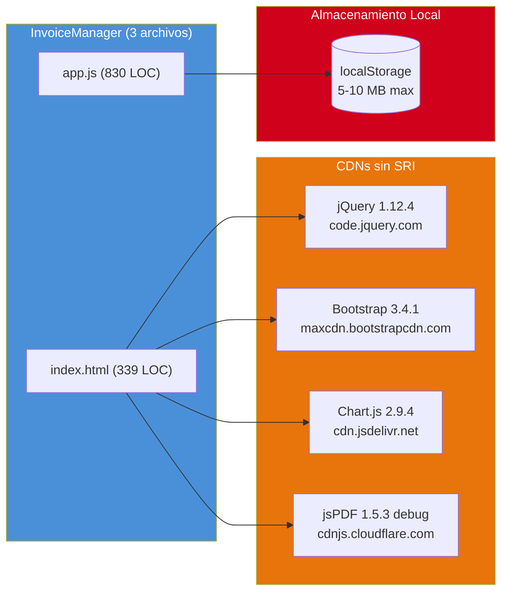
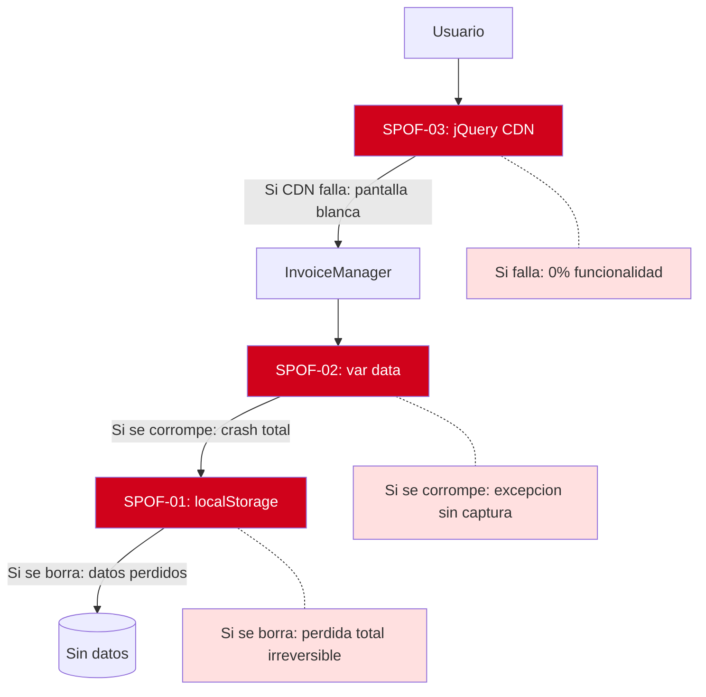

# Análisis de Dependencias

---

> **Aplicación:** INV-001 — InvoiceManager  
> **Cliente:** SoftwareOne  
> **Tipo:** JavaScript ES5 SPA client-side (sin backend, sin build tools)  
> **LOC:** 1,272 | **Archivos fuente:** 3  
> **Fecha de análisis:** 2026-07-23

---

## 1. Análisis Fan-in / Fan-out de Componentes Clave

| Componente | Fan-in (quién lo usa) | Fan-out (qué usa) | Clasificación |
|---|---|---|---|
| `var data` (God Object) | 14 funciones (30% del total) — acceso directo sin encapsulación | 0 (es dato puro) | 🔴 SPOF CRÍTICO — estado global mutable |
| `saveData()` | 9 funciones (toda operación de escritura) | 1 (localStorage.setItem) | 🔴 SPOF CRÍTICO — único punto de persistencia |
| `addAudit()` | 10 funciones (toda operación de negocio) | 1 (data.audit.push) | 🟡 Concentrador — alto fan-in, bajo fan-out |
| `refreshAll()` | 5 funciones + init | 8 funciones render | 🟡 Concentrador — orquestador de rendering |
| `calcItem()` / `calcTotals()` | 4 funciones (facturación, NC, pagos) | 1 (round2) | 🟢 Componente normal — funciones puras |
| `money()` | ~15 funciones | 0 (toLocaleString) | 🟢 Componente normal — utilidad pura |

### Interpretación

- **`var data` (God Object):** Es el punto de máximo acoplamiento. 14 de 46 funciones (30%) acceden directamente a esta variable global. Cualquier cambio en su estructura impacta a todo el sistema. No hay encapsulación ni validación de acceso.
- **`saveData()` (único punto de persistencia):** Toda escritura al almacenamiento pasa por esta función. Si falla (localStorage lleno, error de serialización), se pierde la operación sin recovery. No hay retry, no hay backup pre-write.

---

## 2. Dependencias Externas — Radio de Impacto

| Dependencia Externa | Tipo | Radio de Impacto | Componentes Afectados | Criticidad |
|---|---|---|---|---|
| localStorage (API Browser) | Infraestructura | 100% del sistema | Todas las funciones que persisten datos (saveData, loadData) | 🔴 Crítica |
| jQuery 1.12.4 (CDN) | Framework UI | 100% del sistema | Todos los event handlers + rendering (~50 llamadas $()) | 🔴 Crítica |
| Bootstrap 3.4.1 (CDN) | Framework CSS | 100% de la presentación | index.html completo (339 LOC dependen de clases BS3) | 🔴 Crítica |
| Chart.js 2.9.4 (CDN) | Librería gráficos | 5% (solo dashboard) | drawFinanceChart() — 1 función, ~20 LOC | 🟢 Baja |
| jsPDF 1.5.3 (CDN) | Librería PDF | 5% (solo export PDF) | downloadPDF() — 1 función, ~25 LOC | 🟢 Baja |

### Observaciones

- **3 dependencias con radio de impacto 100%:** localStorage, jQuery y Bootstrap son cada una un SPOF que afecta a la totalidad del sistema. Si cualquiera falla, la app es inutilizable.
- **2 dependencias aisladas (5% impacto):** Chart.js y jsPDF son localizadas a una sola función cada una. Su reemplazo o eliminación no afecta al resto del sistema.

---

## 3. Cadenas de Dependencia Transitiva

### Cadena Crítica 1: Usuario → jQuery → DOM → localStorage

```
Usuario (click) → jQuery (event handler) → Función de negocio → var data (God Object) → saveData() → localStorage
```

- **Riesgo:** La cadena completa es sincrónica y sin error handling. Si localStorage está lleno en el último paso, la excepción se propaga sin captura y la operación se pierde.
- **Mitigación posible:** Implementar try/catch en saveData() con backup pre-write y notificación al usuario.

### Cadena Crítica 2: CDN → Bootstrap → jQuery → UI

```
CDN (load) → Bootstrap JS → jQuery (dependencia) → DOM (rendering)
```

- **Riesgo:** Bootstrap 3 depende de jQuery. Si el CDN de jQuery falla, Bootstrap JS también falla, y toda la UI queda rota (modales, navigation pills, collapse).
- **Mitigación posible:** Ninguna dentro del stack actual — requiere migración a Bootstrap 5 (sin jQuery) o framework moderno.

### Cadena Media 3: refreshAll → 8 funciones render → innerHTML

```
Cualquier operación → refreshAll() → renderDashboard + renderAccounts + renderPayments + ... → innerHTML (XSS)
```

- **Riesgo:** Cada función render concatena datos de usuario directamente a HTML. Si un dato contiene script malicioso, se ejecuta en el browser de todos los usuarios que vean esa vista.
- **Impacto:** 100% del sistema — todas las vistas son vulnerables.

---

## 4. Puntos Únicos de Fallo (SPOFs)

| ID | Componente | Tipo | Impacto si Falla | Dominios Afectados | Mitigación Existente |
|---|---|---|---|---|---|
| SPOF-01 | localStorage | Infraestructura | Pérdida total de datos — app queda vacía | 100% (5/5 dominios) | ❌ Ninguna |
| SPOF-02 | var data (God Object) | God Module | Corrupción de estado → comportamiento impredecible en todo el sistema | 100% (5/5 dominios) | ❌ Ninguna |
| SPOF-03 | jQuery CDN | Infraestructura | App no carga — pantalla blanca (0 funcionalidad) | 100% | ❌ Ninguna |

### Análisis de Impacto SPOF-01: localStorage

localStorage encapsula:
- Todos los datos transaccionales (facturas, pagos, notas crédito)
- Todos los datos maestros (clientes, productos)
- Toda la configuración (numeración, datos empresa)
- Todo el historial de auditoría

No existe:
- Backup automático
- Exportación periódica
- Recuperación ante borrado accidental
- Sincronización con almacenamiento externo
- Validación de integridad post-escritura

### Análisis de Impacto SPOF-02: var data (God Object)

var data contiene:
- 8 sub-colecciones (invoices, payments, clients, products, creditNotes, reminders, audit, numeration)
- Estado mutable compartido por 14 funciones sin coordinación
- Sin deep-clone — modificaciones son por referencia (side effects)

Si se corrompe (JSON.parse falla, schema inválido, campo faltante):
- `loadData()` lanza excepción no capturada → pantalla blanca
- No hay modo degradado ni fallback a datos por defecto
- El usuario pierde todo sin aviso

---

## 5. Diagrama de Dependencias Internas



---

## 6. Diagrama de Dependencias Externas



---

## 7. Diagrama de Mapa de SPOFs



---

## 8. Conclusiones

1. **Patrón estrella con 3 SPOFs al 100%:** La arquitectura presenta una dependencia absoluta (100% radio de impacto) en localStorage, var data y jQuery CDN. Cualquiera de los tres que falle causa inutilización total.
2. **God Object como amplificador de riesgo:** `var data` es accedida directamente por el 30% de las funciones sin encapsulación. Cualquier corrupción se propaga instantáneamente a todo el sistema sin posibilidad de contención.
3. **Sin mecanismos de resiliencia:** No existe retry, circuit breaker, fallback ni modo degradado. El sistema es "todo o nada" — funciona perfecto o falla completamente.
4. **Oportunidad de modernización incremental en Chart.js y jsPDF:** Estas dos dependencias tienen radio de impacto del 5% (1 función cada una). Son candidatas ideales para reemplazo aislado como primer paso de modernización de bajo riesgo.
5. **Cadena de dependencia CDN→jQuery→Bootstrap:** Bootstrap JS depende de jQuery, creando una dependencia transitiva. La migración a Bootstrap 5 (que no requiere jQuery) eliminaría esta cadena completa.

---

Análisis elaborado por SoftwareOne · 2026-07-23
