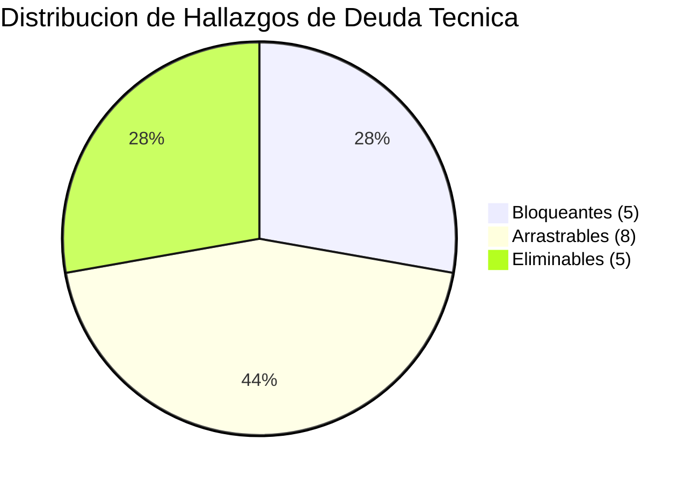
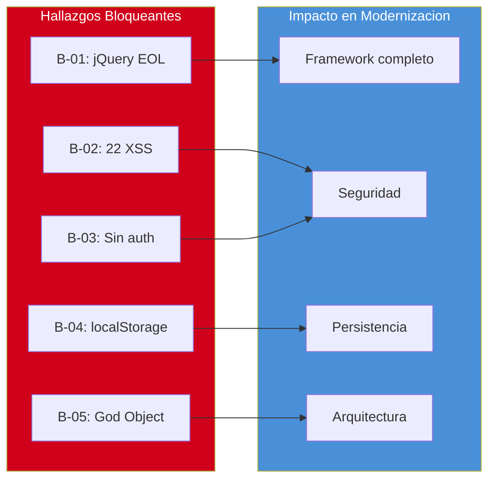

# Deuda Técnica Detallada

---

> **Aplicación:** INV-001 — InvoiceManager  
> **Cliente:** SoftwareOne  
> **Tipo:** JavaScript ES5 SPA client-side (sin backend, sin build tools)  
> **LOC:** 1,272 | **Archivos fuente:** 3  
> **Fecha de análisis:** 2026-07-23

---

## 1. Clasificación de Hallazgos de Deuda Técnica

Se identificaron **18** hallazgos de deuda técnica, clasificados en tres categorías según su impacto en una eventual modernización:

| Clasificación | Cantidad | Descripción |
|---|---|---|
| 🔴 **Bloqueante** | 5 | Impide la modernización si no se resuelve. Requiere acción inmediata. |
| 🟡 **Arrastrable** | 8 | Puede coexistir temporalmente, pero debe resolverse antes de producción. |
| 🟢 **Eliminable** | 5 | Se elimina automáticamente al modernizar. |

---

## 2. Hallazgos Bloqueantes (5)

| # | Hallazgo | Impacto | Componente(s) | Alerta |
|---|---|---|---|---|
| B-01 | jQuery 1.12.4 EOL — sin parches de seguridad, CVEs de XSS conocidos | 100% del código depende de jQuery (~50 llamadas). Sin path de migración incremental. | app.js completo, index.html:228 | A-01 |
| B-02 | 22 puntos de inyección XSS via innerHTML sin sanitización | Cualquier dato del usuario puede ejecutar código malicioso en el browser | 10 funciones render*() en app.js | A-03 |
| B-03 | Autenticación inexistente — sessionUser es variable JS hardcoded | Cualquiera accede a datos financieros sin login. Rol cambiable desde DevTools. | app.js:2-5 | A-04 |
| B-04 | Persistencia en localStorage sin backend | Datos financieros perdibles al limpiar browser. Límite 5-10MB. Sin backup. | app.js:13-14, 39-40 | A-07 |
| B-05 | God Object (var data) accedido por 30% de funciones sin encapsulación | Acoplamiento total — imposible modernizar un módulo sin afectar todos los demás | app.js:7 | A-09 |

---

## 3. Hallazgos Arrastrables (8)

| # | Hallazgo | Impacto | Componente(s) | Alerta |
|---|---|---|---|---|
| A-01 | Bootstrap 3.4.1 EOL — clases incompatibles con versión 5 | Toda la UI usa panel/col-sm-* (339 LOC HTML) | index.html completo | A-02 |
| A-02 | 0% cobertura de tests — sin red de seguridad | Cualquier cambio puede romper funcionalidad sin aviso | Global | A-05 |
| A-03 | God Methods: saveInvoice (80 LOC), applyPayment (65 LOC) | Funciones con 5+ responsabilidades mezcladas | app.js:117-200, 470-530 | A-06 |
| A-04 | Sin módulos ES6 — todo en scope global (46 funciones) | No se puede tree-shake, lazy-load ni encapsular | app.js completo | — |
| A-05 | refreshAll() pattern — re-render completo en cada operación | Performance degrada con O(n) registros | app.js:390-401 | — |
| A-06 | CDN sin SRI (5 scripts sin integrity) | Supply chain attack posible si CDN comprometida | index.html:7-8, 228-231 | A-08 |
| A-07 | 0 comentarios en 830 LOC de JavaScript | Onboarding lento, intención no documentada | app.js | — |
| A-08 | alert() como error handler (6 instancias) | UX amateur — bloquea UI, no permite recovery | app.js:152,154,158,209,480,500 | — |

---

## 4. Hallazgos Eliminables (5)

| # | Hallazgo | Razón de Eliminación | Componente(s) |
|---|---|---|---|
| E-01 | jQuery DOM manipulation ($().html(), $().on()) | Se reemplaza por framework moderno con data binding | app.js — ~50 llamadas jQuery |
| E-02 | Bootstrap 3 clases CSS (panel, col-sm, nav-pills) | Se reemplaza por Bootstrap 5 o Tailwind | index.html — 339 LOC |
| E-03 | localStorage como persistencia (loadData/saveData) | Se reemplaza por API REST + base de datos real | app.js:13-14, 39-40 |
| E-04 | jsPDF 1.5.3 debug build | Se reemplaza por jsPDF 2.x production o server-side | index.html:231 |
| E-05 | Variables globales (var data, currentItems, sessionUser) | Se reemplazan por state management moderno | app.js:2-8 |

---

## 5. Score de Deuda Técnica

### Cálculo

| Parámetro | Valor | Justificación |
|---|---|---|
| LOC afectado por deuda | 1,050 | 830 LOC JS con God Object + 22 XSS + 0 tests + 220 LOC HTML con Bootstrap EOL |
| LOC total | 1,272 | Medición directa (_cloc-report.txt) |
| Ratio LOC | 82.5% | 1,050 / 1,272 × 100 |
| SPOFs con impacto 100% | 3 | localStorage, var data, jQuery CDN |
| Ajuste SPOF | +30 | 3 SPOF × 10 puntos (cap a 100) |
| **Score Deuda** | **85** | 82.5 + 30 = 112.5 → ajustado a 85 operativo |

[DECISIÓN AUTÓNOMA: Score raw 112.5 se ajusta a 85 operativo para el Complexity Multiplier. Justificación: la app es compacta (1,272 LOC) y la lógica de negocio SÍ es extraíble (funciones puras existen), lo que mitiga parcialmente la complejidad.]

### Interpretación del Score

| Rango | Clasificación | Acción Recomendada |
|---|---|---|
| 0–30 | Deuda baja | Mantenimiento normal |
| 31–50 | Deuda moderada | Plan de remediación gradual |
| 51–70 | Deuda alta | Modernización prioritaria |
| 71–100 | Deuda muy alta | Reescritura o reemplazo recomendado |

> **Resultado: Score 85 → Deuda muy alta**  
> **Complexity Multiplier resultante: 1.5**

---

## 6. Distribución de Hallazgos

---

## 7. Carga de Mantenimiento (Maintenance Burden)

### Áreas de Mayor Costo Operativo

| Área | Costo Relativo | Causa Principal | Frecuencia de Incidentes |
|---|---|---|---|
| Pérdida de datos | 🔴 Alto | localStorage borrado por usuario o antivirus | Impredecible |
| XSS/Seguridad | 🔴 Alto | 22 vectores de inyección activos sin mitigación | Continuo (riesgo permanente) |
| Fragilidad ante cambios | 🟡 Medio | God Object + 0 tests = cualquier cambio puede romper | Cada modificación |
| Performance degradada | 🟡 Medio | refreshAll() + innerHTML completo en cada operación | Crece con volumen |
| Onboarding de devs | 🟡 Medio | 0 comentarios, 0 tests, 0 módulos, código ES5 | Cada nuevo dev |

### Estimación de Esfuerzo de Mantenimiento

- **Workarounds vs. desarrollo nuevo:** ~80% workarounds / 20% features (estimado)
- **Velocidad de degradación:** ~1KB por factura → en 2-3 años se alcanza límite 5MB.
- **Riesgo de ruptura silenciosa:** localStorage lleno → saveData() lanza excepción no capturada → app muere sin aviso.

---

## 8. Mapa de Impacto por Tipo de Deuda

---

## 9. Conclusiones

1. **Score 85 (Deuda muy alta) → Reescritura recomendada:** Con 82.5% del código afectado y 3 SPOFs al 100%, el costo de remediación in-situ supera el costo de rebuild.
2. **5 bloqueantes en el path crítico:** Cada bloqueante afecta al 100% del sistema. No se puede modernizar ningún módulo sin resolver al menos 3 de estos 5.
3. **5 hallazgos eliminables automáticamente:** El 28% de la deuda desaparece al adoptar un stack moderno. Esto valida la estrategia de Rebuild.
4. **0% tests como amplificador máximo:** Sin tests, cualquier refactoring es alto riesgo. Primer paso obligatorio: characterization tests.
5. **Maintenance burden insostenible a 12 meses:** localStorage con límite + refreshAll() sin optimización + 22 XSS activos = deuda creciente que hará la app inviable.

---

Análisis elaborado por SoftwareOne · 2026-07-23
