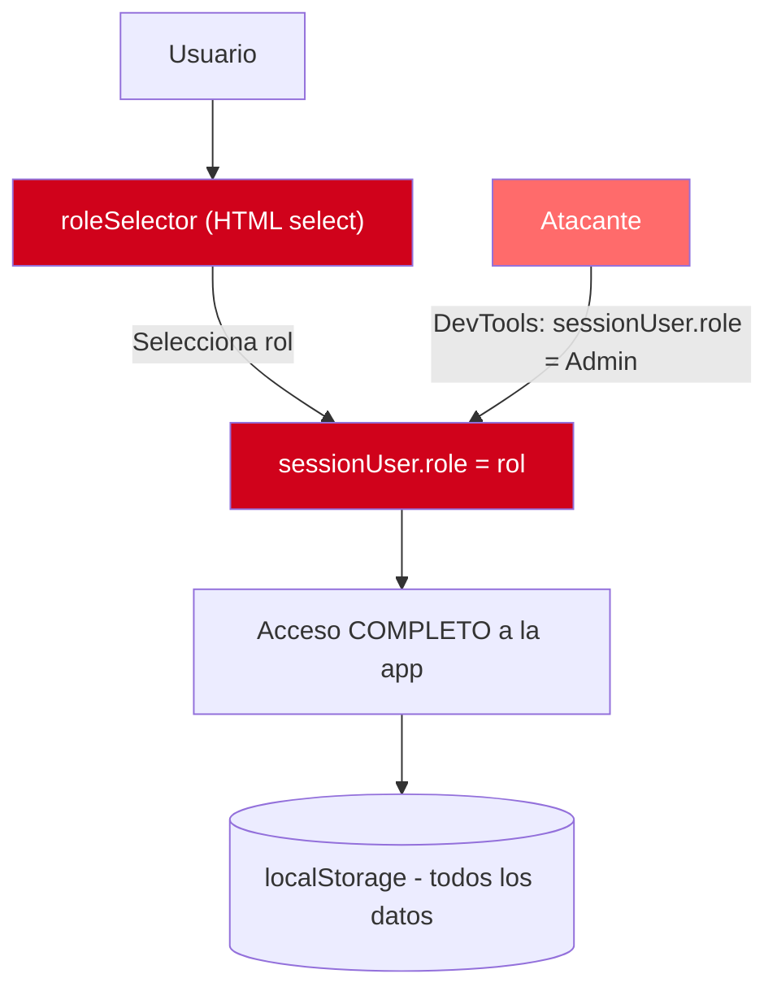

# Análisis de Seguridad

---

> **Aplicación:** INV-001 — InvoiceManager  
> **Cliente:** SoftwareOne  
> **Tipo:** JavaScript ES5 SPA client-side (sin backend, sin build tools)  
> **LOC:** 1,272 | **Archivos fuente:** 3  
> **Fecha de análisis:** 2026-07-23

---

## 1. Postura de Seguridad General

| Área de Seguridad | Estado | Implementación | Observaciones |
|---|---|---|---|
| **Autenticación** | ❌ Ausente | var sessionUser hardcoded (app.js:2) | Sin login, sin password, sin sesión. Cualquiera accede. |
| **Autorización** | ⚠️ Parcial | if (sessionUser.role === "Facturador") en applyPayment() | Solo 1 validación cosmética — eludible con DevTools |
| **Cifrado** | ❌ Ausente | Datos en texto plano en localStorage | Sin TLS forzado, sin cifrado de campos sensibles |
| **Auditoría** | ⚠️ Parcial | addAudit() registra acciones en localStorage | Borrable por el usuario, sin protección contra tampering |
| **Validación de inputs** | ⚠️ Parcial | 15 validaciones de negocio (V-01 a V-15) | Sin sanitización de seguridad — solo reglas de negocio |

### Resumen de Postura

- **Fortalezas:** Auditoría básica de operaciones (addAudit), 15 validaciones de reglas de negocio implementadas.
- **Debilidades críticas:** Autenticación inexistente, 22 puntos de XSS, datos financieros sin cifrar, CDN sin SRI.
- **Riesgo principal:** Cualquier persona con acceso al URL puede ver/modificar todos los datos financieros y ejecutar código malicioso via XSS.

---

## 2. Vulnerabilidades Identificadas

| ID | Vulnerabilidad | CWE | Severidad | Ubicación | Descripción |
|---|---|---|---|---|---|
| V-01 | Reflected/Stored XSS via innerHTML | CWE-79 | 🔴 High | 10 funciones render*() en app.js | 22 puntos donde datos de usuario se concatenan a HTML sin escape |
| V-02 | Missing Authentication | CWE-306 | 🔴 High | app.js:2 (sessionUser hardcoded) | Sin mecanismo de autenticación — acceso directo |
| V-03 | Broken Access Control | CWE-284 | 🔴 High | app.js:75-78 (roleSelector) | Rol es select HTML mutable — sin verificación server-side |
| V-04 | Cleartext Storage of Sensitive Info | CWE-312 | 🟡 Medium | app.js:39 (localStorage) | Datos financieros (NIT, montos, emails) en texto plano |
| V-05 | Missing SRI on CDN Resources | CWE-829 | 🟡 Medium | index.html:7-8, 228-231 | 5 CDNs sin atributo integrity — supply chain attack posible |
| V-06 | Use of Outdated Vulnerable Component | CWE-1104 | 🔴 High | jQuery 1.12.4 (index.html:228) | EOL desde 2016 con CVEs de XSS conocidos |

### Detalle de Impacto por Vulnerabilidad

#### V-01: Stored XSS via innerHTML (CWE-79)

- **Vector de ataque:** Ingresar `` como nombre de producto o razón de nota crédito
- **Impacto:** Ejecución de código JavaScript arbitrario en el contexto del usuario — robo de datos, modificación de facturas
- **Probabilidad:** Alta — los 22 puntos son accesibles desde formularios normales de la app
- **Remediación:** Reemplazar innerHTML por textContent, o usar framework con auto-escaping (React/Vue)

#### V-02: Missing Authentication (CWE-306)

- **Vector de ataque:** Abrir el URL de la aplicación — no se requiere login
- **Impacto:** Acceso completo a datos financieros (facturas, pagos, clientes con NIT y email)
- **Probabilidad:** Alta — es el comportamiento por defecto
- **Remediación:** Implementar OAuth2/JWT con backend que valide identidad

#### V-03: Broken Access Control (CWE-284)

- **Vector de ataque:** Ejecutar `sessionUser.role = "Administrador"` en la consola de DevTools
- **Impacto:** Escalamiento de privilegios instantáneo — acceso a funciones restringidas
- **Probabilidad:** Media — requiere conocimiento técnico mínimo (DevTools)
- **Remediación:** Autorización server-side, tokens JWT con roles firmados

---

## 3. Mapeo OWASP Top 10 (2021)

| OWASP ID | Categoría | Vulnerabilidad Local | Severidad |
|---|---|---|---|
| A01:2021 | Broken Access Control | V-03 (rol mutable sin verificación) | 🔴 High |
| A02:2021 | Cryptographic Failures | V-04 (datos en texto plano en localStorage) | 🟡 Medium |
| A03:2021 | Injection | V-01 (22 puntos XSS via innerHTML) | 🔴 High |
| A04:2021 | Insecure Design | V-02 (diseño sin autenticación ni backend) | 🔴 High |
| A05:2021 | Security Misconfiguration | V-05 (CDN sin SRI) + jsPDF debug en producción | 🟡 Medium |
| A06:2021 | Vulnerable and Outdated Components | V-06 (jQuery 1.12.4 EOL, Bootstrap 3.4.1 EOL) | 🔴 High |
| A07:2021 | Identification and Authentication Failures | V-02 (sin autenticación) | 🔴 High |
| A08:2021 | Software and Data Integrity Failures | V-05 (CDN sin SRI — inyección posible) | 🟡 Medium |
| A09:2021 | Security Logging and Monitoring Failures | Auditoría en localStorage borrable | 🟡 Medium |
| A10:2021 | Server-Side Request Forgery | No aplica (sin backend) | — |

### Categorías OWASP No Aplicables

| OWASP ID | Categoría | Razón |
|---|---|---|
| A10:2021 | SSRF | La aplicación es 100% client-side sin backend. No hace llamadas HTTP server-side. |

---

## 4. Limitaciones del Análisis Estático

| Aspecto | Limitación | Impacto en Evaluación |
|---|---|---|
| Sin runtime | No se ejecutó la aplicación | No se pueden confirmar CVEs de jQuery en contexto real |
| Sin red | No hay tráfico de red que analizar | No se puede evaluar TLS, headers de seguridad en servidor |
| Sin servidor | No existe backend | OWASP A10 (SSRF) no es evaluable |
| Datos de producción | No se accede a localStorage real | No se puede evaluar volumen/sensibilidad de datos reales |
| Entorno de despliegue | Desconocido | No se puede evaluar configuración de servidor web |

---

## 5. Flujo de Autenticación y Autorización

### Observaciones del Flujo

1. **No existe gatekeeper:** No hay login, no hay verificación de identidad. El "flujo de autenticación" es un select HTML que asigna un string a una variable JavaScript.
2. **Autorización es cosmética:** Solo existe una validación de rol (Facturador no puede pagar) que es client-side y eludible con una línea en la consola.
3. **Sin segregación de datos:** Todos los usuarios (y atacantes) acceden al mismo localStorage con todos los datos del sistema.

---

## 6. Recomendaciones Prioritarias

| Prioridad | Acción | Vulnerabilidad | Esfuerzo |
|---|---|---|---|
| 🔴 1 | Implementar autenticación real (OAuth2/JWT con backend) | V-02, V-03 | Alto (4-6 semanas con backend) |
| 🔴 2 | Eliminar innerHTML — usar textContent o framework con auto-escape | V-01 | Medio (2-3 semanas — refactor de 10 funciones) |
| 🟡 3 | Agregar SRI a todos los tags CDN + crossorigin="anonymous" | V-05 | Bajo (1 hora — quick win) |
| 🟡 4 | Actualizar jQuery a 3.7+ o eliminar dependencia | V-06 | Alto (2-4 semanas — breaking changes) |
| 🟡 5 | Reemplazar jspdf.debug.js por jspdf.min.js | V-05 | Bajo (5 minutos — quick win) |

---

## 7. Conclusiones

1. **Postura de seguridad: Crítica (0/5 controles implementados correctamente).** La aplicación no tiene autenticación, tiene autorización cosmética, no cifra datos, y expone 22 vectores XSS. No es apta para uso con datos reales.
2. **6 categorías OWASP vulnerables (de 9 evaluables).** Solo A09 tiene mitigación parcial (addAudit) y A10 no aplica. Todo lo demás está en estado vulnerable o ausente.
3. **Quick wins disponibles:** SRI en CDNs (1 hora) y reemplazo de jspdf.debug (5 min) reducen superficie de ataque sin modificar funcionalidad.
4. **Seguridad no es parcheble — requiere arquitectura:** Sin backend, no hay forma de implementar autenticación, autorización server-side ni protección real de datos. La seguridad es un prerrequisito arquitectónico para la modernización.
5. **Modelo de amenaza simplificado:** Sin backend, sin red, sin integraciones, la superficie de ataque se limita al browser local. Pero si la app se expone via HTTP server (como es probable en producción), todos los vectores se activan.

---

Análisis elaborado por SoftwareOne · 2026-07-23
