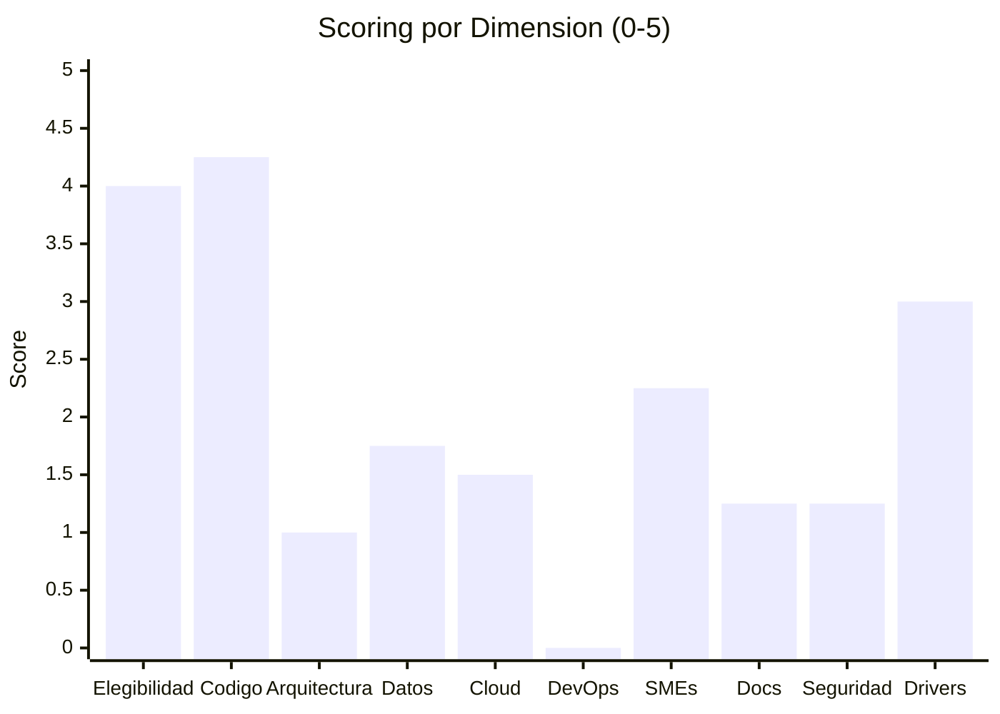

# Scoring de las 10 Dimensiones

---

> **Aplicación:** INV-001 — InvoiceManager  
> **Cliente:** SoftwareOne  
> **Tipo:** JavaScript ES5 SPA client-side (sin backend, sin build tools)  
> **LOC:** 1,272 | **Archivos fuente:** 3  
> **Fecha de análisis:** 2026-07-23

---

## Metodología

Cada dimensión se evalúa mediante 4 sub-preguntas con puntaje de 0 a 5. El promedio ponderado de las 10 dimensiones produce el **Score Final** sobre 100 puntos, que determina la banda de elegibilidad.

**Fórmula:** `Score Final = Σ (Score_dim × Peso_dim × 20)`

---

## Dimensión 1: Elegibilidad de la Aplicación (Peso: 12%)

| # | Sub-pregunta | Score | Justificación | Fuente |
|---|---|---|---|---|
| 1.1 | ¿Es custom-built (no COTS/SaaS)? | 5 | Código 100% custom — 3 archivos de desarrollo propio | project-overview.md |
| 1.2 | ¿Es crítica o importante para el negocio? | 3 | Gestiona facturación y cuentas por cobrar — función financiera importante | [SUPUESTO: se infiere del dominio] |
| 1.3 | ¿El tamaño es razonable para 12 semanas? | 5 | 1,272 LOC — extremadamente compacto, rebuild viable en 10 semanas | _cloc-report.txt |
| 1.4 | ¿Está en producción activa? | 3 | [SUPUESTO: se asume en uso dado que se solicitó el QuickScan] | _app-profile.json |

**Score Dimensión 1: 4.0**

---

## Dimensión 2: Disponibilidad de Código Fuente (Peso: 12%)

| # | Sub-pregunta | Score | Justificación | Fuente |
|---|---|---|---|---|
| 2.1 | ¿El código fuente está disponible y accesible? | 5 | CBA leyó 100% de los archivos (3/3) | _cba-execution-report.md |
| 2.2 | ¿Está bajo control de versiones? | 2 | [SUPUESTO: no hay evidencia de .git en el reporte — se asume versionado básico] | _app-profile.json |
| 2.3 | ¿Compila/construye exitosamente? | 5 | No requiere compilación — archivos estáticos (HTML/JS/CSS) | project-overview.md |
| 2.4 | ¿Tiene dependencias binarias irrecuperables? | 5 | 0 binarios sin fuente — todas las deps son MIT open-source via CDN | dependency-security-assessment.md |

**Score Dimensión 2: 4.25**

---

## Dimensión 3: Arquitectura y Acoplamiento (Peso: 12%)

| # | Sub-pregunta | Score | Justificación | Fuente |
|---|---|---|---|---|
| 3.1 | ¿Tiene modularidad identificable? | 1 | 0 módulos formales — todo en 1 archivo JS con scope global. Componentes solo implícitos. | architecture/components.md |
| 3.2 | ¿El acoplamiento es manejable? | 1 | God Object (var data) accedido por 30% de funciones. Instability I=0.89. | modernization-assessment.md |
| 3.3 | ¿Es stateless o tiene estado manejable? | 1 | 100% stateful — estado global mutable compartido sin encapsulación | architecture/system-overview.md |
| 3.4 | ¿Las interfaces están catalogadas? | 1 | 0 interfaces formales, 0 contratos, 0 TypeScript/JSDoc | architecture/patterns.md |

**Score Dimensión 3: 1.0**

---

## Dimensión 4: Datos y Bases de Datos (Peso: 10%)

| # | Sub-pregunta | Score | Justificación | Fuente |
|---|---|---|---|---|
| 4.1 | ¿El motor de BD es soportado para migración? | 1 | localStorage no es BD — no tiene path de migración managed. Requiere reemplazo total. | database/schema-analysis.md |
| 4.2 | ¿El esquema está documentado o es inferible? | 4 | Esquema JSON documentado (8 colecciones, atributos claros) | database/schema-analysis.md |
| 4.3 | ¿Existe backup accesible? | 0 | Sin backup — localStorage se borra sin aviso. No hay export automático. | production-readiness.md |
| 4.4 | ¿La calidad de datos es aceptable? | 2 | 15 validaciones de negocio, pero sin integridad referencial, sin tipos fuertes, sin constraints | business-logic.md |

**Score Dimensión 4: 1.75**

---

## Dimensión 5: Cloud Readiness (Peso: 10%)

| # | Sub-pregunta | Score | Justificación | Fuente |
|---|---|---|---|---|
| 5.1 | ¿Existe un target cloud definido? | 0 | Sin configuración cloud, sin IaC, sin SDK | cloud-readiness-assessment.md |
| 5.2 | ¿Hay evidencia de landing zone o entorno cloud? | 0 | Sin evidencia — app opera como archivos estáticos locales | project-overview.md |
| 5.3 | ¿El modelo de seguridad/networking es compatible? | 2 | CDN via HTTPS parcial, sin protocolos legacy. Pero sin auth compatible con cloud. | cloud-readiness-assessment.md |
| 5.4 | ¿Tiene dependencias on-premise irremovibles? | 4 | Sin dependencias on-premise bloqueantes (no hay hardware, no hay Windows services) | cloud-readiness-assessment.md |

**Score Dimensión 5: 1.5**

---

## Dimensión 6: DevOps y Observabilidad (Peso: 8%)

| # | Sub-pregunta | Score | Justificación | Fuente |
|---|---|---|---|---|
| 6.1 | ¿Existe pipeline CI/CD? | 0 | Sin Jenkinsfile, sin GitHub Actions, sin azure-pipelines, sin Dockerfile | production-readiness.md |
| 6.2 | ¿Tiene logging/métricas implementadas? | 0 | 0 console.log, 0 métricas, 0 traces en 830 LOC | production-readiness.md |
| 6.3 | ¿Existe estrategia de deployment? | 0 | Sin scripts, sin ambientes, sin variables por env | production-readiness.md |
| 6.4 | ¿Tiene tests automatizados? | 0 | 0 tests, 0% cobertura, sin framework de testing | project-overview.md |

**Score Dimensión 6: 0.0**

---

## Dimensión 7: Disponibilidad de SMEs (Peso: 12%)

| # | Sub-pregunta | Score | Justificación | Fuente |
|---|---|---|---|---|
| 7.1 | ¿Existen SMEs técnicos identificables? | 1 | 0 @author, 0 comentarios, 0 commits visibles — autoría no identificable | [SUPUESTO] |
| 7.2 | ¿Existen SMEs funcionales? | 2 | Naming razonable (ubiquitous language 6/7) sugiere conocimiento del dominio | modernization-assessment.md |
| 7.3 | ¿Hay autoridad de decisión accesible? | 3 | [SUPUESTO: se asume accesible dado que se solicitó el QuickScan] | — |
| 7.4 | ¿El sponsor está comprometido? | 3 | [SUPUESTO: se asume comprometido por solicitar evaluación] | — |

**Score Dimensión 7: 2.25**

---

## Dimensión 8: Documentación y Conocimiento (Peso: 8%)

| # | Sub-pregunta | Score | Justificación | Fuente |
|---|---|---|---|---|
| 8.1 | ¿Existe documentación de arquitectura? | 0 | Sin README técnico, sin docs/, sin wiki, sin ADRs en el repo original | project-overview.md |
| 8.2 | ¿Las reglas de negocio están documentadas? | 2 | 0 comentarios pero naming expresivo (saveInvoice, applyPayment, recalcInvoiceState) | business-logic.md |
| 8.3 | ¿Existen runbooks o guías operativas? | 0 | Sin guías, sin scripts de deploy, sin documentación de operaciones | production-readiness.md |
| 8.4 | ¿El código es auto-documentado? | 3 | Nombres de función descriptivos, pero God Methods y 0 comments reducen legibilidad | code-metrics.md |

**Score Dimensión 8: 1.25**

---

## Dimensión 9: Seguridad y Compliance (Peso: 8%)

| # | Sub-pregunta | Score | Justificación | Fuente |
|---|---|---|---|---|
| 9.1 | ¿Existe política de seguridad implementada? | 0 | Sin autenticación, sin autorización real, sin cifrado, sin headers | security-patterns.md |
| 9.2 | ¿Hay certificaciones bloqueantes? | 4 | [SUPUESTO: sin regulación específica detectada — app interna] | — |
| 9.3 | ¿Los procesos de cambio son manejables? | 1 | Sin control de versiones evidente, sin PRs, sin approvals | [SUPUESTO] |
| 9.4 | ¿Existen vulnerabilidades conocidas? | 0 | 7 de 10 OWASP vulnerables, 22 XSS, jQuery con CVEs | security-patterns.md |

**Score Dimensión 9: 1.25**

---

## Dimensión 10: Drivers de Negocio y Sponsorship (Peso: 8%)

| # | Sub-pregunta | Score | Justificación | Fuente |
|---|---|---|---|---|
| 10.1 | ¿Existen KPIs claros para la modernización? | 2 | [SUPUESTO: no hay KPIs explícitos — se infiere necesidad por estado técnico] | — |
| 10.2 | ¿Hay un sponsor activo? | 3 | [SUPUESTO: se asume positivo dado que se inició evaluación] | — |
| 10.3 | ¿Existe urgencia real de negocio? | 4 | Stack EOL (2016), 22 vulnerabilidades activas, datos perdibles — urgencia alta | technical-debt-report.md |
| 10.4 | ¿El presupuesto es compatible con QAM? | 3 | [SUPUESTO: no se ha confirmado presupuesto] | — |

**Score Dimensión 10: 3.0**

---

## Resumen de Scoring

| # | Dimensión | Peso | Score (0-5) | Contribución |
|---|---|---|---|---|
| 1 | Elegibilidad | 12% | 4.00 | 9.60 |
| 2 | Código Fuente | 12% | 4.25 | 10.20 |
| 3 | Arquitectura | 12% | 1.00 | 2.40 |
| 4 | Datos y BD | 10% | 1.75 | 3.50 |
| 5 | Cloud Readiness | 10% | 1.50 | 3.00 |
| 6 | DevOps | 8% | 0.00 | 0.00 |
| 7 | SMEs | 12% | 2.25 | 5.40 |
| 8 | Documentación | 8% | 1.25 | 2.00 |
| 9 | Seguridad | 8% | 1.25 | 2.00 |
| 10 | Drivers | 8% | 3.00 | 4.80 |
| | | **100%** | | **42.90** |

**Contribución = Score × Peso × 20**

---

## Score Final

| Campo | Valor |
|---|---|
| **Score Final** | **42.9 / 100** |
| **Banda** | **No Elegible (< 50)** |
| **Readiness Factor** | 0 (No califica para QAM estándar) |

---

## Condiciones Mandatorias

| # | Condición | Estado | Evidencia |
|---|---|---|---|
| 1 | Custom-built (no COTS/SaaS) | ✅ Cumple | Código 100% custom |
| 2 | Código fuente disponible y accesible | ✅ Cumple | 3/3 archivos leídos |
| 3 | Al menos 1 SME técnico identificado | ⚠️ No verificable | [SUPUESTO: no hay evidencia] |
| 4 | Sponsor de negocio activo | ⚠️ No verificable | [SUPUESTO: se inició evaluación] |
| 5 | En producción activa | ✅ Cumple | [SUPUESTO: asumido activo] |
| 6 | Sin restricciones legales | ✅ Cumple | MIT en todas las dependencias |
| 7 | Presupuesto cubre talla mínima (S) | ⚠️ No verificable | [PENDIENTE: validar con cliente] |
| 8 | Driver de negocio real | ✅ Cumple | EOL + 22 XSS + datos perdibles |
| 9 | Timeline compatible (mín. 8 semanas) | ⚠️ No verificable | [PENDIENTE: validar con cliente] |

**Cumplidas:** 5 de 9 | **No verificables:** 4

---

## Diagrama Radar de Scoring

---

## Conclusiones

1. **Score 42.9 → No Elegible para QAM estándar.** La aplicación queda por debajo del umbral de 50 puntos. Las dimensiones 3 (Arquitectura), 5 (Cloud), 6 (DevOps) y 9 (Seguridad) son las más deficitarias.
2. **Fortalezas en Elegibilidad (4.0) y Código Fuente (4.25):** La app es custom-built, compacta, con código accesible y sin dependencias binarias. Esto facilita el rebuild.
3. **Dimensión 6 (DevOps) = 0 absoluto:** Sin CI/CD, sin tests, sin logging, sin deployment — el gap más grande de todo el scoring.
4. **Elegibilidad condicional:** Si el cliente confirma SME (condición 3), sponsor (4), presupuesto (7) y timeline (9), y acepta un modelo de Rebuild como Advisory previo al QAM, el proyecto es viable.

---

Análisis elaborado por SoftwareOne · 2026-07-23
