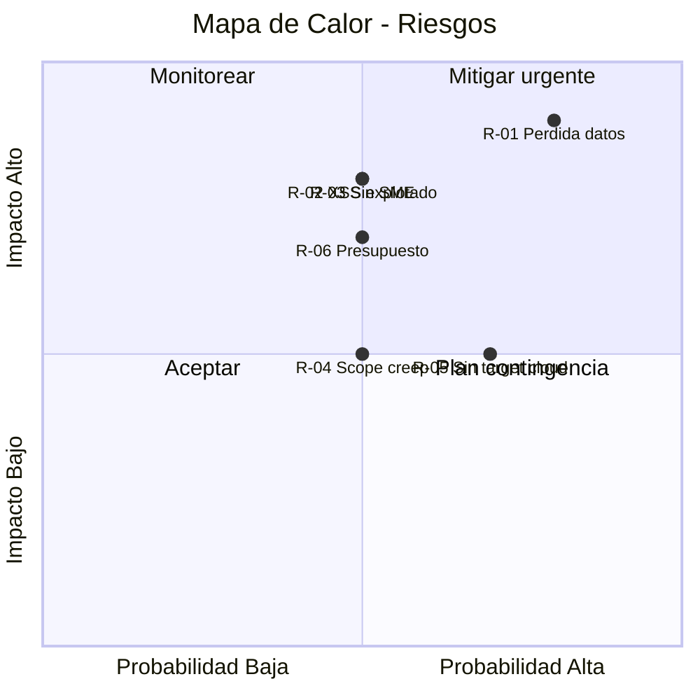

# Gap & Risk Register

> **Score Final:** 42.9 / 100 — No Elegible  
> **Banda:** No Elegible (< 50)  
> **Complexity:** 1.5 (Deuda muy alta)

---

## 1. Registro de Brechas (Gaps de Elegibilidad)

Dimensiones con score < 2.0 que requieren acción para viabilizar la modernización:

| # | Dimensión | Score Actual | Score Target | Gap | Acciones para Cerrar | Responsable | Timing |
|---|---|---|---|---|---|---|---|
| G-01 | Arquitectura y Acoplamiento | 1.0 | 3.0 | 2.0 | Rebuild con separación en capas (backend + frontend + BD) | SoftwareOne (equipo centauro) | Durante modernización |
| G-02 | Datos y BD | 1.75 | 3.0 | 1.25 | Migrar localStorage a PostgreSQL/MySQL managed + implementar backups | SoftwareOne + Cliente (infra) | Durante modernización |
| G-03 | Cloud Readiness | 1.5 | 3.0 | 1.5 | Definir target cloud + landing zone + containerización | Cliente (decisión) + SoftwareOne (implementación) | Pre-modernización |
| G-04 | DevOps y Observabilidad | 0.0 | 3.0 | 3.0 | Implementar CI/CD + tests + logging + deployment automatizado | SoftwareOne (equipo centauro) | Durante modernización |
| G-05 | Documentación | 1.25 | 3.0 | 1.75 | Characterization tests como documentación ejecutable + README | SoftwareOne (equipo centauro) | Fase 0 (primeras 2 semanas) |
| G-06 | Seguridad | 1.25 | 3.0 | 1.75 | Implementar auth (OAuth2/JWT) + eliminar XSS + cifrar datos | SoftwareOne (equipo centauro) | Durante modernización |

### Detalle de Acciones por Gap

#### G-01: Arquitectura y Acoplamiento (Score 1.0 → Target 3.0)

**Situación actual:** Monolito client-side en 1 archivo JS con God Object global. Sin capas, sin módulos, sin interfaces.

**Acciones requeridas:**
1. Separar en frontend (SPA moderna) + backend (API REST)
2. Introducir capas: presentación, servicios, dominio, persistencia
3. Implementar inyección de dependencias
4. Definir interfaces/contratos entre módulos
5. Eliminar God Object — reemplazar por repositories/services

**Prerrequisito para modernización:** No — se resuelve COMO PARTE de la modernización (es la modernización misma).

#### G-04: DevOps y Observabilidad (Score 0.0 → Target 3.0)

**Situación actual:** 0 CI/CD, 0 tests, 0 logging, 0 métricas, 0 ambientes configurados.

**Acciones requeridas:**
1. Crear repositorio Git con branching strategy
2. Configurar pipeline CI (build + lint + test)
3. Implementar framework de testing (Jest/Vitest + Playwright)
4. Configurar logging estructurado (Winston/Pino)
5. Definir ambientes (dev/staging/production)

**Prerrequisito para modernización:** Parcial — el repositorio Git y pipeline básico deben existir ANTES de empezar a escribir código nuevo.

---

## 2. Registro de Riesgos

| ID | Riesgo | Dimensión | Probabilidad | Impacto | Score (P×I) | Mitigación | Owner |
|---|---|---|---|---|---|---|---|
| R-01 | Pérdida de datos financieros en localStorage durante transición | D4 (Datos) | Alta | Alto | 9 | Export inmediato de datos como primera actividad del proyecto | Cliente + SoftwareOne |
| R-02 | XSS explotado antes de completar modernización | D9 (Seguridad) | Media | Alto | 6 | Quick win: SRI en CDNs + textContent en campos críticos como parche temporal | SoftwareOne |
| R-03 | Sin SME técnico — reglas de negocio mal interpretadas | D7 (SMEs) | Media | Alto | 6 | Characterization tests obligatorios + validación funcional con stakeholders | Cliente (proveer SME) |
| R-04 | Scope creep (agregar features no existentes durante rebuild) | D1 (Elegibilidad) | Media | Medio | 4 | Criterio de aceptación: paridad funcional 100% como baseline | SoftwareOne (Project Manager) |
| R-05 | Target cloud no definido — delays en decisiones de infraestructura | D5 (Cloud) | Alta | Medio | 6 | Workshop A2 en semana 1 para definir target | Cliente + SoftwareOne |
| R-06 | Presupuesto insuficiente para rebuild completo | D10 (Drivers) | Media | Alto | 6 | Presentar sizing transparente + opciones de alcance reducido | SoftwareOne (comercial) |

### Mapa de Calor de Riesgos

---

## 3. Plan de Mitigación Prioritario

| Prioridad | Riesgo | Acción Inmediata | Deadline | Responsable |
|---|---|---|---|---|
| 🔴 1 | R-01 (pérdida de datos) | Ejecutar export/backup de localStorage AHORA | Semana 0 (inmediato) | Cliente |
| 🔴 2 | R-05 (sin target cloud) | Workshop de alineación estratégica A2 | Semana 1-2 | SoftwareOne + Cliente |
| 🟡 3 | R-03 (sin SME) | Identificar al menos 1 persona que conoce las reglas de facturación | Semana 1 | Cliente |
| 🟡 4 | R-06 (presupuesto) | Presentar sizing y opciones al sponsor | Semana 2 | SoftwareOne comercial |
| 🟡 5 | R-02 (XSS) | Quick win: agregar SRI a CDNs (1 hora de trabajo) | Semana 1 | SoftwareOne |

---

## 4. Conclusiones

1. **6 gaps identificados:** Las dimensiones 3, 4, 5, 6, 8 y 9 requieren acción. Sin embargo, dado que la estrategia recomendada es Rebuild, la mayoría de gaps se resuelven como parte del proyecto (no son prerrequisitos bloqueantes).
2. **Riesgo #1: pérdida de datos:** Es el único riesgo que requiere acción INMEDIATA (antes de que inicie el proyecto). Si los datos de localStorage se pierden, no hay cómo recuperarlos.
3. **4 condiciones mandatorias pendientes:** El proyecto no puede iniciar hasta que el cliente confirme: SME, sponsor, presupuesto y timeline. Esto debe resolverse en las semanas 1-2.
4. **Score bajo pero viable:** Aunque 42.9 es "No Elegible" para QAM estándar, el tamaño compacto (1,272 LOC) y la ausencia de dependencias propietarias hacen que un Rebuild Advisory sea perfectamente factible con la talla S.

---

Análisis elaborado por SoftwareOne · 2026-07-23
