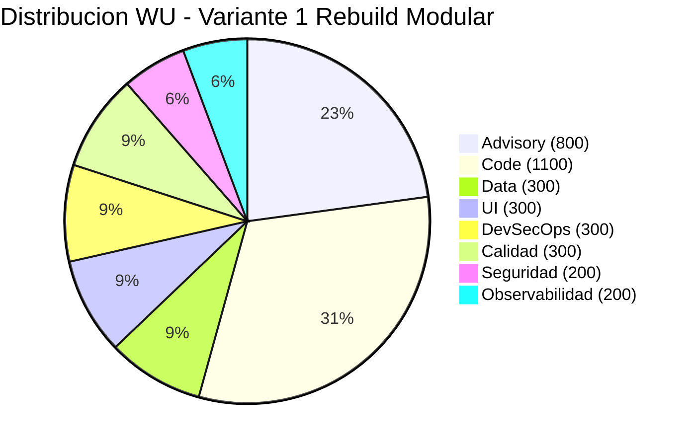
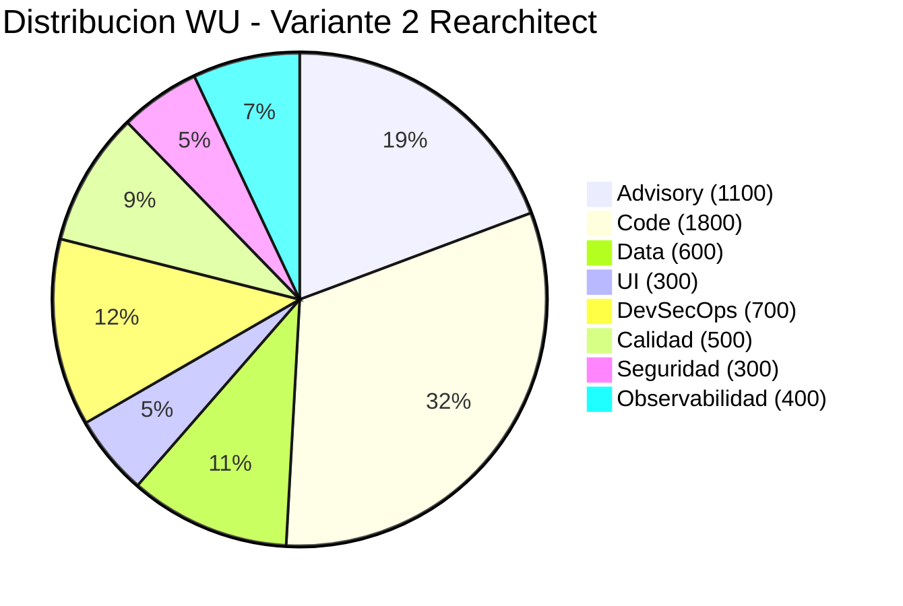

# Dimensionamiento WU

---

> **Score Final:** 42.9 / 100 — No Elegible  
> **Complexity:** 1.5 (Deuda muy alta)  
> **LOC:** 1,272 | **Dominios funcionales:** 5  
> **Referencia coherencia:** 2,122 WU / 1.272K LOC = ~1,669 WU/1K LOC — [DECISIÓN AUTÓNOMA: Ratio alto justificado porque app requiere rebuild completo con backend inexistente + BD nueva + auth nueva + CI/CD desde cero. El código AS-IS es pequeño pero el TO-BE es significativamente más grande en infraestructura.]

---

## Variante 1: Rebuild Modular (RECOMENDADA)

### Familia 1: Advisory

| # | Componente | Justificación de talla | Talla | WU |
|---|---|---|---|---|
| A1 | QuickScan de elegibilidad | App simple, 1.2K LOC, 0 integraciones, sin regulación, target por definir | S | 100 |
| A2 | Workshop alineación estratégica | 1 sesión, 2-4 stakeholders, drivers claros (EOL + seguridad), una línea de negocio | S | 100 |
| A3 | Workshops conceptualización (ES/DDD) | 5 dominios simples, 1 sesión, lógica lineal (state machine documentada) | S | 100 |
| A4 | Análisis arquitectura AS-IS | App monolítica simple (1 archivo), 0 integraciones, documentada por CBA | S | 100 |
| A5 | Diseño arquitectura TO-BE | Monolito modular, 2-3 ADRs (stack, auth, BD), 1 alternativa evaluada | M | 300 |
| A6 | Estrategia de migración | Big-bang con Strangler parcial, 1 fase principal, business case simple | S | 100 |

**Subtotal Advisory: 800 WU**

---

### Familia 2: Code

| # | Componente | Justificación de talla | Talla | WU |
|---|---|---|---|---|
| C1-D1 | Módulo Facturación | Dominio con lógica moderada (state machine, validaciones, cálculos) — ~180 LOC AS-IS pero reglas regulatorias de facturación | M | 300 |
| C1-D2 | Módulo Pagos | Lógica de distribución de pagos, validaciones conciliación, restricción por rol | S | 100 |
| C1-D3 | Módulo Cartera/CxC | Máquina de estados (7 estados), filtros, recordatorios | S | 100 |
| C1-D4 | Módulo Ajustes (NC/Anulación) | Notas crédito parcial/total + anulación con motivo | S | 100 |
| C1-D5 | Módulo Reporting/Dashboard | 8 KPIs, gráfico, top deudores — lógica de cálculo estadístico | S | 100 |
| C2 | API REST backend | 10-15 endpoints (CRUD para 5 dominios + auth + audit), Express/NestJS | M | 300 |
| C5 | Utilidades compartidas (money, dates, calc) | Funciones puras ya identificadas — refactor directo a módulos | S | 100 |

**Subtotal Code: 1,100 WU**

---

### Familia 3: Data

| # | Componente | Justificación de talla | Talla | WU |
|---|---|---|---|---|
| D1 | Migración de esquema | 8 tablas (de JSON a relacional), relaciones simples, sin triggers | S | 100 |
| D3 | ETL datos existentes | Export localStorage JSON → import a PostgreSQL. <1MB, transformación 1:1 | S | 100 |
| D4 | Configuración acceso moderno | Connection pool + ORM (Prisma/TypeORM) + migrations + seeds | S | 100 |

**Subtotal Data: 300 WU**

---

### Familia 4: UI

| # | Componente | Justificación de talla | Talla | WU |
|---|---|---|---|---|
| U1 | Pantallas por módulo (6 vistas + modal) | <10 pantallas, formularios con validación, tablas con filtro | S | 100 |
| U2 | Componentes reutilizables | Usar librería existente (Material UI / PrimeReact) sin customización mayor | S | 100 |
| U4 | Reportería (PDF + CSV) | 1-3 reportes: factura PDF + export CSV cartera | S | 100 |

**Subtotal UI: 300 WU**

---

### Familia 5: DevSecOps

| # | Componente | Justificación de talla | Talla | WU |
|---|---|---|---|---|
| DS1 | Pipeline CI/CD | Pipeline básico: build + test + deploy a 1 ambiente (Vercel/Railway/Render) | S | 100 |
| DS3 | Contenedorización | Dockerfile optimizado para 1 servicio (backend Node.js) | S | 100 |
| DS5 | Gestión de secretos | Variables de entorno + .env por ambiente | S | 100 |

**Subtotal DevSecOps: 300 WU**

---

### Familia 6: Calidad

| # | Componente | Justificación de talla | Talla | WU |
|---|---|---|---|---|
| Q1 | Framework testing unitario | Setup Jest/Vitest + tests para módulos de negocio (calcItem, state machine) | S | 100 |
| Q3 | Tests E2E | 5-10 happy paths con Playwright (crear factura, pagar, dashboard) | S | 100 |
| Q5 | Validación paridad funcional | Comparación manual/semi-auto AS-IS vs TO-BE — 12 funcionalidades | S | 100 |

**Subtotal Calidad: 300 WU**

---

### Familia 7: Seguridad

| # | Componente | Justificación de talla | Talla | WU |
|---|---|---|---|---|
| SE1 | Sistema de identidad y acceso | Integración con provider existente (Auth0/Keycloak) o JWT custom básico, login + 3 roles | S | 100 |
| SE2 | Remediación de vulnerabilidades | Framework moderno elimina XSS automáticamente (React auto-escaping). Verificar que no queden innerHTML. | S | 100 |

**Subtotal Seguridad: 200 WU**

---

### Familia 8: Observabilidad

| # | Componente | Justificación de talla | Talla | WU |
|---|---|---|---|---|
| O1 | Logging estructurado | Winston/Pino JSON + log levels — 1 servicio backend | S | 100 |
| O4 | Health checks | /health endpoint + readiness probe | S | 100 |

**Subtotal Observabilidad: 200 WU**

---

### Total Variante 1 (Rebuild Modular)

| Familia | WU |
|---|---|
| Advisory | 800 |
| Code | 1,100 |
| Data | 300 |
| UI | 300 |
| DevSecOps | 300 |
| Calidad | 300 |
| Seguridad | 200 |
| Observabilidad | 200 |
| **TOTAL** | **3,500** |

---

## Variante 2: Rearchitect a Microservicios (ALTERNATIVA)

### Resumen de dimensionamiento

| Familia | WU | Justificación diferencial |
|---|---|---|
| Advisory | 1,100 | A3=M (5 bounded contexts formales), A5=L (multi-servicio, event bus, API Gateway) |
| Code | 1,800 | Cada dominio es un servicio independiente (C1-D1 a D5 = M cada uno) + API Gateway |
| Data | 600 | D1=M (schema por servicio × 5), D4=M (multi-BD, consistency eventual) |
| UI | 300 | Igual (misma cantidad de pantallas) |
| DevSecOps | 700 | DS1=M (multi-servicio), DS3=M (5 containers), DS4=S (K8s básico) |
| Calidad | 500 | Q1=M (tests por servicio), Q2=S (contract testing), Q3=S |
| Seguridad | 300 | SE1=M (SSO multi-servicio, token propagation) |
| Observabilidad | 400 | O1=S, O2=S, O3=S (tracing distribuido), O4=S |
| **TOTAL** | **5,700** |

---

## Tabla Comparativa

| Familia | V1: Rebuild Modular | V2: Rearchitect |
|---|---|---|
| Advisory | 800 | 1,100 |
| Code | 1,100 | 1,800 |
| Data | 300 | 600 |
| UI | 300 | 300 |
| DevSecOps | 300 | 700 |
| Calidad | 300 | 500 |
| Seguridad | 200 | 300 |
| Observabilidad | 200 | 400 |
| **Total WU** | **3,500** | **5,700** |
| **Créditos** (WU × 0.2) | **700** | **1,140** |
| **Talla** | **S** (< 4,000 créditos) | **S** (< 4,000 créditos) |
| **Duración** | 10-12 semanas | 14-16 semanas |
| **Valor contrato** (créditos × USD 10) | **USD 7,000** | **USD 11,400** |

---

## Cálculo de Créditos (Variante 1 — Recomendada)

| Paso | Valor | Justificación |
|---|---|---|
| Total WU | 3,500 | Suma de 8 familias |
| Conversión WU → Créditos | 3,500 × 0.2 = **700** | Factor: 0.2 créditos por WU |
| Talla por LOC | S (LOC 1,272 < 35,000) | Regla determinística xray-config.json |
| Talla por créditos | S (700 < 4,000) | Regla de tallas_proyecto |
| Complexity Multiplier | 1.5 | Score deuda 85 → banda 85-100 |
| Readiness Factor | N/A | Score 42.9 = No Elegible → se ofrece como Advisory |
| Módulos opcionales | db_modernization (+20%) | Se incluye migración de localStorage a PostgreSQL |
| **Créditos finales** | 700 × (1 + 0.20) = **840** | Con módulo de DB modernization |
| **Valor contrato** | 840 × USD 10 = **USD 8,400** | Anclaje USD 10 por crédito |
| **Duración** | 10-12 semanas | Talla S: 8-10 + buffer por complexity 1.5 |

[DECISIÓN AUTÓNOMA: Aunque el Readiness Factor para "No Elegible" es 0 (no califica QAM estándar), el proyecto se ofrece como Advisory de Modernización con pricing directo por créditos. El factor Readiness no aplica porque no es paquete QAM sino engagement personalizado.]

---

## Conclusiones

1. **Variante 1 (Rebuild Modular): 3,500 WU → 840 créditos → USD 8,400.** Proporcional al tamaño de la app y viable para talla S con duración 10-12 semanas.
2. **Variante 2 (Rearchitect): 5,700 WU → 1,368 créditos → USD 13,680.** Más costosa y sobre-dimensionada para 1,272 LOC. Solo justificable si hay planes de crecimiento agresivo.
3. **63% del esfuerzo en Code + Advisory:** En ambas variantes, la mayor inversión está en reescribir la lógica de negocio y el acompañamiento experto. Esto es esperado en un Rebuild.
4. **Data es solo el 9% del esfuerzo:** La capa de datos es simple (8 tablas, <1MB). No es un bloqueante significativo.

---

Análisis elaborado por SoftwareOne · 2026-07-23
