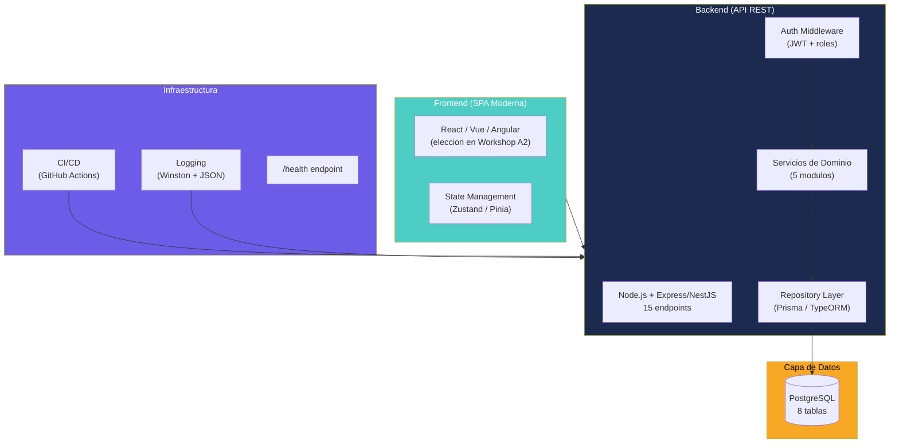
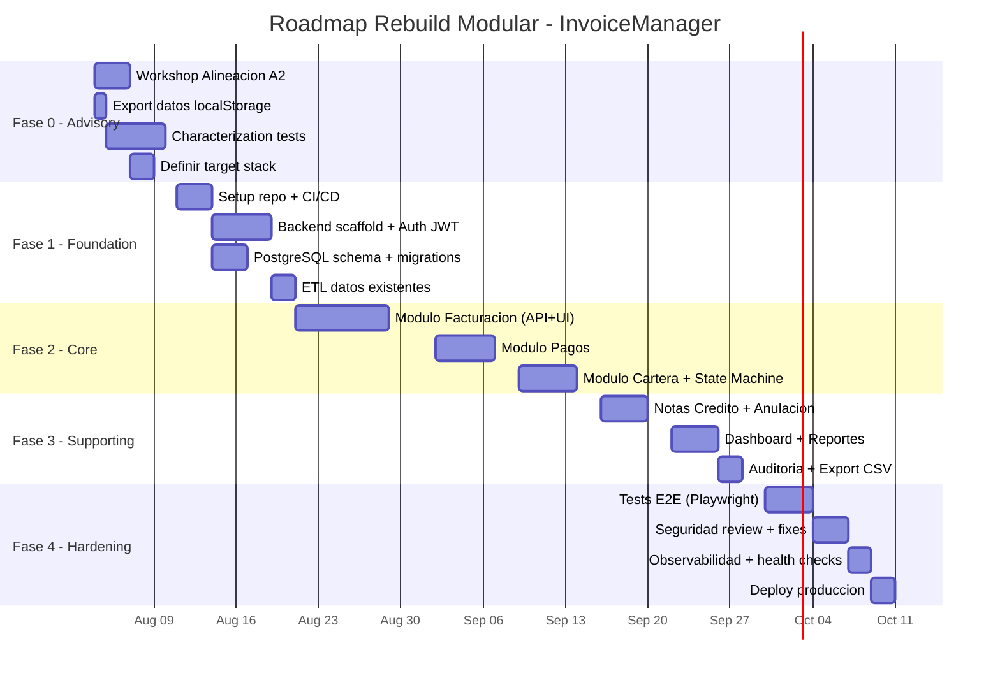
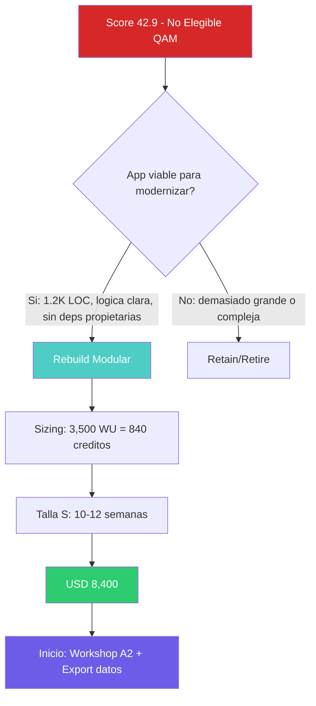

# Recomendación Técnica

---

> **Aplicación:** INV-001 — InvoiceManager  
> **Score Final:** 42.9 / 100 — No Elegible  
> **Variante Recomendada:** Rebuild Modular  
> **Créditos:** 840 | **Talla:** S | **Duración:** 10-12 semanas  
> **Fecha:** 2026-07-23

---

## 1. Veredicto y Justificación

### Recomendación: Rebuild Modular

InvoiceManager requiere una **reescritura completa** debido a la convergencia de tres factores irreconciliables con la base de código actual:

1. **Stack sin path de migración:** jQuery 1.12.4 (EOL 2016) no se "actualiza" — se reemplaza. Bootstrap 3.4.1 no se "migra" — se reescribe.
2. **Arquitectura inexistente:** Un archivo JS de 830 LOC con God Object global no tiene capas que separar ni módulos que extraer. No hay base sobre la cual refactorizar.
3. **Infraestructura ausente:** Sin backend, sin BD, sin auth, sin CI/CD — el 80% del trabajo es crear lo que no existe, no arreglar lo que existe.

### Por qué NO las otras opciones

| Opción descartada | Razón |
|---|---|
| Refactor | jQuery 1.12 no tiene refactoring path. Sin tests (0%) = refactoring ciego. |
| Replatform | No hay plataforma. No hay servidor. No hay BD. No hay qué "re-platformear". |
| Retain | 22 vulnerabilidades XSS activas + sin autenticación = negligencia técnica. |

---

## 2. Arquitectura Propuesta (TO-BE)

### ADRs propuestos (a validar en Workshop A2)

| ADR | Decisión tentativa | Alternativa | Criterio de selección |
|---|---|---|---|
| ADR-01 | Node.js + Express como backend | .NET 8, Go, Python/FastAPI | Ecosistema JavaScript unificado, velocidad de desarrollo |
| ADR-02 | PostgreSQL como BD | MySQL, SQLite, MongoDB | Relacional + open source + managed en todos los clouds |
| ADR-03 | React como frontend | Vue, Angular, Svelte | Ecosistema maduro, componentes disponibles |
| ADR-04 | JWT para autenticación | OAuth2 + provider externo | Simplicidad para app de escala pequeña |
| ADR-05 | Monolito modular (no microservicios) | Microservicios por dominio | Proporcional al tamaño (1.2K LOC), evita over-engineering |

---

## 3. Roadmap de Ejecución

---

## 4. Equipo Recomendado

| Rol | Dedicación | Responsabilidad |
|---|---|---|
| Full-Stack Developer Senior | 100% (10-12 sem) | Implementación completa backend + frontend + tests |
| Arquitecto/Tech Lead (part-time) | 20% (solo Fase 0-1) | Definir arquitectura, ADRs, setup inicial, code review |
| SME Funcional (cliente) | 10% (2h/semana) | Validar paridad funcional, responder dudas de negocio |

**Equipo mínimo viable:** 1 developer senior + soporte puntual de arquitecto.

---

## 5. Prerrequisitos del Cliente

Antes de iniciar el proyecto, el cliente debe:

| # | Prerrequisito | Deadline | Impacto si no se cumple |
|---|---|---|---|
| 1 | Confirmar sponsor con autoridad de presupuesto | Semana 0 | Proyecto no inicia |
| 2 | Identificar 1 SME funcional disponible 2h/semana | Semana 0 | Riesgo de paridad funcional |
| 3 | Validar presupuesto mínimo USD 8,400 | Semana 0 | Proyecto no inicia |
| 4 | Ejecutar export de datos de localStorage | Semana 0 | Datos perdidos = inicia vacío |
| 5 | Definir preferencia de cloud (AWS/Azure/GCP/on-prem) | Semana 1 (Workshop A2) | Se propone default (Render/Railway para S) |
| 6 | Confirmar timeline 10-12 semanas disponible | Semana 0 | Reducir alcance o postergar |

---

## 6. Métricas de Éxito

| Métrica | Baseline (AS-IS) | Target (TO-BE) | Cómo se mide |
|---|---|---|---|
| Vulnerabilidades XSS | 22 | 0 | SAST scan (ESLint security rules) |
| Cobertura tests | 0% | >60% | Jest/Vitest coverage report |
| Production Readiness | 1/10 | 7/10 | Checklist stability patterns |
| Cloud Readiness | 18/100 | 75/100 | Re-evaluación post-deploy |
| Autenticación | Inexistente | OAuth2/JWT funcional | Pen-test básico |
| Persistencia | localStorage (perdible) | PostgreSQL + backups diarios | Verificar backup restore |

---

## 7. Riesgos y Mitigaciones Finales

| Riesgo | Probabilidad | Impacto | Mitigación | Owner |
|---|---|---|---|---|
| Pérdida de datos antes de iniciar | Alta | Alto | Export INMEDIATO como prerrequisito #4 | Cliente |
| Paridad funcional incompleta | Media | Alto | Characterization tests + validación con SME cada sprint | SoftwareOne |
| Scope creep durante rebuild | Media | Medio | Contrato: 12 funcionalidades = 12 funcionalidades. Nada más. | PM SoftwareOne |
| Target stack no adecuado | Baja | Medio | Workshop A2 con pros/cons documentados antes de comprometer | Arquitecto |
| Timeline excedido | Baja | Medio | Buffer de 2 semanas incluido en estimación (10-12 sem) | PM |

---

## 8. Próximos Pasos Inmediatos

1. **Hoy:** Cliente ejecuta export de datos de localStorage (copiar JSON a archivo seguro)
2. **Semana 1:** Workshop A2 — definir target stack, confirmar sponsor, validar presupuesto
3. **Semana 1:** Identificar SME funcional disponible
4. **Semana 2:** Firma de propuesta comercial (USD 8,400 / 840 créditos / Talla S)
5. **Semana 2-3:** Inicio Fase 0 — characterization tests + setup repositorio

---

## Diagrama de Decisión

---

Análisis elaborado por SoftwareOne · 2026-07-23
