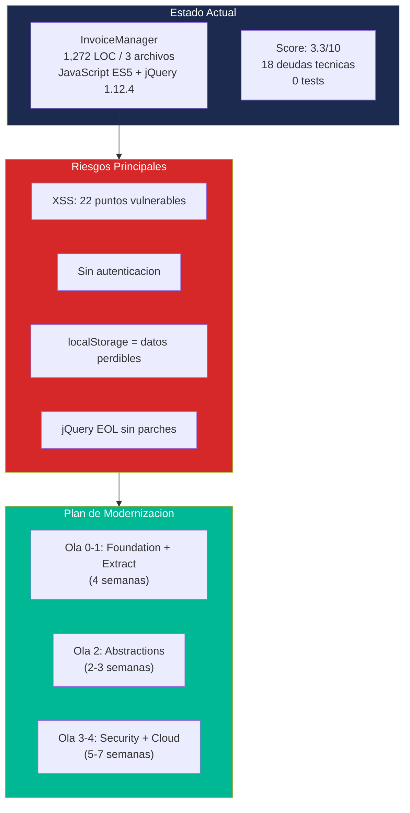

# InvoiceManager — Análisis Completo de Codebase (OneClickCBA v3.5)

## Descripción

Análisis estático exhaustivo de **InvoiceManager**, una aplicación web de facturación y cuentas por cobrar implementada como Single Page Application (SPA) en JavaScript ES5 con persistencia en localStorage del navegador.

## Estadísticas del Proyecto

| Métrica | Valor |
|---|---|
| **LOC Total** | 1,272 |
| **Archivos** | 3 (`index.html`, `app.js`, `styles.css`) |
| **Lenguaje principal** | JavaScript ES5 |
| **Framework CSS** | Bootstrap 3.4.1 (EOL) |
| **Dependencias externas** | 4 vía CDN (jQuery 1.12.4, Bootstrap, Chart.js 2.9.4, jsPDF 1.5.3) |
| **Tests** | 0 (cobertura 0%) |
| **Funciones** | 46 en `app.js` |
| **Persistencia** | localStorage (browser) |
| **Backend** | Ninguno |

## Scores Principales

| Evaluación | Score | Nivel |
|---|---|---|
| Clean Code | 4.3 / 10 | Bajo |
| Production Readiness | 1 / 10 | Dangerous |
| Scalability | 0.2 / 10 | Unscalable |
| Legacy Readiness | C | Seam-Poor |
| Cloud Readiness | 18 / 100 | Not Cloud Ready |
| Modernization Score | 3.3 / 10 | Requiere rebuild |
| Deuda Técnica | 18 items (8 Alta) | Significativa |

## Navegación

### Visión General
- [Project Overview](project-overview.md)
- [Technical Debt Report (Ejecutivo)](technical-debt-report.md)

### Arquitectura
- [System Overview](architecture/system-overview.md)
- [Components](architecture/components.md)
- [Dependencies](architecture/dependencies.md)
- [Patterns](architecture/patterns.md)

### Comportamiento
- [Business Logic](behavior/business-logic.md)
- [Workflows](behavior/workflows.md)
- [Decision Logic](behavior/decision-logic.md)
- [Error Handling](behavior/error-handling.md)

### Referencia
- [Program Structure](reference/program-structure.md)
- [Interfaces](reference/interfaces.md)
- [Data Models](reference/data-models.md)
- [API Reference](reference/api-reference.md)
- [Modules](reference/modules.md)

### Base de Datos
- [Schema Analysis (localStorage)](database/schema-analysis.md)

### Análisis de Calidad
- [Code Metrics](analysis/code-metrics.md)
- [Complexity Analysis](analysis/complexity-analysis.md)
- [Dependency Analysis](analysis/dependency-analysis.md)
- [Security Patterns](analysis/security-patterns.md)
- [Tech Debt](analysis/tech-debt.md)
- [Production Readiness](analysis/production-readiness.md)
- [Dependency Security Assessment](analysis/dependency-security-assessment.md)
- [Modernization Assessment](analysis/modernization-assessment.md)
- [Team Structure Assessment](analysis/team-structure-assessment.md)

### Deuda Técnica
- [Summary](technical-debt/summary.md)
- [Outdated Components](technical-debt/outdated-components.md)
- [Maintenance Burden](technical-debt/maintenance-burden.md)
- [Remediation Plan](technical-debt/remediation-plan.md)

### Diagramas
- [Architecture / System Context](diagrams/architecture/system-context.md)
- [Behavioral / Sequence Diagrams](diagrams/behavioral/sequence-diagrams.md)
- [Structural / Component Diagrams](diagrams/structural/component-diagrams.md)

### Migración
- [Component Order](migration/component-order.md)
- [Test Specifications](migration/test-specifications.md)
- [Validation Criteria](migration/validation-criteria.md)

### Cloud Readiness
- [Cloud Readiness Assessment](analysis/cloud-readiness-assessment.md)

### User Stories (Backlog de Modernización)
- [Backlog](user-stories/backlog.md)
- [Story Map Diagram](user-stories/_story-map-diagram.md)
- [Épica 1: Core Business](user-stories/epics/01-core-business.md)
- [Épica 2: Integraciones](user-stories/epics/02-integrations.md)
- [Épica 3: Seguridad](user-stories/epics/03-security.md)
- [Épica 4: Datos y Persistencia](user-stories/epics/04-data-persistence.md)
- [Épica 5: Infraestructura](user-stories/epics/05-infrastructure.md)
- [Épica 6: Observabilidad](user-stories/epics/06-observability.md)
- [Épica 7: Deuda Técnica](user-stories/epics/07-tech-debt.md)

### Especializado
- [Specialized Documentation](specialized/specialized-documentation.md)

### Ejecución
- [CBA Execution Report](_cba-execution-report.md)

## Diagrama Resumen

## Generado por

- **Agente:** OneClickCBA v3.5
- **Fecha:** 2026-07-23
- **Cobertura:** 100% (3/3 archivos leídos)
- **LOC fuente:** `_cloc-report.txt` (cloc v1.90)
