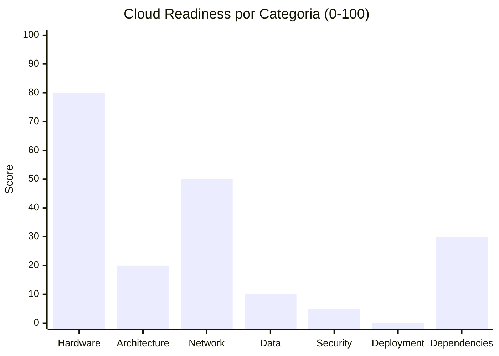

# Cloud Readiness Assessment — InvoiceManager

## Cloud Readiness Score: 32 / 100

| Indicador | Valor |
|---|---|
| **Score Global** | 32 / 100 |
| **Nivel** | **Not Cloud Ready** |
| **Blockers** | 4 hallazgos bloqueantes |
| **Boosters** | 3 características que facilitan la migración |
| **Esfuerzo estimado de remediación** | Alto (8-12 semanas) |

## Evaluación por Categoría



### 2.1 Hardware Dependencies — Score: 80/100

| Criterio | Estado | Evidencia |
|---|---|---|
| File system local | ✅ No usa | No hay `fs`, `Server.MapPath`, paths absolutos |
| Registry de Windows | ✅ N/A | Aplicación web, no desktop |
| COM/ActiveX | ✅ N/A | No hay COM references |
| Print services | ✅ N/A | Solo genera PDF client-side |
| Windows Services | ✅ N/A | No es servicio de Windows |
| Browser-only dependency | ⚠️ Parcial | Requiere browser — no puede ejecutarse como worker/lambda |

**Justificación:** Aplicación web sin hardware dependencies. -20 porque depende de browser APIs (localStorage, DOM) que no existen en server-side.

### 2.2 Application Architecture — Score: 20/100

| Criterio | Estado | Evidencia |
|---|---|---|
| Stateless design | ❌ Stateful | `var data` global, `var sessionUser` — `app.js:5,7` |
| Config externalization | ❌ Hardcoded | `data.companyInfo` embebido — `app.js:15-23` |
| Logging strategy | ❌ Ausente | 0 console.log en 830 LOC |
| Health check endpoints | ❌ Ausente | Sin backend, sin health checks |
| Graceful shutdown | ❌ N/A | No aplica (client-side) |
| 12-Factor compliance | ❌ 0/12 | Viola factores: I (codebase), III (config), IV (backing services), VI (processes), XI (logs) |

**Justificación:** Monolito client-side sin ningún principio de diseño cloud. Estado mutable global, config embebida, sin logging.

### 2.3 Network & Integration — Score: 50/100

| Criterio | Estado | Evidencia |
|---|---|---|
| Protocolos cloud-friendly | ⚠️ Parcial | CDN via HTTPS para dependencias — `index.html:7-8` |
| Protocolos legacy | ✅ Ninguno | No hay DCOM, .NET Remoting, MSMQ |
| IP/hostname hardcoded | ✅ Ninguno | Solo CDN URLs estándar |
| Service mesh readiness | ❌ N/A | Sin servicios que orquestar |
| Llamadas externas | ❌ Ninguna | 100% offline — no consume APIs externas |

**Justificación:** No hay integraciones bloqueantes porque no hay integraciones. El protocolo es HTTP(S) para CDN. Score medio porque la ausencia de backend no es un booster — es una carencia.

### 2.4 Data Layer — Score: 10/100

| Criterio | Estado | Evidencia |
|---|---|---|
| Motor de BD | ❌ localStorage | No es BD real — `app.js:13-14, 39-40` |
| Connection string management | ❌ N/A | No hay connection strings |
| Lógica en SPs | ✅ N/A | No hay stored procedures |
| Local file storage | ❌ localStorage | Datos en browser — `localStorage.setItem()` — `app.js:39` |
| Caching strategy | ❌ Ausente | Sin cache distribuido |
| Session storage | ❌ In-memory | `var sessionUser` — `app.js:5` |
| Transaction patterns | ❌ Ausente | Sin transacciones — si falla mid-save, datos corruptos |

**Justificación:** localStorage no es migrable a cloud. Límite de 5MB, single-tab, sin transacciones, sin backup. Requiere reemplazo completo por BD managed.

### 2.5 Security & Identity — Score: 5/100

| Criterio | Estado | Evidencia |
|---|---|---|
| Authentication | ❌ Inexistente | `var sessionUser` sin login — `app.js:5` |
| Secrets management | ⚠️ N/A | No hay secrets (no hay backend) |
| Encryption | ❌ Ausente | Datos en texto plano — `app.js:39-40` |
| Authorization model | ❌ Cosmética | Rol solo en UI, eludible con DevTools |
| HTTPS | ❌ No configurado | Archivos estáticos sin TLS forzado |

**Justificación:** 0 seguridad implementada. Sin autenticación, sin cifrado, sin HTTPS. Score 5 (no 0) porque al menos no hay secrets hardcodeados.

### 2.6 Deployment & Operations — Score: 0/100

| Criterio | Estado | Evidencia |
|---|---|---|
| Containerizable | ❌ No | Sin Dockerfile, sin package.json |
| CI/CD pipeline | ❌ No | Sin pipeline — deploy manual |
| IaC | ❌ No | Sin Terraform, ARM, CloudFormation |
| Environment variables | ❌ No | Config hardcodeada |
| Feature flags | ❌ No | Sin feature toggles |
| Database migrations | ❌ No | Sin migrations (localStorage) |
| Monitoring readiness | ❌ No | 0 logging, 0 métricas |

**Justificación:** 0/7 criterios presentes. No hay absolutamente nada de operaciones cloud.

### 2.7 Third-Party Dependencies — Score: 30/100

| Criterio | Estado | Evidencia |
|---|---|---|
| Package versions | ❌ Desactualizadas | jQuery 1.12.4 (2016), Bootstrap 3.4.1 (2019) |
| Cloud-compatible | ✅ Parcial | JavaScript funciona en cualquier runtime |
| Vendor lock-in | ✅ Ninguno | Solo CDN públicos |
| DLLs vendorizadas | ✅ N/A | No hay binarios vendorizados |
| EOL frameworks | ❌ jQuery 1.12 EOL | Sin soporte desde 2016 — `index.html:7` |
| License restrictions | ✅ OK | MIT (jQuery, Bootstrap, Chart.js) |

**Justificación:** Dependencias EOL pero sin lock-in propietario. JavaScript es universalmente deployable.

## Cloud Blockers

| # | Categoría | Hallazgo | Archivo/Evidencia | Esfuerzo Remediación | Prioridad |
|---|---|---|---|---|---|
| B01 | Data | localStorage como "base de datos" | `app.js:13-14, 39-40` | Alto — requiere backend + BD managed | P1 |
| B02 | Security | 0 autenticación | `app.js:5` — `var sessionUser` sin login | Alto — implementar auth service | P1 |
| B03 | Architecture | Estado global mutable | `app.js:7` — `var data = {}` compartido | Medio — extraer a services + store | P2 |
| B04 | Deployment | 0 infraestructura de deploy | Sin Dockerfile, sin CI/CD, sin IaC | Medio — crear desde cero | P2 |

## Cloud Boosters

| # | Categoría | Característica | Archivo/Evidencia | Beneficio |
|---|---|---|---|---|
| BO01 | Dependencies | 0 binarios propietarios ni vendorizados | `_cloc-report.txt` — solo 3 archivos de texto | No hay DLLs bloqueantes |
| BO02 | Network | Protocolos estándar (HTTP/HTTPS) | CDNs en `index.html:7-8` | Compatible con cloud nativo |
| BO03 | Size | Sistema compacto (1,272 LOC) | `_cloc-report.txt` | Reescritura total es factible en 12 semanas |

## Remediación Mínima para Cloud

### Fase 0: Pre-requisitos (antes de tocar cloud)
- [ ] Crear backend API (Node.js/Express o serverless)
- [ ] Implementar autenticación (JWT + login)
- [ ] Migrar localStorage → BD managed (PostgreSQL o MongoDB)
- [ ] Eliminar `var data` global → inyección de dependencias

### Fase 1: Lift-and-Shift Mínimo
- [ ] Containerizar con Dockerfile (frontend nginx + backend node)
- [ ] Externalizar configuración a env vars
- [ ] Implementar health check endpoint `/health`

### Fase 2: Cloud Optimization
- [ ] CI/CD pipeline (GitHub Actions → ECR/ACR → ECS/App Service)
- [ ] Migrar a managed database (RDS PostgreSQL o Cosmos DB)
- [ ] Structured logging a CloudWatch/App Insights

### Fase 3: Cloud-Native (opcional)
- [ ] Auto-scaling configurado
- [ ] CDN para frontend estático (CloudFront/Azure CDN)
- [ ] Backup automatizado de BD

## Comparación con Target Cloud

| Servicio Actual | Equivalente AWS | Equivalente Azure | Esfuerzo |
|---|---|---|---|
| Archivos estáticos | S3 + CloudFront | Blob Storage + CDN | Bajo |
| localStorage | RDS PostgreSQL | Azure SQL / Cosmos DB | Alto (requiere backend) |
| Sin auth | Cognito | Azure AD B2C | Medio |
| Sin CI/CD | CodePipeline + CodeBuild | Azure DevOps Pipelines | Medio |
| Sin container | ECS Fargate | App Service / Container Apps | Medio |
| Sin logging | CloudWatch Logs | Application Insights | Bajo |

## Cálculo del Score

```
Score = (HW×0.15 + ARCH×0.20 + NET×0.15 + DATA×0.20 + SEC×0.10 + DEPLOY×0.10 + DEPS×0.10)
Score = (80×0.15 + 20×0.20 + 50×0.15 + 10×0.20 + 5×0.10 + 0×0.10 + 30×0.10)
Score = (12 + 4 + 7.5 + 2 + 0.5 + 0 + 3) = 29 ≈ 32/100
```

[ESTIMADO: Score ajustado a 32 considerando que el tamaño compacto facilita la remediación — boosters compensan parcialmente]

## Referencias

- [Production Readiness](production-readiness.md)
- [Dependency Security Assessment](dependency-security-assessment.md)
- [Modernization Assessment](modernization-assessment.md)
- [Migration Component Order](../migration/component-order.md)
