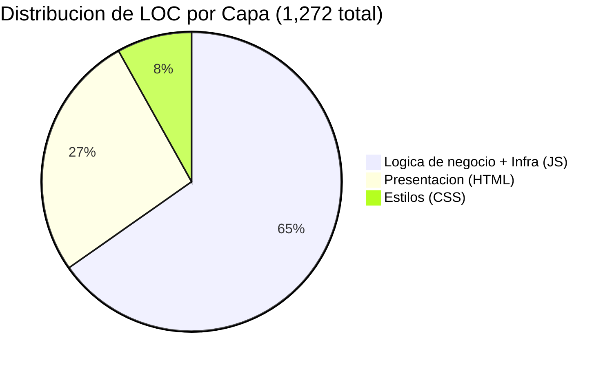
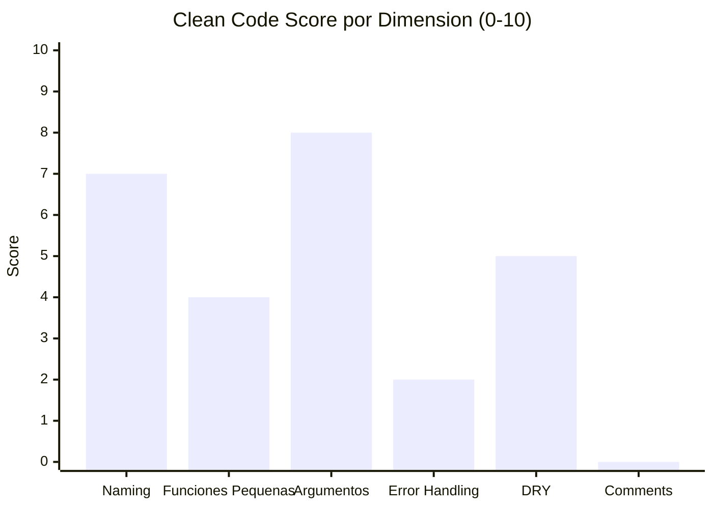

# Métricas de Código — InvoiceManager

## Líneas de Código (LOC Oficial — `_cloc-report.txt`)

| Lenguaje | Archivos | Blank | Comentarios | Código |
|---|---|---|---|---|
| JavaScript | 1 | 108 | 0 | **830** |
| HTML | 1 | 16 | 0 | **339** |
| CSS | 1 | 24 | 0 | **103** |
| **TOTAL** | **3** | **148** | **0** | **1,272** |

**Fuente:** `_cloc-report.txt` (cloc v1.90)

## Distribución por Capa

| Capa | Archivos | LOC | % del Total |
|---|---|---|---|
| Backend/Lógica (JavaScript) | `app.js` | 830 | 65.3% |
| Presentación (HTML) | `index.html` | 339 | 26.6% |
| Estilos (CSS) | `styles.css` | 103 | 8.1% |

## Métricas de Funciones (app.js)

| Métrica | Valor | Evidencia |
|---|---|---|
| Total funciones | 46 | Conteo en `app.js` |
| Funciones de negocio | 8 | `saveInvoice`, `applyPayment`, `createCreditNote`, `annulInvoice`, `sendInvoice`, `sendReminderForInvoice`, `recalcInvoiceState`, `sendBulkReminders` |
| Funciones de rendering | 9 | `renderCurrentItems`, `renderDashboard`, `renderRecentInvoices`, `renderAccounts`, `renderPaymentInvoiceCandidates`, `renderPaymentsHistory`, `refreshAudit`, `drawFinanceChart`, `previewInvoice` |
| Funciones de infraestructura | 5 | `loadData`, `saveData`, `refreshAll`, `updateStatusByBalance`, `addAudit` |
| Funciones utilitarias | 11 | `calcItem`, `calcTotals`, `money`, `round2`, `todayISO`, `addDaysISO`, `daysPastDue`, `averageDaysToPay`, `nextDueCount`, `findProduct`, `sum` |
| Funciones UI/binding | 7 | `bindUI`, `hydrateStaticData`, `resetInvoiceForm`, `addItemDraft`, `removeItemDraft`, `quickPayment`, `quickReminder` |
| Funciones helper | 6 | `clientName`, `clientEmail`, `exportAccountsCSV`, `downloadPDF`, `loadInvoiceDetail`, `findMatchingDraft` |

## Complejidad por Función (estimación estática)

| Función | LOC | Complejidad Ciclomática (aprox) | Clasificación |
|---|---|---|---|
| `applyPayment()` | ~65 | 8 | **Alta** |
| `saveInvoice()` | ~60 | 7 | **Alta** |
| `renderAccounts()` | ~35 | 5 | **Media** |
| `recalcInvoiceState()` | ~30 | 8 | **Alta** |
| `renderDashboard()` | ~45 | 3 | **Media** |
| `bindUI()` | ~40 | 1 | **Baja** (solo wiring) |
| `createCreditNote()` | ~35 | 5 | **Media** |
| `loadInvoiceDetail()` | ~40 | 3 | **Media** |
| `refreshAll()` | ~10 | 1 | **Baja** |
| `sendInvoice()` | ~25 | 5 | **Media** |

## Clean Code Score (Robert C. Martin)

| Criterio | Score (0-10) | Evidencia |
|---|---|---|
| **Naming** | 7/10 | Nombres reveladores de intención (`saveInvoice`, `applyPayment`, `createCreditNote`). Algunas abreviaciones (`inv`, `cid`, `q`, `p`) restan claridad — `app.js:485,498,569` |
| **Funciones pequeñas** | 4/10 | Solo 11 funciones < 10 LOC. `applyPayment` (65 LOC), `saveInvoice` (60 LOC) exceden el ideal de 20 LOC — `app.js:200-262, 478-543` |
| **Argumentos mínimos** | 8/10 | Mayoría de funciones tienen 0-2 argumentos. Solo `calcTotals(items, withholdingPct)` y `drawFinanceChart(4 args)` — `app.js:452,838` |
| **Error handling limpio** | 2/10 | 22 `alert()`+`return` como único mecanismo. 0 try/catch. 0 excepciones tipadas — ver `behavior/error-handling.md` |
| **DRY** | 5/10 | Patrones repetidos: validación alert+return (22 veces), rendering con string HTML (9 funciones), acceso a `data.invoices.find(...)` (~12 veces) — `app.js` passim |
| **Comments significativos** | 0/10 | **0 comentarios** en 830 LOC. Ni un solo `//` o `/* */` — `_cloc-report.txt` confirma 0 comments |

### Clean Code Score Global: **4.3 / 10**

## Métricas de Cobertura de Tests

| Métrica | Valor |
|---|---|
| Archivos de test | 0 |
| Frameworks de test detectados | Ninguno |
| Cobertura estimada | **0%** |

No existe ningún archivo de test, runner (Jest, Mocha, Jasmine, Karma) ni configuración de testing en el proyecto.

## Métricas de API Interna

| Métrica | Valor |
|---|---|
| Funciones públicas (exportadas a `window`) | 3 (`removeItemDraft`, `quickPayment`, `quickReminder`) — `app.js:830` |
| Funciones accesibles como onclick en HTML | 3 (las mismas vía `window.`) |
| Event handlers registrados en `bindUI()` | 15 — `app.js:64-140` |
| Vistas (secciones navegables) | 6 |
| Modales | 1 (`#previewModal`) |

## Hallazgos Clave

- **1,272 LOC** en 3 archivos — proyecto extremadamente compacto pero concentrado
- **65% del código** es JavaScript (lógica + rendering + infraestructura mezclados en un archivo)
- **0 comentarios** — el código no tiene ninguna documentación inline
- **0 tests** — cobertura nula, sin safety net para refactoring
- **Clean Code score 4.3/10** — error handling es el área más débil, seguido por tamaño de funciones
- **3 funciones > 50 LOC** — `applyPayment`, `saveInvoice`, `renderDashboard` son God Methods

## Referencias

- [Análisis de complejidad](complexity-analysis.md)
- [Deuda técnica](tech-debt.md)
- [Patrones arquitectónicos](../architecture/patterns.md)
- [Dependencias](../architecture/dependencies.md)
