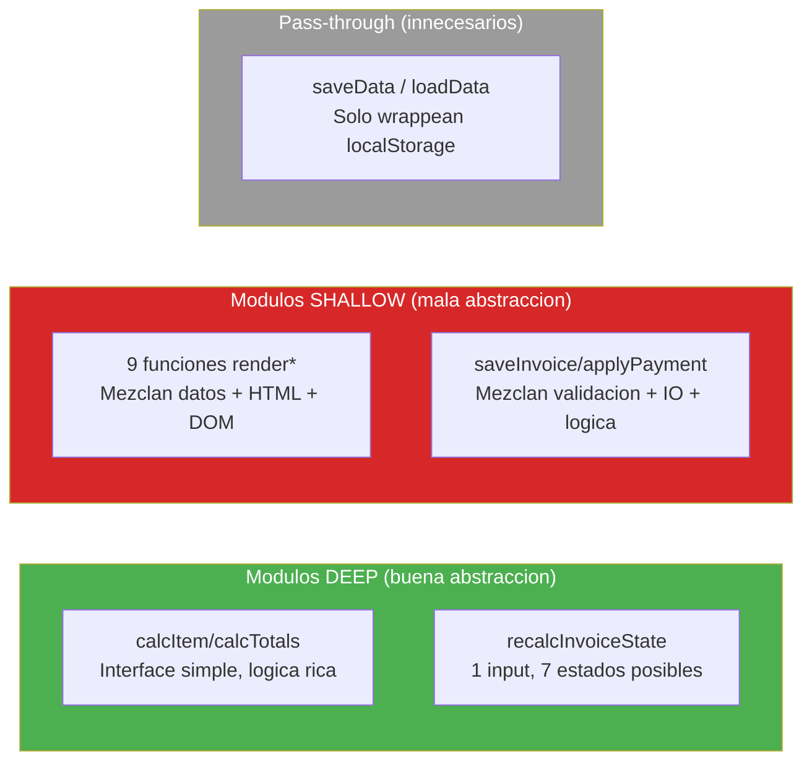

# Análisis de Complejidad — InvoiceManager

## Resumen de Complejidad

| Indicador | Valor | Umbral | Estado |
|---|---|---|---|
| God Classes / God Object | 1 (`var data`) | 0 | ❌ Excede |
| God Methods (>50 LOC) | 3 | 0 | ❌ Excede |
| Deep nesting (>4 niveles) | 0 | 0 | ✅ OK |
| High coupling (>10 imports) | N/A (1 archivo) | — | ⚠️ Todo acoplado |
| Duplicación de patrones | Alta (22× alert+return, 9× innerHTML render) | <5% | ❌ Excede |
| Variables globales mutables | 5 | 0 | ❌ Excede |

## God Methods Detectados

| Función | LOC | Responsabilidades | Evidencia |
|---|---|---|---|
| `applyPayment()` | ~65 | Validar rol + validar input + parsear DOM + validar conciliación + validar saldos + aplicar montos + crear payment + auditar + persistir + refresh | `app.js:478-543` |
| `saveInvoice()` | ~60 | Leer form + validar campos + validar condiciones + calcular totales + detectar duplicado + generar consecutivo + crear objeto + auditar + persistir + reset + refresh | `app.js:199-262` |
| `renderDashboard()` | ~45 | Calcular 8 KPIs + generar HTML KPIs + calcular top debtors + generar HTML debtors + invocar chart | `app.js:394-451` |

## Legacy Readiness Assessment (Michael Feathers)

### Clasificación por Componente

| Componente Lógico | Nivel | Justificación |
|---|---|---|
| Motor de Cálculos (`calcItem`, `calcTotals`) | **B — Seam-Rich** | Funciones puras, sin side-effects, testeables con characterization tests |
| State Machine (`recalcInvoiceState`) | **B — Seam-Rich** | Función pura que recibe un invoice y retorna string — testeable |
| Facturación (`saveInvoice`) | **D — Monolithic** | Lee DOM, muta global, persiste, renderiza — todo en una función |
| Pagos (`applyPayment`) | **D — Monolithic** | Lee DOM, valida, muta estado global, persiste, renderiza |
| Rendering (9 funciones) | **C — Seam-Poor** | Dependen de jQuery DOM + `data` global — sin interfaces |
| Infraestructura (`saveData`, `loadData`) | **C — Seam-Poor** | Acceso directo a localStorage sin abstracción |
| Utilidades (`money`, `round2`, `todayISO`) | **A — Testable** | Funciones puras sin dependencias |

### Seams Detectados

| Seam | Tipo | Evidencia | Potencial |
|---|---|---|---|
| `calcItem(i)` / `calcTotals(items, pct)` | **Object Seam** | Funciones puras con parámetros — `app.js:818-849` | Extraer a módulo `calculator.js` |
| `recalcInvoiceState(inv)` | **Object Seam** | Recibe objeto, retorna string — `app.js:363-388` | Extraer a módulo `state-machine.js` |
| `money(v)`, `round2(v)`, `todayISO()` | **Object Seam** | Funciones puras de formato — `app.js:890-910` | Extraer a módulo `utils.js` |
| `addAudit(action, detail)` | **Preprocessing Seam** | Puede interceptarse para testing — `app.js:808-814` | Inyectar logger |

### Dependency Blockers

| Blocker | Tipo | Impacto | Evidencia |
|---|---|---|---|
| `var data = loadData()` | Global mutable state | Toda función depende de este objeto | `app.js:7` |
| `$("...")` (jQuery) | Framework coupling | Imposible testear sin DOM | ~50 llamadas en `app.js` |
| `localStorage` | Infrastructure coupling | `saveData()` llamado en `refreshAll()` que se llama 10+ veces | `app.js:40, 400` |
| `window.alert()` | Environment coupling | 22 funciones dependen de `alert()` para feedback | `app.js` passim |

## Evaluación de Profundidad de Módulos (Ousterhout)

| Módulo Lógico | Interfaz | Implementación | Clasificación |
|---|---|---|---|
| Cálculos financieros | Simple: `calcItem(item)` → object | 10 LOC de aritmética | **Deep** ✅ |
| State Machine | Simple: `recalcInvoiceState(inv)` → string | 25 LOC de lógica condicional | **Deep** ✅ |
| Rendering | Compleja: cada función lee DOM + `data` global | 20-40 LOC de string concatenation | **Shallow** ❌ |
| Facturación | Compleja: lee 8 campos DOM + valida + muta + persiste | 60 LOC mezclando responsabilidades | **Shallow** ❌ |
| Persistencia | Trivial: `saveData()` | 1 LOC (`localStorage.setItem`) | **Pass-through** ❌ |

### Deep vs Shallow Assessment

## Pinch Points (Testing con mínimo esfuerzo)

| Pinch Point | Cobertura que provee | Esfuerzo de test |
|---|---|---|
| `recalcInvoiceState(inv)` | Toda la lógica de máquina de estados (7 transiciones) | **Bajo** — función pura |
| `calcItem(i)` + `calcTotals(items, pct)` | Toda la aritmética financiera (descuentos, impuestos, retención) | **Bajo** — funciones puras |
| `applyPayment()` → sección de validación | 5 reglas de negocio de pagos | **Medio** — requiere mock de DOM |
| `saveInvoice()` → sección de validación | 4 reglas de negocio de facturación | **Medio** — requiere mock de DOM |

## Characterization Tests Recomendados

| # | Test | Qué piena | Prioridad |
|---|---|---|---|
| 1 | `recalcInvoiceState` con 7 inputs diferentes | Garantiza que la SM no cambia al refactorear | P1 — Alta |
| 2 | `calcItem` con edge cases (0%, 100% descuento, 0 qty) | Protege aritmética financiera | P1 — Alta |
| 3 | `calcTotals` con retención (0%, 5%, 19%) | Protege cálculo de totales | P1 — Alta |
| 4 | `money(v)` con valores edge (0, negativo, NaN) | Protege formateo de moneda | P2 — Media |
| 5 | Validaciones en `saveInvoice` (mocking DOM) | Protege reglas de negocio | P2 — Media |

## Hallazgos Clave

- **Legacy Readiness promedio: C-D** — La mayoría del código requiere dependency-breaking antes de poder testearse
- **Solo 2 módulos lógicos son "Deep"** — cálculos y state machine son las únicas abstracciones bien diseñadas
- **60% del código es Shallow** — funciones de rendering y negocio mezclan responsabilidades
- **Pinch points identificados** — con 5 characterization tests se puede pinear ~70% de la lógica crítica
- **0 seams de inyección** — no hay DI, no hay interfaces, no hay constructores parametrizados

## Referencias

- [Métricas de código](code-metrics.md)
- [Deuda técnica](tech-debt.md)
- [Patrones](../architecture/patterns.md)
- [Error handling](../behavior/error-handling.md)
