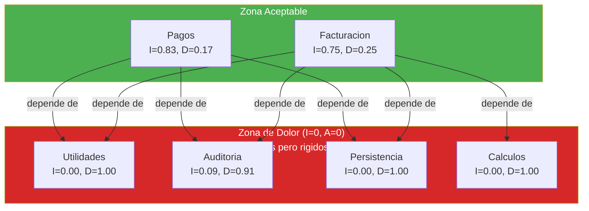

# Análisis de Dependencias Internas — InvoiceManager

## Resumen

| Métrica | Valor |
|---|---|
| Componentes lógicos (módulos implícitos) | 7 |
| Dependencia más estable (menor I) | Utilidades (I=0.00) |
| Dependencia más inestable (mayor I) | Pagos/Dashboard (I=0.83) |
| Violaciones a Dependency Rule | 5 (negocio → jQuery, negocio → localStorage) |
| Acoplamiento al God Object `data` | 46 funciones (100%) |

## Métricas de Component Principles (Clean Architecture)

| Componente Lógico | Ca (incoming) | Ce (outgoing) | I = Ce/(Ca+Ce) | A (abstractness) | D = \|A+I-1\| |
|---|---|---|---|---|---|
| Utilidades (`money`, `round2`, `todayISO`) | 15 | 0 | 0.00 | 0.0 | **1.00** (Zona de dolor) |
| Auditoría (`addAudit`) | 10 | 1 | 0.09 | 0.0 | **0.91** (Zona de dolor) |
| Persistencia (`saveData`, `loadData`) | 9 | 0 | 0.00 | 0.0 | **1.00** (Zona de dolor) |
| Motor de Cálculos (`calcItem`, `calcTotals`) | 4 | 0 | 0.00 | 0.0 | **1.00** (Zona de dolor) |
| State Machine (`recalcInvoiceState`) | 1 | 0 | 0.00 | 0.0 | **1.00** (Zona de dolor) |
| Facturación (`saveInvoice`) | 2 | 6 | 0.75 | 0.0 | **0.25** |
| Pagos (`applyPayment`) | 1 | 5 | 0.83 | 0.0 | **0.17** |

**Nota:** Abstractness (A) = 0 para todos porque no hay interfaces ni clases abstractas. Todo el código es concreto.

### Interpretación

- **Todos los módulos estables están en la Zona de Dolor** (I≈0, A=0): son concretos y estables — difíciles de cambiar porque muchos dependen de ellos pero no son abstractos (no tienen interface)
- **Los módulos inestables tienen D cercano a 0**: están correctamente ubicados (son inestables Y concretos — candidatos a refactoring)
- **Sin zona inútil** (I=1, A=1): no hay abstracciones sin implementación

## Violaciones a la Dependency Rule

| # | Violación | Capa Inner | Capa Outer | Evidencia | Impacto |
|---|---|---|---|---|---|
| 1 | Negocio depende de jQuery | Business Logic | Framework/UI | `saveInvoice()` usa `$("...")` para leer form — `app.js:200-210` | No testeable sin DOM |
| 2 | Negocio depende de localStorage | Business Logic | Infrastructure | `refreshAll()` llama `saveData()` — `app.js:401` | Side-effect en cada operación |
| 3 | Negocio depende de `alert()` | Business Logic | Environment | 22 funciones usan `alert()` — `app.js` passim | Bloquea testing headless |
| 4 | State Machine depende del objeto completo | Domain Logic | Data Structure | `recalcInvoiceState(inv)` accede a `inv.creditNotes`, `inv.paid`, etc. — `app.js:363-388` | Acoplado a estructura de invoice |
| 5 | Rendering depende de `data` global | Presentation | Global State | 9 funciones `render*()` acceden directamente a `data.invoices` — `app.js:404-540` | Sin inyección posible |

## Acoplamiento al God Object

El objeto global `data` (inicializado en `app.js:7`) es accedido directamente por:

| Función | Tipo de acceso | Campos accedidos |
|---|---|---|
| `saveInvoice()` | Read + Write | `data.invoices`, `data.numeration` |
| `applyPayment()` | Read + Write | `data.invoices`, `data.payments` |
| `createCreditNote()` | Read + Write | `data.invoices`, `data.creditNotes` |
| `annulInvoice()` | Read + Write | `data.invoices` |
| `sendReminderForInvoice()` | Read + Write | `data.reminders` |
| `renderDashboard()` | Read | `data.invoices`, `data.clients`, `data.payments` |
| `renderAccounts()` | Read | `data.invoices` |
| `renderPaymentInvoiceCandidates()` | Read | `data.invoices` |
| `renderPaymentsHistory()` | Read | `data.payments` |
| `refreshAudit()` | Read | `data.audit` |
| `hydrateStaticData()` | Read | `data.clients`, `data.products` |
| `exportAccountsCSV()` | Read | `data.invoices` |
| `sendBulkReminders()` | Read | `data.invoices` |
| `updateStatusByBalance()` | Read + Write | `data.invoices` |

**Total: 14 funciones** acceden directamente al God Object — representa el 30% de todas las funciones.

## Hallazgos Clave

- **5 violaciones de Dependency Rule** — la lógica de negocio está directamente acoplada a jQuery, localStorage y el DOM
- **100% de componentes estables en Zona de Dolor** — son concretos sin interfaces, lo que los hace rígidos
- **God Object `data`** accedido por 14 funciones directamente — imposible aislar componentes
- **Sin interfaces ni abstracciones** — Abstractness = 0 en todo el proyecto
- **Para modernizar se necesita:** introducir interfaces (Repository pattern, Event Bus) que permitan desacoplar capas

## Referencias

- [Componentes](../architecture/components.md)
- [Dependencias externas](../architecture/dependencies.md)
- [Patrones](../architecture/patterns.md)
- [Complejidad](complexity-analysis.md)
