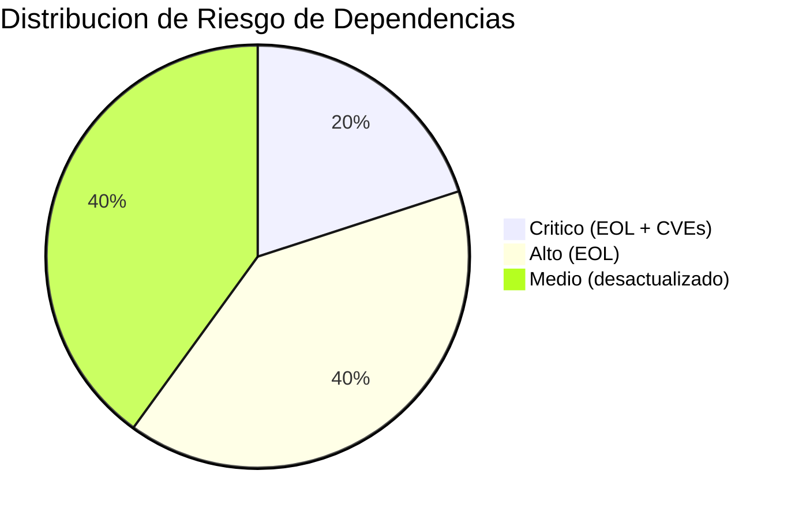

# Análisis de Dependencias y Seguridad — InvoiceManager

## Resumen Ejecutivo

| Indicador | Valor |
|---|---|
| **Total dependencias** | 5 (todas CDN, sin package manager) |
| **Dependencias con riesgo Alto+** | 4 de 5 (80%) |
| **Dependencias EOL** | 2 (jQuery 1.12.4, Bootstrap 3.4.1) |
| **Dependencias desactualizadas (>2 major)** | 3 |
| **Package manager** | Ninguno (sin npm/yarn/bower) |
| **Lock file** | No existe |
| **SRI (Subresource Integrity)** | 0 de 5 scripts tienen `integrity` |

## Inventario Completo de Dependencias

| Nombre | Versión Instalada | Última Estable | Tipo | Riesgo | Estado | Evidencia |
|---|---|---|---|---|---|---|
| jQuery | 1.12.4 | 3.7.x | Directa (CDN) | **Crítico** | EOL (2016) | `index.html:228` |
| Bootstrap CSS | 3.4.1 | 5.3.x | Directa (CDN) | **Alto** | EOL (2019) | `index.html:7` |
| Bootstrap JS | 3.4.1 | 5.3.x | Directa (CDN) | **Alto** | EOL (2019) | `index.html:229` |
| Chart.js | 2.9.4 | 4.4.x | Directa (CDN) | **Medio** | Mantenimiento | `index.html:230` |
| jsPDF (debug) | 1.5.3 | 2.5.x | Directa (CDN) | **Medio** | Desactualizado | `index.html:231` |



## Dependencias con Riesgo Crítico/Alto

### jQuery 1.12.4 — Riesgo CRÍTICO

| Campo | Detalle |
|---|---|
| **Publicada** | 2016 |
| **Estado** | End of Life — sin parches de seguridad desde 2016 |
| **Desfase** | 8 major versions (1.12 → 3.7) |
| **Vulnerabilidades conocidas** | XSS en `.html()` con input no sanitizado (versiones < 3.0) |
| **CVEs aplicables** | [PENDIENTE: verificar CVE-2020-11022, CVE-2020-11023 — afectan jQuery < 3.5.0 via `.html()` y `$.htmlPrefilter()`] |
| **Surface area** | ~50 llamadas `$(...)` en `app.js` — 100% del código depende de jQuery |
| **Expuesta a input externo** | Sí — `.html()` con datos de usuario (XSS) — `app.js:171-185, 491-520` |
| **Fix disponible** | Sí — jQuery 3.7.1 |
| **Fix es breaking change** | Parcial — requiere actualizar selectores deprecated y plugins |
| **Alternativa moderna** | Vanilla JS (querySelector, addEventListener, fetch) |

### Bootstrap 3.4.1 — Riesgo ALTO

| Campo | Detalle |
|---|---|
| **Publicada** | 2019 (último parche línea 3.x) |
| **Estado** | EOL — sin mantenimiento ni parches |
| **Desfase** | 2 major versions (3 → 5) |
| **Vulnerabilidades** | XSS en tooltips/popovers (versiones < 3.4.0 — parcheado en 3.4.1) |
| **Surface area** | 100% del HTML usa clases Bootstrap 3 (`panel`, `col-sm-*`, `nav-pills`) — `index.html` completo |
| **Fix disponible** | Bootstrap 5.3.x |
| **Fix es breaking change** | Sí — requiere migración de clases (panel→card, col-sm→responsive rewrite) y remoción de jQuery dependency |
| **Alternativa moderna** | Bootstrap 5, Tailwind CSS, o custom CSS |

### Chart.js 2.9.4 — Riesgo MEDIO

| Campo | Detalle |
|---|---|
| **Publicada** | 2020 |
| **Estado** | En mantenimiento — no EOL pero superseded |
| **Desfase** | 2 major versions |
| **Surface area** | 1 función (`drawFinanceChart`) — ~20 LOC — `app.js:452-468` |
| **Fix es breaking change** | Sí — API completamente diferente en v3+/v4+ |
| **Alternativa moderna** | Chart.js 4.x, Apache ECharts, D3.js |

### jsPDF 1.5.3 (debug build) — Riesgo MEDIO

| Campo | Detalle |
|---|---|
| **Publicada** | 2019 |
| **Estado** | Desactualizado — versión DEBUG incluida |
| **Desfase** | 1 major version |
| **Surface area** | 1 función (`downloadPDF`) — ~25 LOC — `app.js:306-336` |
| **Riesgo adicional** | Versión `debug` incluye source maps y es significativamente más grande |
| **Fix es breaking change** | Parcial — API cambió en 2.x |
| **Alternativa moderna** | jsPDF 2.x, pdf-lib, pdfmake |

## Análisis de Exposición

| Dependencia | ¿Expuesta a input externo? | ¿Runtime? | ¿Surface area grande? | Score de exposición |
|---|---|---|---|---|
| jQuery 1.12.4 | **Sí** — `.html()` con datos usuario | Sí | Sí — 100% de app.js | **CRÍTICO** |
| Bootstrap 3.4.1 | No (solo CSS/Layout) | Sí | Sí — 100% de index.html | Alto (por EOL) |
| Chart.js 2.9.4 | No (solo renderiza datos internos) | Sí | No — 1 función | Bajo |
| jsPDF 1.5.3 | No (solo genera PDF) | Sí | No — 1 función | Bajo |

## Supply Chain Risk (CDN sin SRI)

Ninguno de los 5 tags `<script>` o `<link>` tiene atributo `integrity`:

```html
<!-- index.html:7 — SIN integrity -->
<link rel="stylesheet" href="https://maxcdn.bootstrapcdn.com/bootstrap/3.4.1/css/bootstrap.min.css" />

<!-- index.html:228 — SIN integrity -->
<script src="https://code.jquery.com/jquery-1.12.4.min.js"></script>

<!-- index.html:229 — SIN integrity -->
<script src="https://maxcdn.bootstrapcdn.com/bootstrap/3.4.1/js/bootstrap.min.js"></script>

<!-- index.html:230 — SIN integrity -->
<script src="https://cdn.jsdelivr.net/npm/chart.js@2.9.4/dist/Chart.min.js"></script>

<!-- index.html:231 — SIN integrity -->
<script src="https://cdnjs.cloudflare.com/ajax/libs/jspdf/1.5.3/jspdf.debug.js"></script>
```

**Riesgo:** Si algún CDN es comprometido (hijack de DNS, cuenta comprometida), se inyecta código malicioso sin detección.

## Licencias

| Dependencia | Licencia | Riesgo Legal |
|---|---|---|
| jQuery | MIT | ✅ Sin restricciones |
| Bootstrap | MIT | ✅ Sin restricciones |
| Chart.js | MIT | ✅ Sin restricciones |
| jsPDF | MIT | ✅ Sin restricciones |

Todas las dependencias usan licencia MIT — sin riesgo de GPL ni restricciones comerciales.

## Recomendaciones Priorizadas

| # | Acción | Tipo | Esfuerzo | Impacto |
|---|---|---|---|---|
| 1 | Agregar `integrity` + `crossorigin="anonymous"` a todos los CDNs | Quick win | Bajo (1 hora) | Mitiga supply chain attack |
| 2 | Reemplazar `jspdf.debug.js` por `jspdf.min.js` | Quick win | Bajo (5 min) | Reduce tamaño y exposición |
| 3 | Migrar jQuery 1.12 → 3.7 o eliminar jQuery | Refactoring | Alto (2-4 semanas) | Elimina CVEs conocidos |
| 4 | Migrar Bootstrap 3 → 5 | Refactoring | Alto (2-3 semanas) | Elimina componentes EOL |
| 5 | Introducir npm/package.json para gestión de deps | Structural | Medio (1 semana) | Habilita auditoría automatizada |
| 6 | Configurar `npm audit` o Snyk en CI | Automation | Bajo (1 día) | Detección continua de CVEs |

## Impacto en Modernización

| Dependencia | ¿Bloquea migración? | Equivalente moderno | Esfuerzo de migración |
|---|---|---|---|
| jQuery 1.12.4 | **Sí** — framework structural | Vanilla JS / Alpine.js / htmx | Alto — reescritura de UI |
| Bootstrap 3.4.1 | **Sí** — todo el layout depende | Bootstrap 5 / Tailwind | Alto — migración de clases |
| Chart.js 2.9.4 | No — localizado a 1 función | Chart.js 4.x | Bajo — 20 LOC a adaptar |
| jsPDF 1.5.3 | No — localizado a 1 función | jsPDF 2.x / pdf-lib | Bajo — 25 LOC a adaptar |

## Hallazgos Clave

- **80% de dependencias en estado de riesgo Alto o Crítico** — postura de seguridad de dependencias inaceptable
- **jQuery 1.12.4 es la dependencia más peligrosa** — EOL desde 2016, surface area del 100%, CVEs conocidos de XSS
- **0 de 5 CDNs con SRI** — vulnerable a supply chain attacks
- **Sin package manager** — imposible automatizar auditoría de seguridad
- **Versión DEBUG de jsPDF** en producción — incluye source maps innecesarios

## Referencias

- [Dependencias arquitectónicas](../architecture/dependencies.md)
- [Seguridad](security-patterns.md)
- [Production readiness](production-readiness.md)
- [Deuda técnica](tech-debt.md)
