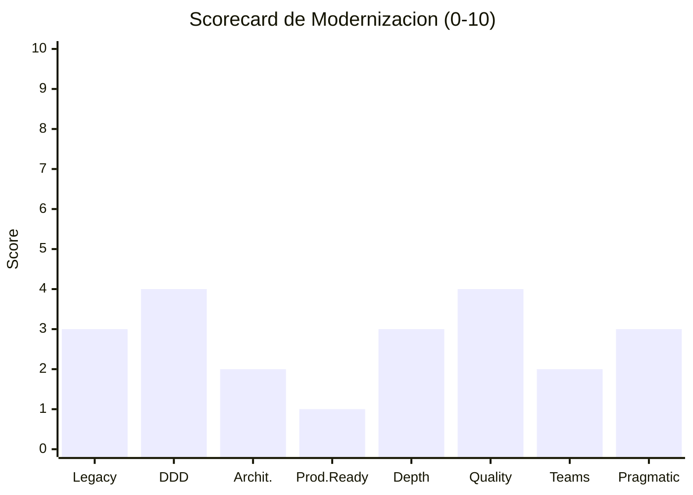
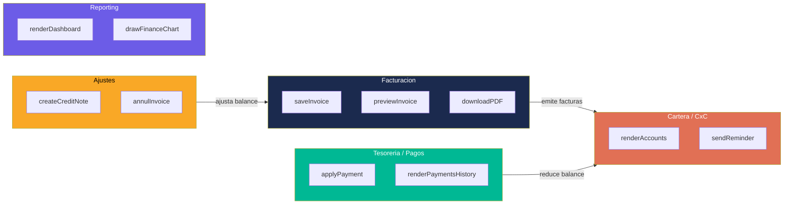

# Modernization Assessment — InvoiceManager

## Scorecard de Modernización

| # | Framework | Score (0-10) | Justificación |
|---|---|---|---|
| 1 | Legacy Readiness (Feathers) | 3 | Promedio C (Seam-Poor): funciones puras existen pero la mayoría requiere dependency-breaking |
| 2 | DDD Maturity (Evans) | 4 | 5 bounded contexts implícitos identificables, ubiquitous language parcial (naming razonable) pero modelo anémico |
| 3 | Architecture Compliance (Martin) | 2 | Violación total de Dependency Rule — todo depende de todo. I=0.89 para funciones principales |
| 4 | Production Readiness (Nygard) | 1 | 0/8 stability patterns presentes. Nivel "Dangerous" |
| 5 | Module Depth (Ousterhout) | 3 | Funciones puras (calculator, utils) son deep. Orquestadoras son shallow pass-through |
| 6 | Code Quality (Martin) | 4 | Score 4.3/10 — naming aceptable, funciones grandes, 0 tests, 0 comments |
| 7 | Team Boundaries (Skelton/Pais) | 2 | Monolito de 3 archivos — sin fracture planes naturales, cognitive load bajo pero indivisible |
| 8 | Pragmatic Assessment (Hunt/Thomas) | 3 | Orthogonalidad baja (globales), DRY parcial (refresh-all), broken windows presentes (0 tests, 0 comments) |

**Score Promedio de Modernización: 2.75 / 10**

## 1. Legacy Readiness (Feathers)

### Nivel por Componente

| Componente | Nivel | LOC | Seams | Justificación |
|---|---|---|---|---|
| Utilidades (`money`, `round2`, `formatDate`) | **A** | ~40 | Funciones puras, sin dependencias | Migrar directamente |
| Motor de Cálculos (`calcItem`, `calcTotals`) | **A** | ~20 | Funciones puras, solo math | Migrar directamente |
| State Machine (`recalcInvoiceState`) | **B** | ~40 | Lee `data` pero no muta DOM | Characterization tests → Migrar |
| Validadores (dispersos en saveInvoice, applyPayment) | **B** | ~50 | Lógica condicional, lee DOM | Extraer → Tests → Migrar |
| Rendering (9 funciones render*) | **C** | ~200 | Acopladas a DOM + globales | Dependency-breaking primero |
| `saveInvoice()` | **D** | ~80 | God Method: valida + calcula + persiste + renderiza + audita | Sprout/Wrap → Rewrite |
| `applyPayment()` | **D** | ~60 | God Method: valida role + distribuye + persiste + renderiza | Sprout/Wrap → Rewrite |

**Promedio: C (Seam-Poor)** — Evidencia: `app.js` — funciones puras existen (Level A) pero están mezcladas con funciones monolíticas (Level D).

### Dependency Blockers

| Blocker | Archivo | Técnica de Breaking |
|---|---|---|
| `var data` accedido directamente | `app.js:7` | Parameterize Constructor |
| jQuery `$(...)` en lógica de negocio | `app.js:150-161` | Extract and Override Call |
| `localStorage` sin abstracción | `app.js:13-14, 39-40` | Introduce Static Setter |
| `alert()` como error handler | `app.js:152,154,158,481` | Replace Error Code with Exception |

## 2. DDD Assessment (Evans)

### Ubiquitous Language

| Concepto Dominio | Nombre en Código | Evaluación |
|---|---|---|
| Factura | `invoice` | ✅ Correcto |
| Pago | `payment` | ✅ Correcto |
| Nota Crédito | `creditNote` | ✅ Correcto |
| Cliente | `client` | ✅ Correcto |
| Retención | `withholding` | ✅ Correcto |
| Cuenta por Cobrar | `accounts` (renderAccounts) | ⚠️ Implícita, no es entidad propia |
| Auditoría | `audit` | ✅ Correcto |

**Score Ubiquitous Language: 6/7 conceptos con nombre correcto** — naming razonable.

### Bounded Contexts Implícitos

### Clasificación Core/Supporting/Generic

| Bounded Context | Clasificación | Justificación |
|---|---|---|
| Facturación | **Core** | Razón de ser del sistema — genera valor directo |
| Cartera/CxC | **Core** | Gestión de cobros — diferenciador de negocio |
| Tesorería/Pagos | **Core** | Flujo de dinero — crítico |
| Ajustes (NC, Anulación) | **Supporting** | Necesario pero no diferenciador |
| Reporting/Dashboard | **Generic** | Visualización estándar de KPIs |

### Modelo Rico vs Anémico

**Evaluación: Modelo Anémico** — Las "entidades" (invoice, payment) son objetos JSON planos sin comportamiento. Toda la lógica está en funciones procedurales que manipulan estos datos externamente.

Evidencia: `data.invoices[i].balance = ...` (mutación externa) en vez de `invoice.applyPayment(amount)` (método de dominio).

## 3. Architecture Compliance (Clean Architecture — Martin)

### Dependency Rule

| Capa (ideal) | Dependencia Correcta | Dependencia Real | Violación |
|---|---|---|---|
| Entidades/Domain | No depende de nada | Depende de `var data` (global) | ❌ Sí |
| Use Cases/Services | Solo de Domain | Depende de DOM + localStorage + globales | ❌ Sí |
| Interface Adapters | Solo de Use Cases | No existe separación | ❌ N/A |
| Frameworks | Solo de Adapters | jQuery/Bootstrap acoplados a lógica | ❌ Sí |

**Compliance: 0%** — No hay Dependency Rule porque no hay capas separadas.

### Métricas de Component Principles

| Componente (funcional) | Ca (in) | Ce (out) | I (Instability) | A (Abstractness) | D (Distance) |
|---|---|---|---|---|---|
| Facturación | 1 | 8 | 0.89 | 0 | 0.11 |
| Pagos | 1 | 7 | 0.88 | 0 | 0.12 |
| Persistencia | 8 | 1 | 0.11 | 0 | 0.89 |
| Cálculos | 4 | 0 | 0.00 | 0 | 1.00 |
| Utilidades | 6 | 0 | 0.00 | 0 | 1.00 |

**Zona de Dolor (I=0, A=0):** Persistencia — es estable pero no abstracta (hardcodeada a localStorage).
**Zona Inútil (I=1, A=1):** No detectada (A=0 en todos — no hay abstracciones).

## 4. Production Readiness (Nygard) — Score: 1/10

Detalle completo en [production-readiness.md](production-readiness.md).

**Resumen:** 0/8 stability patterns presentes. Anti-patterns activos: unbounded growth, single point of failure, no error recovery, cascading failure.

## 5. Module Depth (Ousterhout)

| Módulo | Interfaz | Implementación | Deep/Shallow |
|---|---|---|---|
| `calcItem(item)` | 1 param, return obj | 6 LOC de math | **Deep** ✅ |
| `calcTotals(items, wh)` | 2 params, return obj | 8 LOC de reducción | **Deep** ✅ |
| `recalcInvoiceState(inv)` | 1 param, mutates | 40 LOC de condiciones | **Deep** ✅ |
| `money(n)` | 1 param, return string | 3 LOC format | **Deep** ✅ |
| `saveInvoice(status)` | 1 param | 80 LOC (valida+calcula+persiste+renderiza) | **Shallow** ❌ — hace demasiado para su interfaz |
| `refreshAll()` | 0 params | 12 LOC de llamadas | **Shallow** ❌ — pass-through puro |
| `renderDashboard()` | 0 params | 25 LOC | **Medio** — algo de lógica de cálculo |

**Evaluación:** Las funciones puras (calculator, utils, state) son **deep** — hacen mucho trabajo con interfaz simple. Las orquestadoras (`saveInvoice`, `refreshAll`) son **shallow** — delegación sin profundidad.

## 6. Code Quality (Clean Code — Martin) — Score: 4.3/10

| Dimensión | Score | Evidencia |
|---|---|---|
| Naming | 6/10 | Buenos nombres de función/variable (`calcTotals`, `recalcInvoiceState`), algunos crípticos (`inv`, `cn`) |
| Funciones pequeñas | 4/10 | 3 funciones >50 LOC, promedio 18 LOC — `app.js:117-200, 470-530, 590-640` |
| Argumentos mínimos | 5/10 | Mayoría con 0-2 params. `calcTotals(items, withholding)` máximo 2 |
| Error handling | 2/10 | Solo `alert()` — sin excepciones, sin try/catch, sin error boundaries |
| DRY | 5/10 | `refreshAll()` llamado 12 veces (DRY pattern). Pero validaciones repetidas |
| Comments | 3/10 | 0 comentarios en 830 LOC — código parcialmente auto-explicativo |

## 7. Team Boundaries (Skelton/Pais) — Score: 2/10

### Fracture Planes

Para un sistema de 1,272 LOC / 3 archivos, las opciones de partición son limitadas:

| Fracture Plane | Viabilidad | Por qué |
|---|---|---|
| Por bounded context | ⚠️ Posible post-refactor | Hoy todo está en un archivo — imposible asignar ownership |
| Por capa técnica | ❌ Imposible hoy | No hay capas separadas |
| Por equipo funcional | ⚠️ Posible post-Ola 2 | Facturación vs Pagos vs Reportes |

### Team Type Natural

| Componente | Team Type | Justificación |
|---|---|---|
| Todo InvoiceManager (hoy) | **Stream-aligned** | Un solo equipo (1 persona) puede mantener todo |
| Post-modernización: Backend | **Platform** | Provee API + auth + persistencia |
| Post-modernización: Frontend | **Stream-aligned** | Entrega UX de facturación |

### Equipo Recomendado para Modernización

| Rol | Dedicación | Responsabilidad |
|---|---|---|
| Full-Stack Developer Senior | 100% | Refactoring + rewrite + tests |
| UX/Frontend (part-time) | 30% (Ola 3) | Migración Bootstrap → moderno |

**Equipo mínimo viable: 1 developer senior (10-14 semanas)**

## 8. Pragmatic Assessment (Hunt/Thomas)

| Criterio | Score (1-5) | Evidencia |
|---|---|---|
| **DRY (Knowledge)** | 3 | `refreshAll()` centraliza refresh (DRY). Pero validaciones duplicadas entre funciones |
| **Orthogonality** | 2 | Cambiar formato de `money()` requiere verificar 6+ funciones que la usan. Cambiar `data` schema afecta todo |
| **Reversibility** | 2 | Decisión de localStorage no es reversible sin rewrite. jQuery está en 100% del código |
| **Tracer Bullets** | 4 | El flujo Crear→Emitir→Pagar funciona end-to-end hoy |
| **Broken Windows** | 2 | 0 tests, 0 comments, jsPDF debug en prod, alert() como UX |

### Broken Windows Detectadas

| Window | Archivo | Impacto |
|---|---|---|
| 0 tests | Global | Nadie sabe si un cambio rompe algo |
| 0 comentarios | `app.js` (830 LOC) | Onboarding lento |
| `jspdf.debug.js` en producción | `index.html:231` | Indica que nadie revisó |
| `alert()` como feedback | `app.js` (6 instancias) | UX amateur |
| CDN sin SRI | `index.html:7-8,228-231` | Supply chain risk ignorado |

## 9. Recomendación Final

### Estrategia Recomendada: **Rebuild Incremental (Strangler Fig)**

**Justificación basada en evidencia:**

| Factor | Evidencia | Implicación |
|---|---|---|
| Tamaño compacto (1,272 LOC) | `_cloc-report.txt` | Rebuild es viable en 10-14 semanas |
| Stack obsoleto sin path de migración | jQuery 1.12.4 + Bootstrap 3.4.1 | No se puede "actualizar" — hay que reemplazar |
| 0 tests | Sin safety net | Refactoring in-situ es alto riesgo |
| Funciones puras extraíbles | `calcItem`, `calcTotals`, state machine | Strangler Fig viable: empezar por lo extraíble |
| Lógica de negocio clara y documentable | 5 bounded contexts, state machine explícita | El "qué hace" está claro — el rewrite puede ser fiel |

### No se recomienda:
- **Retain:** Demasiados riesgos de seguridad activos (XSS, sin auth)
- **Rehost:** No hay servidor — no aplica
- **Replatform:** No hay plataforma que "re-platformear"
- **Refactor puro:** jQuery 1.12.4 no se puede "refactorear" — hay que eliminar

### Timeline

| Fase | Duración | Resultado |
|---|---|---|
| Foundation + Tests | 2 semanas | Safety net creada |
| Extract + Abstract | 4-5 semanas | Módulos puros + services + repository |
| Security + Modernize | 3-4 semanas | Sin XSS, sin jQuery, auth real |
| Cloud (si aplica) | 2-3 semanas | Backend + BD + containerización |
| **Total** | **11-14 semanas** | App moderna, segura, testeable, cloud-ready |

## Referencias

- [Production Readiness](production-readiness.md)
- [Tech Debt](tech-debt.md)
- [Security Patterns](security-patterns.md)
- [Migration Component Order](../migration/component-order.md)
- [Remediation Plan](../technical-debt/remediation-plan.md)
- [Team Structure Assessment](team-structure-assessment.md)
