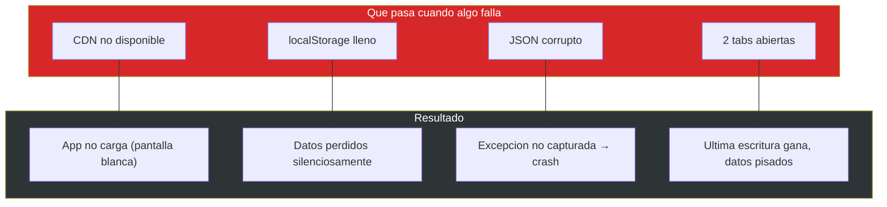

# Production Readiness — InvoiceManager

## Score Global: 1 / 10

**Nivel:** Dangerous — Sin timeouts, sin error handling robusto, single point of failure (localStorage)

**Justificación:** La aplicación carece de TODOS los stability patterns. Es un prototipo funcional, no un sistema de producción. Opera exclusivamente en el navegador del usuario sin ningún mecanismo de resiliencia, observabilidad ni recuperación.

## Stability Patterns — Presencia / Ausencia

| Pattern | Presente | Evidencia | Impacto |
|---|---|---|---|
| **Circuit Breaker** | ❌ Ausente | No hay llamadas externas ni protección contra fallas — sin fetch/XHR en `app.js` | N/A (no hay servicios externos) |
| **Timeouts** | ❌ Ausente | No hay operaciones asíncronas ni configuración de timeout | Si se agregara backend, todo bloquearía |
| **Retry con backoff** | ❌ Ausente | No hay operaciones de red que reintentar | Sin resiliencia ante fallas de IO |
| **Bulkheads** | ❌ Ausente | Todo el estado en un solo objeto `var data` — `app.js:7` | Un fallo corrompe todo |
| **Health Checks** | ❌ Ausente | No hay endpoint /health ni verificación de estado | Impossible saber si la app funciona |
| **Graceful Degradation** | ❌ Ausente | Si CDN falla → app inoperable. Si localStorage lleno → pérdida silenciosa | All-or-nothing |
| **Steady State** | ❌ Ausente | `data.audit` crece indefinidamente sin cleanup — `app.js:808-814` | localStorage se llenará eventualmente |
| **Observability** | ❌ Ausente | 0 `console.log`, 0 métricas, 0 traces — `_cloc-report.txt`: 0 comments | Debugging imposible |

## Anti-Patterns de Producción Detectados

| Anti-Pattern | Severidad | Evidencia | Impacto |
|---|---|---|---|
| **Unbounded data growth** | Alta | `data.audit`, `data.invoices`, `data.payments` crecen sin límite — nunca se purgan | localStorage se llenará (~5MB limit) → crash silencioso |
| **Single point of failure** | Alta | TODO el estado en un solo key de localStorage (`invoiceManagerData`) — `app.js:1,39` | Corrupción de esa key = pérdida total |
| **Refresh-All on every mutation** | Media | `refreshAll()` llamado después de cada operación — `app.js:390-401` | Performance degradada con más datos (O(n) renders) |
| **No error recovery** | Alta | Si `JSON.parse()` falla en `loadData()`, excepción no capturada → pantalla blanca — `app.js:13-14` | Datos corruptos = app muerta |
| **Cascading failure** | Alta | `refreshAll()` llama `saveData()` que puede fallar si localStorage está lleno → excepción propagada a todas las operaciones | Un fallo de storage mata toda la app |
| **No connection resilience** | Media | CDNs cargados en `<head>` sin fallback — `index.html:7-8, 228-231` | Sin internet = app no carga |

## Observability Assessment

| Dimensión | Estado | Evidencia |
|---|---|---|
| **Logs estructurados** | ❌ Ausente | 0 `console.log`, 0 `console.error` en 830 LOC |
| **Métricas (RED/USE)** | ❌ Ausente | Sin recolección de request rate, errores, duración |
| **Traces distribuidos** | ❌ N/A | Aplicación single-page sin backend |
| **Alertas** | ❌ Ausente | Sin sistema de alertas ni notificaciones |
| **Audit trail** | ⚠️ Básico | `addAudit()` registra acciones en localStorage — pero borrable y sin protección — `app.js:808-814` |

## Deployment Readiness

| Criterio | Estado | Evidencia |
|---|---|---|
| **Zero-downtime deploy** | ❌ N/A | Archivos estáticos — deploy es sobrescribir archivos |
| **Feature flags** | ❌ Ausente | Sin mecanismo de feature toggle |
| **Rollback strategy** | ❌ Ausente | Sin versionamiento de archivos en producción |
| **Environment config** | ❌ Ausente | Sin variables de entorno, sin config por ambiente |
| **Container-ready** | ❌ No | Sin Dockerfile, sin multi-stage build |
| **CI/CD pipeline** | ❌ Ausente | Sin Jenkinsfile, sin GitHub Actions, sin azure-pipelines.yml |

## Scalability Assessment (System Design — Alex Xu)

| Aspecto | Estado | Evidencia | Score |
|---|---|---|---|
| **Statelessness** | ❌ Stateful | Todo el estado en `var data` (memoria) + localStorage (persistencia local) — `app.js:7` | 0 |
| **Caching** | ❌ Ausente | Sin Redis, sin CDN cache, sin Service Worker | 0 |
| **Message Queues** | ❌ Ausente | Sin colas de mensajes | 0 |
| **Database Patterns** | ❌ N/A | localStorage es la "BD" — no escala | 0 |
| **Connection Pooling** | ❌ N/A | Sin conexiones a gestionar | N/A |
| **Async/Non-blocking** | ❌ Ausente | Todo síncrono — 0 `async/await`, 0 Promises, 0 callbacks async — ES5 puro | 0 |
| **Rate Limiting** | ❌ Ausente | Sin throttling — un script puede mutar datos indefinidamente | 0 |
| **CDN/Static Assets** | ⚠️ Parcial | Librerías via CDN pero sin cache headers propios ni Service Worker | 2 |
| **Horizontal Scaling** | ❌ Imposible | State local (localStorage) — no sincroniza entre instancias | 0 |
| **Batch Processing** | ❌ Ausente | `refreshAll()` procesa TODO en cada operación | 0 |

**Scalability Score: 0.2 / 10**

## Recomendaciones de Resiliencia para Modernización

| Prioridad | Recomendación | Building Block | Esfuerzo |
|---|---|---|---|
| P1 | Agregar try/catch en `loadData()` con fallback a default | Error recovery | Bajo (1 día) |
| P1 | Implementar backup pre-write en `saveData()` | Data protection | Bajo (1 día) |
| P2 | Agregar `console.error` en puntos de fallo | Observability mínima | Bajo (1 día) |
| P2 | Limitar `data.audit` a últimos 500 registros | Steady state | Bajo (1 día) |
| P3 | Agregar Service Worker para offline-first | CDN resilience | Medio (1 semana) |
| P3 | Migrar a backend con BD real | Scalability | Alto (1-2 meses) |

## Hallazgos Clave

- **Production Readiness: 1/10** — la app es un prototipo funcional, no un sistema de producción
- **Scalability: 0.2/10** — imposible escalar más allá de un usuario en un navegador
- **0 de 8 stability patterns** implementados — no hay resiliencia ante fallas
- **Sin observability** — 0 logging, 0 métricas, 0 alertas
- **Crecimiento sin límite** de datos de auditoría e invoices agotará localStorage
- **Sin CI/CD** — deploy manual, sin versionamiento, sin rollback

## Referencias

- [Métricas de código](code-metrics.md)
- [Seguridad](security-patterns.md)
- [Error handling](../behavior/error-handling.md)
- [Dependencias](../architecture/dependencies.md)
- [Patrones](../architecture/patterns.md)
