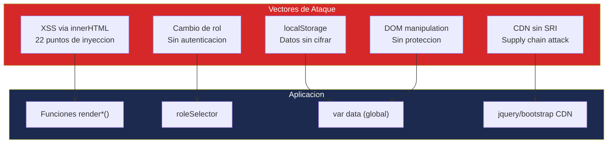

# Análisis de Seguridad — InvoiceManager

## Resumen de Postura de Seguridad

| Indicador | Estado | Impacto |
|---|---|---|
| Autenticación | ❌ **Inexistente** | Cualquiera accede |
| Autorización | ⚠️ **Cosmética** (solo UI) | Eludible con DevTools |
| Cifrado de datos | ❌ **Ausente** | Datos en texto plano en localStorage |
| Validación de inputs | ⚠️ **Parcial** (solo negocio, no seguridad) | XSS potencial |
| HTTPS / TLS | ❌ **No configurado** | Archivos estáticos sin SSL |
| Logging de seguridad | ❌ **Ausente** | Sin alertas de intrusión |
| Secrets management | ❌ **N/A** (no hay secrets) | — |

## Diagrama de Superficie de Ataque

## Evaluación OWASP Top 10 (2021)

### A01: Broken Access Control

**Estado:** ❌ Vulnerable

**Severidad:** Crítica

**Evidencia del código:**
- El "control de acceso" es un `<select>` HTML que cambia `sessionUser.role` — `app.js:75-78`
- Única validación de rol: `if (sessionUser.role === "Facturador") { alert(...); return; }` en `applyPayment()` — `app.js:479-480`
- Cualquier usuario puede cambiar su rol a "Administrador" desde DevTools: `sessionUser.role = "Administrador"`

**Hallazgos:**
- Sin autenticación (no hay login, no hay password, no hay sesión)
- Sin autorización real (el rol es una variable JavaScript mutable)
- Sin validación server-side (no hay servidor)
- Acceso directo a TODOS los datos via `localStorage` o `window.data`

**Impacto en modernización:** Requiere implementar autenticación y autorización reales antes de exponer a internet.

---

### A02: Cryptographic Failures

**Estado:** ❌ Vulnerable

**Severidad:** Alta

**Evidencia del código:**
- Datos financieros almacenados en texto plano en localStorage — `app.js:39` (`localStorage.setItem(storeKey, JSON.stringify(data))`)
- Sin cifrado de ningún campo sensible (NIT, emails, montos)
- Sin HTTPS forzado (no hay redirección ni HSTS)

**Hallazgos:**
- Información financiera completa (facturas, pagos, clientes con NIT y email) accesible sin restricción
- localStorage no tiene mecanismo de cifrado nativo
- Los CDN se cargan via HTTP en la definición (aunque maxcdn redirige a HTTPS)

---

### A03: Injection

**Estado:** ❌ Vulnerable

**Severidad:** Crítica

**Evidencia del código:**
- **22 puntos de innerHTML injection** donde datos de usuario se concatenan directamente a HTML sin sanitización:
  - `renderCurrentItems()` — `app.js:171-185`: `"<td>" + i.detail + "</td>"` (detail viene de product name, controlable)
  - `renderAccounts()` — `app.js:491-520`: `"<td>" + clientName(inv.clientId) + "</td>"` 
  - `renderDashboard()` — `app.js:432-439`: `'
' + x.v + "
"`
  - `loadInvoiceDetail()` — `app.js:663-700`: `"<li>" + cn.reason + "</li>"` (reason es input libre del usuario)
  - `previewInvoice()` — `app.js:290-300`: `"<td>" + i.detail + "</td>"`
  - `renderPaymentsHistory()` — `app.js:638-648`: todo el rendering de tabla
  
- **Vector de XSS demostrado:** Si un producto se nombra ``, se ejecuta JavaScript al renderizar

**Hallazgos:**
- Sin uso de `.text()` (jQuery safe method) — se usa `.html()` con strings concatenados
- Sin función de escape/sanitize en todo el codebase
- `$().html()` usado en: `hydrateStaticData`, `renderCurrentItems`, `renderDashboard`, `renderRecentInvoices`, `renderAccounts`, `renderPaymentInvoiceCandidates`, `renderPaymentsHistory`, `refreshAudit`, `loadInvoiceDetail`, `previewInvoice` — 10 funciones vulnerables

---

### A04: Insecure Design

**Estado:** ❌ Vulnerable

**Severidad:** Alta

**Evidencia del código:**
- Sin defensa en profundidad — una sola capa (client-side) sin backend que valide
- Sin rate limiting (un script puede generar miles de facturas)
- Sin validación de integridad de datos (cualquier tab puede pisar datos de otra)
- Sin threat modeling visible — diseño no contempla adversarios

**Hallazgos:**
- Toda la lógica de negocio es bypasseable desde la consola del navegador
- No existe separación entre lógica de presentación y lógica de negocio segura

---

### A05: Security Misconfiguration

**Estado:** ⚠️ Parcialmente vulnerable

**Severidad:** Alta

**Evidencia del código:**
- Sin security headers (no hay servidor para configurarlos)
- CDNs sin Subresource Integrity (SRI) — `index.html:7-8, 228-231`
- Versión DEBUG de jsPDF incluida (`jspdf.debug.js`) — `index.html:231`
- Sin Content-Security-Policy (CSP)
- Sin X-Frame-Options (frameable)

---

### A06: Vulnerable and Outdated Components

**Estado:** ❌ Vulnerable

**Severidad:** Alta

**Evidencia del código:**
- jQuery 1.12.4 (2016) — EOL, múltiples CVEs conocidos para versiones < 3.0 — `index.html:228`
- Bootstrap 3.4.1 (2019) — EOL, sin mantenimiento — `index.html:7-8, 229`
- Chart.js 2.9.4 (2020) — desactualizado 2 major versions — `index.html:230`
- jsPDF 1.5.3 DEBUG (2019) — versión debug en "producción" — `index.html:231`

[PENDIENTE: verificar CVEs específicos de jQuery 1.12.4 en NVD — se conocen XSS en < 3.0 por `.html()` y `$.parseHTML()`]

---

### A07: Identification and Authentication Failures

**Estado:** ❌ Vulnerable

**Severidad:** Crítica

**Evidencia del código:**
- **No existe autenticación** — la app se abre directamente sin login — `app.js:2`: `var sessionUser = { name: "usuario.demo", role: "Facturador" }`
- Sin password, sin token, sin sesión
- El "usuario" es un hardcoded object literal
- Sin logout, sin expiración, sin MFA

---

### A08: Software and Data Integrity Failures

**Estado:** ❌ Vulnerable

**Severidad:** Alta

**Evidencia del código:**
- CDNs sin Subresource Integrity (SRI): ningún `<script>` tiene atributo `integrity` — `index.html:228-231`
- Si el CDN es comprometido, se inyecta código malicioso sin detección
- localStorage modificable desde DevTools sin validación de integridad

---

### A09: Security Logging and Monitoring Failures

**Estado:** ⚠️ Parcialmente mitigado

**Severidad:** Media

**Evidencia del código:**
- Existe `addAudit()` que registra acciones de negocio — `app.js:808-814`
- Sin embargo, no registra: intentos de cambio de rol, accesos no autorizados, manipulación de datos
- Auditoría almacenada en localStorage (borrable por el mismo usuario)
- Sin alertas, sin exportación a sistema externo

---

### A10: Server-Side Request Forgery (SSRF)

**Estado:** ℹ️ No evaluable

**Severidad:** N/A

**Evidencia:** No hay llamadas HTTP/fetch/XHR en el código. La aplicación es 100% client-side sin backend.

---

## Tabla Resumen OWASP

| Categoría | Estado | Severidad | Bloqueante para Cloud |
|---|---|---|---|
| A01: Broken Access Control | ❌ | Crítica | Sí — requiere autenticación real |
| A02: Cryptographic Failures | ❌ | Alta | Sí — datos sensibles sin cifrar |
| A03: Injection | ❌ | Crítica | Sí — XSS en 10 funciones |
| A04: Insecure Design | ❌ | Alta | Sí — sin backend = sin seguridad real |
| A05: Security Misconfiguration | ⚠️ | Alta | No — se resuelve con server config |
| A06: Vulnerable Components | ❌ | Alta | No — se resuelve actualizando |
| A07: Authentication Failures | ❌ | Crítica | Sí — sin autenticación |
| A08: Integrity Failures | ❌ | Alta | No — se resuelve con SRI |
| A09: Logging Failures | ⚠️ | Media | No |
| A10: SSRF | ℹ️ | N/A | N/A |
| **Totales** | ✅: 0 | ⚠️: 2 | ❌: 7 | ℹ️: 1 |

## Modelo STRIDE

| Amenaza | Estado | Evidencia |
|---|---|---|
| **Spoofing** | ❌ Vulnerable | Sin autenticación — cualquiera es "usuario.demo" (`app.js:2`) |
| **Tampering** | ❌ Vulnerable | localStorage editable, `var data` modificable desde consola |
| **Repudiation** | ⚠️ Parcial | `addAudit()` existe pero es borrable por el usuario |
| **Information Disclosure** | ❌ Vulnerable | Datos financieros en texto plano en localStorage |
| **Denial of Service** | ⚠️ Parcial | localStorage tiene límite 5-10MB; ataques de llenado posibles |
| **Elevation of Privilege** | ❌ Vulnerable | `sessionUser.role = "Administrador"` desde consola |

## Hallazgos Clave

- **7 de 10 categorías OWASP en estado ❌ (vulnerable)** — postura de seguridad crítica
- **Sin autenticación ni autorización reales** — el "control de acceso" es puramente cosmético
- **22 puntos de XSS** via innerHTML sin sanitización — cada función render es un vector
- **Datos financieros sin cifrar** en localStorage accesible
- **4 de 5 dependencias CDN sin SRI** — vulnerables a supply chain attack
- **Versión DEBUG de jsPDF** en uso — expone source maps e información innecesaria

## Referencias

- [Error handling](../behavior/error-handling.md)
- [Dependencias](../architecture/dependencies.md)
- [Production readiness](production-readiness.md)
- [Deuda técnica](tech-debt.md)
