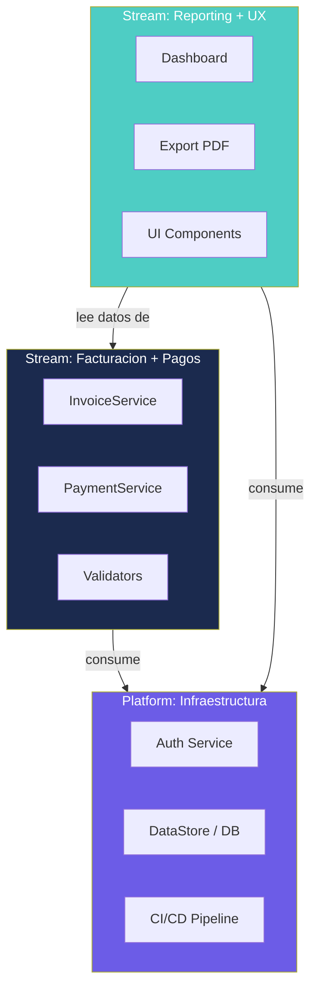
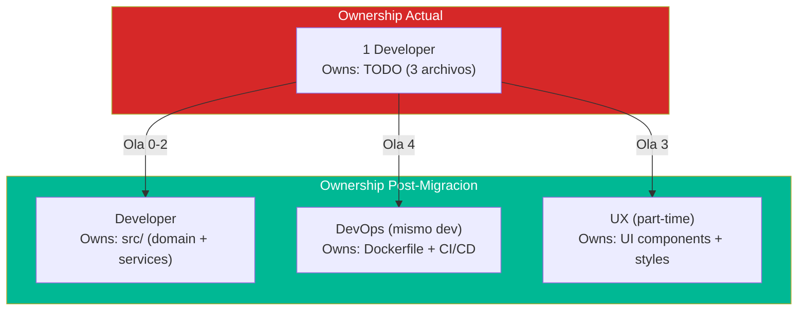

# Team Structure Assessment — InvoiceManager

## Fracture Planes

Para un sistema de 1,272 LOC en 3 archivos, las posibilidades de partición son limitadas **hoy**, pero se abren **post-modernización**.

### Estado Actual (Pre-Modernización)

| Fracture Plane | Viable Hoy | Post-Modernización |
|---|---|---|
| Por bounded context | ❌ Todo en 1 archivo | ✅ Facturación / Pagos / Reporting como servicios |
| Por capa técnica | ❌ Sin capas | ✅ Frontend / Backend / Data |
| Por criticidad | ❌ Todo es igual de crítico | ✅ Core (fact+pagos) vs Supporting (dashboard) |
| Por cadencia de cambio | ❌ Todo cambia junto | ✅ UI (frecuente) vs Reglas (estable) |

### Post-Modernización (Ola 2+)

## Cognitive Load Map

| Módulo | Responsabilidades | Cognitive Load | Complejidad |
|---|---|---|---|
| Facturación | Crear, emitir, validar, numerar, PDF, enviar | **Alto** (8 funciones, state machine, 4 validaciones) | Media-Alta |
| Pagos | Distribuir entre facturas, validar role, recalcular balance | **Medio** (3 funciones, lógica de distribución) | Media |
| Cuentas x Cobrar | Calcular aging, alertas de vencimiento, recordatorios | **Medio** (6 funciones, cálculos de fechas) | Media |
| Notas Crédito | Crear NC, recalcular balance, validar factura elegible | **Medio** (3 funciones, similar a pagos) | Media |
| Dashboard | Agregar KPIs, gráfico por mes, calcular totales | **Bajo** (3 funciones, solo reads) | Baja |
| Auditoría | Registrar evento, mostrar log | **Bajo** (2 funciones triviales) | Baja |
| Persistencia | Serializar/deserializar JSON, hidratar datos estáticos | **Bajo** (3 funciones, pero críticas) | Baja |

**Cognitive Load Total del Sistema:** Bajo-Medio (1,272 LOC es manejable por 1 persona).

## Team Types Propuestos

### Para la Fase de Modernización

| Tipo | Componente | Justificación |
|---|---|---|
| **Stream-aligned** | Todo InvoiceManager | Un solo developer puede mantener y modernizar — el sistema es suficientemente pequeño |

### Post-Modernización (si crece)

| Tipo | Componente | Cuándo activar |
|---|---|---|
| **Stream-aligned** | Facturación + Pagos (core business) | Cuando haya > 5K LOC o > 2 developers |
| **Platform** | Auth + API + DB + CI/CD | Cuando se agregue backend |
| **Enabling** | Tooling (ESLint, Prettier, test framework) | Durante Ola 0 — luego se disuelve |

## Interaction Modes

| Equipo A | Equipo B | Modo | Razón |
|---|---|---|---|
| Developer (modernización) | Product Owner | **Collaboration** | Definir prioridades de funcionalidad durante rebuild |
| Developer (modernización) | Usuarios finales | **X-as-a-Service** | Los usuarios consumen la app, no co-crean |

## Equipo Recomendado para Modernización

### Composición Mínima

| Rol | Dedicación | Perfil | Responsabilidad |
|---|---|---|---|
| **Full-Stack Developer Senior** | 100% (14 semanas) | JavaScript moderno, testing, DevOps básico | Ejecuta las 4 olas de migración |
| **Product Owner / SME** | 20% (validación) | Conoce el dominio de facturación | Valida que la funcionalidad se preserva |
| **UX/Frontend** (opcional) | 30% (Ola 3, 3-4 semanas) | CSS moderno, accesibilidad | Migración visual Bootstrap 3 → 5 |

### Justificación del Tamaño

| Factor | Implicación |
|---|---|
| 1,272 LOC | Un developer puede leer y entender TODO en 1 día |
| 3 archivos | No hay complejidad de navegación de proyecto |
| Sin backend | No requiere DevOps dedicado inicialmente |
| Sin tests | El developer escribe sus propios tests (no necesita QA dedicado) |
| Sin integraciones | No hay coordinación con otros sistemas |

**Conclusión:** Un equipo de **1 persona** es suficiente y óptimo para esta modernización. Agregar más personas genera overhead de comunicación sin beneficio (Ley de Brooks aplica a <2K LOC).

## Diagrama de Team Boundaries

## Hallazgos Clave

- **Hoy:** 1 persona puede (y debe) mantener todo — el sistema es demasiado pequeño para dividir
- **Post-Ola 2:** Los módulos extraídos permiten ownership granular si el equipo crece
- **Riesgo principal:** Bus factor = 1 (una sola persona conoce todo)
- **Mitigación:** La documentación CBA + tests characterization mitigan el bus factor

## Referencias

- [Modernization Assessment](modernization-assessment.md)
- [Components](../architecture/components.md)
- [Migration Component Order](../migration/component-order.md)
- [Complexity Analysis](complexity-analysis.md)
