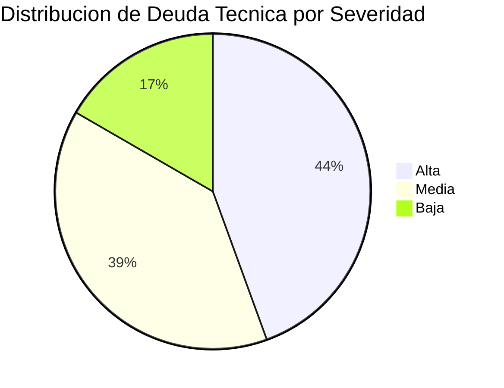

# Deuda Técnica y Legacy Assessment — InvoiceManager

## Resumen de Deuda Técnica

| Severidad | Cantidad | % del Total |
|---|---|---|
| **Alta** | 8 | 44% |
| **Media** | 7 | 39% |
| **Baja** | 3 | 17% |
| **Total** | **18** | 100% |

## Legacy Readiness Global

| Componente | Nivel Feathers | Acción Requerida |
|---|---|---|
| Utilidades (`money`, `round2`, etc.) | **A — Testable** | Migrar directamente con tests |
| Motor de Cálculos | **B — Seam-Rich** | Characterization tests → Migrar |
| State Machine | **B — Seam-Rich** | Characterization tests → Migrar |
| Rendering (9 funciones) | **C — Seam-Poor** | Dependency-breaking → Tests → Migrar |
| Facturación (`saveInvoice`) | **D — Monolithic** | Sprout/Wrap → Strangler fig → Rewrite |
| Pagos (`applyPayment`) | **D — Monolithic** | Sprout/Wrap → Strangler fig → Rewrite |
| Persistencia | **C — Seam-Poor** | Extraer Repository → Tests → Migrar |

**Legacy Readiness Promedio: C (Seam-Poor)** — La mayoría del código requiere dependency-breaking antes de poder testearse.

## Inventario de Deuda Técnica

### DT-01: jQuery 1.12.4 EOL con CVEs conocidos

**Severidad:** Alta  
**Smell:** Vulnerable and Outdated Component  
**Refactoring recomendado:** Replace Framework (Fowler: Replace Library)  
**Mecánica:**
1. Introducir `package.json` con jQuery 3.7 como dependencia
2. Reemplazar selectores deprecated (`.live()`, `.bind()`)  
3. Actualizar plugins Bootstrap (si se mantiene)
4. Verificar que `.html()` no rompe rendering
**Archivos afectados:** `index.html:228`, todo `app.js`  
**Tests necesarios:** Characterization tests de todos los flujos UI  
**Riesgo:** Alto — jQuery es structural (100% del código depende)

---

### DT-02: Bootstrap 3.4.1 EOL

**Severidad:** Alta  
**Smell:** Outdated Framework  
**Refactoring recomendado:** Migrate to Modern Framework  
**Mecánica:**
1. Reemplazar `panel` → `card`
2. Actualizar grid system (Bootstrap 5 usa flexbox nativo)
3. Eliminar dependencia de jQuery para componentes BS
4. Migrar modal API
**Archivos afectados:** `index.html` (100% del layout), `styles.css`  
**Tests necesarios:** Visual regression tests  
**Riesgo:** Alto — requiere rewrite completo del HTML

---

### DT-03: God Object `var data` — Global Mutable State

**Severidad:** Alta  
**Smell:** God Object + Global State  
**Refactoring recomendado:** Extract Class (Fowler) → Introduce Repository Pattern  
**Mecánica:**
1. Extract Class: crear `InvoiceRepository`, `PaymentRepository`, `ClientRepository`
2. Move Field: mover `data.invoices` → `InvoiceRepository.getAll()`
3. Parameterize Constructor: inyectar repositories en funciones de negocio
4. Encapsulate Collection: exponer solo métodos de query, no el array directo
**Archivos afectados:** `app.js` — 14 funciones acceden directamente  
**Tests necesarios:** Characterization tests de state transitions  
**Riesgo:** Alto — afecta toda la aplicación

---

### DT-04: innerHTML injection (XSS) — 22 puntos de inyección

**Severidad:** Alta  
**Smell:** Security Anti-pattern  
**Refactoring recomendado:** Replace innerHTML with Safe DOM Manipulation  
**Mecánica:**
1. Crear función `escapeHtml(str)` para sanitizar input
2. Reemplazar concatenación de strings con templates literales + escape
3. O migrar a framework con auto-escaping (Vue, React, Svelte)
**Archivos afectados:** `app.js` — 10 funciones `render*()`  
**Tests necesarios:** XSS payload tests  
**Riesgo:** Medio — cambio mecánico pero en muchos puntos

---

### DT-05: God Methods (>50 LOC) — 3 funciones monolíticas

**Severidad:** Alta  
**Smell:** Long Method (Fowler)  
**Refactoring recomendado:** Extract Method → Extract Class  
**Mecánica para `applyPayment()` (65 LOC):
1. Extract Method: `validatePaymentRole()` — 3 LOC
2. Extract Method: `parsePaymentForm()` — 10 LOC  
3. Extract Method: `validatePaymentAmounts(allocations, amount)` — 10 LOC
4. Extract Method: `applyAllocations(allocations)` — 15 LOC
5. Extract Class: `PaymentService.apply(payment)` — consolidar
**Archivos afectados:** `app.js:199-262, 478-543, 394-451`  
**Tests necesarios:** Characterization tests de cada flujo  
**Riesgo:** Medio — bien delimitado

---

### DT-06: 0 comentarios en 830 LOC

**Severidad:** Alta  
**Smell:** Missing Documentation  
**Refactoring recomendado:** Extract Method (usa el comentario como nombre de método)  
**Mecánica:**
1. Cada bloque lógico con `//` mental → extraer a función con nombre revelador
2. Agregar JSDoc para funciones públicas
3. Documentar reglas de negocio como `@businessRule`
**Archivos afectados:** todo `app.js`  
**Tests necesarios:** Ninguno (cambio documental)  
**Riesgo:** Bajo

---

### DT-07: 0 tests — cobertura nula

**Severidad:** Alta  
**Smell:** Missing Tests (Feathers: "Legacy Code is code without tests")  
**Refactoring recomendado:** Write Characterization Tests (Feathers)  
**Mecánica:**
1. Instalar Jest + jsdom (o Vitest)
2. Escribir characterization tests para funciones puras: `calcItem`, `calcTotals`, `recalcInvoiceState`, `money`, `daysPastDue`
3. Agregar integration tests con mock de localStorage
4. Agregar e2e con Playwright para flujos críticos
**Archivos afectados:** Nuevos archivos de test  
**Tests necesarios:** Son los tests mismos  
**Riesgo:** Bajo (solo agrega, no modifica)

---

### DT-08: Alert-as-error-handler (22 alert+return)

**Severidad:** Alta  
**Smell:** Primitive Error Handling  
**Refactoring recomendado:** Replace Error Code with Exception (Fowler) + Introduce Error Boundary  
**Mecánica:**
1. Crear clase `ValidationError` con mensaje y campo
2. Reemplazar `alert()` → `throw new ValidationError(msg, field)`
3. Agregar error boundary en el event handler (try/catch + render de error en UI)
4. Agregar `console.error()` para debugging
**Archivos afectados:** `app.js` — 22 funciones  
**Tests necesarios:** Tests de validación con assert de excepción  
**Riesgo:** Medio

---

### DT-09: Refresh-All Pattern (re-render global en cada mutación)

**Severidad:** Media  
**Smell:** Shotgun Surgery + Performance Anti-pattern  
**Refactoring recomendado:** Introduce Observer (Fowler) o Virtual DOM  
**Mecánica:**
1. Identificar qué vista necesita refresh por operación
2. Reemplazar `refreshAll()` por renders específicos
3. O migrar a framework reactivo (Vue/React/Svelte)
**Archivos afectados:** `app.js:390-401` + todos los callers (10+)  
**Tests necesarios:** Performance benchmarks  
**Riesgo:** Medio

---

### DT-10: Sin autenticación ni autorización real

**Severidad:** Media  
**Smell:** Security Anti-pattern  
**Refactoring recomendado:** Introduce Authentication + Authorization Layer  
**Mecánica:**
1. Agregar login con OAuth2/OIDC (Auth0, Keycloak, AWS Cognito)
2. Almacenar JWT en memoria (no localStorage para tokens)
3. Validar rol server-side (requiere backend)
4. Eliminar `sessionUser` hardcoded
**Archivos afectados:** `app.js:2`, `index.html:15-19`, nuevo backend  
**Tests necesarios:** Auth flow tests  
**Riesgo:** Alto — requiere backend nuevo

---

### DT-11: localStorage como base de datos

**Severidad:** Media  
**Smell:** Inappropriate Intimacy (acoplado a browser API)  
**Refactoring recomendado:** Introduce Repository (Fowler: Extract Interface + Dependency Inversion)  
**Mecánica:**
1. Crear interface `IDataStore` con `get()`, `save()`, `query()`
2. Implementar `LocalStorageStore` como adapter actual
3. Implementar `ApiStore` como adapter nuevo (apunta a REST backend)
4. Inyectar store en funciones de negocio
**Archivos afectados:** `app.js:12-15, 39-41`  
**Tests necesarios:** Tests con mock store  
**Riesgo:** Medio

---

### DT-12: CDNs sin SRI (Subresource Integrity)

**Severidad:** Media  
**Smell:** Security Misconfiguration  
**Refactoring recomendado:** Add Integrity Attributes  
**Mecánica:**
1. Generar hashes SRI con `shasum` o `srihash.org`
2. Agregar `integrity="sha384-..."` y `crossorigin="anonymous"` a cada `<script>` y `<link>`
**Archivos afectados:** `index.html:7-8, 228-231`  
**Tests necesarios:** Ninguno (cambio declarativo)  
**Riesgo:** Bajo

---

### DT-13: jsPDF versión DEBUG en producción

**Severidad:** Media  
**Smell:** Configuration Anti-pattern  
**Refactoring recomendado:** Replace with Minified Version  
**Mecánica:** Cambiar `jspdf.debug.js` → `jspdf.min.js` en la URL CDN  
**Archivos afectados:** `index.html:231`  
**Tests necesarios:** Verificar que PDF se genera correctamente  
**Riesgo:** Bajo

---

### DT-14: Duplicación del patrón validate-alert-return (22×)

**Severidad:** Media  
**Smell:** Duplicated Code (Fowler)  
**Refactoring recomendado:** Extract Method → `validate(condition, message)`  
**Mecánica:**
1. Crear función `function requireField(val, msg) { if (!val) { showError(msg); return false; } return true; }`
2. Reemplazar 22 bloques `if (!x) { alert(msg); return; }` por llamadas a `requireField()`
3. Extraer función `showError(msg)` que reemplaza `alert()`
**Archivos afectados:** `app.js` — 22 puntos  
**Tests necesarios:** Tests de validación  
**Riesgo:** Bajo

---

### DT-15: Sin package manager (npm/yarn)

**Severidad:** Media  
**Smell:** Missing Infrastructure  
**Refactoring recomendado:** Introduce Build System  
**Mecánica:**
1. `npm init`
2. Agregar dependencias: jquery, bootstrap, chart.js, jspdf
3. Configurar bundler (Vite, webpack, o esbuild)
4. Configurar `npm audit` para CVE scanning
**Archivos afectados:** Nuevos (`package.json`, `vite.config.js`)  
**Tests necesarios:** Build verification  
**Riesgo:** Medio

---

### DT-16: String-typed states sin enum

**Severidad:** Baja  
**Smell:** Primitive Obsession (Fowler)  
**Refactoring recomendado:** Replace Data Value with Object / Introduce Enum  
**Mecánica:** Crear `const InvoiceStatus = { BORRADOR: "Borrador", EMITIDA: "Emitida", ... }`  
**Archivos afectados:** `app.js` — `recalcInvoiceState`, comparaciones de status  
**Tests necesarios:** Characterization tests de state machine  
**Riesgo:** Bajo

---

### DT-17: `loadData()` sin try/catch (crash en JSON corrupto)

**Severidad:** Baja (actualmente) → Alta (si localStorage se corrompe)  
**Smell:** Missing Error Handling  
**Refactoring recomendado:** Wrap with Exception Handling  
**Mecánica:** Envolver `JSON.parse(raw)` en try/catch con fallback a default data  
**Archivos afectados:** `app.js:12-14`  
**Tests necesarios:** Test con localStorage corrupto  
**Riesgo:** Bajo

---

### DT-18: Funciones expuestas a window (`onclick` en HTML)

**Severidad:** Baja  
**Smell:** Global Namespace Pollution  
**Refactoring recomendado:** Replace with Event Delegation  
**Mecánica:** Reemplazar `onclick="removeItemDraft(id)"` con event delegation via data attributes  
**Archivos afectados:** `app.js:830`, `renderCurrentItems()`, `renderAccounts()`  
**Tests necesarios:** UI interaction tests  
**Riesgo:** Bajo

## Broken Windows (Pragmatic Programmer)

| # | Broken Window | Evidencia | Impacto Psicológico |
|---|---|---|---|
| 1 | 0 comentarios en 830 LOC | `_cloc-report.txt`: 0 comments | "Nadie documenta aquí" |
| 2 | 0 tests | Sin carpeta de tests | "Nadie testea aquí" |
| 3 | `alert()` como UX pattern | 22 instancias | "Basta con alert() y return" |
| 4 | Versión DEBUG de librería | `jspdf.debug.js` — `index.html:231` | "No importa qué se deploya" |
| 5 | Variables de 1 letra (`q`, `p`, `d`) | `app.js:485,498,569,905` | "Los nombres no importan" |

## Orthogonality Score (Pragmatic Programmer)

**Score: 1/5 (Muy bajo)**

**Justificación:** Cambiar cualquier funcionalidad afecta todo el sistema porque:
- Todas las funciones comparten `var data` (global mutable)
- `refreshAll()` re-ejecuta TODO después de cada operación
- No hay boundaries entre dominios (facturación, pagos, cartera)
- Agregar un campo a invoice requiere cambiar: model, rendering, export, detail view, PDF

## DRY Violations de Conocimiento

| Conocimiento duplicado | Dónde se repite | Instancias |
|---|---|---|
| Formato de moneda | `money()` existe pero se usa `Number().toFixed()` en otros puntos | 2 |
| Pattern alert+return | 22 funciones repiten la misma estructura | 22 |
| Acceso a invoice por ID | `data.invoices.find(x => x.id === id)` en ~8 funciones | 8 |
| Acceso a invoice por consecutive | `data.invoices.find(x => x.consecutive === cons)` en 3 funciones | 3 |
| Rendering HTML con concatenación | 9 funciones crean HTML con `"<td>" + val + "</td>"` | 9 |

## Reversibility Assessment

| Decisión | ¿Reversible? | Costo de revertir |
|---|---|---|
| Usar localStorage | Medio | Migrar datos a nueva BD requiere export/import |
| jQuery como framework | Bajo | Reescritura completa del UI |
| Single-file JavaScript | Alto | Se puede modularizar incrementalmente |
| Bootstrap 3 layout | Bajo | Reescritura del HTML |
| Sin backend | Alto | Se puede agregar backend sin tocar frontend (API layer) |

## Hallazgos Clave

- **18 items de deuda técnica** — 8 de severidad alta, concentrados en seguridad y acoplamiento
- **Legacy Readiness C/D** — solo las funciones puras (cálculos, state machine) son migrables directamente
- **Orthogonality 1/5** — un cambio en una función puede afectar al sistema completo
- **5 broken windows** — indican cultura de "no importa" que dificulta onboarding y mantenimiento
- **Refactoring strategy:** Characterization tests → Extract Pure Functions → Introduce Repository → Migrate UI Framework

## Referencias

- [Métricas de código](code-metrics.md)
- [Complejidad](complexity-analysis.md)
- [Seguridad](security-patterns.md)
- [Production readiness](production-readiness.md)
- [Dependencias](dependency-security-assessment.md)
- [Error handling](../behavior/error-handling.md)
