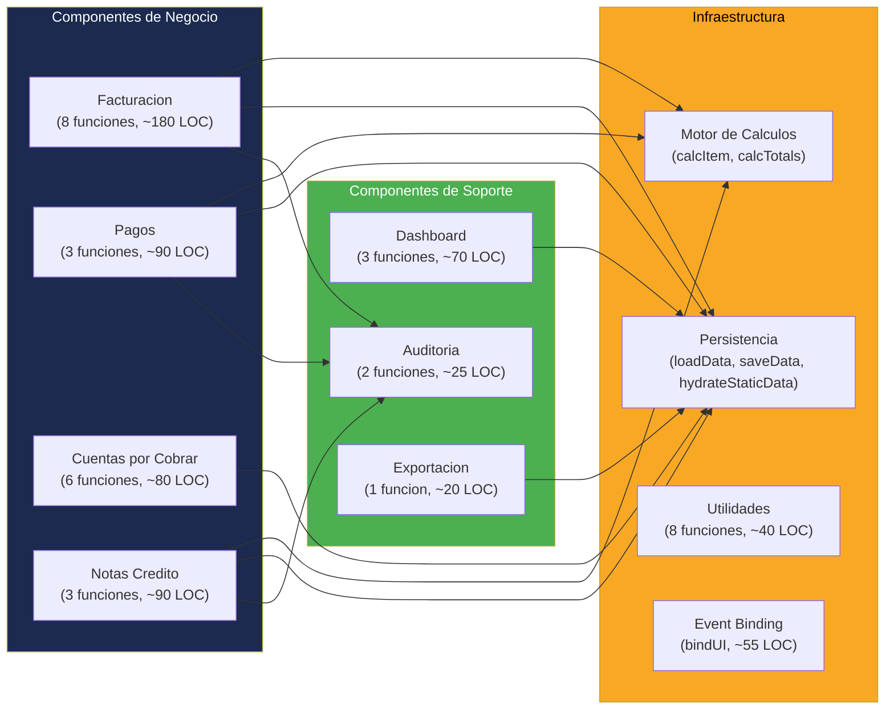

# Componentes del Sistema — InvoiceManager

## Mapa de Componentes

La aplicación no tiene componentes separados formalmente (no hay módulos, clases, ni paquetes). Sin embargo, el código se puede descomponer lógicamente en **8 dominios funcionales** que operan como componentes implícitos dentro de `app.js`.

## Detalle por Componente

### 1. Facturación (Core)

| Atributo | Valor |
|---|---|
| **Funciones** | `addItemDraft`, `renderCurrentItems`, `removeItemDraft`, `saveInvoice`, `findMatchingDraft`, `previewInvoice`, `downloadPDF`, `sendInvoice` |
| **LOC estimado** | ~180 |
| **Responsabilidades** | Crear facturas, gestionar items del borrador, emitir, generar PDF, enviar por correo |
| **Dependencias** | `calcItem`, `calcTotals`, `saveData`, `addAudit`, `clientName`, `money` |
| **Evidencia** | `app.js:115-310` |

### 2. Pagos (Core)

| Atributo | Valor |
|---|---|
| **Funciones** | `renderPaymentInvoiceCandidates`, `applyPayment`, `renderPaymentsHistory` |
| **LOC estimado** | ~90 |
| **Responsabilidades** | Listar facturas pendientes por cliente, aplicar pagos distribuidos, validar montos |
| **Dependencias** | `saveData`, `addAudit`, `clientName`, `money` |
| **Evidencia** | `app.js:457-545` |

### 3. Cuentas por Cobrar (Core)

| Atributo | Valor |
|---|---|
| **Funciones** | `recalcInvoiceState`, `renderAccounts`, `quickPayment`, `quickReminder`, `sendBulkReminders`, `sendReminderForInvoice` |
| **LOC estimado** | ~80 |
| **Responsabilidades** | Máquina de estados, visualización de cartera, filtros, acciones de cobro, recordatorios |
| **Dependencias** | `saveData`, `addAudit`, `daysPastDue`, `clientName`, `money` |
| **Evidencia** | `app.js:315-455` |

### 4. Notas Crédito y Anulación (Core)

| Atributo | Valor |
|---|---|
| **Funciones** | `loadInvoiceDetail`, `createCreditNote`, `annulInvoice` |
| **LOC estimado** | ~90 |
| **Responsabilidades** | Carga de detalle de factura, generación de notas crédito parciales/totales, anulación con motivo |
| **Dependencias** | `saveData`, `addAudit`, `calcItem`, `money`, `clientName` |
| **Evidencia** | `app.js:548-680` |

### 5. Dashboard (Soporte)

| Atributo | Valor |
|---|---|
| **Funciones** | `renderDashboard`, `drawFinanceChart`, `renderRecentInvoices` |
| **LOC estimado** | ~70 |
| **Responsabilidades** | Calcular 8 KPIs, renderizar gráfico de barras, tabla de facturas recientes, top deudores |
| **Dependencias** | `sum`, `money`, `averageDaysToPay`, `nextDueCount`, Chart.js |
| **Evidencia** | `app.js:350-475` |

### 6. Auditoría (Soporte)

| Atributo | Valor |
|---|---|
| **Funciones** | `refreshAudit`, `addAudit` |
| **LOC estimado** | ~25 |
| **Responsabilidades** | Registrar trazabilidad de acciones, renderizar historial |
| **Dependencias** | `sessionUser` (variable global) |
| **Evidencia** | `app.js:790-810` |

### 7. Motor de Cálculos (Infraestructura)

| Atributo | Valor |
|---|---|
| **Funciones** | `calcItem`, `calcTotals` |
| **LOC estimado** | ~25 |
| **Responsabilidades** | Cálculos de línea (subtotal, descuento, impuesto), totales con retención |
| **Dependencias** | `round2` |
| **Evidencia** | `app.js:815-850` |

### 8. Persistencia (Infraestructura)

| Atributo | Valor |
|---|---|
| **Funciones** | `loadData`, `saveData`, `hydrateStaticData`, `resetInvoiceForm` |
| **LOC estimado** | ~60 |
| **Responsabilidades** | Leer/escribir JSON completo a localStorage, seed data, inicializar formularios |
| **Dependencias** | `localStorage` (API del browser), `todayISO`, `addDaysISO` |
| **Evidencia** | `app.js:13-60, 855-870` |

## Acoplamiento entre Componentes

| Componente Origen | Depende de | Tipo de Acoplamiento |
|---|---|---|
| Facturación | Motor Cálculos, Persistencia, Auditoría | Directo (llama funciones globales) |
| Pagos | Persistencia, Auditoría | Directo |
| Cuentas por Cobrar | Persistencia, Auditoría | Directo |
| Notas Crédito | Persistencia, Auditoría, Motor Cálculos | Directo |
| Dashboard | Persistencia (lectura), Chart.js | Directo |
| Auditoría | Variable global `sessionUser` | Acoplamiento por dato compartido |
| Todos | Variable global `data` | **Acoplamiento máximo** — estado global mutable |

## Fan-in / Fan-out

| Función | Fan-in (quién la llama) | Fan-out (a quién llama) |
|---|---|---|
| `saveData()` | 9 funciones | 0 (solo `localStorage.setItem`) |
| `addAudit()` | 10 funciones | 0 |
| `refreshAll()` | 5 funciones + init | 8 funciones render |
| `calcItem()` | 4 funciones | `round2` implícito |
| `money()` | ~15 funciones | `toLocaleString` |
| `clientName()` | ~8 funciones | `data.clients.find` |

**Hallazgo:** `saveData()` y `addAudit()` son los puntos de mayor fan-in — cualquier refactoring debe preservar estos contratos.

## Hallazgos Clave

- **Sin encapsulamiento** — Todos los componentes acceden directamente a la variable global `data`
- **Sin interfaces definidas** — Las funciones no tienen contratos formales (no hay TypeScript, JSDoc ni validaciones de tipo)
- **Componentes implícitos** — La separación por dominio solo es convención de agrupación en el archivo, no hay boundary real
- **Mezcla de concerns** — Funciones como `renderAccounts()` mezclan filtrado de datos (negocio) con generación HTML (presentación)

## Referencias

- [Visión del sistema](system-overview.md)
- [Dependencias](dependencies.md)
- [Patrones](patterns.md)
- [Estructura del programa](../reference/program-structure.md)
