# Análisis de Dependencias — InvoiceManager

## Resumen de Dependencias

| Tipo | Cantidad | Estado |
|---|---|---|
| **Dependencias externas (CDN)** | 5 | 4 de 5 desactualizadas |
| **Dependencias internas (entre funciones)** | ~40 funciones acopladas | Alto acoplamiento |
| **Dependencias de runtime** | 0 (sin backend, sin APIs) | — |
| **Package manager** | Ninguno | Sin npm/yarn/bower |

## Dependencias Externas (CDN)

| Librería | Versión Usada | Última Estable | Desfase | Riesgo | Evidencia |
|---|---|---|---|---|---|
| jQuery | 1.12.4 | 3.7.x | **~8 major** | **Alto** — EOL, XSS CVEs | `index.html:228` |
| Bootstrap CSS/JS | 3.4.1 | 5.3.x | **2 major** | **Alto** — EOL Feb 2019 | `index.html:7-8, 229` |
| Chart.js | 2.9.4 | 4.4.x | **2 major** | **Medio** — Breaking changes | `index.html:230` |
| jsPDF | 1.5.3 | 2.5.x | **1 major** | **Medio** — API cambiada | `index.html:231` |

### Detalle por Dependencia

#### jQuery 1.12.4 (Crítica)

- **Publicada:** 2016
- **Estado:** EOL (End of Life) — no recibe parches de seguridad
- **Uso en la app:** Selectores DOM (`$(...)`), event binding (`.on()`), AJAX no usado, `.val()`, `.html()`, `.text()`, `.modal()`
- **Surface area:** 100% de `app.js` depende de jQuery — ~50 llamadas `$(...)` detectadas
- **Riesgo:** XSS en versiones < 3.0 via `$.html()` con input no sanitizado

#### Bootstrap 3.4.1 (Alta)

- **Publicada:** 2019 (último parche de la línea 3.x)
- **Estado:** EOL — sin mantenimiento
- **Uso en la app:** Grid system (12 columnas), paneles, formularios, tablas, modal, botones, navegación pills
- **Surface area:** 100% del layout HTML depende de clases Bootstrap 3 (`panel`, `col-sm-*`, `nav-pills`)
- **Riesgo:** Sin parches de seguridad, incompatible con Bootstrap 5 (requiere migración de clases)

#### Chart.js 2.9.4 (Media)

- **Publicada:** 2020
- **Uso en la app:** Un solo gráfico de barras en `drawFinanceChart()` (`app.js:452-468`)
- **Surface area:** 1 función, ~20 LOC
- **Riesgo:** API de Chart.js 3+ rompe `type: "bar"` syntax. Migración localizada.

#### jsPDF 1.5.3 (Media)

- **Publicada:** 2019 — Se usa versión **debug** (`jspdf.debug.js`)
- **Uso en la app:** 1 función `downloadPDF()` (`app.js:265-295`)
- **Surface area:** 1 función, ~25 LOC
- **Riesgo:** Versión debug incluye source maps y es más grande. API cambiada en 2.x.

## Dependencias Internas (Grafo de Acoplamiento)

```mermaid
flowchart TD
    subgraph Global["Estado Global"]
        DATA["var data (JSON)"]
        ITEMS["var currentItems"]
        SELID["var selectedInvoiceId"]
        USER["var sessionUser"]
    end

    subgraph Business["Funciones de Negocio"]
        SAVE_INV["saveInvoice()"]
        APPLY_PAY["applyPayment()"]
        CREATE_CN["createCreditNote()"]
        ANNUL["annulInvoice()"]
        SEND_REM["sendReminderForInvoice()"]
    end

    subgraph Infra["Funciones Infraestructura"]
        SAVE_DATA["saveData()"]
        ADD_AUDIT["addAudit()"]
        REFRESH["refreshAll()"]
        CALC["calcItem() / calcTotals()"]
    end

    SAVE_INV --> DATA
    SAVE_INV --> SAVE_DATA
    SAVE_INV --> ADD_AUDIT
    SAVE_INV --> CALC
    SAVE_INV --> REFRESH

    APPLY_PAY --> DATA
    APPLY_PAY --> SAVE_DATA
    APPLY_PAY --> ADD_AUDIT
    APPLY_PAY --> USER
    APPLY_PAY --> REFRESH

    CREATE_CN --> DATA
    CREATE_CN --> SELID
    CREATE_CN --> SAVE_DATA
    CREATE_CN --> ADD_AUDIT
    CREATE_CN --> REFRESH

    ANNUL --> DATA
    ANNUL --> SELID
    ANNUL --> SAVE_DATA
    ANNUL --> ADD_AUDIT
    ANNUL --> REFRESH

    SEND_REM --> DATA
    SEND_REM --> ADD_AUDIT

    style Global fill:#d62828,color:#fff
    style Business fill:#1b2a4e,color:#fff
    style Infra fill:#4caf50,color:#fff
```

## Inconsistencias de Versiones

No aplica formalmente (no hay `package.json` ni lock files). Sin embargo, existe **inconsistencia implícita** entre las versiones CDN:

| Librería | Paradigma | Era |
|---|---|---|
| jQuery 1.12.4 | Callback-based, imperative | 2012-2016 |
| Bootstrap 3.4.1 | jQuery plugins, `.panel`, sin Flexbox | 2013-2019 |
| Chart.js 2.9.4 | Canvas-based, config objects | 2019-2020 |
| jsPDF 1.5.3 | Imperative API, method chaining | 2018-2019 |

Todas las librerías pertenecen a la generación pre-ES6 / pre-módulos, lo cual es coherente con el JavaScript ES5 de la app.

## Tabla de Métricas de Estabilidad (Clean Architecture)

| Componente Lógico | Ca (incoming) | Ce (outgoing) | I = Ce/(Ca+Ce) | Clasificación |
|---|---|---|---|---|
| Motor de Cálculos | 4 | 0 | 0.00 | **Estable** — depende nadie, todos dependen de él |
| Auditoría (`addAudit`) | 10 | 1 | 0.09 | **Estable** — alta dependencia entrante |
| Persistencia (`saveData`) | 9 | 0 | 0.00 | **Estable** |
| Utilidades (`money`, `clientName`) | 15 | 0 | 0.00 | **Estable** |
| Facturación (`saveInvoice`) | 2 | 6 | 0.75 | **Inestable** — candidato a refactoring |
| Pagos (`applyPayment`) | 1 | 5 | 0.83 | **Inestable** |
| Dashboard (`renderDashboard`) | 1 | 5 | 0.83 | **Inestable** |

## Hallazgos Clave

- **4 de 5 librerías CDN son EOL o desactualizadas** — jQuery 1.12.4 es la más crítica (8 major versions detrás)
- **Sin package manager** — No hay forma automatizada de actualizar dependencias
- **Sin lock file** — Las CDNs pueden cambiar sin aviso (riesgo de supply chain)
- **Acoplamiento máximo al estado global** — Todas las funciones de negocio acceden directamente a `var data`
- **Fan-in concentrado** — `saveData()` (9 callers), `addAudit()` (10 callers), `money()` (15 callers) son puntos de alto acoplamiento

## Referencias

- [Visión del sistema](system-overview.md)
- [Componentes](components.md)
- [Patrones](patterns.md)
- [Estructura del programa](../reference/program-structure.md)
