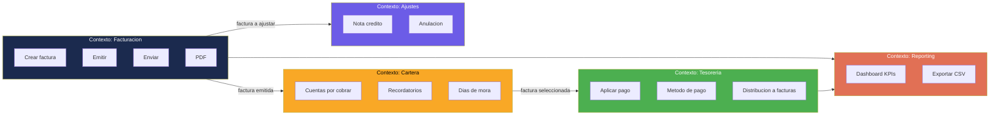

# Patrones Arquitectónicos — InvoiceManager

## Patrones Detectados

| Patrón | Presente | Evidencia |
|---|---|---|
| **SPA (Single Page Application)** | ✅ | Navegación por vistas show/hide (`$(".view").removeClass("active")`) — `app.js:64-69` |
| **Procedural / Script Pattern** | ✅ | ~40 funciones globales sin clases ni objetos — todo `app.js` |
| **State Machine** (implícita) | ✅ | `recalcInvoiceState()` — `app.js:315-355` |
| **Observer** (simplificado) | ✅ Parcial | `refreshAll()` como refresh global post-mutación — `app.js:340-350` |
| **Repository Pattern** | ❌ | Sin abstracción sobre localStorage — acceso directo |
| **MVC / MVVM** | ❌ | Sin separación model/view/controller |
| **Component-Based** | ❌ | Sin componentes reutilizables |
| **Event-Driven Architecture** | ❌ | Solo eventos DOM, sin domain events |
| **Module Pattern / IIFE** | ❌ | Todo en scope global |
| **Dependency Injection** | ❌ | Dependencias directas a globales |

## Análisis de Patrones Presentes

### 1. SPA con Navegación Manual

**Implementación:** Las 6 vistas (`<section class="view">`) se muestran/ocultan manipulando clases CSS.

```javascript
// app.js:64-69 — Navegación
$(".nav-sections a").on("click", function (e) {
    e.preventDefault();
    var view = $(this).data("view");
    $(".view").removeClass("active");
    $("#view-" + view).addClass("active");
    refreshAll();
});
```

**Evaluación:** Este patrón es funcional pero primitivo. No hay routing, no hay history API, no hay lazy loading. Toda la app se carga siempre.

### 2. State Machine Implícita

**Implementación:** `recalcInvoiceState()` calcula el estado de una factura basándose en múltiples condiciones.

| Estado | Condición |
|---|---|
| Anulada | `inv.status === "Anulada"` |
| Pagada | `inv.balance <= 0` |
| Con nota crédito | `inv.creditNotes.length > 0 && inv.balance > 0` |
| Parcialmente pagada | `inv.paid > 0 && inv.balance > 0 && !vencida` |
| Vencida | `dueDate < now && status !== "Borrador"` |
| Borrador | `inv.status === "Borrador"` |
| Emitida | Default |

**Evaluación:** Es una state machine válida pero implementada como cascada de `if/else`. Sin transiciones explícitas — el estado se recalcula en cada `refreshAll()`.

### 3. Refresh-All Pattern (Anti-pattern parcial)

**Implementación:** Después de cada mutación, `refreshAll()` recalcula TODO el estado y re-renderiza TODAS las vistas.

```javascript
// app.js:340-350
function refreshAll() {
    updateStatusByBalance();  // Recalcula todos los estados
    renderCurrentItems();     // Re-renderiza form de factura
    renderDashboard();        // Re-renderiza dashboard completo
    renderRecentInvoices();   // Re-renderiza tabla
    renderAccounts();         // Re-renderiza cuentas
    renderPaymentInvoiceCandidates();
    renderPaymentsHistory();
    refreshAudit();
    saveData();               // Persiste TODO a localStorage
}
```

**Evaluación:** Este patrón es **ineficiente** (re-renderiza todo sin necesidad) pero **correcto** (siempre muestra estado consistente). En un dataset pequeño es aceptable.

## Evaluación DDD (Domain-Driven Design)

### Bounded Contexts Implícitos



### Evaluación DDD

| Criterio DDD | Evaluación | Evidencia |
|---|---|---|
| **Ubiquitous Language** | ✅ Parcial | Nombres de funciones reflejan dominio: `createCreditNote`, `applyPayment`, `sendReminder` |
| **Bounded Contexts** | ❌ No implementado | Todo acoplado en un solo archivo — sin boundaries |
| **Aggregates** | ❌ No implementado | `invoice` podría ser aggregate root pero no se implementa como tal |
| **Domain Events** | ❌ No implementado | Solo `addAudit()` como registro post-hoc, no como evento de dominio |
| **Anti-Corruption Layer** | N/A | No hay sistemas externos |
| **Anemic Domain Model** | ✅ Presente | Los datos son DTOs puros (`invoice`, `payment`) — la lógica vive en funciones separadas |

**Clasificación DDD:** **Big Ball of Mud** — Sin fronteras, todo acoplado, pero con naming razonable de dominio.

## Evaluación Clean Architecture (Dependency Rule)

| Criterio | Evaluación | Evidencia |
|---|---|---|
| **Dirección de dependencias** | ❌ Violada | Las funciones de negocio (`saveInvoice`) dependen directamente de jQuery (`$(...)`) y localStorage |
| **Framework independence** | ❌ Violada | Eliminar jQuery requiere reescribir ~80% del código |
| **Testabilidad sin infraestructura** | ❌ Violada | Imposible testear `applyPayment()` sin DOM + localStorage |
| **Boundaries claras** | ❌ Violada | Sin interfaces, sin capas, sin inyección de dependencias |

**Clasificación:** El código viola completamente la Dependency Rule. La lógica de negocio está entrelazada con la infraestructura (DOM, localStorage).

## Anti-Patrones Detectados

| Anti-Patrón | Severidad | Evidencia | Impacto |
|---|---|---|---|
| **God Object** | Alta | `var data` — contiene TODAS las entidades | Acoplamiento total |
| **Global State** | Alta | 5 variables globales mutables | Impredecibilidad, no testeable |
| **Feature Envy** | Media | `renderAccounts()` accede internals de invoice | Acoplamiento entre dominios |
| **Shotgun Surgery** | Media | Agregar un campo a invoice requiere cambiar ~5 funciones | Mantenibilidad baja |
| **String-typed states** | Media | Estados como strings (`"Emitida"`, `"Vencida"`) sin enum | Typos silenciosos |
| **innerHTML injection** | Alta | Concatenación de strings para HTML sin sanitización | XSS potencial |

## Hallazgos Clave

- **Modelo anémico** — Las entidades (invoice, payment) son objetos planos sin comportamiento; toda la lógica está en funciones procedurales
- **Sin boundaries** — Los 5 bounded contexts identificados comparten el mismo `data` object sin aislamiento
- **State machine correcta pero frágil** — `recalcInvoiceState()` es la única función con lógica de dominio rica, pero está hardcoded sin extensibilidad
- **Potencial de microservicios:** Si se modernizara, los 5 bounded contexts son candidatos naturales a servicios independientes

## Referencias

- [Visión del sistema](system-overview.md)
- [Componentes](components.md)
- [Dependencias](dependencies.md)
- [Lógica de negocio](../behavior/business-logic.md)
