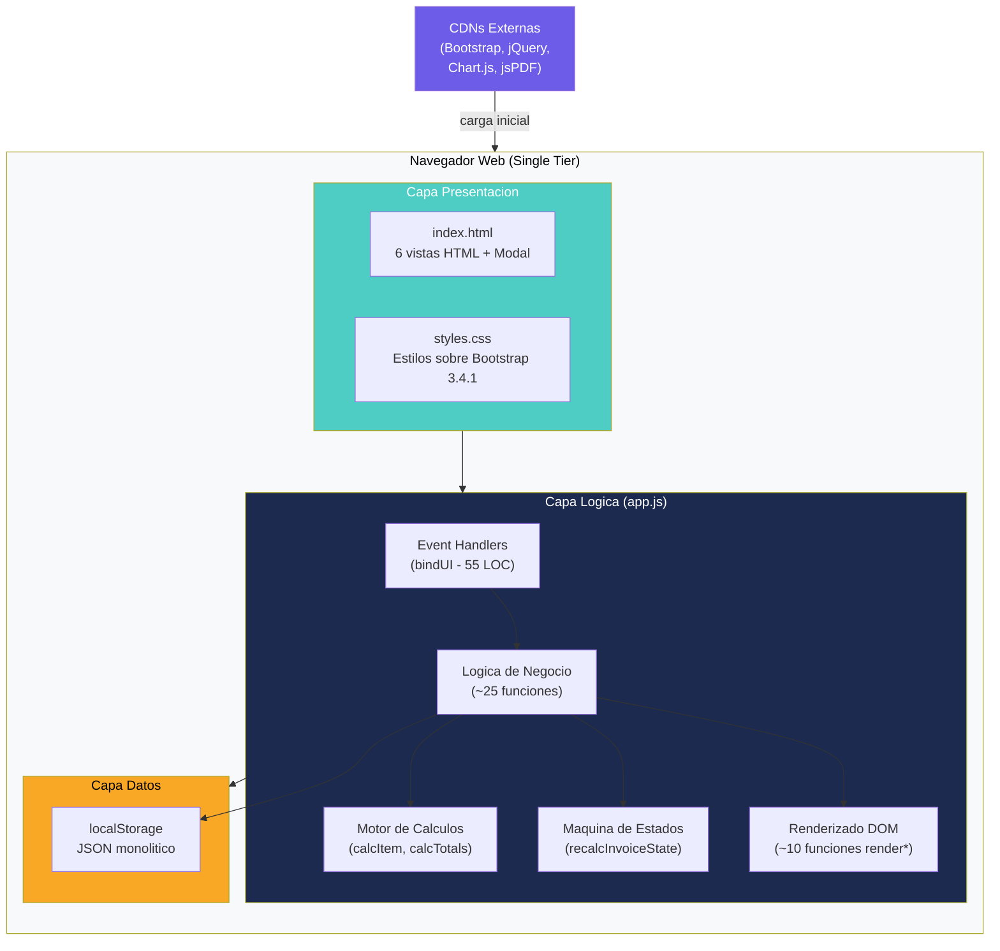
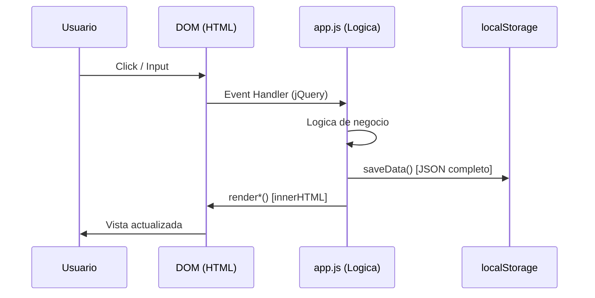

# Visión General de la Arquitectura — InvoiceManager

## Arquitectura de Alto Nivel

InvoiceManager implementa una **arquitectura de cliente grueso (fat-client)** monolítica en un solo tier: todo el sistema — presentación, lógica de negocio y persistencia — reside en el navegador del usuario. No existe separación entre frontend y backend.

### Modelo Arquitectónico

| Aspecto | Implementación |
|---|---|
| **Estilo** | Monolito cliente-side (Single Page Application sin backend) |
| **Tiers** | 1 tier (solo browser) |
| **Rendering** | Client-side rendering via jQuery DOM manipulation |
| **Estado** | JSON monolítico en localStorage |
| **Comunicación** | Ninguna (sin red, sin APIs) |
| **Despliegue** | Archivos estáticos (`index.html` + `app.js` + `styles.css`) |

### Diagrama de Arquitectura

## Modelo de Despliegue

La aplicación **no requiere servidor**. Se ejecuta abriendo `index.html` directamente en el navegador (protocolo `file://`) o sirviéndola desde cualquier servidor HTTP estático.

| Componente | Ubicación | Protocolo |
|---|---|---|
| Aplicación (3 archivos) | Filesystem del usuario o HTTP server estático | `file://` o `http://` |
| Librerías externas | CDNs públicas (maxcdn, cdnjs, code.jquery) | `https://` |
| Datos | localStorage del navegador | — (API del browser) |

### Limitaciones del Modelo de Despliegue

- Sin HTTPS obligatorio (datos financieros en texto plano)
- Sin backups (datos perdidos al limpiar browser)
- Sin sincronización multi-dispositivo
- Sin concurrencia (una sola sesión a la vez)
- Sin failover ni redundancia

## Decisiones Arquitectónicas Detectadas

| # | Decisión | Evidencia | Consecuencia |
|---|---|---|---|
| AD-01 | Toda la lógica en un solo archivo JS | `app.js` (830 LOC, ~40 funciones globales) | Sin modularidad, alto acoplamiento |
| AD-02 | Persistencia en localStorage | `loadData()` / `saveData()` en `app.js:13-35` | Límite 5-10MB, sin queries, sin transacciones |
| AD-03 | UI via jQuery DOM manipulation | `bindUI()` + funciones `render*()` | Sin componentes, sin data-binding reactivo |
| AD-04 | Librerías vía CDN sin bundling | `index.html:7-231` (5 CDN links) | Requiere internet, sin control de versiones local |
| AD-05 | Sin autenticación | `sessionUser` hardcoded en `app.js:2` | Cualquier usuario accede a todo |
| AD-06 | Seed data embebido en código | `loadData()` retorna JSON hardcoded (`app.js:18-33`) | Datos maestros no editables sin modificar código |
| AD-07 | Estado global mutable | Variables `data`, `currentItems`, `selectedInvoiceId` | Race conditions potenciales, difícil de testear |

## Patrones de Comunicación

No existen patrones de comunicación de red. La comunicación es exclusivamente:

1. **Usuario → DOM** — Clicks, inputs (capturados por jQuery event handlers)
2. **DOM → Funciones JS** — `bindUI()` enruta eventos a funciones de negocio
3. **Funciones JS → localStorage** — `saveData()` persiste estado completo
4. **Funciones JS → DOM** — Funciones `render*()` reconstruyen HTML

## Hallazgos Clave

- **Violación masiva de Separation of Concerns** — Un solo archivo mezcla presentación, negocio y datos
- **Sin capas definidas** — No hay boundary entre la lógica de negocio y el rendering
- **God Object: `data`** — Todo el estado del sistema vive en una variable global mutable
- **Acoplamiento total** — Cambiar cualquier parte puede afectar a cualquier otra

## Referencias

- [Componentes](components.md)
- [Dependencias](dependencies.md)
- [Patrones](patterns.md)
- [Visión general del proyecto](../project-overview.md)
