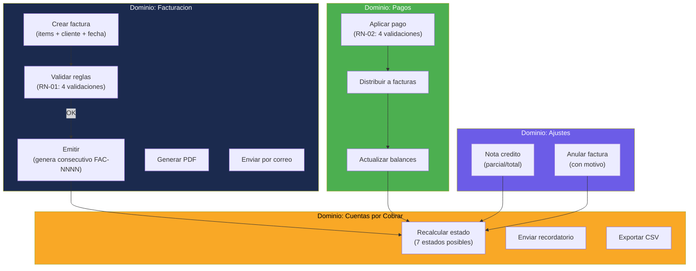

# Lógica de Negocio — InvoiceManager

## Dominios Funcionales Detectados

La aplicación implementa lógica de negocio para **5 dominios** de facturación y cuentas por cobrar:

| # | Dominio | Funciones Principales | Complejidad |
|---|---|---|---|
| 1 | Facturación | `saveInvoice()` | Media-Alta |
| 2 | Gestión de Pagos | `applyPayment()` | Alta |
| 3 | Cuentas por Cobrar | `recalcInvoiceState()`, `sendReminderForInvoice()` | Media |
| 4 | Notas Crédito / Anulación | `createCreditNote()`, `annulInvoice()` | Media |
| 5 | Cálculos Financieros | `calcItem()`, `calcTotals()` | Baja (pura aritmética) |

## Reglas de Negocio Documentadas

### RN-01: Creación de Factura

| Regla | Implementación | Evidencia |
|---|---|---|
| Cliente y fecha son obligatorios | `if (!clientId || !invoiceDate)` | `app.js:208-209` |
| Toda factura debe tener al menos un ítem | `if (currentItems.length === 0)` | `app.js:213-214` |
| Factura a crédito requiere fecha de vencimiento | `if (cond === "Credito" && !dueDate)` | `app.js:218-219` |
| No se puede emitir una factura duplicada ya emitida | `if (existingByDraftHash && existingByDraftHash.emittedAt)` | `app.js:228-229` |
| Al emitir, se genera consecutivo automático (`FAC-NNNN`) | `consecutive = data.numeration.prefix + data.numeration.next` | `app.js:231-232` |
| Se crea registro de auditoría al guardar | `addAudit("Factura " + status, ...)` | `app.js:261` |

### RN-02: Aplicación de Pagos

| Regla | Implementación | Evidencia |
|---|---|---|
| El rol "Facturador" NO puede registrar pagos | `if (sessionUser.role === "Facturador")` | `app.js:479-480` |
| El valor del pago debe ser > 0 | `if (amount <= 0 || allocations.length === 0)` | `app.js:499-500` |
| La suma aplicada debe coincidir con el valor del pago | `if (totalApplied !== amount)` | `app.js:504-505` |
| Los pagos no pueden superar el saldo de la factura | `if (allocations[i].amount > inv.balance)` | `app.js:513-514` |
| Al aplicar pago, se actualiza `paid` y `balance` de la factura | `inv.paid += a.amount; inv.balance -= a.amount` | `app.js:521-523` |

### RN-03: Máquina de Estados de Factura

| Regla | Condición | Estado Resultante |
|---|---|---|
| Factura anulada es estado terminal | `status === "Anulada"` | Anulada |
| Saldo ≤ 0 = pagada | `balance <= 0` | Pagada |
| Con nota crédito y saldo > 0 | `creditNotes.length > 0 && balance > 0` | Con nota crédito |
| Pago parcial sin vencer | `paid > 0 && balance > 0 && !vencida` | Parcialmente pagada |
| Pago parcial vencida | `paid > 0 && balance > 0 && vencida` | Vencida |
| Sin pago y vencida | `dueDate < hoy && status !== "Borrador"` | Vencida |
| Recién creada sin emitir | `status === "Borrador"` | Borrador |
| Default (emitida sin pago) | ninguna condición anterior | Emitida |

### RN-04: Notas Crédito

| Regla | Implementación | Evidencia |
|---|---|---|
| Primero debe cargarse una factura | `if (!selectedInvoiceId)` | `app.js:710` |
| Motivo y monto son obligatorios | `if (!reason || amount <= 0)` | `app.js:722-723` |
| La NC no puede superar el saldo | `if (amount > inv.balance)` | `app.js:727-728` |
| Si tipo es "Total", el monto = saldo completo | `if (type === "Total") amount = inv.balance` | `app.js:732` |
| La NC reduce el balance de la factura | `inv.balance -= amount` | `app.js:745` |

### RN-05: Anulación de Factura

| Regla | Implementación | Evidencia |
|---|---|---|
| Toda anulación requiere motivo | `if (!reason)` | `app.js:760` |
| El estado cambia a "Anulada" (terminal) | `inv.status = "Anulada"` | `app.js:763` |
| Se registra el motivo en la factura | `inv.canceledReason = reason` | `app.js:764` |

### RN-06: Cálculos Financieros

| Regla | Fórmula | Evidencia |
|---|---|---|
| Bruto por línea | `qty × price` | `app.js:818` |
| Descuento por línea | `bruto × (discountPct / 100)` | `app.js:819` |
| Subtotal neto | `bruto - descuento` | `app.js:820` |
| Impuesto por línea | `neto × (taxPct / 100)` | `app.js:821` |
| Total por línea | `neto + impuesto` | `app.js:822` |
| Total factura antes de retención | `Σ subtotales + Σ impuestos` | `app.js:832-833` |
| Retención en la fuente | `totalAntes × (withholdingPct / 100)` | `app.js:835` |
| Total factura final | `totalAntes - retención` | `app.js:836` |

## Diagrama de Lógica de Negocio

## Validaciones Implementadas

| ID | Función | Tipo | Mensaje | Evidencia |
|---|---|---|---|---|
| V-01 | `addItemDraft` | Existencia | "Producto no encontrado" | `app.js:123` |
| V-02 | `addItemDraft` | Rango | "Cantidad invalida" | `app.js:130` |
| V-03 | `saveInvoice` | Requerido | "Cliente y fecha son obligatorios" | `app.js:209` |
| V-04 | `saveInvoice` | Negocio | "Toda factura debe tener al menos un detalle" | `app.js:214` |
| V-05 | `saveInvoice` | Condicional | "Una factura a credito requiere vencimiento" | `app.js:219` |
| V-06 | `saveInvoice` | Duplicidad | "La emision ya fue ejecutada para esta factura" | `app.js:229` |
| V-07 | `applyPayment` | Autorización | "El rol Facturador no registra pagos" | `app.js:480` |
| V-08 | `applyPayment` | Requerido | "Ingrese valor y facturas a aplicar" | `app.js:500` |
| V-09 | `applyPayment` | Conciliación | "La suma aplicada debe coincidir con el valor del pago" | `app.js:505` |
| V-10 | `applyPayment` | Negocio | "Los pagos no pueden superar el saldo" | `app.js:514` |
| V-11 | `createCreditNote` | Requerido | "Primero cargue una factura" | `app.js:711` |
| V-12 | `createCreditNote` | Requerido | "Motivo y monto son obligatorios" | `app.js:723` |
| V-13 | `createCreditNote` | Negocio | "La nota credito no puede superar el saldo" | `app.js:728` |
| V-14 | `annulInvoice` | Requerido | "Toda anulacion requiere motivo" | `app.js:761` |
| V-15 | `sendInvoice` | Estado | "No se puede enviar factura en borrador" | `app.js:303` |

## Hallazgos Clave

- **15 reglas de validación** — Todas implementadas como `if/alert/return` sin framework de validación
- **Máquina de 7 estados** — Correcta pero implícita (se recalcula siempre, no hay transiciones explícitas)
- **1 regla de autorización** — Solo el rol "Facturador" tiene restricción (no puede registrar pagos)
- **Sin validación de tipos** — Los valores numéricos se castean con `Number()` sin verificar NaN
- **Sin validación de formato** — NIT, email, fechas no se validan con regex/patterns
- **0% cobertura de tests** — Ninguna regla de negocio tiene test asociado

## Referencias

- [Workflows](workflows.md)
- [Lógica de decisión](decision-logic.md)
- [Manejo de errores](error-handling.md)
- [Patrones](../architecture/patterns.md)
