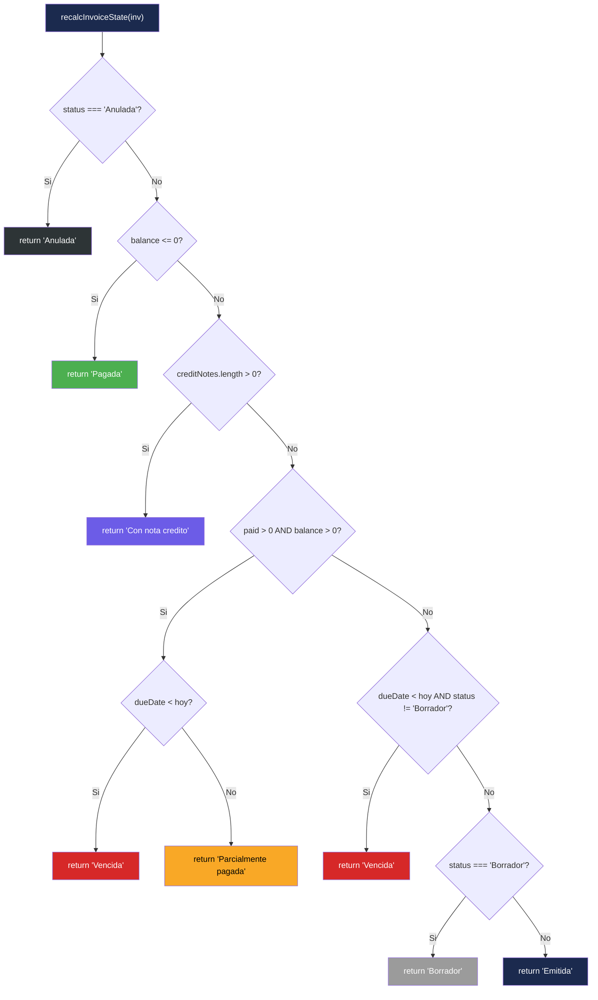
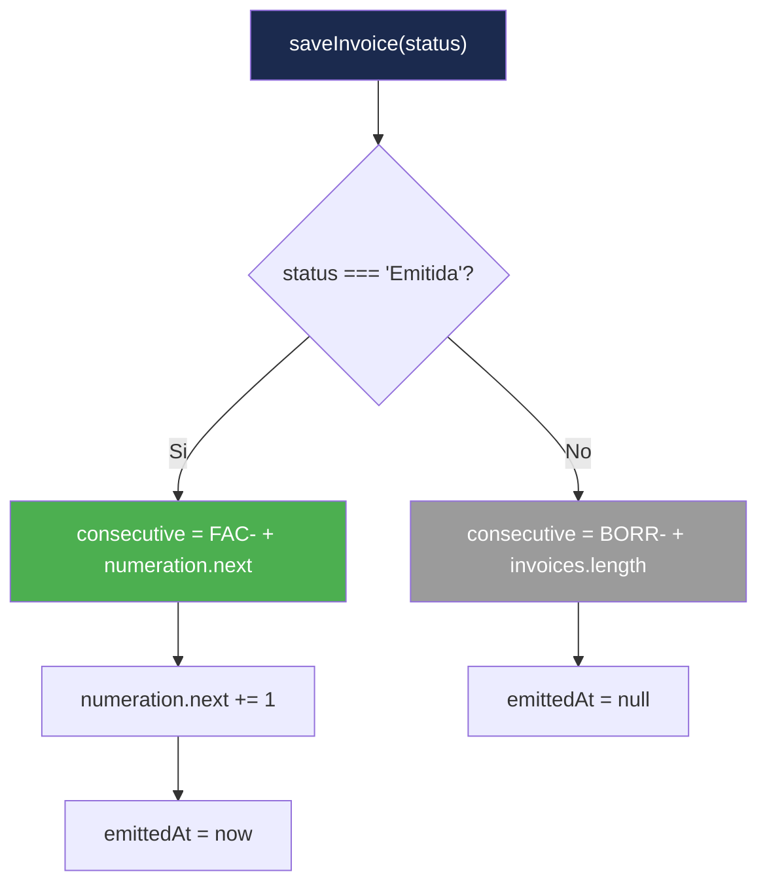

# Lógica de Decisión — InvoiceManager

## Puntos de Decisión en el Sistema

### Decisión 1: Determinación del Estado de Factura

**Función:** `recalcInvoiceState(inv)` — `app.js:315-355`
**Complejidad:** Alta (7 caminos, 6 condiciones anidadas)

**Observaciones:**
- La prioridad de evaluación determina el estado final (la primera condición que se cumple gana)
- "Anulada" es prioritaria sobre todo (incluso sobre balance=0)
- Una factura con notas crédito Y pagos parciales mostrará "Con nota crédito" (no "Parcialmente pagada")
- El estado "Vencida" se evalúa en dos puntos distintos del flujo

### Decisión 2: Permitir o Denegar Pago

**Función:** `applyPayment()` — `app.js:476-540`
**Criterios de decisión:**

| # | Condición | Resultado si falla |
|---|---|---|
| 1 | `sessionUser.role !== "Facturador"` | Rechaza: "El rol Facturador no registra pagos" |
| 2 | `amount > 0 && allocations.length > 0` | Rechaza: "Ingrese valor y facturas a aplicar" |
| 3 | `totalApplied === amount` | Rechaza: "La suma aplicada debe coincidir con el valor" |
| 4 | Para cada factura: `allocation.amount <= inv.balance` | Rechaza: "Los pagos no pueden superar el saldo" |

**Orden de evaluación:** Secuencial (first-fail). Si la condición 1 falla, no se evalúan las demás.

### Decisión 3: Tipo de Consecutivo al Guardar Factura

**Función:** `saveInvoice(targetStatus)` — `app.js:172-270`

### Decisión 4: Monto de Nota Crédito

**Función:** `createCreditNote()` — `app.js:710-750`

| Condición | Resultado |
|---|---|
| `type === "Total"` | `amount = inv.balance` (ignora monto ingresado) |
| `type === "Parcial"` | Usa monto ingresado por usuario |
| `amount > inv.balance` | Rechaza operación |

### Decisión 5: Cálculo de Días de Mora

**Función:** `daysPastDue(inv)` — `app.js:880-886`

| Condición | Resultado |
|---|---|
| No hay `dueDate` | 0 días |
| Estado "Pagada" o "Anulada" | 0 días |
| `dueDate` en el futuro | 0 días |
| `dueDate` en el pasado | `Math.floor((hoy - dueDate) / (1 día))` |

### Decisión 6: Envío de Factura por Correo

**Función:** `sendInvoice()` — `app.js:292-320`

| Paso | Condición | Resultado |
|---|---|---|
| 1 | No se ingresa consecutivo | Cancela (return) |
| 2 | Factura no encontrada | alert + return |
| 3 | Estado "Borrador" | alert "No se puede enviar en borrador" |
| 4 | No hay email | Pide email via `prompt()` |
| 5 | No se ingresa email | alert "Correo requerido" |
| 6 | Todo OK | Registra envío en `sentHistory` |

## Tabla de Condiciones de Autorización

| Acción | Facturador | Analista | Administrador | Evidencia |
|---|---|---|---|---|
| Crear factura | ✅ | ✅ | ✅ | Sin restricción en `saveInvoice()` |
| Emitir factura | ✅ | ✅ | ✅ | Sin restricción |
| Aplicar pago | ❌ | ✅ | ✅ | `app.js:479-480` |
| Nota crédito | ✅ | ✅ | ✅ | Sin restricción |
| Anular factura | ✅ | ✅ | ✅ | Sin restricción |
| Enviar recordatorio | ✅ | ✅ | ✅ | Sin restricción |
| Exportar CSV | ✅ | ✅ | ✅ | Sin restricción |

**Hallazgo:** Solo existe 1 regla de autorización en todo el sistema (rol Facturador no puede registrar pagos). Todas las demás operaciones están abiertas a cualquier rol.

## Complejidad Ciclomática Estimada

| Función | Decisiones | CC Estimado | Clasificación |
|---|---|---|---|
| `recalcInvoiceState()` | 7 | 8 | Media-Alta |
| `applyPayment()` | 6 | 7 | Media |
| `saveInvoice()` | 5 | 6 | Media |
| `createCreditNote()` | 4 | 5 | Baja-Media |
| `renderDashboard()` | 3 | 4 | Baja |
| `sendInvoice()` | 5 | 6 | Media |

## Hallazgos Clave

- **Toda la lógica de decisión usa `if/else` plano** — sin patrón Strategy, sin polimorfismo, sin tablas de decisión
- **Solo 1 punto de autorización** — La app es esencialmente sin control de acceso
- **La state machine se recalcula en cada refresh** — no hay persistencia de transiciones, solo del estado actual
- **Sin validación de invariantes** — Es posible manipular `localStorage` para crear estados inconsistentes

## Referencias

- [Lógica de negocio](business-logic.md)
- [Workflows](workflows.md)
- [Manejo de errores](error-handling.md)
- [Patrones](../architecture/patterns.md)
