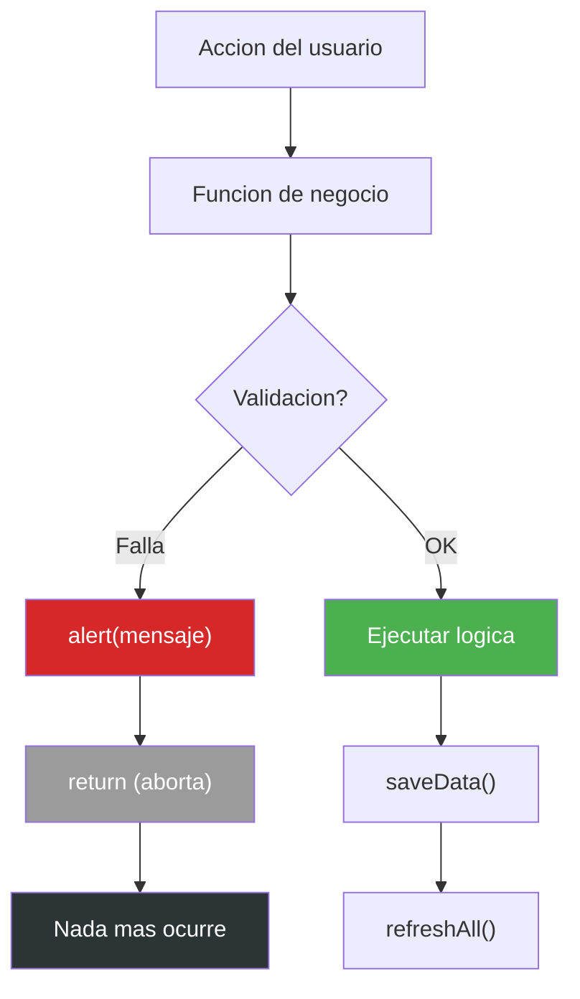

# Manejo de Errores — InvoiceManager

## Estrategia de Manejo de Errores

La aplicación **no tiene una estrategia formal de manejo de errores**. Todos los errores se manejan con el patrón:

```javascript
if (condición_falla) {
    alert("mensaje al usuario");
    return;  // aborta la función
}
```

No hay `try/catch`, no hay error boundaries, no hay logging de errores, no hay recovery.

## Inventario de Errores Manejados

| # | Función | Condición | Mensaje al Usuario | Tipo de Error |
|---|---|---|---|---|
| 1 | `addItemDraft` | Producto no encontrado | "Producto no encontrado" | Validación de datos |
| 2 | `addItemDraft` | Cantidad ≤ 0 | "Cantidad invalida" | Validación de input |
| 3 | `saveInvoice` | Sin cliente o fecha | "Cliente y fecha son obligatorios" | Validación de campo requerido |
| 4 | `saveInvoice` | Sin items | "Toda factura debe tener al menos un detalle" | Validación de negocio |
| 5 | `saveInvoice` | Crédito sin vencimiento | "Una factura a credito requiere vencimiento" | Validación condicional |
| 6 | `saveInvoice` | Factura ya emitida | "La emision ya fue ejecutada para esta factura" | Validación de duplicidad |
| 7 | `previewInvoice` | Sin items | "No hay items para vista previa" | Validación de precondición |
| 8 | `downloadPDF` | Sin items | "No hay informacion para PDF" | Validación de precondición |
| 9 | `sendInvoice` | Factura no encontrada | "Factura no encontrada" | Validación de existencia |
| 10 | `sendInvoice` | Estado "Borrador" | "No se puede enviar factura en borrador" | Validación de estado |
| 11 | `sendInvoice` | Sin correo | "Correo requerido" | Validación de campo requerido |
| 12 | `applyPayment` | Rol incorrecto | "El rol Facturador no registra pagos" | Validación de autorización |
| 13 | `applyPayment` | Sin monto o facturas | "Ingrese valor y facturas a aplicar" | Validación de input |
| 14 | `applyPayment` | Suma no concilia | "La suma aplicada debe coincidir con el valor del pago" | Validación de integridad |
| 15 | `applyPayment` | Monto > saldo | "Los pagos no pueden superar el saldo" | Validación de negocio |
| 16 | `sendBulkReminders` | Sin selección | "Seleccione al menos una factura" | Validación de input |
| 17 | `loadInvoiceDetail` | Factura no encontrada | "Factura no encontrada" | Validación de existencia |
| 18 | `createCreditNote` | Sin factura cargada | "Primero cargue una factura" | Validación de precondición |
| 19 | `createCreditNote` | Sin motivo o monto | "Motivo y monto son obligatorios" | Validación de campo requerido |
| 20 | `createCreditNote` | Monto > saldo | "La nota credito no puede superar el saldo" | Validación de negocio |
| 21 | `annulInvoice` | Sin factura seleccionada | "No hay factura seleccionada" | Validación de precondición |
| 22 | `annulInvoice` | Sin motivo | "Toda anulacion requiere motivo" | Validación de campo requerido |

## Diagrama de Flujo de Errores



## Errores NO Manejados (Gaps)

| Escenario | Qué pasa | Impacto |
|---|---|---|
| **localStorage lleno** (>5MB) | `saveData()` lanza excepción no capturada | Pérdida de datos silenciosa |
| **JSON corrupto en localStorage** | `JSON.parse()` lanza excepción | App crash (pantalla blanca) |
| **CDN no disponible** (sin internet) | jQuery/Bootstrap/Chart.js no cargan | App no funciona |
| **NaN en cálculos** (input malformado) | Se propaga como NaN en totales | Facturas con `$NaN` |
| **Fechas inválidas** | `new Date("invalid")` → `Invalid Date` | Cálculos de mora incorrectos |
| **Concurrent access** (2 tabs) | Última escritura gana, datos pisados | Pérdida silenciosa de datos |
| **Browser crashea durante saveData()** | Datos parcialmente escritos | Corrupción potencial |

## Clasificación de la Estrategia

| Criterio | Evaluación | Evidencia |
|---|---|---|
| **Excepciones específicas** | ❌ No hay | Sin `throw`, sin clases de error |
| **try/catch** | ❌ Ausente | 0 bloques try/catch en 830 LOC |
| **Error logging** | ❌ Ausente | Sin `console.error`, sin servicio de logging |
| **Error recovery** | ❌ Ausente | Tras error solo hay `alert()` + `return` |
| **User-friendly messages** | ⚠️ Parcial | Mensajes en español pero sin sugerencia de solución |
| **Error boundaries** | ❌ Ausente | Sin framework que los soporte |
| **Graceful degradation** | ❌ Ausente | Si falla CDN, toda la app es inoperable |
| **Retry logic** | ❌ Ausente | No hay operaciones de red |

## Anti-Patrones de Error Handling Detectados

| Anti-Patrón | Severidad | Evidencia |
|---|---|---|
| **Alert-as-error-handler** | Alta | 22 `alert()` como único mecanismo de error |
| **No error propagation** | Media | Errores se "tragan" con `return` sin notificar upstream |
| **No validation of JSON.parse** | Alta | `loadData()` no tiene try/catch para JSON corrupto (`app.js:14`) |
| **Silent data loss** | Alta | Si localStorage está lleno, el error es silencioso |
| **No input sanitization** | Alta | `Number()` sobre inputs sin verificar `isNaN()` |

## Hallazgos Clave

- **22 puntos de error manejados** — todos con el mismo patrón primitivo (`alert` + `return`)
- **0 bloques try/catch** — no hay protección contra excepciones de runtime
- **0 logging** — imposible diagnosticar problemas post-mortem
- **Sin degradación elegante** — cualquier fallo de CDN o localStorage deja la app inutilizable
- **Sin feedback constructivo** — los mensajes de error no sugieren cómo corregir el problema

## Referencias

- [Lógica de negocio](business-logic.md)
- [Workflows](workflows.md)
- [Lógica de decisión](decision-logic.md)
- [Patrones](../architecture/patterns.md)
