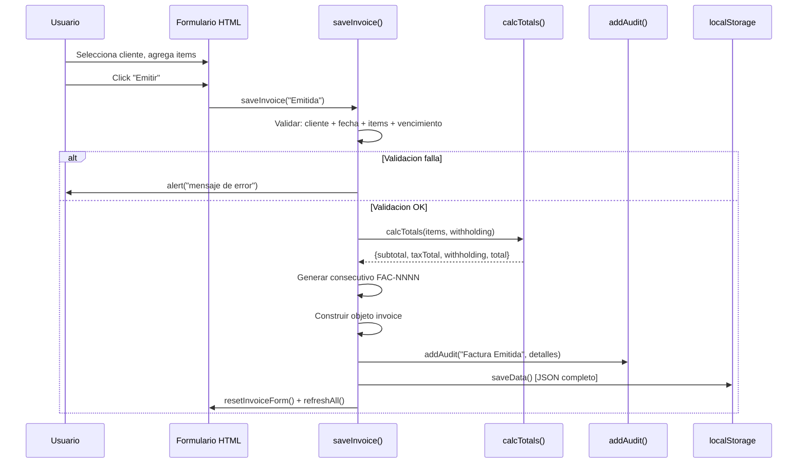
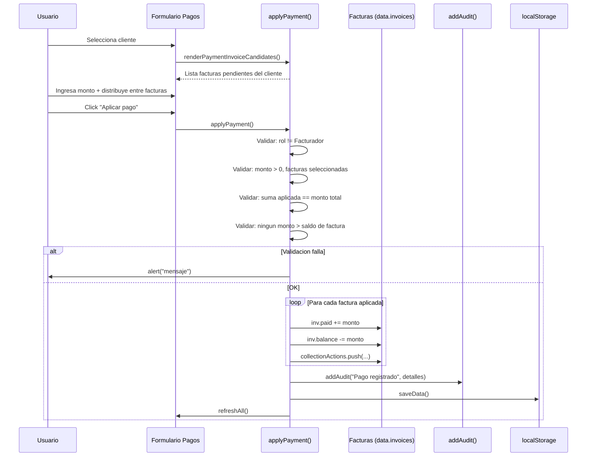
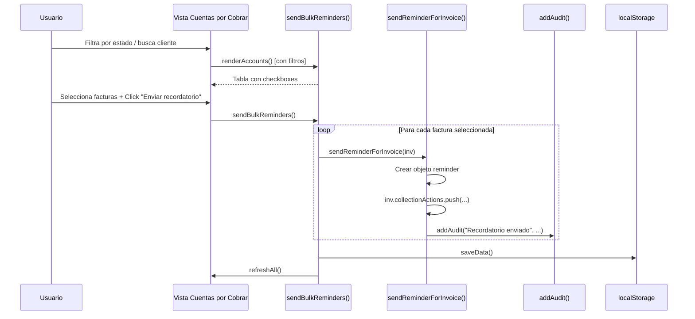
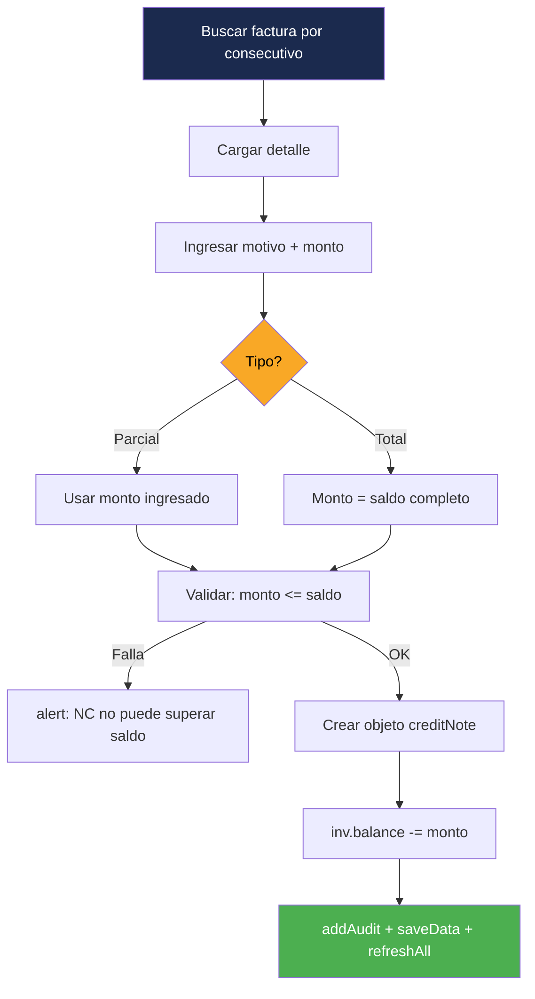

# Workflows — InvoiceManager

## Workflow 1: Creación y Emisión de Factura

**Actor:** Facturador / Administrador
**Entrada:** Datos del formulario (cliente, items, condición de pago)
**Salida:** Factura persistida con consecutivo (si emitida)

**Pasos detallados:**
1. Usuario selecciona cliente del dropdown
2. Agrega items uno por uno (`addItemDraft()`)
3. Opcionalmente: fija retención, condición de pago, vencimiento, notas
4. Click "Emitir" → `saveInvoice("Emitida")`
5. Se validan 4 reglas (RN-01)
6. Se calcula totales con impuestos y retención
7. Se genera consecutivo incremental (`FAC-1001`, `FAC-1002`...)
8. Se persiste a localStorage
9. Se registra auditoría
10. Se limpia formulario y refresca UI

## Workflow 2: Aplicación de Pago

**Actor:** Analista de cartera / Administrador
**Entrada:** Cliente, monto, método de pago, distribución entre facturas
**Salida:** Pago registrado, balances actualizados

**Pasos detallados:**
1. Usuario selecciona cliente → se listan sus facturas pendientes
2. Ingresa monto total del pago
3. Distribuye el monto entre las facturas seleccionadas
4. Se valida autorización (solo Analista/Admin pueden pagar)
5. Se valida conciliación (suma distribuida = monto total)
6. Se valida que ningún monto exceda el saldo
7. Se aplica a cada factura (actualiza `paid` y `balance`)
8. Se registra pago y auditoría
9. `refreshAll()` recalcula estados (puede cambiar a "Pagada" o "Parcialmente pagada")

## Workflow 3: Gestión de Cartera y Recordatorios

**Actor:** Analista de cartera / Administrador
**Entrada:** Selección de facturas pendientes
**Salida:** Recordatorios enviados (simulados), registro en auditoría

**Nota:** El envío es simulado — no hay integración con servicios de email. Solo se registra la acción.

## Workflow 4: Nota Crédito

**Actor:** Administrador
**Entrada:** Factura cargada, motivo, monto, tipo (Parcial/Total)
**Salida:** Nota crédito registrada, balance reducido

## Workflow 5: Anulación de Factura

**Actor:** Administrador
**Entrada:** Factura cargada, motivo de anulación
**Salida:** Estado = "Anulada" (terminal)

1. Cargar factura por consecutivo (`loadInvoiceDetail()`)
2. Click "Anular factura" → `annulInvoice()`
3. Prompt: ingresar motivo
4. Si no hay motivo → rechaza
5. `inv.status = "Anulada"` (estado terminal, no recalculable)
6. `inv.canceledReason = motivo`
7. Auditoría + persistencia

## Workflow 6: Dashboard Financiero

**Actor:** Cualquier rol
**Entrada:** Datos de todas las facturas y pagos
**Salida:** 8 KPIs, gráfico de barras, top deudores

**KPIs calculados:**
1. Facturación mensual (suma de totales de facturas emitidas)
2. Valor recaudado (suma de `paid` de todas las facturas)
3. Saldo pendiente (suma de `balance`)
4. Cartera vencida (suma de `balance` de facturas con estado "Vencida")
5. Facturas emitidas (count)
6. Pagadas / Parciales (count)
7. Promedio días de pago (`averageDaysToPay()`)
8. Próximos vencimientos en 7 días (`nextDueCount(7)`)

## Hallazgos Clave

- **6 workflows principales** cubren el ciclo completo de facturación
- **Todos son síncronos** — no hay operaciones asíncronas ni callbacks de red
- **Todos terminan en `refreshAll()`** — patrón de "re-render everything" después de cada mutación
- **Sin transacciones** — si falla algo a mitad (ej: browser crash durante `saveData()`), no hay rollback
- **Sin confirmación de operaciones destructivas** — Solo anulación pide `prompt()`, pero nota crédito no confirma

## Referencias

- [Lógica de negocio](business-logic.md)
- [Lógica de decisión](decision-logic.md)
- [Manejo de errores](error-handling.md)
- [Componentes](../architecture/components.md)
