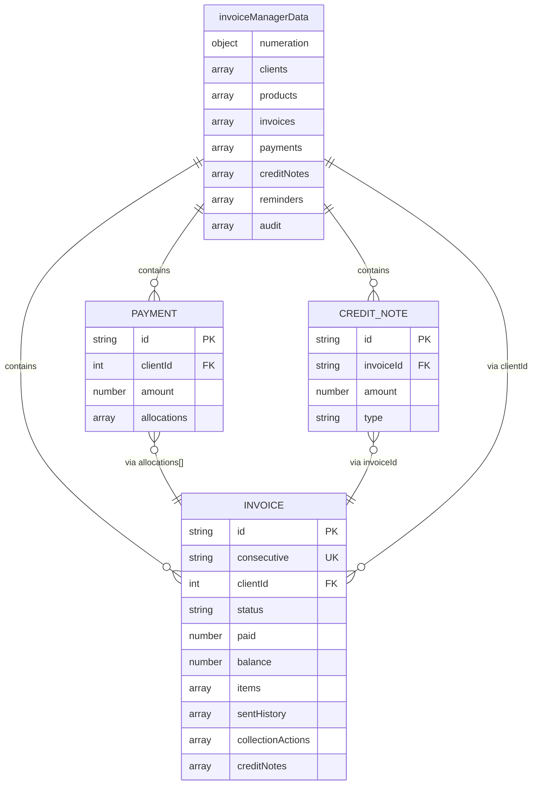

# Análisis de Base de Datos — InvoiceManager

## Resumen del Esquema

| Aspecto | Valor |
|---|---|
| **Motor** | localStorage (Web Storage API) |
| **Tipo** | Key-Value store (JSON monolítico) |
| **Clave** | `"invoiceManagerData"` |
| **Formato** | JSON serializado (`JSON.stringify`) |
| **Límite** | ~5-10 MB (varía por navegador) |
| **Transacciones** | No soportadas |
| **Índices** | No existen (`Array.find()` lineal) |
| **Concurrencia** | Sin soporte (single tab) |

## Estadísticas del Schema

| Métrica | Valor |
|---|---|
| Entidades (tablas lógicas) | 8 |
| Campos totales | 52 |
| Relaciones FK | 6 |
| Entidades embebidas | 4 (items, sentHistory, collectionActions, creditNotes dentro de Invoice) |
| Triggers/SPs | 0 (no aplica) |
| Migrations | 0 (no existe versionamiento de schema) |

## Schema Inferido desde Código

[INFERIDO: Schema reconstruido desde `loadData()` en `app.js:13-35` y las funciones que crean/mutan objetos]

### Entidades Principales

| Entidad | Tipo | Campos | Registros Iniciales | Función de Creación |
|---|---|---|---|---|
| `numeration` | Configuración | 2 | 1 (seed) | — |
| `clients` | Maestro | 5 | 3 (seed) | — (no hay CRUD de clientes) |
| `products` | Maestro | 3 | 4 (seed) | — (no hay CRUD de productos) |
| `invoices` | Transaccional | 20+ campos | 0 | `saveInvoice()` |
| `payments` | Transaccional | 8 | 0 | `applyPayment()` |
| `creditNotes` | Transaccional | 6 | 0 | `createCreditNote()` |
| `reminders` | Transaccional | 4 | 0 | `sendReminderForInvoice()` |
| `audit` | Log | 4 | 0 | `addAudit()` |

## Diagrama del Schema



## Operaciones de Datos (equivalente a SPs/Queries)

| Operación | Equivalente SQL | Función JS | Complejidad |
|---|---|---|---|
| Insertar factura | `INSERT INTO invoices` | `saveInvoice()` | Media (validaciones + consecutivo) |
| Buscar factura por consecutivo | `SELECT * WHERE consecutive = ?` | `data.invoices.find(x => x.consecutive === cons)` | Simple |
| Filtrar facturas por cliente y saldo | `SELECT * WHERE clientId=? AND balance>0` | `data.invoices.filter(...)` | Simple |
| Actualizar balance tras pago | `UPDATE invoices SET paid=?, balance=?` | `inv.paid += amount; inv.balance -= amount` | Simple |
| Insertar pago distribuido | `INSERT INTO payments` + N updates | `applyPayment()` | Alta |
| Insertar nota crédito | `INSERT INTO creditNotes` + update balance | `createCreditNote()` | Media |
| Actualizar estado | `UPDATE invoices SET status=?` | `recalcInvoiceState()` (recalculado) | Media |
| Agregar auditoría | `INSERT INTO audit` | `addAudit()` | Simple |
| Leer todo | `SELECT * FROM todas_las_tablas` | `loadData()` | Simple (lee JSON completo) |
| Escribir todo | `REPLACE completo` | `saveData()` | Simple (escribe JSON completo) |

## Hallazgos de Calidad de Datos

| Hallazgo | Severidad | Impacto | Evidencia |
|---|---|---|---|
| **Sin integridad referencial** | Alta | Borrar un cliente no borra sus facturas | No hay cascade/constraints |
| **Sin validación de unicidad** | Alta | Posibles IDs duplicados bajo concurrencia | IDs = `Date.now()` |
| **Sin validación de tipos** | Alta | Campos numéricos podrían contener strings | Sin schema validation |
| **Datos embebidos (denormalizados)** | Media | Items duplicados si se modifica producto | Deep copy en `saveInvoice()` |
| **Sin paginación** | Media | `refreshAudit()` limita a 300, pero otros no | `slice(0, 300)` solo en audit |
| **Sin backup** | Alta | Limpiar browser = pérdida total | localStorage es volátil |
| **Sin migración de schema** | Alta | Agregar campos rompe registros existentes | Sin versión de schema |
| **Write-all pattern** | Media | Cada operación reescribe TODO el JSON | `saveData()` serializa todo |

## Impacto en Modernización

| Aspecto | Estado Actual | Estado Target | Esfuerzo |
|---|---|---|---|
| Motor de BD | localStorage (browser) | PostgreSQL / MySQL | **Alto** — requiere diseñar schema SQL |
| Integridad referencial | Ninguna | FKs + constraints | **Medio** — lógica ya existe implícitamente |
| Transacciones | No existen | BEGIN/COMMIT/ROLLBACK | **Alto** — requiere repensar `saveData()` |
| Índices | Ninguno (`find()` lineal) | Índices en columnas de búsqueda | **Bajo** — aplicar al crear tablas |
| Concurrencia | Single-user | Multi-user con locks | **Alto** — requiere backend |
| Queries | `Array.filter/find` | SQL SELECT con WHERE | **Bajo** — mapeo directo |
| Schema versioning | Sin versiones | Migrations (Flyway/EF) | **Medio** — crear primera migración |

## Recomendación de Migración de Datos

**Estrategia recomendada:** El JSON de localStorage mapea directamente a 5 tablas SQL:

```sql
-- Schema target propuesto
CREATE TABLE clients (id SERIAL PRIMARY KEY, name TEXT NOT NULL, email TEXT, tax_id TEXT, status TEXT);
CREATE TABLE products (id SERIAL PRIMARY KEY, name TEXT NOT NULL, price DECIMAL(12,2));
CREATE TABLE invoices (id UUID PRIMARY KEY, consecutive TEXT UNIQUE, client_id INT REFERENCES clients(id), ...);
CREATE TABLE payments (id UUID PRIMARY KEY, client_id INT REFERENCES clients(id), amount DECIMAL(12,2), ...);
CREATE TABLE credit_notes (id UUID PRIMARY KEY, invoice_id UUID REFERENCES invoices(id), ...);
```

Los arrays embebidos (`items`, `sentHistory`, `collectionActions`) se convierten en tablas adicionales con FK a `invoices`.

## Referencias

- [Modelos de datos](../reference/data-models.md)
- [Lógica de negocio](../behavior/business-logic.md)
- [Componentes](../architecture/components.md)
- [Dependencias](../architecture/dependencies.md)
